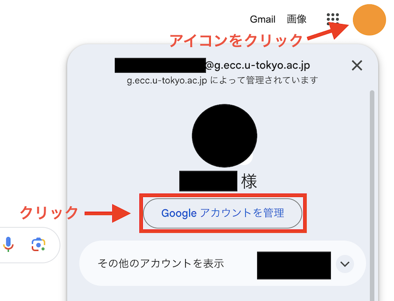
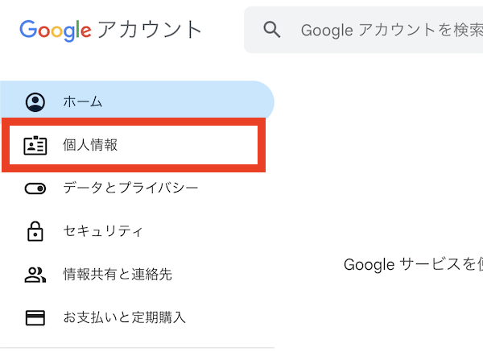

## 概要
{:#overview}

ECCSクラウドメールのアカウントにおけるプロフィールの姓・名は，システムからの自動連携で作成されていますが，自分で編集することができます．

### 留意事項
{:#caution}

- プロフィールの姓・名を変更できるのは，90日間で3回のみです．
- 一部のシステムでは，[「システム管理上の姓名」が表示されてしまうケース](#system-name)があります．なお，「システム管理上の姓名」をユーザが編集することはできません．
- [Googleアカウントヘルプ：Google アカウントの名前とその他の情報の変更](https://support.google.com/accounts/answer/27442)もご参照ください．

## プロフィールの姓・名を編集する手順
{:#edit-name}

1. ブラウザで[ECCSクラウドメールにログイン](/google/#login)してください．
2. 右上のアイコンをクリックしてメニューを開き，「Googleアカウントを管理」をクリックしてください．
   
3. 「個人情報」タブを開いてください．
   
   
4. 「基本情報」欄内にある「名前」をクリックしてください．
   
5. 名前（姓・名）を入力して，「保存」をクリックしてください．
   

## 「システム管理上の姓名」が表示されてしまうケースについて
{:#system-name}

ECCSクラウドメールのアカウントでは，利用者が変更できる"プロフィールの姓名"と，予めシステムの処理により登録されている"システム管理上の姓名"の2つの姓名があります．
Google Chatを使用する際,自分の姓名に見覚えのない"システム管理上の姓名"が表示されますが，相手の画面では，"プロフィールの姓名"が表示されます．
自分の画面と相手の画面で表示される姓名が異なるため，紛らわしい部分にはなりますが，2022年5月の時点では，Google Chatの挙動として想定されたものになっています．
どうかご理解ください.

- プロフィールの姓名
  - Google Chatを利用する際や,ファイルやGoogleカレンダーの共有を行う場合に,相手に通知される姓名です.
  - 利用者側で変更することができます.詳しくは,"ECCSクラウドメール：姓，名の変更について"を参照してください.
- システム管理上の姓名
  - ECCSクラウドメールのユーザを作成する際,システムの一連の処理の中で自動的に設定される姓名です.
  - 利用者側の操作により，姓名を変更することはできません.
  - Google Chatでは，以下の画像のように，自分の画面かつ自分の姓名に対しての表示に使用されます.
  - "システム管理上の姓名"が表示されるケースについて,正式に公開されている情報はありませんが,Google Chat以外のサービスでは見つかっていません.
