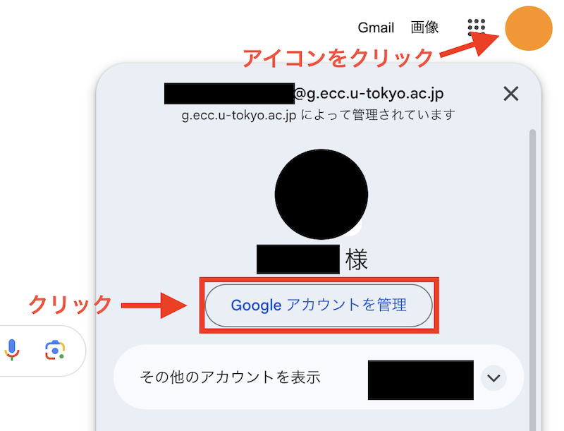
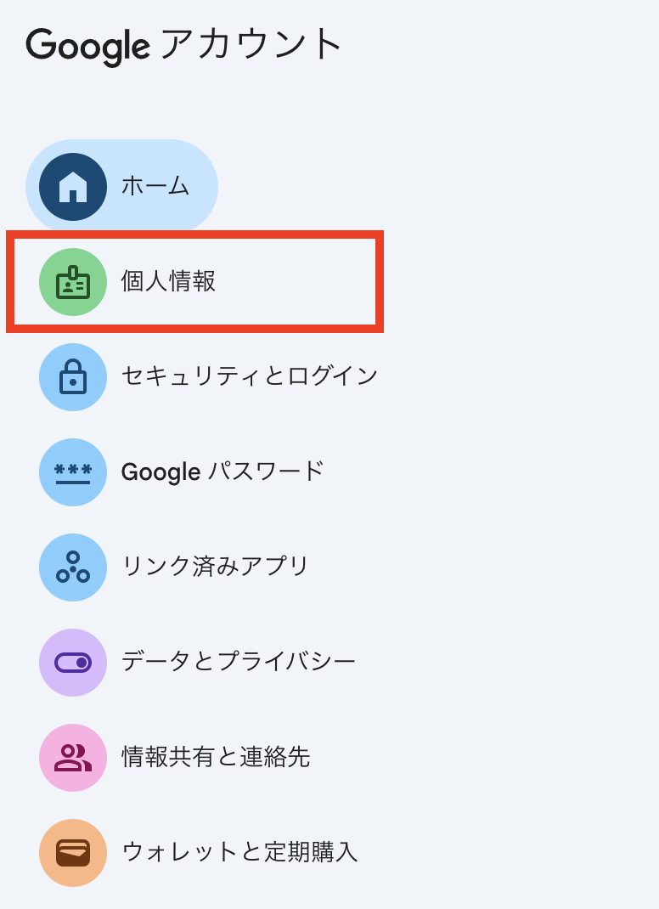
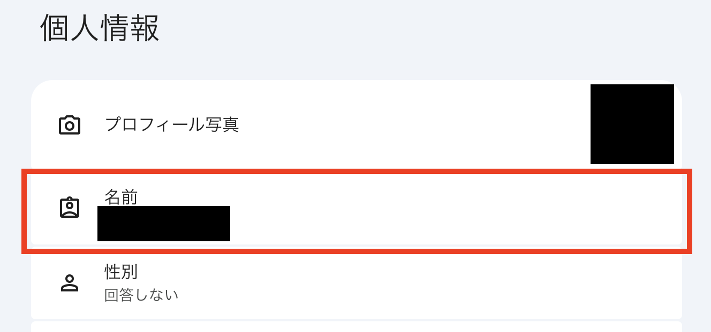
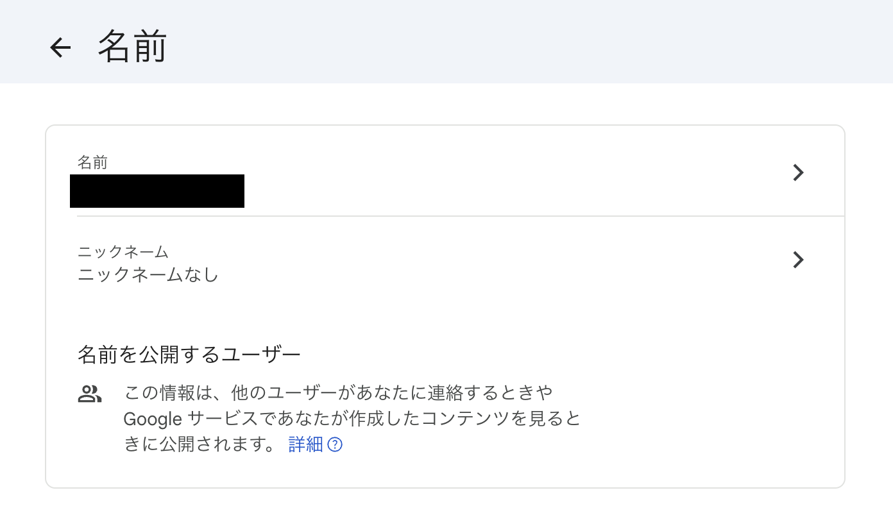
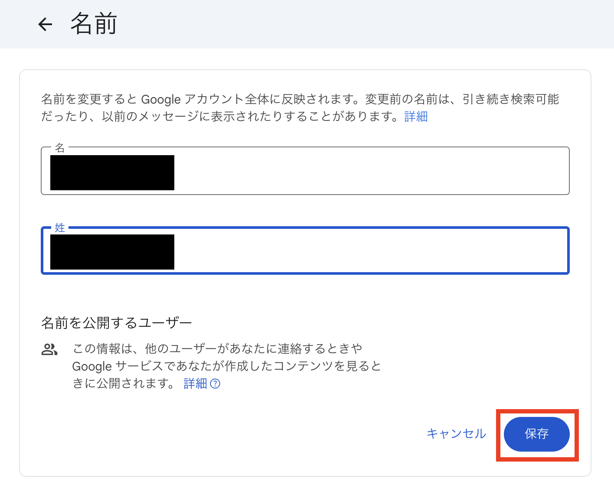
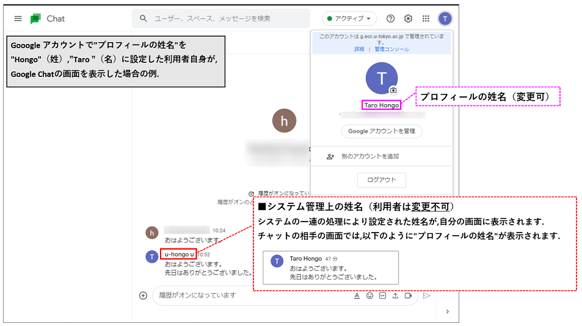

import ExcuseForAccuracy from "@components/ja/ExcuseForAccuracy.mdx";

<ExcuseForAccuracy />

## 概要
{:#overview}

- ECCSクラウドメールのアカウントにおける「プロフィールの姓名」（画面上の「名前」）は，システムからの自動連携で作成されていますが，自分で変更することができます．
- 一部のシステムでは，プロフィールの姓名ではなく，[「システム管理上の姓名」が表示されてしまうケース](#system-name-issue)があります．なお，「システム管理上の姓名」をユーザが変更することはできません．

## プロフィールの姓・名を変更する手順
{:#edit-name}

1. ブラウザで，[ECCSクラウドメールにログイン](/google/#login)してください．
2. 右上のアイコンをクリックしてメニューを開き，「Googleアカウントを管理」をクリックしてください．
   {:.small .border}
3. 「個人情報」タブを開いてください．
   {:.small .border}
4. 「個人情報」内の「名前」をクリックしてください．
   {:.small .border}
5. 「名前」と「ニックネーム」が表示されます．「名前」をクリックしてください．
   {:.small .border}
6. 名前（姓・名）を入力して，「保存」をクリックしてください．
   {:.small .border}

## 「プロフィールの姓名」と「システム管理上の姓名」
{:#profile-and-system-name}

ECCSクラウドメールのアカウントでは，利用者が変更できる「プロフィールの姓名」と，予めシステムの処理により登録されている「システム管理上の姓名」の2つの姓名があります．

### プロフィールの姓名
{:#profile-name}

- Google Chatを利用する際や，ファイルやGoogleカレンダーの共有を行う場合に，相手に通知される姓名です．
- 利用者自身で[変更する](#edit-name)ことができます．

#### ニックネーム

「名前」の設定画面には「ニックネーム」の項目もありますが，これは姓名を置き換えるものではありません．

- ニックネームは，設定しても単独では表示されず，本名（名前）と組み合わせて表示されます．
- メールの差出人名など，相手に見える名前がそのままニックネームに置き換わるわけではありません．
- 表示される姓・名を変えたい場合は，ニックネームではなく，上記の手順で「名前」を変更してください．

### システム管理上の姓名
{:#system-name}

- ECCSクラウドメールのユーザを作成する際，システムの一連の処理の中で自動的に設定される姓名です．
- 利用者側の操作により，姓名を変更することはできません．

#### システム管理上の姓名が表示されるケース
{:#system-name-issue}

一部のシステムを使用する際，表示される姓名が見覚えのない「システム管理上の姓名」になってしまうケースの存在が確認されています．

2022年5月の時点では，Google Chatでのみ，このような問題が確認されています．Google Chatの場合，自分の画面では「システム管理上の姓名」が表示されますが，相手の画面では「プロフィールの姓名」が表示されます．自分と相手で表示が異なり紛らわしいものの，相手には正しく（プロフィールの姓名で）表示されるため実害はありません．

なお，2026年7月時点では，一部の環境でこの現象が再現しないことを確認しています．現在は改善されている可能性がありますが，すべての環境で解消したことを確認できているわけではありません．

## 参考ページ

- [Googleアカウントヘルプ：Google アカウントの写真や名前などの情報を変更するにはどうすればよいですか？](https://support.google.com/accounts/answer/27442?hl=ja)
