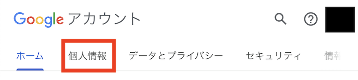

## 概要
{:#overview}

- ECCSクラウドメールのアカウントにおける「プロフィールの姓名」は，システムからの自動連携で作成されていますが，自分で変更することができます．
- 一部のシステムでは，プロフィールの姓名ではなく，[「システム管理上の姓名」が表示されてしまうケース](#system-name)があります．なお，「システム管理上の姓名」をユーザが変更することはできません．

## プロフィールの姓・名を変更する手順
{:#edit-name}

1. ブラウザで，[ECCSクラウドメールにログイン](/google/#login)してください．
2. 右上のアイコンをクリックしてメニューを開き，「Googleアカウントを管理」をクリックしてください．
   {:.small .border}
3. 「個人情報」タブを開いてください．
   <figure class="gallery">{:.small .border}{:.small .border}</figure>
4. 「基本情報」欄内にある「名前」をクリックしてください．
   {:.small .border}
5. 名前（姓・名）を入力して，「保存」をクリックしてください．
   {:.small .border}

## 「システム管理上の姓名」が表示されてしまうケースについて
{:#system-name}

ECCSクラウドメールのアカウントでは，利用者が変更できる「プロフィールの姓名」と，予めシステムの処理により登録されている「システム管理上の姓名」の2つの姓名があります．

### プロフィールの姓名

- Google Chatを利用する際や，ファイルやGoogleカレンダーの共有を行う場合に，相手に通知される姓名です．
- 利用者自身で[変更する](#edit-name)ことができます．

### システム管理上の姓名

- ECCSクラウドメールのユーザを作成する際，システムの一連の処理の中で自動的に設定される姓名です.
- 利用者側の操作により，姓名を変更することはできません.
- Google Chatでは，以下の画像のように，自分の画面かつ自分の姓名に対しての表示に使用されます.
- 「システム管理上の姓名」が表示されるケースについて，正式に公開されている情報はありませんが，Google Chat以外のサービスでは見つかっていません.

### Google Chatでの表示について

**Google Chat**を使用する際，送信者自身の姓名として見覚えのない「システム管理上の姓名」が表示されますが，相手の画面では，「プロフィールの姓名」が表示されます．自分の画面と相手の画面で表示される姓名が異なるため，紛らわしい部分にはなりますが，2022年5月の時点では，Google Chatの挙動として想定されたものになっています．どうかご理解ください.

## 参考ページ

- [Googleアカウントヘルプ：Google アカウントの写真や名前などの情報を変更するにはどうすればよいですか？](https://support.google.com/accounts/answer/27442?hl=ja)
