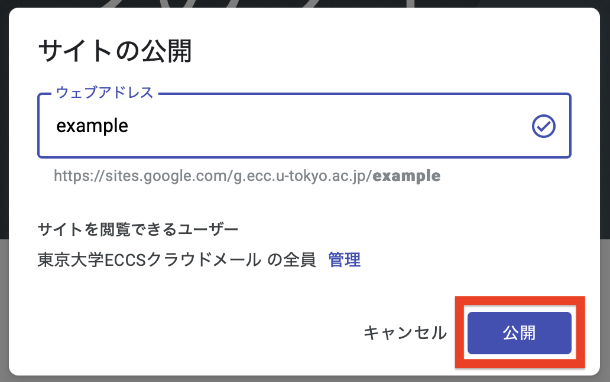

## Google サイトとは

Google サイトは，ブラウザ上でウェブサイトを作成して公開できるサービスです．以下のような特徴があります．

- 直感的な操作のみで（ローコードで），ウェブサイトを作成できる
- クラウドサービスとして提供されているので，サーバーを自分で用意する必要がない（サーバーレス）
- テンプレートが用意されているので，ゼロから構成やデザインを考える必要はない
- 複数人で共同編集できる
- 他のGoogleサービスとの連携が容易である
- 特定のユーザー（Google アカウント）に公開範囲を限定できる
- デザインや動的なコンテンツの作成には制約がある

### 東京大学のアカウントでの利用
{:#with-utac}

東京大学の構成員は，[ECCSクラウドメール](/google/)でGoogle サイトを作成できます．この場合，一般のGoogleアカウントで作成する場合と，以下の点が異なります．

- ECCSクラウドメールのアカウントからしかアクセスできない設定にできます．
- URLに「[メールホスティングサービス](https://mh.ecc.u-tokyo.ac.jp/service/)」のドメインやそのサブドメインを使用できます．この場合，「[Googleサイト カスタムドメイン設定サービス（試行）](https://mh.ecc.u-tokyo.ac.jp/googlesites-customdomain/)」の利用を申請してください．ただし，申請できるのは「メールホスティングサービス」のドメイン管理者のみです．

### 活用方法の例

ゼミや研究室内で，整理された情報を一方向的に共有したいときに，Google サイトの利用が考えられます．手軽に情報を共有したい際は，[Google ドキュメント](../document/)や[Google ドライブ](../drive/)なども適しています．しかし，ドキュメントでは，表や画像といった様々な情報をわかりやすい形でまとめることは難しいです．また，ドライブで複数のファイルに分割して情報を整理すると，必要な情報にアクセスしづらくなります．このような場合，Google サイトでウェブページとして共有すると，様々な情報をアクセスしやすい形で集約できます．

小規模なサークルや人の入れ替わりが早いサークルでは，ウェブサイト制作に詳しい人材が不足している場合があります．Google サイトは操作が直感的なので，編集が簡単であり，このようなサークルでも作成や維持管理が比較的容易です．

東大の学生のみからなる団体の場合は，新規メンバーを勧誘する際に，学内者のみに情報を発信するようなことが考えられます．このようなときは，勧誘用のサイトをGoogle サイトで作成すれば，学内の構成員に限定して公開できます．

## 基本的な使い方

以下ではサイトの作成，編集や公開などの基本的な操作について説明します．

### サイトの作成・編集

Googleの公式ヘルプ「[Google サイトの使い方](https://support.google.com/sites/answer/6372878?hl=ja)」を参照してください．ただし，上記「[カスタムドメイン設定サービス](#with-utac)」を利用する場合は，先にそちらの手続きをしてください．

### サイトの公開

1. 公開したいサイトの編集画面で，右上の「公開」を押してください．
{:.medium .border}
2. サイトを閲覧できるユーザーを確認してください．
    - そのままで良い場合は，手順3に進んでください．
    - 変更したい場合は，以下の手順を行ってください．
        1. 「管理」を押してください．
            {:.small}
        2. 公開範囲を「制限付き」，「東京大学ECCSクラウドメール」，「公開」の中から選択してください．
            - 「制限付き」を選択した場合，アクセス権のあるユーザーだけが，閲覧できるようになります．アクセス権はサイトの「オーナー」が，個別のユーザーやGoogle グループに与えることができます．Google グループについて詳しくは，Google グループのページを参照してください．
            - 「東京大学ECCSクラウドメール」を選択した場合，ECCSクラウドメールのユーザーだけが閲覧できるようになります．大学構成員に公開範囲を限定したいときは，「東京大学ECCSクラウドメール」を選択してください．
            - 「公開」を選択した場合，インターネット上の誰でも閲覧できるようになります．外部に公開してはいけない内容を含んでいないか，注意が必要です．
            - なお，同じサイトでページごとに異なる公開範囲を設定することはできません．異なる公開範囲のページを公開したいときは，別のサイトを作成する必要があります．
        3. 「完了」を押してください．
            {:.small}
3. ウェブアドレス欄に任意の文字列を入力して「公開」を押してください．
   - 「[カスタムドメイン設定サービス](#with-utac)」を利用していない場合，URLは`https://sites.google.com/g.ecc.u-tokyo.ac.jp/xxx`という形式になります．

    {:.small}

