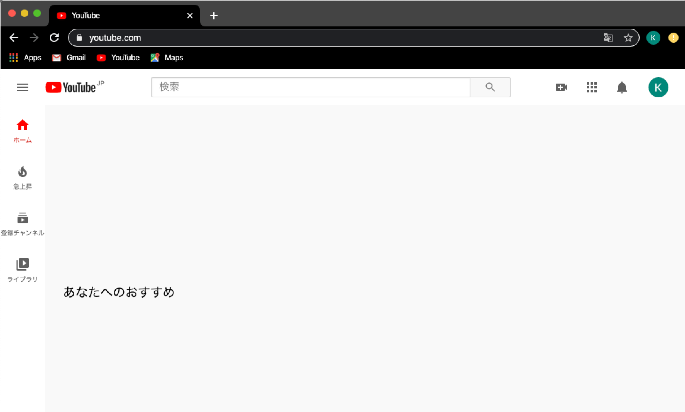
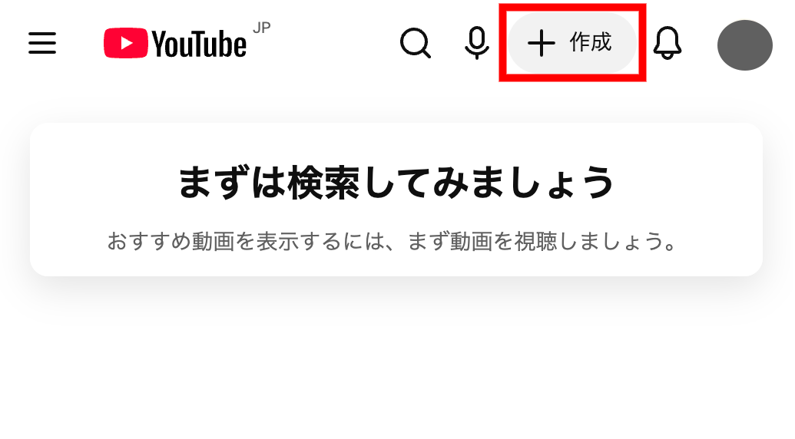
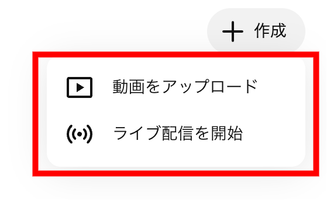
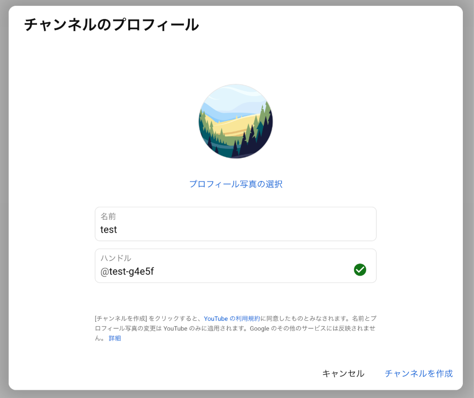
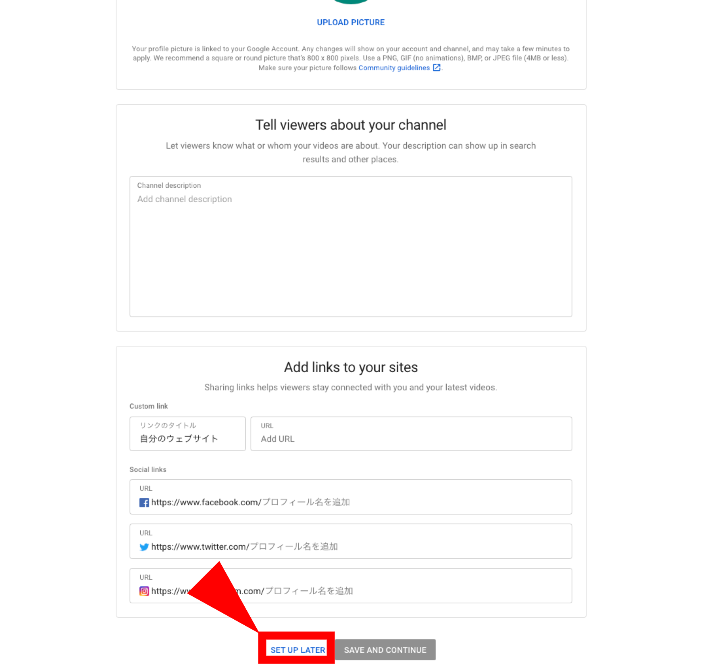
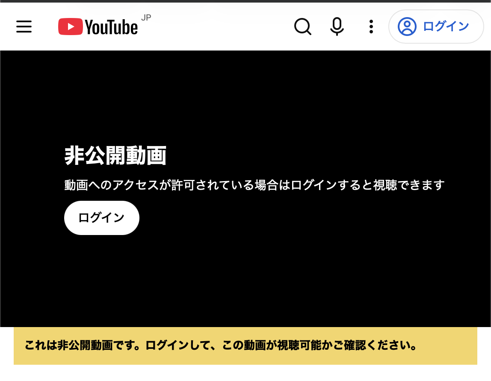
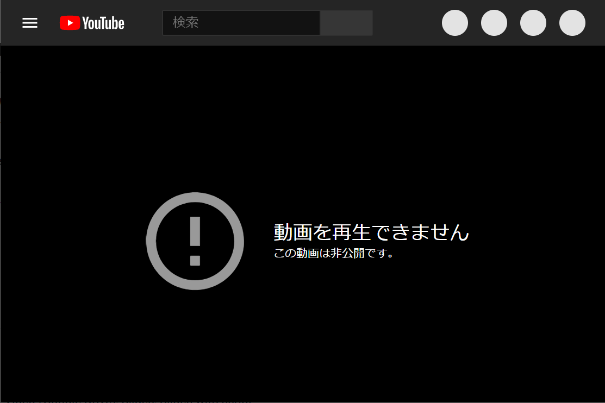
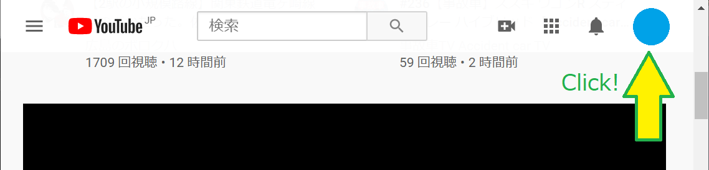
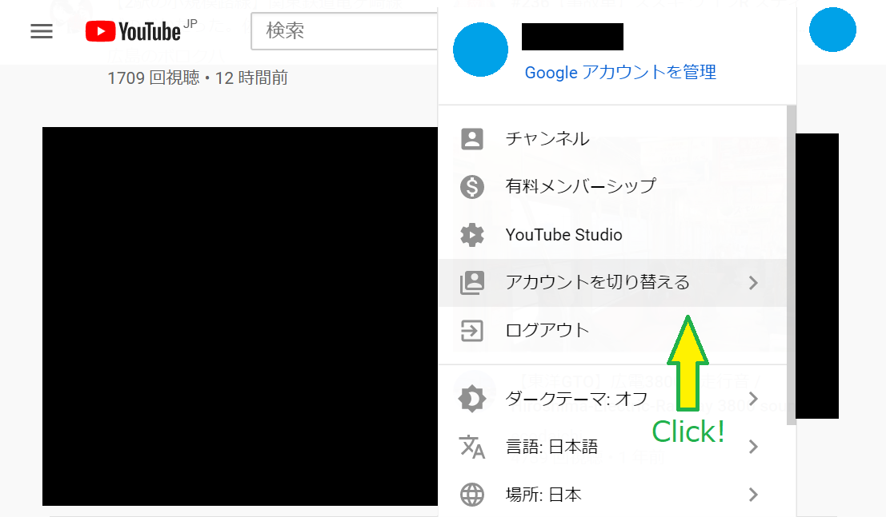
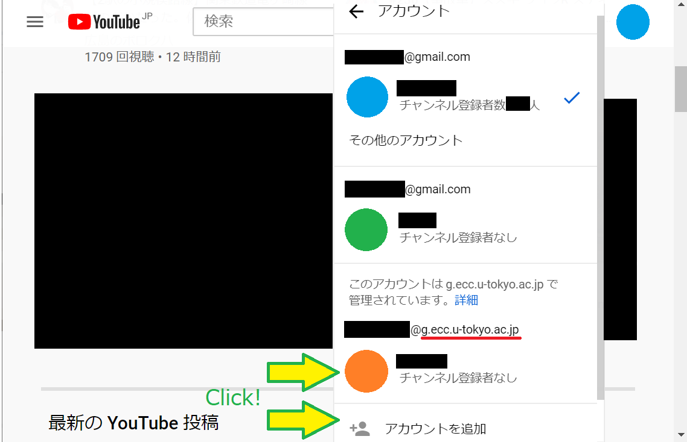

import ExcuseForAccuracy from '@components/ja/ExcuseForAccuracy.mdx'

**YouTube**は，Google社が提供する動画配信サービスです．動画を投稿して公開したり，ライブ配信を行ったりすることができます．

東京大学の構成員は，[ECCSクラウドメール](/google/)のアカウントでYouTubeを利用することができます．ECCSクラウドメールのアカウントで動画を配信すると，**視聴を東京大学の構成員のみに限定する**こともできるため，学内向けの講義動画や行事の配信などに活用できます．

- 基本的な使い方については，[Googleの公式ヘルプ](https://support.google.com/youtube)を参照してください．
- このページでは，[動画を投稿・配信する人向けの情報](#for-creators)と，[学内構成員限定で公開されたコンテンツを視聴する人向けの情報](#watching)を案内します．

## 動画を投稿・配信する人向けの情報
{:#for-creators}

ECCSクラウドメールのアカウントを使って，動画の投稿やライブ配信を行う方法を案内します．はじめに[チャンネルを作成](#create-channel)し，目的に応じて[動画をアップロード](#upload)したり，[動画の公開範囲を設定](#sharing)したり，[ライブ配信](#live)を行ったりしてください．

### チャンネルとアカウントについて
{:#channel}

YouTubeに動画を投稿したりライブ配信を行ったりするには，アカウントに紐づいた**チャンネル**が必要です．

YouTubeのチャンネルには，**個人のアカウントで作成するもの**と，**「ブランドアカウント」で作成するもの**の2種類があります．このうち，**ブランドアカウントで作成されたチャンネルでは，コンテンツの視聴を東京大学の構成員のみに限定することができません**．

そのため，**東大構成員限定で動画やライブ配信を行いたい場合は，（ブランドアカウントではなく）個人のECCSクラウドメールアカウントで作成したチャンネルを使う**必要があります．既にチャンネルを利用している場合は，そのチャンネルがECCSクラウドメールアカウント（個人のアカウント）に接続されたものであることを確認してください．

### チャンネルを作成する
{:#create-channel}

動画の投稿やライブ配信を行うには，あらかじめECCSクラウドメールアカウントでチャンネルを作成しておきます．

1. ECCSクラウドメールアカウントでYouTubeにログインしてください．
    {:.small}
2. 画面右上のカメラアイコンを押してください．
    {:.small}
3. 「始める」を押してください．
    {:.small}
4. チャンネル名を設定してください．（以下では「自分の名前を使う」を選択しています．）
    {:.small}
5. 詳細情報を入力してください．「SET UP LATER」を押して先に進むこともできます．これでチャンネルの作成が完了します．
    {:.small}

### 動画をアップロードする
{:#upload}

YouTubeに動画をアップロードする基本的な手順については，「[YouTubeに動画をアップロードする](./upload/)」を参照してください．

### 動画の公開範囲を設定する
{:#sharing}

「公開」「限定公開」「非公開」の違いや，視聴を東大構成員のみに限定して公開する方法については，「[YouTube動画の公開範囲を設定する](./sharing/)」を参照してください．

### ライブ配信を行う
{:#live}

ライブ配信機能の有効化と，配信を開始する方法については，「[クラウドメールアカウントでのYouTubeライブ配信方法](./live/)」を参照してください．

ライブ配信の一つの方法として，**ZoomミーティングやウェビナーをYouTubeでライブ配信する**こともできます．Zoomで開催するミーティングやウェビナーをそのままYouTubeで配信したい場合は，「[ZoomミーティングやウェビナーをYouTubeでストリーミング配信する](./live/streaming/zoom/)」を参照してください．

## 動画を視聴する人向けの情報（学内構成員限定）
{:#watching}

<ExcuseForAccuracy />

視聴を東京大学の構成員に限定しているYouTubeのコンテンツを視聴する場合，**ECCSクラウドメール（`xxxx@g.ecc.u-tokyo.ac.jp`）のアカウントに切り替える**必要があります．

ログインしていない場合や，他のアカウントでコンテンツを視聴しようとした場合は，以下のどちらかのエラー画面が表示されます．

- 「**非公開動画 動画へのアクセスが許可されている場合はログインすると視聴できます**」（画面中央にログインボタンが**ある**）
- 「**動画を再生できません この動画は非公開です。**」（画面にログインボタンが**ない**）

それぞれの場合について，ECCSクラウドメールのアカウントに切り替えてコンテンツを視聴する方法を案内します．

### 「非公開動画」と表示された場合
{:#watching-private}

※画面にログインボタンがない場合は，次の「[「動画を再生できません」と表示された場合](#watching-cannot-play)」を参照してください．

{:.small.border}

ECCSクラウドメールのアカウントや，各自で取得したGoogleアカウントにログインしていない状態で学内構成員限定のコンテンツにアクセスすると，「非公開動画」という表示になります．

画面中央の「ログイン」をクリックしてください．Googleのログイン画面が表示されるので，ECCSクラウドメールのメールアドレス（自分で設定したアドレス，または「数字10桁の共通ID＋`@g.ecc.u-tokyo.ac.jp`」）を入力してください．続いて[UTokyo Account](/utokyo_account/)のサインイン画面が表示されるので，サインインすると動画にアクセスできます．

- ECCSクラウドメールの初期設定がお済みでない場合や，メールアドレスを忘れた場合は，「[ECCSクラウドメールの利用開始の手順](/google/#initial-setup)」を参考に，初期設定やメールアドレスの確認をしてください．

### 「動画を再生できません」と表示された場合
{:#watching-cannot-play}

{:.small.border}

このエラー画面は，以下のような場合に表示されます．

- ECCSクラウドメール**以外**のアカウントでログインしているが，ECCSクラウドメールのアカウントでログインしていない．
- ECCSクラウドメールのアカウントでログインしているが，別のアカウントが使用されている．

この場合は，以下の手順でECCSクラウドメールのアカウントに切り替えてください．

1. エラー画面ではアカウントを切り替えることができないので，まず[YouTubeのトップページ](https://www.youtube.com/)にアクセスして，画面右上のアカウントのアイコン（画像を設定していない場合は，氏名の一部やイニシャルが表示されることもあります）をクリックしてください．
    {:.small.border}
2. 出現したメニューの「アカウントを切り替える」をクリックしてください．
    {:.small.border}
3. 現在ログインしているアカウントの一覧が表示されるので，この中にECCSクラウドメールのアカウント（`@g.ecc.u-tokyo.ac.jp`で終わるもの）が含まれていたら，そのアカウントを選択してください．
    - ECCSクラウドメールのアカウントが無い場合は，「アカウントを追加」を選択して，上記の「[「非公開動画」と表示された場合](#watching-private)」と同様にECCSクラウドメールにログインしてから，再度動画ページにアクセスしてください．

    {:.small.border}
4. ここまでの手順を完了したら，再度学内構成員限定のYouTubeコンテンツにアクセスしていただくと，視聴できるはずです．
