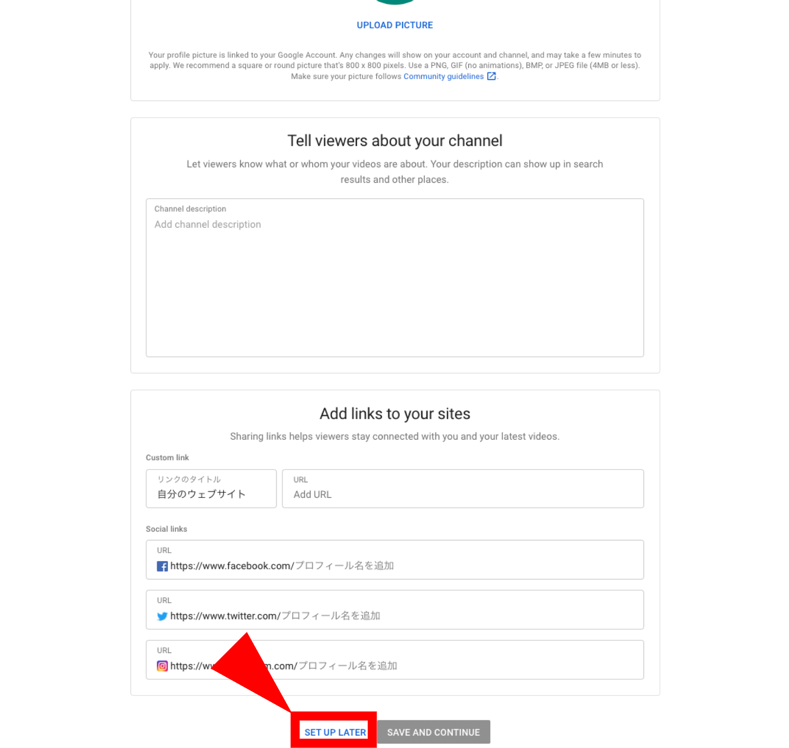

2020年3月10日 公開

このページでは，ECCSクラウドメールアカウントでYouTubeのライブ配信機能を利用する方法，特にライブ配信機能の有効化と配信について紹介します．学内の各種行事等でライブ配信が必要な場合にご活用ください．

**ライブ配信時には配信範囲を「公開」「限定公開」にするかの設定にご注意ください．「公開」と設定した場合にはYouTubeを通じて任意の人が配信を閲覧可能になります．「限定公開」と設定した場合には，当該配信専用に生成されるURLを知っている人のみが閲覧できます．一般に公開したくない配信の場合は「限定公開」をご利用ください．**

## 利用上の注意点

* ライブ配信時の「限定公開用のURL」は配信の度に変更されます．配信開始後に視聴希望者に共有してください．
* 不測の事態に備えて，配信者となるアカウントは複数有効化しておくことをおすすめします．
* ライブ配信の開始時に「公開」「限定公開」の設定を間違えないようにご注意ください．
* 配信本番の1-2週間前には，配信本番と同じ場所・機材・環境で事前の配信テストをすることをおすすめします．
* ライブ配信は受信者毎のネットワーク・端末環境によって正しく受信できない場合があります．また，YouTube側の配信システムで障害が発生した場合には配信サービスが利用できない可能性があります．

## ライブ配信の設定

本ページでの検証環境は以下のとおりです．

* OS：macOS 10.15.3 (19D76)
* ブラウザ：Google Chrome 80.0.3987.132 (Official Build) (64-bit)

### ライブ配信の有効化⼿順
{:#enable-live}

YouTubeチャネルを作成してからライブ配信ができるようになるまで24時間程度かかるため，時間に余裕をもって行ってください．

1. ECCSクラウドメールアカウントでYouTubeにログインしてください．
    {:.small}
2. YouTubeチャネルの作成を⾏います．右上のカメラアイコンを押してください．
    {:.small}
3. 「始める」を押してください．
    {:.small}
4. チャネル名を設定してください．ここでは「自分の名前を使う」を選択しています．
    {:.small}
5. 詳細情報を⼊⼒します．
    * 「SET UP LATER」を押して先に進むこともできます．
    * これでチャネルの作成が完了します．

    {:.small}
6. ホーム画⾯を開き，再度カメラアイコンを押してください．
    {:.small}
7. 「ライブ配信を開始」を選択してください．
    {:.small}
8. アカウントを確認します．

    a. 確認⽅法を選択してください．電話⾳声もしくはSMSによる通知を選べます．
        {:.small}
    b. 電話番号を⼊⼒してください．
        {:.small}
    c. 受け取った６桁のコードを⼊⼒してください．
        {:.small}
    d. アカウントの確認が成功したら，「次へ」を押してください．
        {:.small}

9. 再度ホーム画面を開き，「ライブ配信の開始」を選択してください．
    {:.small}
10. ライブ配信が有効化されるまで待ちます．
    * ここまでの⼿続きから有効化されるまで24時間程度かかります．

    {:.small}

### ライブ配信の開始

[ライブ配信の有効化](#enable-live)が完了した後に実施してください．

1. ホーム画面を開き，「ライブ配信の開始」を選択してください．
    {:.small}
2. ライブ配信の情報を⼊⼒します．

    a. 配信タイトル
      {:.small}
    b. 公開種別の選択

      * 「公開」「限定公開」「⾮公開」から適切なものを選択してください．
      * 「公開」にするとYouTubeで⼀般に公開されて配信されますのでご注意ください．
      * 「限定公開」ですとライブURLを知っている⼈のみが視聴できます．

      \* 以後は「限定公開」を想定し説明します．

      {:.small}

    c. 視聴対象と年齢制限
      {:.small}
    d. カメラ・マイクの選択
      * 内臓カメラ・マイク以外に，USBカメラ・マイクも選択できます．

      {:.small}
    e. チャット許可・不可の選択（「詳細設定」内）
      * 詳細設定には視聴者からのチャットを許可するか否かの項⽬があります．
      * 初期状態は許可になっていますので，必要に応じて不可にしてください．
      * 前の画⾯に戻り「次へ」を押してください．

      {:.small}
3. カメラ画像・設定を確認し，「ライブ配信を開始」を押してください．
    {:.small}
4. 配信が開始されます．
    * 配信中の映像が表⽰されます．

    {:.small}

    * 「限定公開」⽤のURLは画⾯下部の⽮印を押すと表⽰できます．
        * URLをコピーし，視聴して欲しい⼈にメール等で共有してください．

        {:.small}
5. 配信を終了するには，配信画⾯下部の「ライブ配信を終了」を押してください．
    {:.small}

## 参考ページ

ライブ配信を行うにあたってはYouTubeの公式ヘルプページにある下記の情報を適宜ご参照ください．

* ライブ配信：<https://support.google.com/youtube/answer/2474026?hl=ja>
* エンコーダでライブ配信を作成する：<https://support.google.com/youtube/answer/9227510>
* ライブ配信エンコーダの設定：<https://support.google.com/youtube/answer/2907883?hl=ja>
