import ExcuseForAccuracy from '@components/ja/ExcuseForAccuracy.mdx'

<ExcuseForAccuracy />

2020年3月10日 公開

このページでは，ECCSクラウドメールアカウントでYouTubeのライブ配信機能を利用する方法，特にライブ配信機能の有効化と配信について紹介します．学内の各種行事等でライブ配信が必要な場合にご活用ください．

ZoomミーティングやウェビナーをYouTubeで配信したい場合は，「[ZoomミーティングやウェビナーをYouTubeでストリーミング配信する](./streaming/zoom/)」を参照してください．また，配信の公開範囲（東大構成員限定での公開など）の設定方法については「[YouTube動画の公開範囲を設定する](../sharing/)」を参照してください．

**ライブ配信時には配信範囲を「公開」「限定公開」にするかの設定にご注意ください．「公開」と設定した場合にはYouTubeを通じて任意の人が配信を閲覧可能になります．「限定公開」と設定した場合には，当該配信専用に生成されるURLを知っている人のみが閲覧できます．一般に公開したくない配信の場合は「限定公開」をご利用ください．**

## 利用上の注意点

* ライブ配信時の「限定公開用のURL」は配信の度に変更されます．配信開始後に視聴希望者に共有してください．
* 不測の事態に備えて，配信者となるアカウントは複数有効化しておくことをおすすめします．
* ライブ配信の開始時に「公開」「限定公開」の設定を間違えないようにご注意ください．
* 配信本番の1-2週間前には，配信本番と同じ場所・機材・環境で事前の配信テストをすることをおすすめします．
* ライブ配信は受信者毎のネットワーク・端末環境によって正しく受信できない場合があります．また，YouTube側の配信システムで障害が発生した場合には配信サービスが利用できない可能性があります．

## ライブ配信の設定

本ページでの検証環境は以下のとおりです．

* OS：macOS 10.15.3 (19D76)
* ブラウザ：Google Chrome 80.0.3987.132 (Official Build) (64-bit)

### ライブ配信の有効化⼿順
{:#enable-live}

YouTubeチャンネルを作成してからライブ配信ができるようになるまで24時間程度かかるため，時間に余裕をもって行ってください．

あらかじめ，ECCSクラウドメールアカウントでYouTubeのチャンネルを作成しておく必要があります．チャンネルの作成手順については「[チャンネルを作成する](../#create-channel)」を参照してください．チャンネルを作成したら，以下の手順でライブ配信を有効化してください．

1. ホーム画⾯を開き，画面右上の「+作成」ボタンを押してください．
    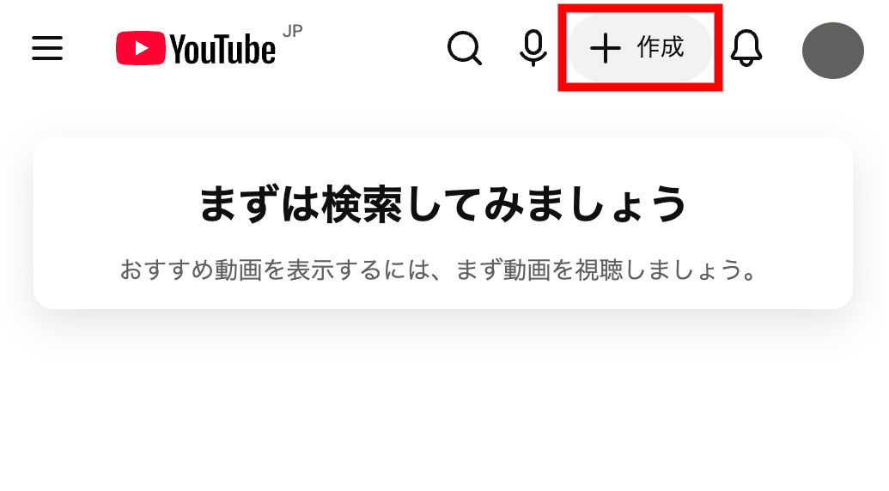{:.small.border}
2. 「ライブ配信を開始」を選択してください．
    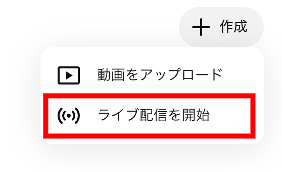{:.small.border}
3. 「ライブ配信へのアクセスのリクエスト」の画面が出てくるので，「リクエスト」ボタンを押してください．
    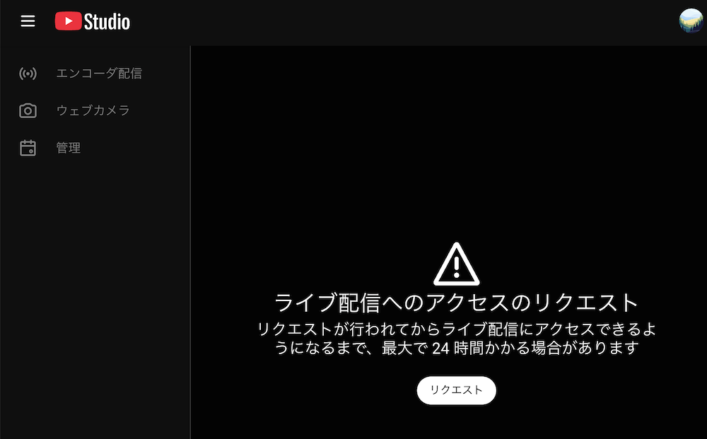{:.small}
4. [アカウントの確認](https://support.google.com/youtube/answer/171664)を行います．
    1. 「確認」ボタンを押してください．
        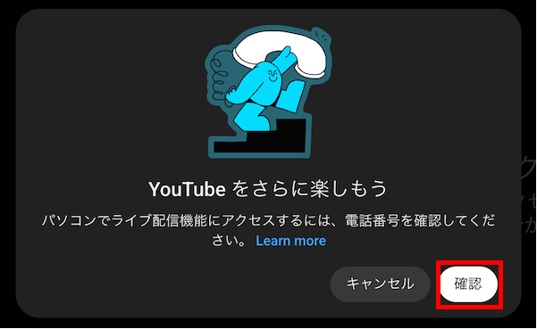{:.small}
    1. 画面右側のアイコンから，開いている画面がライブ配信をしたいアカウントのものであることを確認してください．
    1. 確認⽅法を選択してください．電話⾳声もしくはSMSによる通知を選べます．
        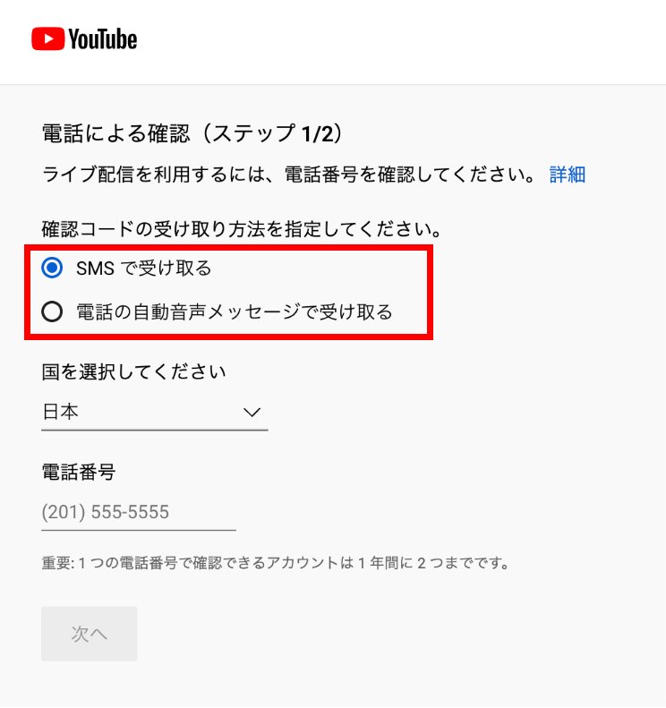{:.small.border}
    1. 国が入力する電話番号のものになっているのを確認した上で，電話番号を入力してください．
        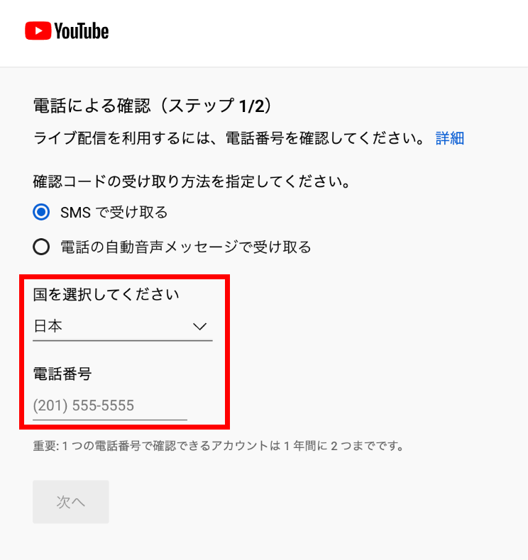{:.small.border}
    1. 受け取った６桁のコードを⼊力してください．
        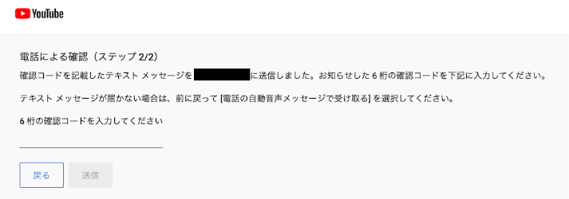{:.medium.border}
    1. アカウントの確認が成功したら，元のページに戻ってください．
        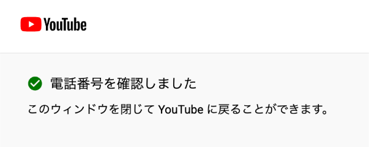{:.small.border}
5. ライブ配信が有効化されるまで24時間程度待ってください．
    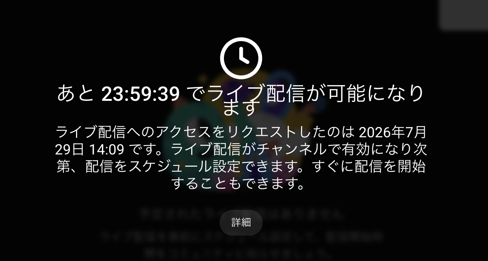{:.small}

### ライブ配信の開始

[ライブ配信の有効化](#enable-live)が完了した後に実施してください．

1. ホーム画面を開き，画面右上の「+作成」ボタンを押して，「ライブ配信の開始」を選択してください．
    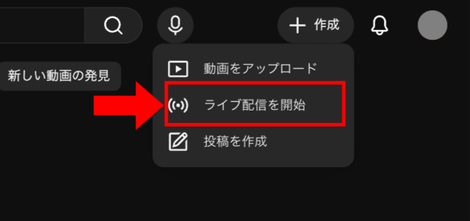{:.small}
1. 「ウェブカメラ」を押してください．
    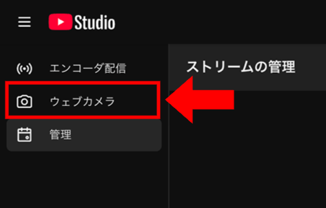{:.small}
1. ライブ配信の情報を⼊力します．
    1. 配信タイトル
      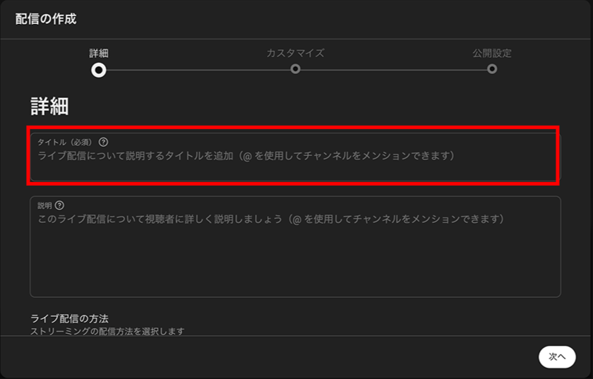{:.small}
    1. 視聴対象と年齢制限
        * 必要に応じて視聴対象と年齢制限を設定してください．通常は「いいえ、子ども向けではありません」を選択してください．
        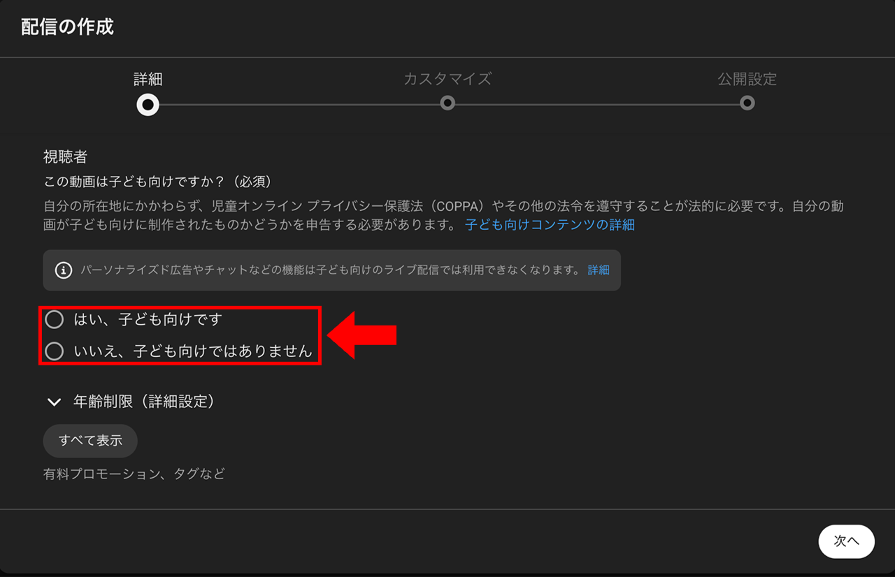{:.small}
1. チャット有効・無効の選択
    * 「カスタマイズ」には視聴者からのチャットを有効化するか否かの項⽬があります．
    * 初期状態は有効になっていますので，必要に応じてチェックボックスを外して無効にしてください．
    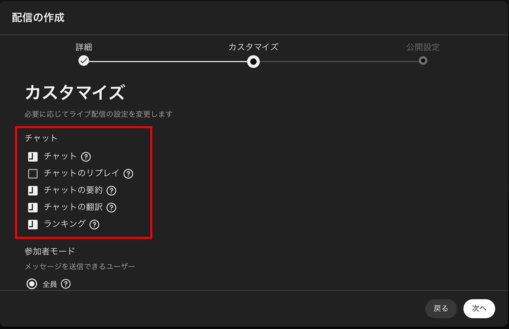{:.small}
1. 公開種別の選択
    * 「公開」「限定公開」「⾮公開」から適切なものを選択してください．
    * 「公開」にするとYouTubeで⼀般に公開されて配信されますのでご注意ください．
    * 「限定公開」ですとライブURLを知っている⼈のみが視聴できます．

    \* 以後は「限定公開」を想定し説明します．
    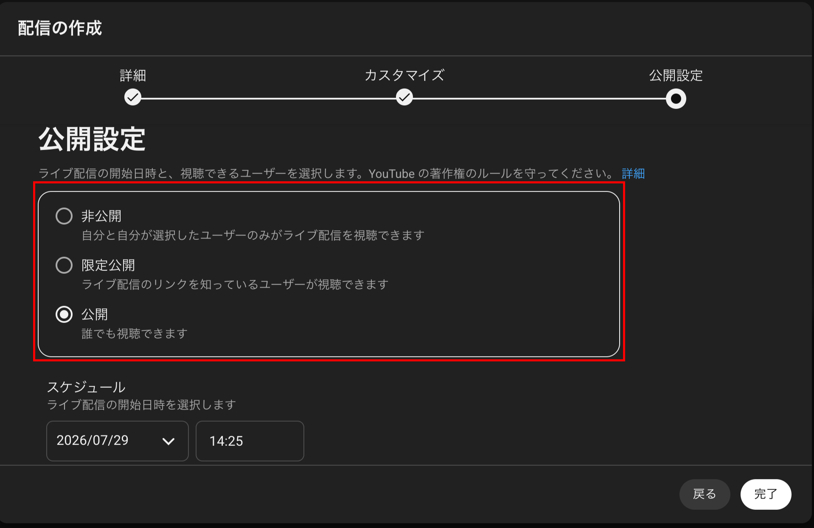{:.small}
1. ストリームのプレビュー
    * 「動画」からカメラを選択し，「音声」からマイクを選択してください．
        * 内蔵カメラ・マイク以外に，USBカメラ・マイクも選択できます．
    * カメラ画像，カメラとマイク設定，公開種別（「プライバシー」）を確認し，「ライブ配信を開始」を押してください．
    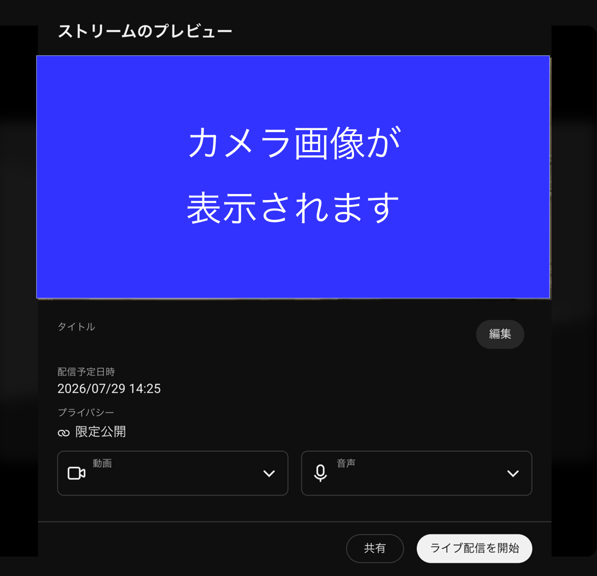{:.small}
1. 配信が開始されます．
    * 配信中の映像が表⽰されます．
    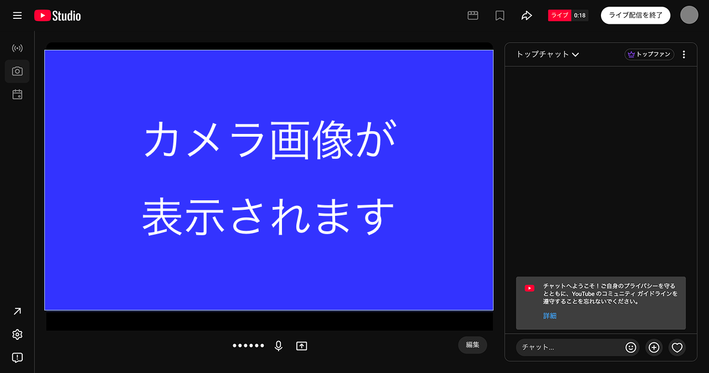{:.small}
    * 「限定公開」⽤のURLは画⾯右上部の⽮印を押すと表⽰できます．
        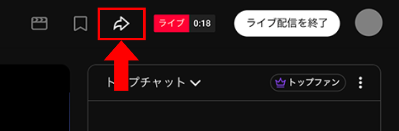{:.small}
        * URLをコピーし，視聴して欲しい⼈にメール等で共有してください．
        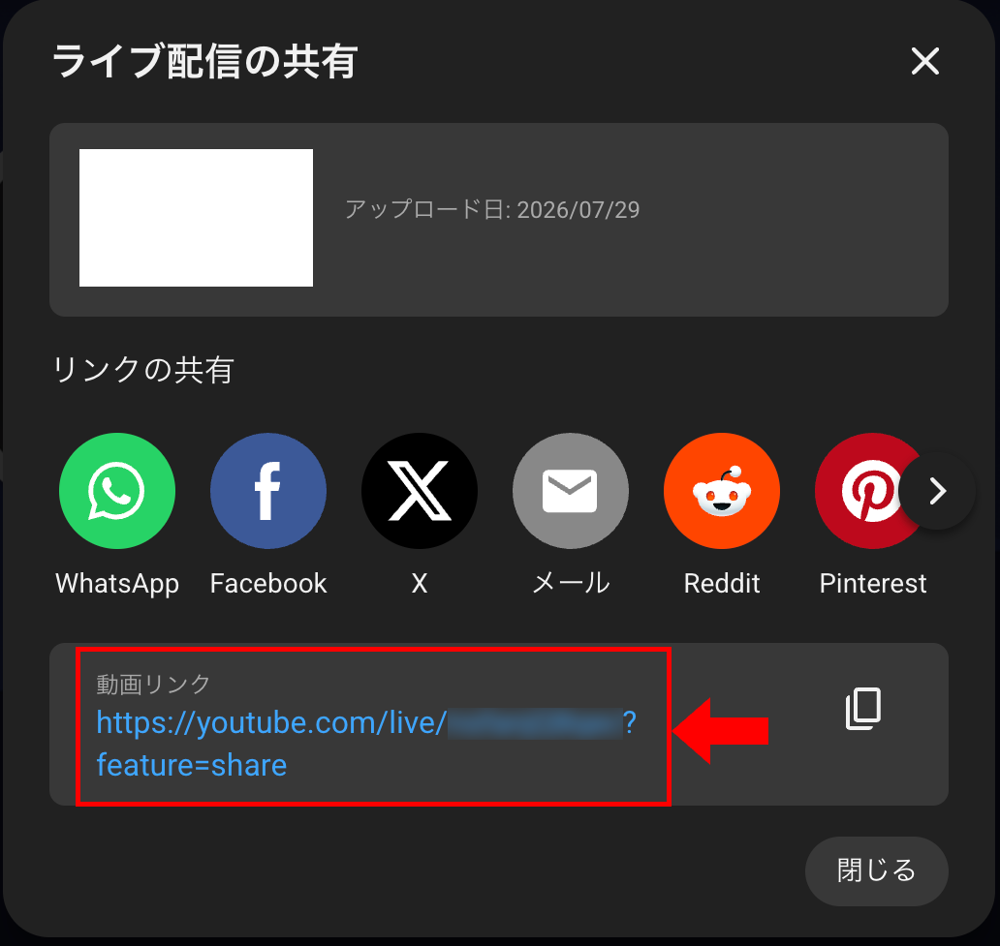{:.small}
1. 配信を終了するには，画⾯右上部の「ライブ配信を終了」を押してください．
    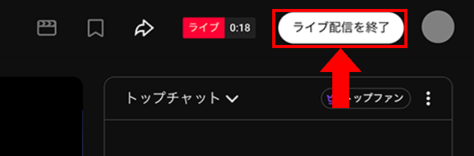{:.small}

## 参考ページ

ライブ配信を行うにあたってはYouTubeの公式ヘルプページにある下記の情報を適宜ご参照ください．

* ライブ配信：https://support.google.com/youtube/answer/2474026?hl=ja
* エンコーダでライブ配信を作成する：https://support.google.com/youtube/answer/9227510
