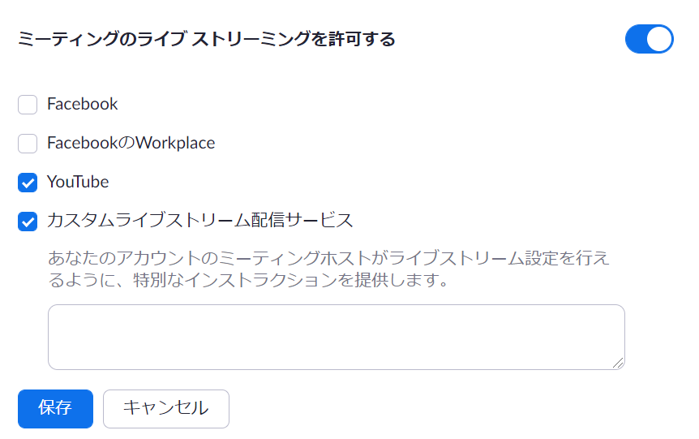
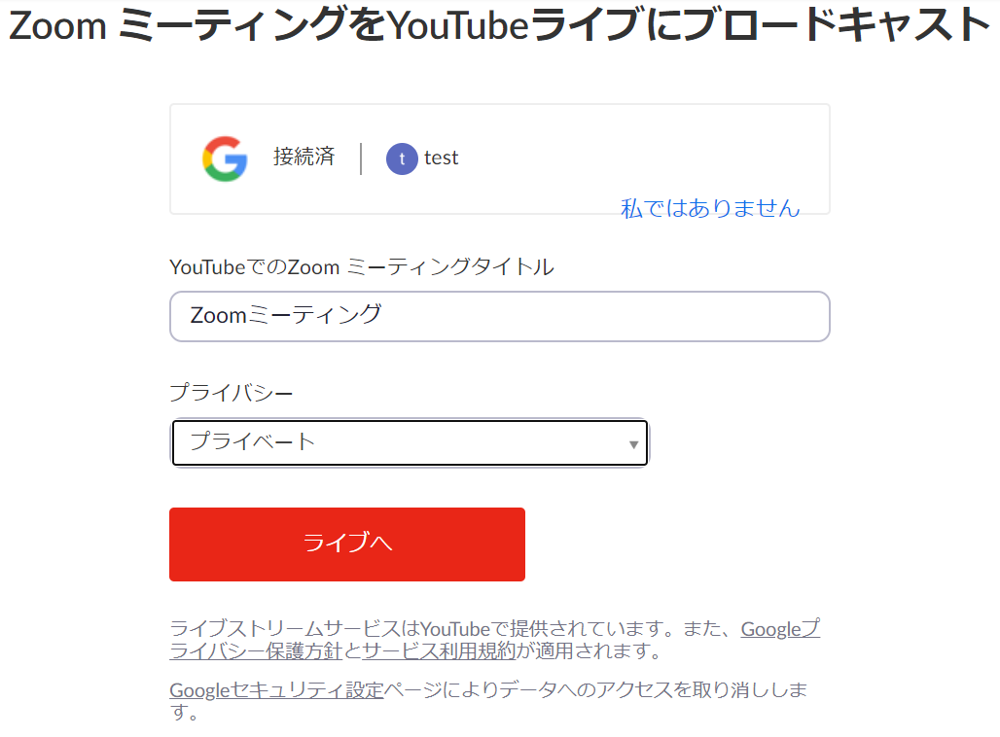
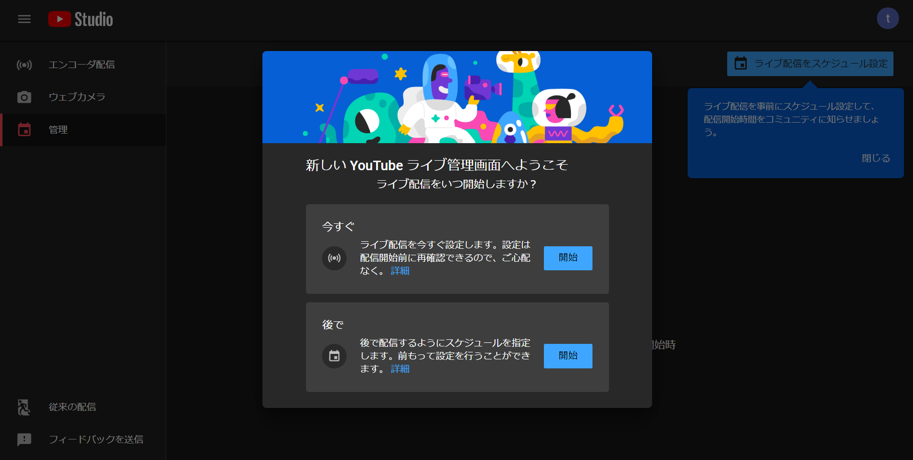
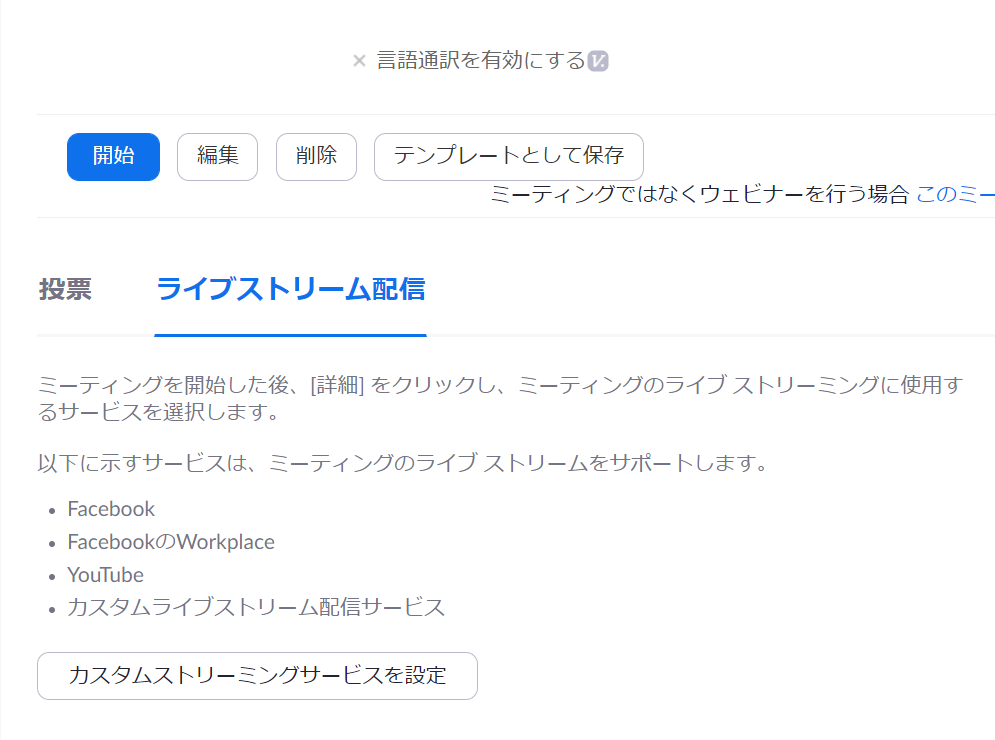
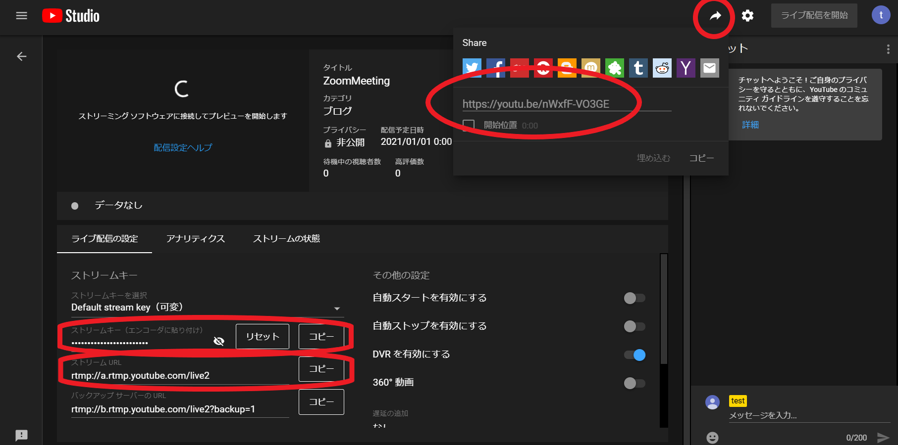
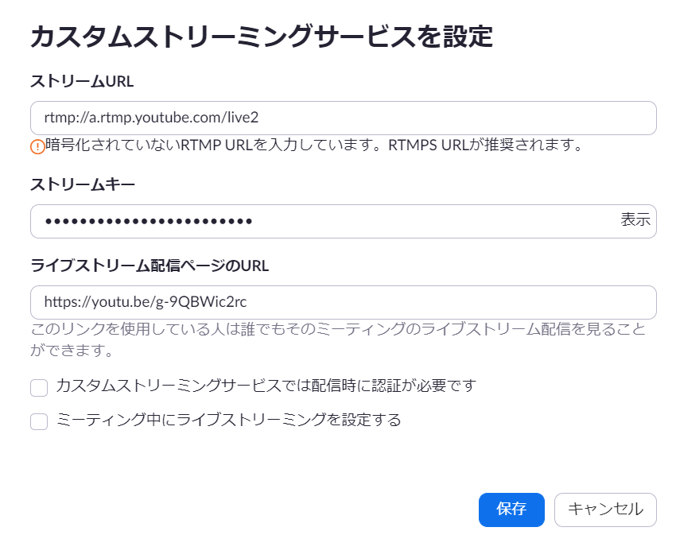

import ExcuseForAccuracy from '@components/ja/ExcuseForAccuracy.mdx'

<ExcuseForAccuracy />

このページでは，東京大学の[Zoom](/zoom/)アカウントを使って，ZoomミーティングやウェビナーをYouTubeでストリーミング配信する手順を案内します．

YouTubeのアカウントに東京大学の[ECCSクラウドメール](/google/)（`xxxx@g.ecc.u-tokyo.ac.jp`）アカウントを使うと，（ライブ配信を含む）YouTubeのコンテンツの視聴を東京大学の構成員のみに限定することもできます．

なお，YouTubeのチャンネルには「ブランドアカウント」で作成するものと個人のアカウントで作成するものがありますが，**ブランドアカウントで作成されたチャンネルでは視聴を東大の構成員のみに限定することができません**．東大構成員限定で配信を行いたい場合は，（ブランドアカウントではなく）個人のECCSクラウドメールアカウントで作成したチャンネルを使う必要があります．詳しくは「[チャンネルとアカウントについて](../../../#channel)」を参照してください．

## 事前準備：YouTubeのライブ配信を有効化する
{:#enable-live}

あらかじめ，配信に使うECCSクラウドメールアカウントでYouTubeのライブ配信機能を有効化しておく必要があります．有効化の手順については「[クラウドメールアカウントでのYouTubeライブ配信方法](../../#enable-live)」を参照してください．

なお，**ライブ配信が最初に有効になるまで最大24時間程度かかる**ことがあるため，時間に余裕をもって行ってください．

## Zoomでライブストリーミングを許可する
{:#allow-livestreaming}

ZoomからYouTubeへ配信するには，Zoom側でライブストリーミングを許可しておく必要があります．

1. [Zoom Webポータル](https://utokyo-tv.zoom.us/)にサインインして，「設定」にアクセスしてください．
2. 「ミーティングにて（詳細）」にある「ミーティングのライブ ストリーミングを許可する」を有効化し，「YouTube」または「カスタムライブストリーム配信サービス」を選択してください．
    - **YouTube**：Zoomミーティング／ウェビナーから直接ストリーミング配信をする場合に選択します（後述の「[Zoomから直接ストリーミング配信する](#direct)」）．
    - **カスタムライブストリーム配信サービス**：予定されたYouTubeのイベントにZoomミーティング／ウェビナーをストリーミング配信する場合に選択します（後述の「[予定されたYouTubeのイベントに配信する](#scheduled)」）．

    {:.medium.border}

## ストリーミング配信を始める
{:#start-streaming}

配信方法には，Zoomから直接配信する方法と，あらかじめYouTube側でイベントを用意してそこに配信する方法の2つがあります．

### Zoomから直接ストリーミング配信する
{:#direct}

1. ミーティングかウェビナーを開始してください．
2. ミーティングコントロールの「詳細」から「YouTubeにてライブ中」を選択してください．
3. ECCSクラウドメール（`xxxx@g.ecc.u-tokyo.ac.jp`）アカウントでYouTubeにサインインしてください．
4. 「Zoom ミーティングをYouTubeライブにブロードキャスト」のページで，以下の設定を行ってください．
    - **YouTubeでのZoom ミーティングタイトル**：Zoomミーティング／ウェビナーのトピックが自動的に入力されています．必要に応じてテキストボックスから変更してください．
    - **プライバシー**：「プライベート」を選択してください．

    {:.medium.border}
5. 「ライブへ」ボタンを押してください．

- ライブ配信では，実際のZoomミーティング／ウェビナーに対して約20秒程度の遅延が生じます．
- このYouTubeのライブストリームを東大の構成員と共有する方法は，「[配信を東大の構成員限定で共有する](#share)」を参照してください．

### 予定されたYouTubeのイベントに配信する
{:#scheduled}

あらかじめライブストリーミングへのリンクを取得し，参加者に共有しておきたい場合は，この方法を使います．

1. YouTubeにサインインしてください．
2. 右上の「作成」アイコンから「ライブ配信を開始」を選択してください．
3. 「今すぐ」または「後で」を選択してください．
    {:.medium.border}
4. 「ストリーミングソフトウェア」を選択してください．
5. 手順3で「後で」を選択した場合は，右上の「ライブ配信をスケジュール設定」を選択してください．（「今すぐ」を選択した場合はこの操作は必要ありません．）
6. 新しいタブを開き，[Zoom Webポータル](https://utokyo-tv.zoom.us/)を開いてください．
7. ミーティング／ウェビナーをスケジュールし保存してください．既にスケジュール済みの場合は，「ミーティング（／ウェビナー）」＞「次回のミーティング（／ウェビナー）」＞トピックを選択してください．
8. 下部にある「ライブストリーム配信」から「カスタムストリーミングサービスを設定」を選択してください．
    {:.medium.border}
9. YouTubeのライブ配信の設定画面で「ストリームURL」「ストリームキー」「ライブストリーム配信ページのURL」をコピーし，ミーティング／ウェビナーの「カスタムストリーミングサービスを設定」にペーストしてください．
    - ライブストリーム配信ページのURLは，YouTubeにて共有の矢印アイコンをクリックすることでリンクをコピーできます．
    - この手順を飛ばして次に進むこともできます．その場合は，代わりに手順11の後で同様の設定を行ってください．

    {:.medium.border}
    {:.medium.border}
10. イベントを始める準備ができたら，Zoomミーティング／ウェビナーを開始してください．
11. ミーティングコントロールの「詳細」から「カスタムライブストリーム配信サービスにてライブ中」を選択してください．

参考：Zoom公式ヘルプセンター「[カスタムサービスを使用してミーティングやウェビナーをライブストリーム配信する](https://support.zoom.com/hc/ja/article?id=zm_kb&sysparm_article=KB0061010)」

## 配信を東大の構成員限定で共有する
{:#share}

配信した動画（ライブストリーム）の視聴を東京大学の構成員のみに限定して共有する方法については，「[YouTube動画の公開範囲を設定する](../../../sharing/#utokyo-only)」を参照してください．

東大の構成員限定ではなく一般に公開したい場合や，「限定公開」と「公開」の違いについても，同じページで案内しています．

なお，視聴者（東京大学の構成員）が学内構成員限定のコンテンツを視聴する方法については，「[学内構成員限定のYouTubeコンテンツを視聴する](../../../#watching)」を参照してください．
