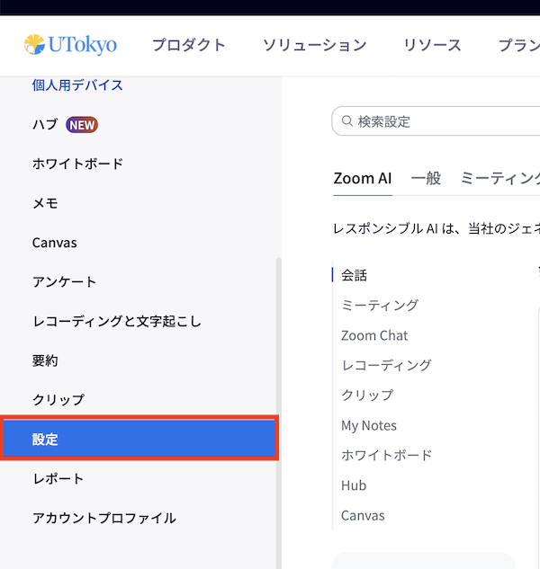
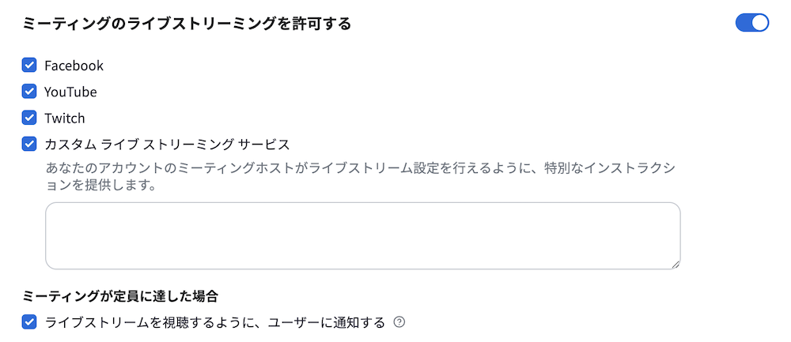
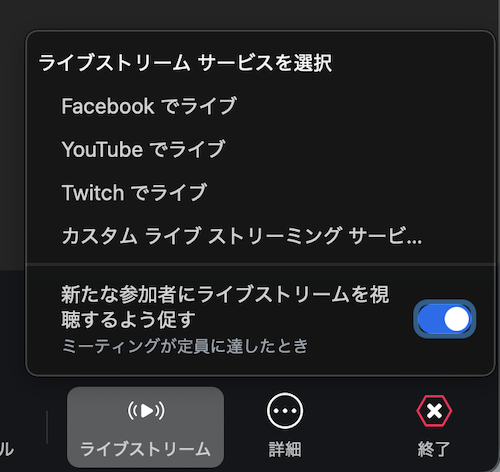
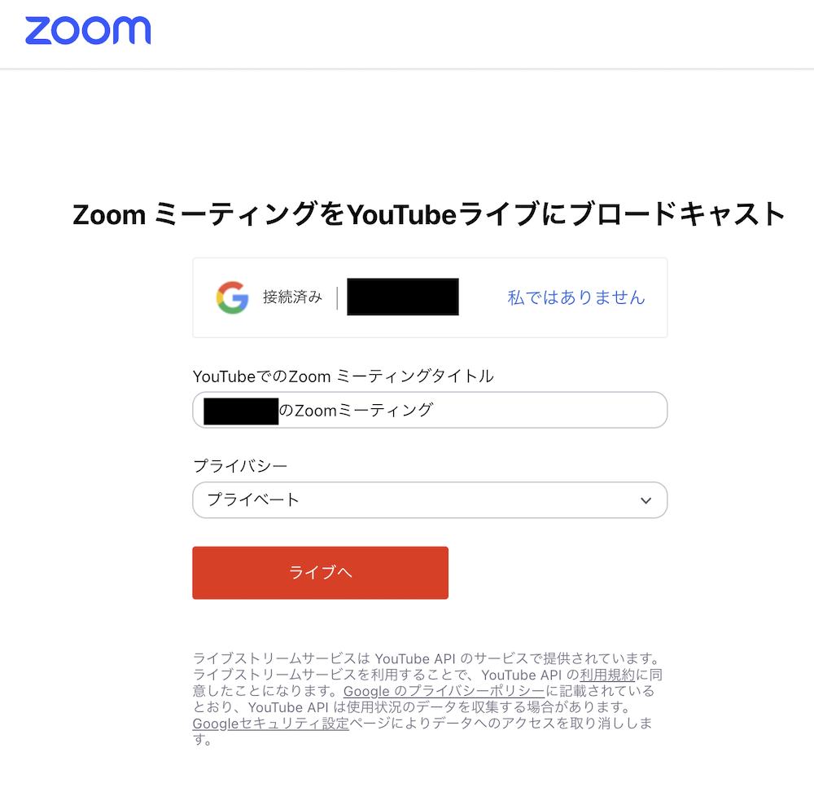
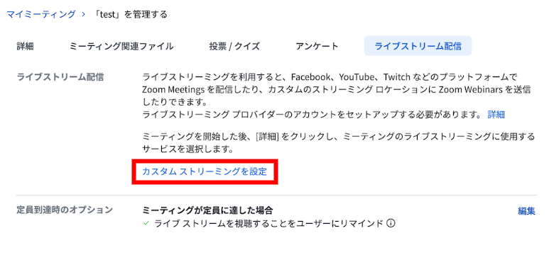
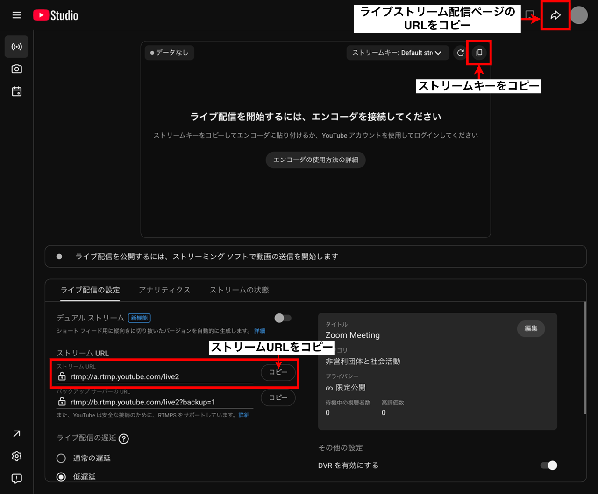
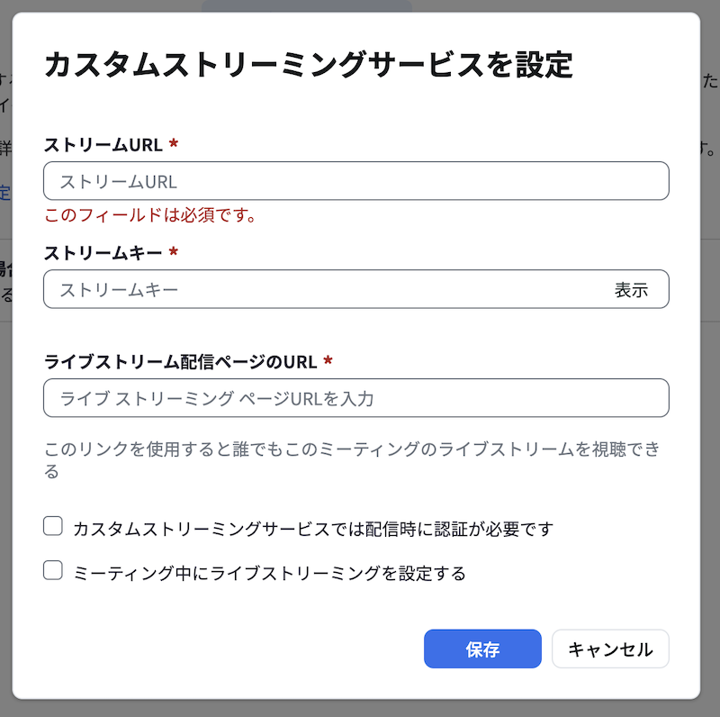

import ExcuseForAccuracy from '@components/ja/ExcuseForAccuracy.mdx'
import RequireEnableStriming from '../../_require_enable_striming.md'

<ExcuseForAccuracy />

このページでは，東京大学の[Zoom](/zoom/)アカウントを使って，ZoomミーティングやウェビナーをYouTubeでストリーミング配信する手順を案内します．

YouTubeのアカウントに東京大学の[ECCSクラウドメール](/google/)（`xxxx@g.ecc.u-tokyo.ac.jp`）アカウントを使うと，（ライブ配信を含む）YouTubeのコンテンツの視聴を東京大学の構成員のみに限定することもできます．

なおストリーミング配信では，実際のZoomミーティング／ウェビナーに対して約20秒程度の遅延が生じます．

また，配信する動画（ライブストリーム）の視聴を東京大学の構成員のみに限定して共有する方法については，「[YouTube動画の公開範囲を設定する](../../../sharing/#utokyo-only)」を参照してください．東大の構成員限定ではなく一般に公開したい場合についても，同じページで案内しています．特にYouTubeのチャンネルには「ブランドアカウント」で作成するものと個人のアカウントで作成するものがありますが，**ブランドアカウントで作成されたチャンネルでは視聴を東大の構成員のみに限定することができない**ため，東大構成員限定で配信を行いたい場合は（ブランドアカウントではなく）個人のECCSクラウドメールアカウントで作成したチャンネルを使う必要があることに注意してください．（詳しくは「[チャンネルとアカウントについて](../../../#channel)」を参照してください．）

## 事前準備：YouTubeのライブ配信を有効化する
{:#enable-live}

あらかじめ，配信に使うECCSクラウドメールアカウントでYouTubeのライブ配信機能を有効化しておく必要があります．有効化の手順については「[クラウドメールアカウントでのYouTubeライブ配信方法](../../#enable-live)」を参照してください．

なお，**ライブ配信が最初に有効になるまで最大24時間程度かかる**ことがあるため，時間に余裕をもって行ってください．

## 事前準備：Zoomでライブストリーミングを許可する
{:#allow-livestreaming}

ZoomからYouTubeへ配信するには，Zoomミーティングの開始前に，Zoomでライブストリーミングを許可しておく必要があります．（初期設定では有効になっていますが，同じ設定になっているかを以下の手順で事前に確認してください．）

1. [Zoom Webポータル](https://u-tokyo-ac-jp.zoom.us/profile)に[サインイン](/zoom/signin/)して，「設定」にアクセスしてください．
    {:.small.border}
2. 「ミーティング」>「ミーティング内（詳細）」にある「ミーティングのライブ ストリーミングを許可する」を有効化し，下記の説明に基づき「YouTube」または「カスタムライブストリームサービス」を選択してください．
    - **YouTube**：[Zoomミーティング／ウェビナーから直接ストリーミング配信をする場合](#direct)に選択してください．
    - **カスタムライブストリームサービス**：[予定されたYouTubeのイベントにZoomミーティング／ウェビナーをストリーミング配信する場合](#scheduled)に選択してください．

    {:.medium.border}

## ストリーミング配信を始める
{:#start-streaming}

配信方法には，[Zoomから直接配信する方法](#direct)と，あらかじめ[YouTube側でイベントを用意してそこに配信する方法](#scheduled)の2つがあります．

### Zoomから直接ストリーミング配信する
{:#direct}

1. ミーティングかウェビナーを開始してください．
2. ミーティングコントロールの「詳細」から「ライブストリーム」を選択してください．
3. 「YouTube でライブ」を選択してください．
    {:.small}
4. ECCSクラウドメール（`xxxx@g.ecc.u-tokyo.ac.jp`）アカウントでYouTubeにサインインしてください．
    - 「Google は、あなたに関する情報へのアクセスを Zoom に許可します」「Zoom が Google アカウントへのアクセスを求めています」といった画面が出てきた場合，権限を与えないとストリーミング配信ができないケースがあるので，注意してください．
6. 「Zoom ミーティングをYouTubeライブにブロードキャスト」のページで，以下の設定を行ってください．
    - **YouTubeでのZoom ミーティングタイトル**：Zoomミーティング／ウェビナーのトピックが自動的に入力されています．必要に応じてテキストボックスから変更してください．
    - **プライバシー**：「プライベート」を選択してください．

    {:.medium.border}
7. 「ライブへ」ボタンを押してください．
    

    
「The user is not enabled for live streaming...」というエラーが出た場合

    YouTubeの[ライブ配信の有効化](../../#enable-live)が完了していない可能性があります．「[機能の利用資格](https://www.youtube.com/features)」の画面で，「ライブ配信」（「中級者向け機能」の一部です）が有効になっているか確認してください．
    

### 予定されたYouTubeのイベントに配信する
{:#scheduled}

あらかじめライブストリーミングへのリンクを取得し，参加者に共有しておきたい場合は，この方法を使います．

1. YouTubeにサインインしてください．
2. 右上の「作成」アイコンから「ライブ配信を開始」を選択してください．
    <RequireEnableStriming />
3. 「エンコーダ配信」を選択してください．
4. 「編集」を押して，タイトル・説明・公開範囲などを選択・保存してください．
    - 設定項目については，「[ライブ配信の開始](../../#start-live)」と同様です．
5. 新しいタブで，[Zoom Webポータル](https://u-tokyo-ac-jp.zoom.us/profile)にサインインしてください．
6. ミーティング／ウェビナーをスケジュールし保存してください．既にスケジュール済みの場合は，「ミーティング（／ウェビナー）」＞「次回のミーティング（／ウェビナー）」＞トピックを選択してください．
7. 「ライブストリーム配信」タブから「カスタムストリーミングサービスを設定」を選択してください．
    {:.medium.border}
8. YouTubeのライブ配信の設定画面で「ストリームURL」「ストリームキー」「ライブストリーム配信ページのURL」をコピーし，ミーティング／ウェビナーの「カスタムストリーミングサービスを設定」にペーストしてください．
    - ライブストリーム配信ページのURLは，YouTubeにて共有の矢印アイコンをクリックすることでリンクをコピーできます．

    {:.medium.border}
    {:.medium.border}
9. イベントを始める準備ができたら，Zoomミーティング／ウェビナーを開始してください．
10. ミーティングコントロールの「詳細」から「カスタムライブストリーム配信サービスにてライブ中」を選択してください．

参考：Zoom公式ヘルプセンター「[カスタムサービスを使用してミーティングやウェビナーをライブストリーム配信する](https://support.zoom.com/hc/ja/article?id=zm_kb&sysparm_article=KB0061010)」
