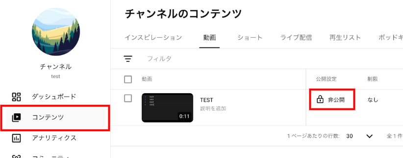
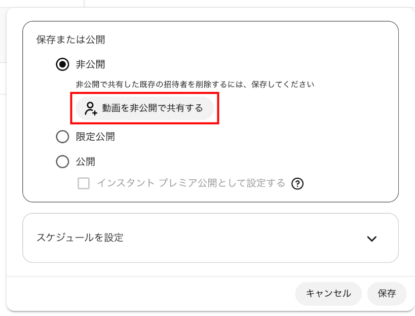
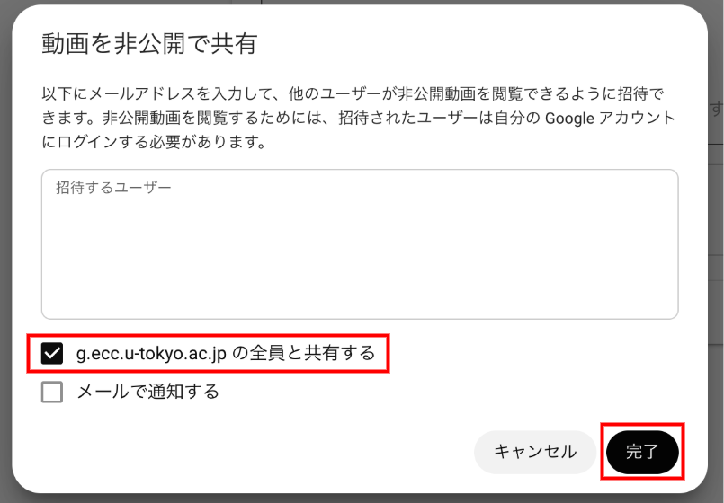
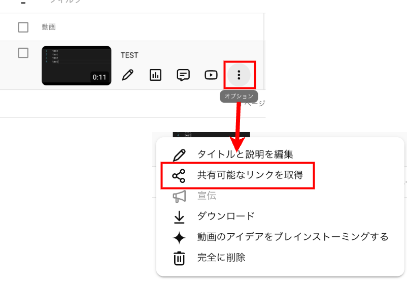

このページでは，YouTubeにアップロードした動画の公開範囲の設定方法，特に視聴を**東京大学の構成員のみに限定して公開する**方法を案内します．

[ECCSクラウドメール](/google/)（`xxxx@g.ecc.u-tokyo.ac.jp`）のアカウントでYouTubeにログインし，そのアカウントに紐づけられたチャンネルからコンテンツを共有する場合，視聴を東京大学の構成員に限定することができます．

## 公開範囲の種類
{:#visibility-types}

YouTubeの動画には，次の3つの公開範囲があります．

- **公開**：誰でも視聴できます．チャンネルの動画一覧や検索結果などに掲載され，そこからアクセスできるようになります．
- **限定公開**：URLを知っている人だけが視聴できます．動画一覧や検索結果には掲載されず，URLの直接入力やYouTube以外からのリンク経由でのみアクセスできます．
- **非公開**：自分と，自分が指定したアカウントだけが視聴できます．

このうち**「非公開」を使い，共有先としてECCSクラウドメールのドメイン（`g.ecc.u-tokyo.ac.jp`）全体を指定する**ことで，視聴を東京大学の構成員のみに限定して公開することができます．具体的な手順は次の「[学内構成員限定で公開する](#utokyo-only)」で説明します．

なお，**東大構成員限定で公開できるのは，個人のECCSクラウドメールアカウントで作成したチャンネルの場合のみ**です．「ブランドアカウント」で作成したチャンネルでは，視聴を東大構成員に限定することができません．チャンネルとアカウントの種類については「[チャンネルとアカウントについて](../#channel)」を参照してください．

## 学内構成員限定で公開する
{:#utokyo-only}

### 非公開で動画をアップロードする
{:#upload-private}

まず，**非公開**で動画をアップロードしてください．「[動画をアップロードする](../upload/)」を参考に，公開設定の画面で「非公開」を選択してください．

既に動画をアップロードしている場合は，動画のプライバシー設定を「非公開」に変更してください．

**「限定公開」ではなく「非公開」である**ことに注意してください．(「限定公開」の場合，URLを知っている人は，学内構成員であるか否かに関わらず視聴できます．)

動画が非公開になっているかは，次の手順で確認できます．

1. [YouTube Studio](https://studio.youtube.com/)にサインインしてください．
    - 既にYouTubeにサインインしている場合は，右上のチャンネルアイコンをクリックし，「YouTube Studio」を選択して移動してください．
    - 既にYouTube Studioにサインインしている場合は，左上のYouTube Studioのアイコンをクリックしてください．
2. 左のメニューから「コンテンツ」を選択してください．
3. 確認したい動画の公開設定欄が「非公開」になっていることを確認してください．
    {:.border}
    - もし「非公開」になっていない場合は，「限定公開」や「公開」とある部分を押して，公開設定のメニューから「非公開」を選択してください．

### 東大の構成員が動画を視聴できるようにする
{:#share-with-utokyo}

1. YouTube Studioにサインインしてください．
    - 既にYouTubeにサインインしている場合は，右上のチャンネルアイコンをクリックし，「YouTube Studio」を選択して移動してください．
    - 既にYouTube Studioにサインインしている場合は，左上のYouTube Studioのアイコンをクリックしてください．
2. 左のメニューから「コンテンツ」を選択してください．
3. 共有したい動画の公開設定欄を押してください．
    {:.border}
4. 公開設定のメニューで「非公開」を選択し，「動画を非公開で共有する」を押してください．
    {:.medium.border}
5. 「動画を非公開で共有」にて「`g.ecc.u-tokyo.ac.jp`の全員と共有する」をチェックして，「完了」をクリックしてください．
    {:.medium.border}
6. 手順4の公開設定のメニューに戻ったら，右下の「保存」をクリックしてメニューを閉じてください．
7. 「オプション」>「共有可能なリンクを取得」を選択して，動画のURLをコピーして，閲覧して欲しい相手に共有してください．
    {:.medium.border}

なおこの手順で共有された東大の構成員限定の動画を視聴する方法については，「[学内構成員限定のYouTubeコンテンツを視聴する](../#watching)」を参照してください．

## 一般に公開する
{:#public}

東大の構成員限定ではなく，一般に公開したい場合は，上記の公開設定のメニューで「非公開」の代わりに「**限定公開**」または「**公開**」を選択してください．

「限定公開」と「公開」の違いは「[公開範囲の種類](#visibility-types)」のとおりです．詳細はYouTubeのヘルプ「[動画のプライバシー設定を変更する](https://support.google.com/youtube/answer/157177?hl=ja)」もご覧ください．
