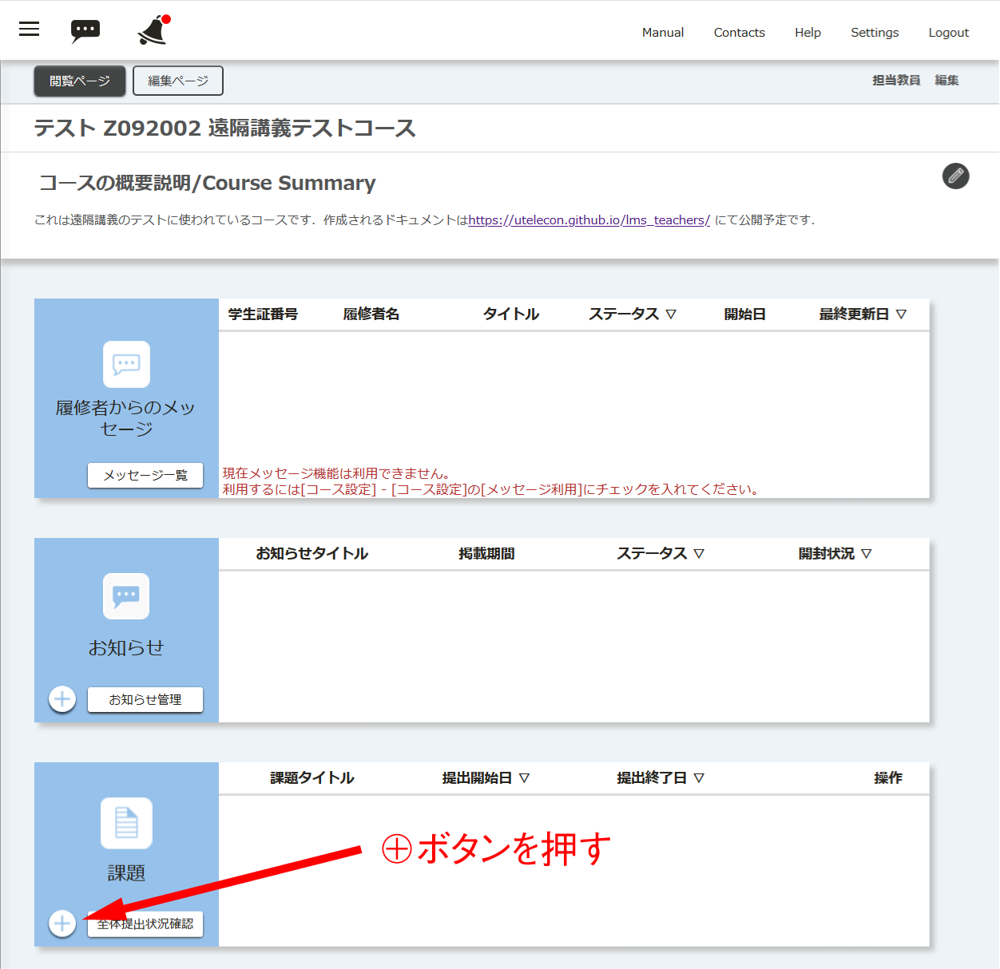

## 概要

- 「課題」では，提出期限を定めてレポートなどを提出させることが出来ます．
  - 提出物の形式は，ファイル（レポート，画像，プログラムなど）とテキスト直接入力が選べます．
- 期限を過ぎても提出できるように設定することが出来ます．
  - 期限を過ぎたレポートは区別できるので，減点するなどの対応が可能です．

## 「課題」の作り方

### 動画

### 画像

1. 「コースの概要説明/Course Summary」の画面の上から3つ目にある「課題」の左下にある⊕ボタンを押します．

1. 「課題 新規登録」のページになるので，以下の内容を設定します．

   1. 「タイトル」では，課題のタイトルを記入します．
   1. 「内容」では，課題の内容を記入します．
   1. 「提出期間」では，課題を提出できる期間を設定します．
      - 具体的には，授業開始時から次回授業の開始時まで，といった設定が考えられます．
   1. 「提出方法」では，提出方法を選択します．
      - 「ファイルアップロード」では，最大100MBまでのファイルを複数アップロードできます．
        - 教員は後で一括でファイルをzip形式でダウンロードすることが出来ます．
      - 「テキスト直接入力」では，ブラウザからテキストを10000文字まで直接入力できます．
   1. 「期間後の提出」では，期間が過ぎても提出を認めるかどうかを指定します．
      - 提出間際にトラブルが発生する場合があるので，「可」にしておいた方が安全です．
      - 遅れて提出した学生は減点するなどの対応をすることが出来ます．
   1. 「評価の参照」では，教員の評価結果を学生が参照できるかどうかを指定します．
      - 学生へのフィードバックに使用できます．
   1. 最後に「確認画面に進む」ボタンを押します．
1. 内容を確認して登録します．

   - 必要に応じて「提出画面プレビュー」を確認して下さい．
   - 提出期間をよく確認して下さい．
     - 開始日時や終了日時は，その日時を過ぎると後から変更できません．
   - 「登録する」ボタンを押します．

## 参考情報

* <a href="https://www.ecc.u-tokyo.ac.jp/itc-lms/faq.html">FAQ: よくある質問 (ITC-LMS)</a>