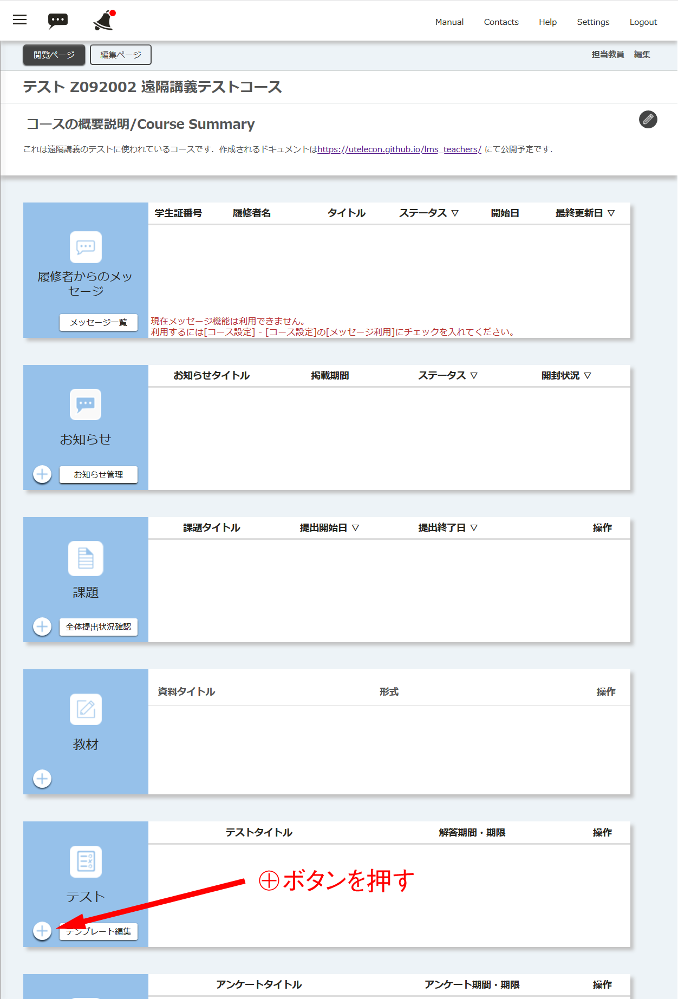
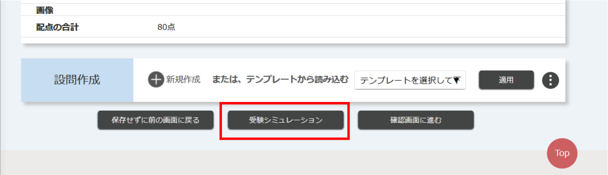

## 概要
* 「テスト」では，1問1答形式の問題を出題することが出来ます．
  * 授業をちゃんと聞いていたか，どの程度まで理解したか，などを確認する目的に使えます．
    * カンニングの問題などがあるので，成績に反映させる場合は実施方法に注意が必要です．
    * 出席確認の代わりに使うなど，カジュアルな使い方のほうが向いていると思います．
* 提出できない等のトラブルに対して，予め対応を決めておく必要があります．
  * 学生が操作に不慣れな場合，システムの過負荷による場合など，様々なケースが想定されます．
  * 教員・学生の双方が慣れるまでは，点数を厳密に扱わないほうが安全です．
* 様々な条件を設定できるので，作成前にテストの性質をよく考えておく必要があります．
  * 学生が自主的に学ぶため，授業中に理解度を確認するため，成績をつけるため，など．
* 「課題」と違って解答期間を過ぎて提出することはできません．
  * 例えば，遅れた人にも減点ありで解答させたい場合は，解答期間を別にしたテストをもう一つ作成しておく必要があります．

## テストの作り方

### 動画

### 画像

1. 「コースの概要説明/Course Summary」の画面の上から5つ目にある「テスト」の左下にある⊕ボタンを押します．

1. 「テスト 新規登録」のページになるので，以下の内容を設定します．

   1. 「タイトル」では，テストのタイトルを記入します．
   1. 「テスト内容」では，テストの内容の説明を記入します．省略可能です．
   1. 「解答期間」では，テストに解答できる期間を設定します．
      - 「再受験」を「可」または「合格点に達するまで可」にすると，この期間内で何度も受験できます．
      - 「再受験」を不可にすると，この期間内で１度だけ受験できます．
      - 具体的には，(1) 授業時間中のみ，(2) 次回の授業開始時まで，といった設定が考えられます．
      - 期間が始まってしまうと止められないので，開始時間はよく考えて設定してください．
   1. 「制限時間」ではテスト全体の解答時間を設定できます．
      - 「あり」の場合，制限時間を超えると強制的に解答が打ち切られて，その時点の回答内容が送られます．
   1. 「解答待ち時間」では，解答を始めるまでに待たせる時間を設定できます．
      - 受験開始前に説明を読ませるなどの場合に使います．
      - 最初は「なし」で良いと思います．
   1. 「ランダム出題」を「あり」に設定すると，予め複数作成しておいた設問の中から，指定した数の設問をランダムに出題させることが出来ます．
      - テストを繰り返し行う場合に，答えを順番で丸暗記するなどの対策を防ぐことが出来ます．
   1. 「合格点」を「あり」に設定すると，合格点に達するまで繰り返し受験させることが出来ます．
   1. 「採点結果の参照」では，学生が解答後に採点結果の点数を参照可能にするかどうかや，参照させるタイミングを設定します．
      - 参照不可（「不可 」），「提出時」（自動採点の場合）あるいは「採点後」（手動採点の場合），全員が回答し終わった後（「解答期間終了時」）から選択できます．
   1. 「正解の参照」では，学生に正解や解説を参照させるかどうかや，参照させるタイミングを設定します．
      - 参照不可（「不可」），「提出時」（手動採点の場合は採点前），「採点後」，全員が回答し終わった後（「解答期間終了時」）から選択できます．
      - 正解を参照可能にすると，解答が他の受験中の学生に知られてしまう可能性があるので，テストの性質に応じて適切に設定してください．
   1. 「自動採点」では，解答時にシステムが自動で採点するか，教員が手動で採点するかを設定します．
       - 自動採点をするためには，選択式や一意の文字列に定まる穴埋め問題（全角・半角の違い等に注意）である必要があります．
   1. 「再受験」では，2回以上繰り返し受験できるかどうかを設定します．
       - 自主研鑽のためのテストの場合は，再受験を「可」や「合格点に達するまで可」にすると良いでしょう．
       - 成績に反映させる場合は，再受験を「不可」にするとよいでしょう．
1. 「設問作成」の「⊕新規作成」で必要な数だけ設問を追加します．

   - <u>単一選択形式（ラジオボタン）の作り方</u>
      
      1. 「設問設定」で「単一選択形式（ラジオボタン）」を選択します．
      1. 「タイトル」を入力します．
      	 - 問1などのタイトルであって，設問そのものではありません．
      1. 「設問内容」 で実際の問題文を入力します．
      1. 解答の項目数（選択肢の数）を選択します．
      1. 解答項目（解答の選択肢）を必要な数だけ入力します．
      1. 正解の解答項目のチェックボックスをチェックします．
      1. 解説文を入力します．提出後，採点後，解答期間終了時に学生が参照できます．
      1. 配点を入力します．問題総数や合格点，重要度に応じて決めて下さい．
      	 - 合計点数が何点になるかは事前に確認しておいて下さい．
      1. 「登録する」ボタンを押す
   -  <u>複数選択形式（チェックボックス）の作り方</u>
      
      　 <b>※正解が複数あるだけで，ラジオボタンとほとんど同じです．</b>
      1. 「設問設定」で「複数選択形式（チェックボックス）」を選択します．
      1. 「タイトル」を入力します．
      	 - 問1などのタイトルであって，設問そのものではありません．
      1. 「設問内容」 で実際の問題文を入力します．
      1. 解答の項目数（選択肢の数）を選択します．
      1. 解答項目（解答の選択肢）を必要な数だけ入力します．
      1. <b>正解の解答項目のチェックボックスをすべてチェックします．</b>
      1. 解説文を入力します．提出後，採点後，解答期間終了時に学生が参照できます．
      1. 配点を入力します．問題総数や合格点，重要度に応じて決めて下さい．
      	 - 合計点数が何点になるかは事前に確認しておいて下さい．
      1. 「登録する」ボタンを押す
   -  <u>フリーテキスト形式（テキストエリア）の作り方</u>
      
   　 <b>※正解が文章になっているだけで，ラジオボタンやチェックボックスとほとんど同じです．自動採点は出来ません．</b>
      1. 「設問設定」で「フリーテキスト形式（テキストエリア）」を選択します．
      1. 「タイトル」を入力します．
      	 - 問1などのタイトルであって，設問そのものではありません．
      1. 「設問内容」 で実際の問題文を入力します．
      1. <b>正解の文章を入力します．</b>
      1. 解説文を入力します．提出後，採点後，解答期間終了時に学生が参照できます．
      1. 配点を入力します．問題総数や合格点，重要度に応じて決めて下さい．
      	 - 合計点数が何点になるかは事前に確認しておいて下さい．
      1. 「登録する」ボタンを押す
   - <u>穴埋め形式の作り方</u>
      
   　 <b>※設問への入力欄の挿入の仕方や自動採点方式の選択などが他と異なります．</b>
      1. 「設問設定」で「穴埋め形式」を選択します．
      1. 「タイトル」を入力します．
      	 - 問1などのタイトルであって，設問そのものではありません．
      1. <b>「設問内容」 で実際の問題文を入力します．</b>
         - 解答の入力欄（穴）を挿入したい場所で「穴埋めタグ追加」ボタンを押します（[fb]という文字列が挿入されます）．
      1. <b>解答項目数（穴の数）を指定します．</b>
      1. <b>正解の文字列を必要な数だけ入力します．</b>
         - 問題文から一意な文字列になるように出題の仕方を注意します．
      1. <b>自動採点方式を指定します．</b>
         - 不正解の解答があった場合の点数の付け方を変えられます．
      1. 解説文を入力します．提出後，採点後，解答期間終了時に学生が参照できます．
      1. 配点を入力します．問題総数や合格点，重要度に応じて決めて下さい．
      	 - 合計点数が何点になるかは事前に確認しておいて下さい．
      1. 「登録する」ボタンを押す
1. 受験シュミレーションをします．

   - 「テスト 新規登録」の画面で「受験シュミレーション」ボタンを押します．
   - 一通り試験を受験してみて内容を確かめてみて下さい．
1. 確認画面に進みます．

   - 「テスト 新規登録」の画面で「確認画面に進む」ボタンを押します．
1. 確認してテストを登録します．

   - 「確認」ボタンを押します．

## 参考情報

* <a href="https://www.ecc.u-tokyo.ac.jp/itc-lms/faq.html">FAQ: よくある質問 (ITC-LMS)</a>
  * <a href="https://www.ecc.u-tokyo.ac.jp/announcement/2015/04/08_2029.html">ITC-LMS のテンプレートを別のコースや違うアカウントでも使いたい （教員）</a>
  * <a href="https://www.ecc.u-tokyo.ac.jp/announcement/2014/04/10_1858.html">ITC-LMS で作成したテストを確認する方法 (教員)</a>
  * <a href="https://www.ecc.u-tokyo.ac.jp/announcement/2014/04/23_1889.html">ITC-LMS のテストや課題の評価で利用できる文字について (教員)</a>
  * <a href="https://www.ecc.u-tokyo.ac.jp/announcement/2014/04/23_1888.html">ITC-LMSのテストで、複数の穴埋めを用意した問題を作成したい(教員)</a>
  * <a href="https://www.ecc.u-tokyo.ac.jp/announcement/2014/04/23_1890.html">ITC-LMSのテストで出題時に配点を表示させたい(教員)</a>
