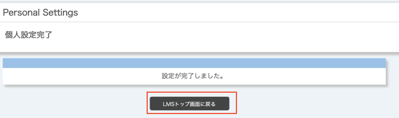

import NotificationHelp from '@components/ja/systems/itc_lms/NotificationHelp.mdx'

ITC-LMSにログインした際に「お知らせ」として知ることができる更新内容について，あらかじめ設定をしておくことで，メールやLINEで受け取ることができます．
学生は，先生からのお知らせを確実に受け取れるよう，以下の手順で通知設定を行っておいてください．LINEで通知を受け取ることもできます．なお，教員も通知設定をすると学生からのメッセージの受信や課題提出などの通知を受け取れます．

## お知らせの通知先を設定する

1.ITC-LMSにログインすると時間割の画面が表示されます．右上の`Settings`ボタンを押してください.

2.以下のような設定画面が表示され，LINEやメールで ITC-LMS の通知を受け取るための設定を行うことができます．以下，各項目の説明を行います．

3.お知らせをメールで受け取る場合，この画面で`転送先メールアドレス`を設定します．頻繁にチェックするメールアドレスを設定してください．

{/* 
学務システム UTAS に登録された連絡先（`[E-Mail1]`）を通知先に使いたい場合には，`連絡メールアドレス`を指定してください．それ以外のアドレスを使いたい場合には，`手動登録メールアドレス`を指定し，直下のボックス（以下の図では表示されていない）にメールアドレスを入力してください．
*/}

|指定する項目|効果|
|---|---|
|`連絡メールアドレス`|学務システム UTAS に登録された連絡先（`[E-Mail1]`）に通知|
|`手動登録メールアドレス`|以下の図の直下のボックスに入力したメールアドレスに通知|
|`転送しない`|メールでは通知しない **（注）LINEで通知を受け取る場合以外，選択しないでください**|

<NotificationHelp />

4.LINEで受け取る場合，以下の図の`LINEから通知を受け取る`を押してください．  
**（注） iPhone等のiOS機器では以下の LINEの設定ができないことがあります．そのような場合には，PC（Windows または macOS）からお試しください．**

すると LINE のログイン画面が現れます．
メールアドレスとパスワードを入力し，`ログイン`ボタンを押してください．

次の画面で，`1:1でLINE Notifyから通知を受け取る`を選択し，`同意して連携する`ボタンを押してください．

「設定が完了しました」と表示されたら，`LMSトップ画面に戻る`を押してください．
そして，LINEに連携完了のメッセージが届くのを確認してください．

5.以下の２つの図に示すポップアップメニューから，お知らせ通知と更新通知の受け取り方を指定してください．お知らせ通知では，重要な情報が送られていることがあります．**`受け取らない`は指定しないようにしてください．**

6.以上の項目の設定ができたら，`確認画面に進む`ボタンを押してください．

7.内容を確認し，`登録する`を押してください．

8.「設定が完了しました」と表示されたら，`LMSトップ画面に戻る`を押してください．これで設定は完了です．

[手順動画](https://youtu.be/xAur5zar5Sc)

## 参考情報
* <a href="https://www.ecc.u-tokyo.ac.jp/itc-lms/faq.html">FAQ: よくある質問 (ITC-LMS)</a>
  * <a href="https://www.ecc.u-tokyo.ac.jp/announcement/2014/04/21_1886.html">ITC-LMS のお知らせメールが英語で届く (教員・学生)</a>
