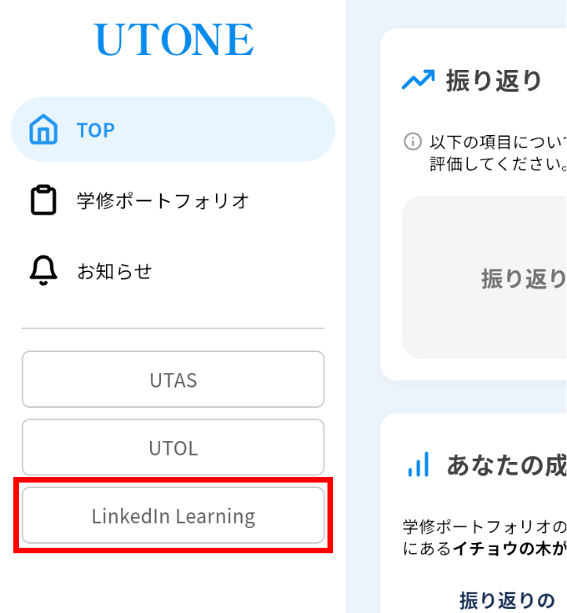
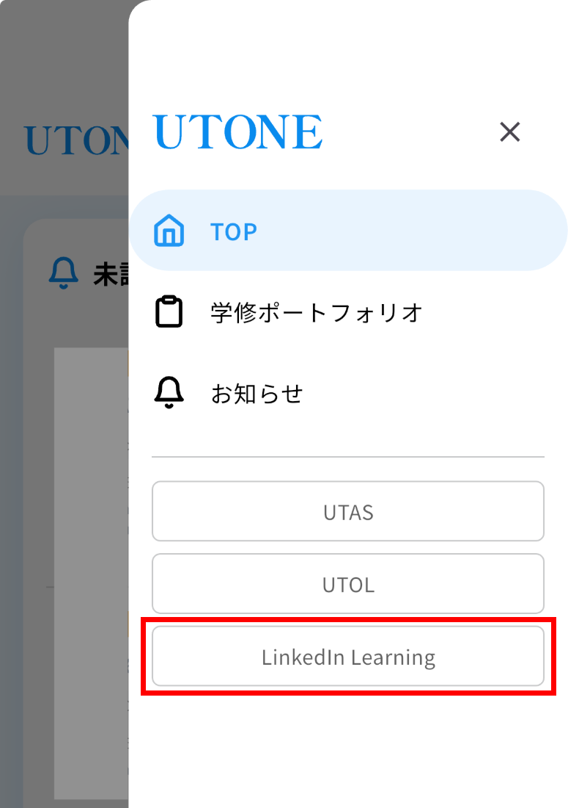

1. ブラウザで[UTONEにアクセス](https://utone.u-tokyo.ac.jp/)してください．またはUTONEのモバイルアプリ（[Google Play](https://play.google.com/store/apps/details?id=jp.ac.u_tokyo.utone)または[App Store](https://apps.apple.com/app/id6760084159)からダウンロード）でも結構です．
2. UTokyo Accountにサインイン済みでない場合，サインインしてください．
3. サイドバーの「LinkedIn Learning」ボタンを押してください．
   <gallery></gallery>
