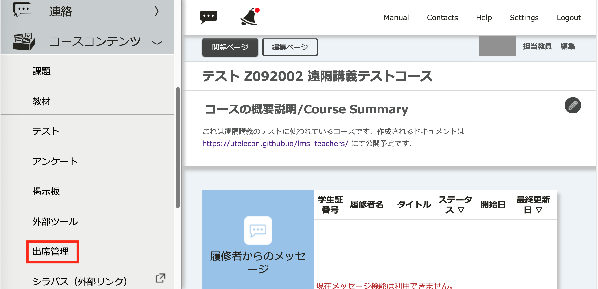
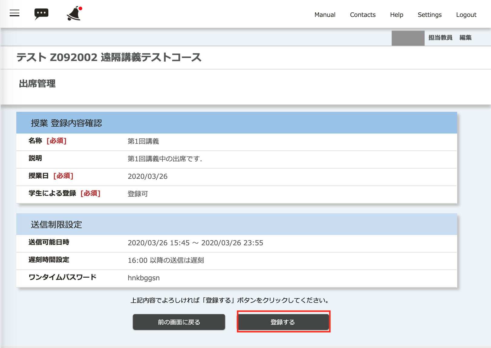

オンライン授業では，ITC-LMSの「出席」機能を以下のように利用することができます．

* 教員が設定した時間帯 (分単位で指定可能)に，学生がITC-LMSの該当コースを選択して，「出席送信」ボタンを押してワンタイムパスワードを入力したことを確認できる．
* ワンタイムパスワードをオンライン授業中に画面，音声，コメント，チャット等で提示すると，オンライン授業を受講していることも確認できる．
* 教員が設定した時間帯になるまで，学生にはどの時間帯に出席をとるかがわからないため，学生は出席のためにオンライン授業の全部の時間帯だけを受講するモーティベーションが高まる．

一方で，オンライン授業において出席をとることには以下のような問題もあります．

* 学生のネットワーク環境や，サーバの負荷等により，受講の意志があっても，一部の学生のみ該当時間帯に「出席」とすることができない不利が生じることがある．
* 出席を取るためだけに，あらかじめ設定した時間帯に授業を中断する必要がある．学生の理解度もはかりたい場合はテスト機能の方が適している．
* ワンタイムパスワードを受講者同士がSNS等でやり取りすると，授業を視聴してなくても出席とすることが可能となる．

小テストや出席点を成績評価に反映させることを避けるように教員に案内している学部，研究科もあるので，回答者を特定しないで学生の反応，フィードバックを得たい場合は，オンライン会議システムの投票機能などを使うことも検討してください．

## 授業の登録
出席を取る時間帯を授業中に設定すると，その間授業が止まるので，授業準備の段階で設定しておくことをお勧めします．

1. コースの画面で左上の三本線のアイコンを選択してメニューを出します．

2. 「コースコンテンツ」を展開して，「出席管理」を選択します．

3. 「出席管理」の画面で「+」を選択します．

4. 出席を取る時間帯を選択します．
  
    * 「名称」は教員の集計時に見えるだけなので適当で構いません．
    * 「説明」は空で問題はありません．
    * 「授業日」は授業をおこなう日を入れてください．
    * 「学生による登録」は，「登録可」にします．「登録不可」は，カードリーダー等，ITC-LMS以外で取った出席情報を教員が登録する際の設定になります．
    * 「送信可能日時」は学生が，ITC-LMSを使って「出席」を送信可能な時間帯を指定します．オンライン授業で録画された授業を後日視聴可能にしている場合は，終了時刻を数日後，数週間後に設定することも検討してください．
    * 「遅刻時間設定」は，「送信可能日時」の範囲でも，ある時刻を超えた時に，「遅刻扱い」にする (学生本人にも伝わる) ための設定になります．
    * 「ワンタイムパスワード」は，学生が出席送信をする際に入力させるパスワードになります．毎回同じパスワードを使うのではなくて，オンライン授業中に画面，音声，コメント，チャット等で提示することが想定されています．毎回違うパスワードを考えるのが面倒な場合は，自動生成を選択すると乱数でパスワードが生成されます．
5. 登録します．

[手順動画](https://youtu.be/QHTF-pG886w)
## 参考情報
* <a href="https://www.ecc.u-tokyo.ac.jp/itc-lms/faq.html">FAQ: よくある質問 (ITC-LMS)</a>
  * <a href="https://www.ecc.u-tokyo.ac.jp/announcement/2014/05/13_1904.html">ITC-LMS で出席確認を行う方法について (教員)</a>
  * <a href="https://www.ecc.u-tokyo.ac.jp/announcement/2014/04/18_1881.html">ITC-LMS で出席管理を行う際の注意点 (教員)</a>
