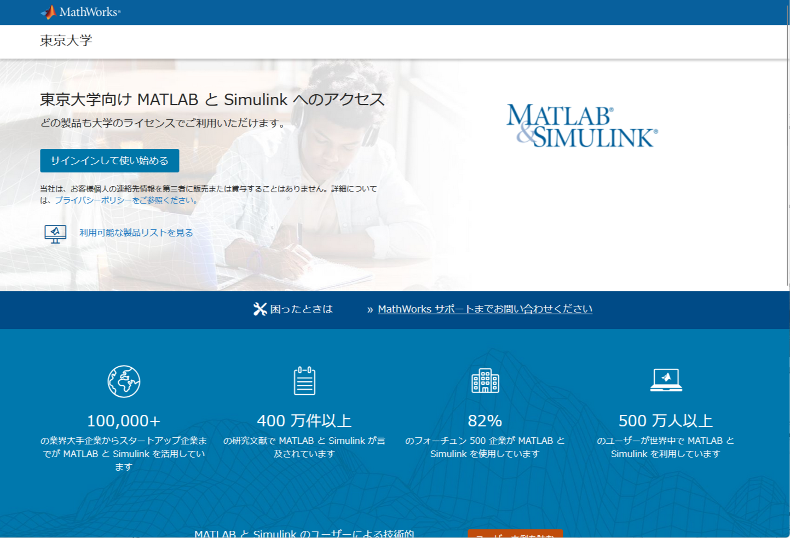
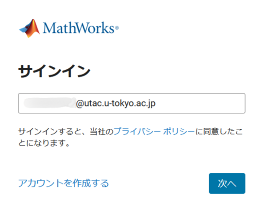
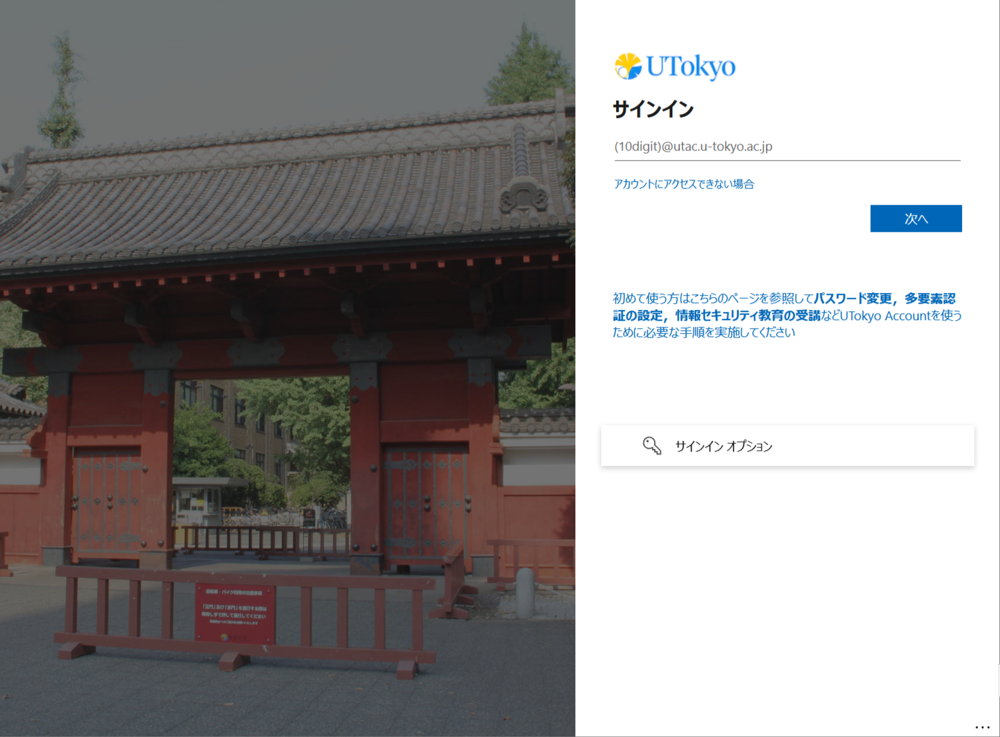
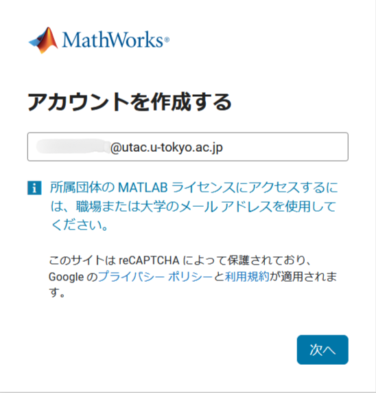
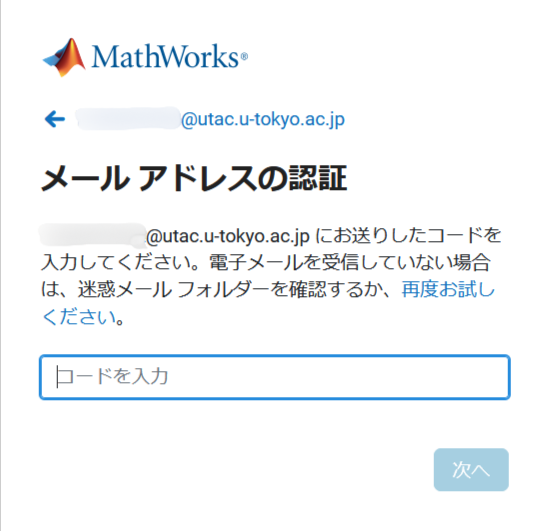
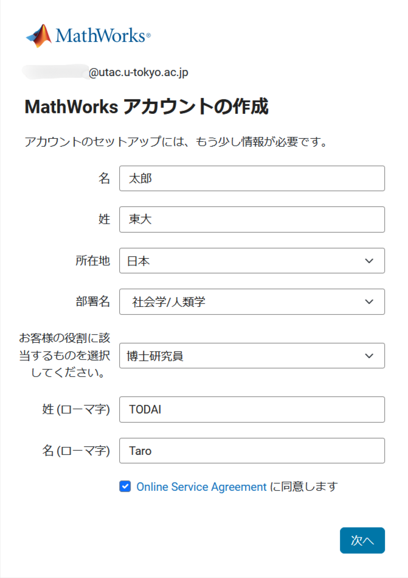
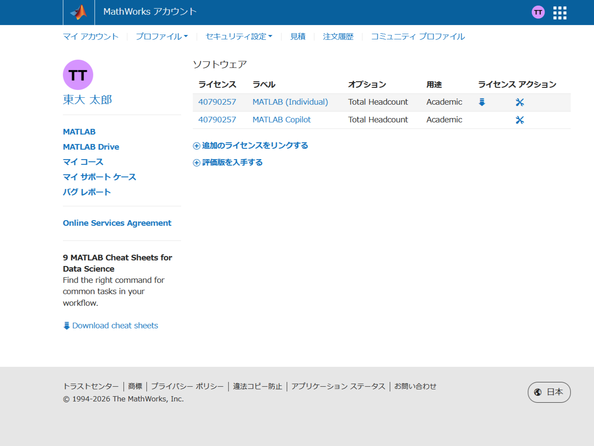

## はじめに
東京大学ではMathWorks社の提供するソフトウェア「[MATLAB](https://jp.mathworks.com/products/matlab.html)」を全学で導入しており，学内構成員に対して個人端末での利用，教育・研究用の共用端末での利用，情報基盤センターが提供する[スーパーコンピュータシステムでの利用](https://www.cc.u-tokyo.ac.jp/guide/application/introduction-matlab.php)をサポートしています．

このページでは個人端末でのMATLABの利用について説明しています．

## MATLABについて
[MATLAB](https://jp.mathworks.com/products/matlab.html)は，科学技術計算を目的に開発されたプログラミング言語，およびこれを用いた数値計算・数式処理ソフトウェアです．代数・幾何・解析の各数学処理をはじめ，機械学習や統計分析・データの可視化・制御シミュレーションとそのハードウェアへの実装といった，さまざまな用途に利用できます．コードを書かずにGUIで操作することも可能なため，工学・理学などの専門分野における研究利用はもちろん，プログラミング初学者の基礎教育や，人文科学・社会科学の分野におけるデータ分析でも容易に導入できます．

東京大学ではライセンスの包括契約を行っており，現在は**すべてのUTokyo Account利用者**が個人の端末から下記の機能を追加の費用負担なく利用できます．提供される機能は大学の状況と契約内容により増減する場合があります．

- MATLABのインストールと利用
- MATLAB Onlineの無制限利用
    - PCブラウザから利用できるオンライン版のMATLABです．
- MATLAB Mobileの無制限利用
    - スマートフォン・タブレット向けに提供されているアプリです．
- MATLAB Toolbox
    -  [東京大学の包括ライセンスページ](https://jp.mathworks.com/academia/tah-portal/university-of-tokyo-40790257.html)の「利用可能な製品の一覧」に記載された関連オプション製品を利用することができます．
- MATLAB Driveの保存容量 20 GB
    - MATLAB Online等のデータを保存可能なクラウドサービスです．
- オンラインチュートリアルコースの受講
- MATLAB Graderの利用
    - プログラムコーディング課題の作成・問題の配布・自動採点・評価を一括で行えるサービスです．

利用目的は教育・研究活動とそれに関連する業務に限ります．営利目的での利用はできませんので，必要な方は，別途MathWorks社へお問い合わせください．

また，利用の際は「[情報システム本部が管理・運用する外部サービスの利用にあたっての注意事項](/docs/dics-terms/)」も参照してください．

## 利用開始の手順

東京大学の包括ライセンスのもとでMATLABを利用する場合は，UTokyo AccountをMathWorksアカウントとして利用します．
なお，2024年12月以前に，それまで提供していた形式（UTokyo Accountではなく，u-tokyo.ac.jpで終わる東京大学のメールアドレス）のMathWorksアカウントを作成し, UTokyo MATLAB CWL を利用していた方も，サインインにはUTokyo Accountを利用できます．
1. MathWorks社の提供する東京大学の[東京大学の包括ライセンス紹介ページ](https://jp.mathworks.com/academia/tah-portal/university-of-tokyo-40790257.html)にアクセスし，ページ中ほどの「サインインして使い始める」を押してください．

{:.medium.center.border}

2. 以下のようなMATLABのサインイン画面が表示されるので，「電子メール」欄にUTokyo Account（例：`0123456789@utac.u-tokyo.ac.jp`）を入力し，「次へ」を押してください．

{:.medium.center.border}

3. 既にUTokyo Accountにサインイン済みの場合を除き，以下のようなUTokyo Accountのサインイン画面が表示されるので，サインインしてください．

{:.medium.center.border}

### まだMathWorksアカウントを作成していない場合
UTokyo AccountをMathWorksアカウントとして利用するため，次の手順で初期設定を行ってください．
1. MathWorks社の提供する[東京大学の包括ライセンス紹介ページ](https://jp.mathworks.com/academia/tah-portal/university-of-tokyo-40790257.html)にアクセスし，ページ中ほどの「サインインして使い始める」を押してください．

{:.medium.center.border}

2. MATLABのサインイン画面が表示されるので，「電子メール」欄にUTokyo Account（例：`0123456789@utac.u-tokyo.ac.jp`）を入力し，「アカウントを作成する」を押してください．
3. 以下のような「アカウントを作成する」という画面が表示されるので，「メールアドレス」欄に再度UTokyo Account（例：`0123456789@utac.u-tokyo.ac.jp`）を入力し，「次へ」を押してください．

{:.medium.center.border}

4. 既にUTokyo Accountにサインイン済みの場合を除き，以下のようなUTokyo Accountのサインイン画面が表示されるので，サインインしてください．

{:.medium.center.border}
5. 以下のような「メール アドレスの認証」という画面が表示されるので，認証コードを入力してください．認証コードは，[ECCSクラウドメール](/google/#login)のメールボックスに届きます．

{:.medium.center.border}

6. 以下のようなMathWorksアカウントを作成する画面が表示されるので，氏名やその他の必要事項を入力してください．これでMathWorks アカウントが作成されます．

{:.medium.center.border}

7. 以上の手順で作成したMathWorks アカウントに東京大学の包括ライセンスが適用されているか確認してください．以下のような[「マイアカウント」の画面](https://jp.mathworks.com/mwaccount/)にアクセスし，ソフトウェアライセンスの欄に「40790257 MATLAB (Individual)」と表示されていれば，問題ありません．

{:.medium.center.border}

この手順がうまくいかない場合は，MathWorks社のサポート（service@mathworks.co.jp）にメールしてサポートを依頼してください．

## 基本的な利用の方法
MATLABの機能をすべて使うには，PCにソフトウェア版のインストールを行うことが推奨されますが，PCに十分な処理速度のプロセッサ，および保存領域の余裕があることが必要です．また，インストール時にはインターネット通信が必要となります．

→ [MATLABインストールのシステム要件](https://jp.mathworks.com/support/requirements/previous-releases.html)

ソフトウェア版で提供される機能の多くはオンライン版でも利用可能ですので，利用開始時に必ずしもソフトウェア版をインストールする必要はありません．

### ソフトウェア版のインストール
ダウンロードおよびインストールにはインターネット通信が必要です．[ダウンロードセンター](https://jp.mathworks.com/downloads/web_downloads/)にアクセスし，基本的には最新のリリースをダウンロードしてください．

詳細な説明は準備中です．

「ライセンスの有効期限まで、あと X 日です。システム管理者または MathWorks に連絡してこのライセンスを更新してください。」と表示される場合

東京大学でのライセンス契約更新に伴い，このような表示がされることがあります．次の手順で作業することで，ライセンスが更新され，解消されます．

1. MATLABの「ホーム」タブにある「ヘルプ」メニューから「ライセンス」→「ソフトウェアのアクティベーションを行う」を選んでください．
1. アクティベーションの画面が表示されるので，「インターネットを使用してアクティベーションを行う」を選択して進んでください．
1. Mathworksアカウントでサインインしてください．
1. ライセンスを選択する画面が表示されたら，「MATLAB (Individual)」を選んでください．
1. アクティベーションが完了したら，MATLABを再起動してください．

### オンライン版の利用
MATLAB Onlineでは，ブラウザからオンラインリソースにアクセスし，ソフトウェア版と同様の操作画面でMATLABを利用することができます．ソフトウェア版ではPC内のデータの保存・読み取りを行うのに対して，オンライン版ではMATLAB Driveにデータの保存・読み取りを行います．利用ブラウザはGoogle Chromeが推奨されています．
#### MATLAB Onlineへのアクセス
1. [MATLAB Online](https://matlab.mathworks.com/)にアクセスし，サインインします．
2. 「MATLAB Onlineを開く」をクリックします．

#### MATLAB Driveへのアクセス
- [MATLAB Drive オンライン](https://drive.matlab.com/files)にアクセスし，サインインします．
- PCに[MATLAB Drive Connecter](https://jp.mathworks.com/products/matlab-drive)をインストールすることで，MATLAB Driveのデータを同期したドライブをマウントすることができます．

### 操作方法の学習
基本の操作から目的別の応用まで，チュートリアル形式で学習可能なオンライントレーニングコースを利用できます．
- [オンラインコース一覧](https://matlabacademy.mathworks.com/)から自分に合ったものを選択して受講できます．
- 年に数回，「東大MATLABアンバサダー」による講習会が開催されています．参加申込みを受付中の講習会は[アンバサダーポータルサイト](https://sites.google.com/view/ut-matlab-amb/Event)に掲載されています．

## 授業利用についての情報

2022年12月20日開催の「**[MATLABの教育利用推進に向けた全学シンポジウム](/events/2022-12-20-matlab/)**」にて，学内でMATLABを活用して教育を行った事例を紹介しています．

また，授業における利用例が[MathWorks社のウェブサイト](https://jp.mathworks.com/academia/courseware.html)で公開されていますので，こちらも参考にしてください．

### MATLAB Driveでのファイル共有

教員から学生にMATLABのサンプルファイルを配布する際に，[MATLAB Drive](https://jp.mathworks.com/products/matlab-drive)や[File Exchange](https://jp.mathworks.com/matlabcentral/fileexchange/)を利用すると，より簡単にファイルの受け取りやプログラムの実行ができます．

詳細な説明は準備中です．

### MATLAB Graderの利用

学生にスクリプトコードを作成する課題を行う場合，MATLAB Graderを利用することで，提出されたスクリプトに自動で採点・評価・フィードバックを行うことができます．

詳細な説明は準備中です．

## 高度なライセンスについて

以下の高度なライセンスについて，希望する方に個別に提供しています．

- [コンカレント ライセンス](https://jp.mathworks.com/help/install/license/concurrent-licenses.html)
    - 演習室等で集中管理しているPCで利用したい場合に適用可能なライセンス認証の形態です．
- [Parallel Server](https://jp.mathworks.com/help/matlab-parallel-server/index.html)
    - 複数台のPCやクラウドによってクラスターを構成し，並列計算を行うためのライセンスです．
    - 1台のマルチコアPCで行う通常の並列計算であれば，[Parallel Computing Toolbox](https://jp.mathworks.com/help/parallel-computing/index.html)で利用可能ですので，Parallel Serverは必要ありません．

これらが必要な場合は，どのような理由・どのような形態で利用したいか具体的に分かるような情報を添えて，[サポート窓口のメールフォーム](/support/#email-form)へご相談ください．

## 参考情報

### ユーザコミュニティ（UTokyo Slack）
MATLABの製品更新情報や，利用に関する相談を行えるオープンフォーラムです．学内構成員は誰でも参加可能で，MathWorksエンジニアや他の学内ユーザと情報交換できます．

「**東京大学MATLABユーザコミュニティ**」という名前のワークスペースが[UTokyo Slack](/slack/)内で公開されています．参加の方法は以下のページを参照してください．

→<b>[UTokyo Slackに自由に参加できるワークスペースの中から選んで参加する](/slack/join/)</b>

### 東大MATLABアンバサダー
「東大MATLABアンバサダー」は，利用方法の講習会や，学内ユーザの交流イベントなどを実施している学生チームです．メールやZoomによる利用相談も行っています．詳しくは[**アンバサダーポータルサイト**](https://sites.google.com/view/ut-matlab-amb/)をご覧ください．

### MathWorksテクニカルサポート
製品の技術的な仕様に関する問い合わせは，以下のページからMathWorks社へお送りください．

[サポートへの問い合わせ（MathWorks社ウェブサイト）](https://jp.mathworks.com/support/contact_us.html)
