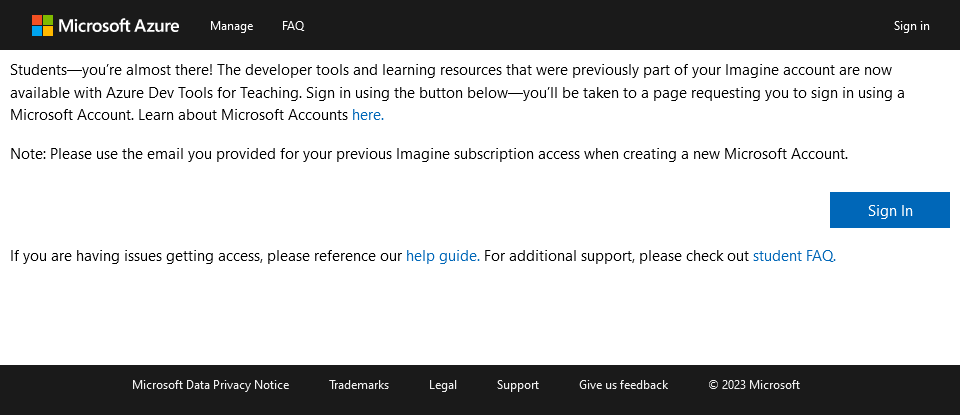
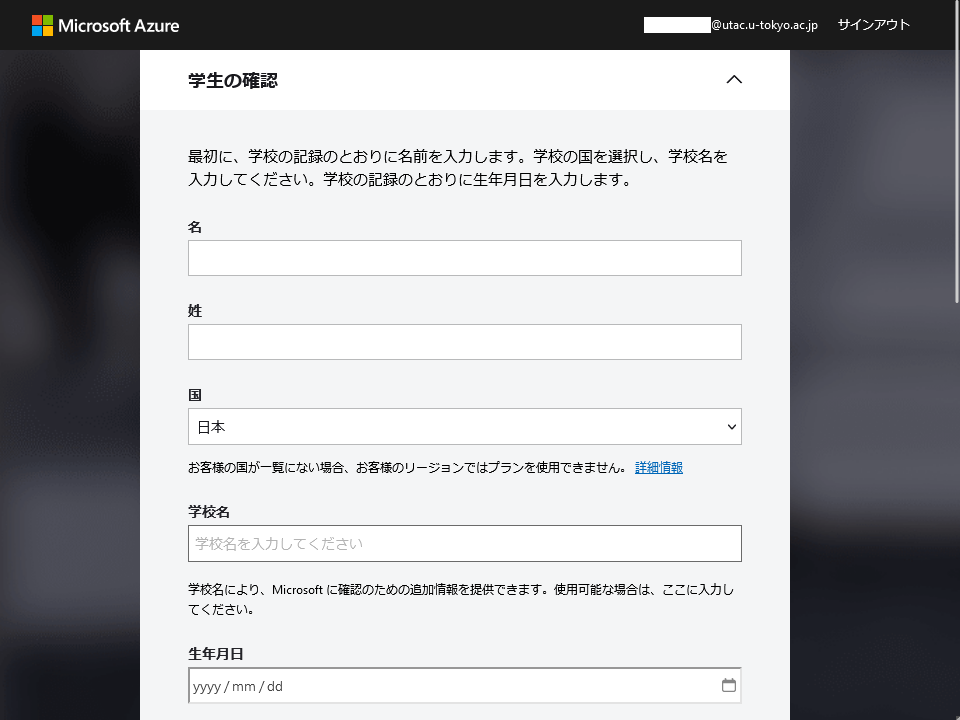
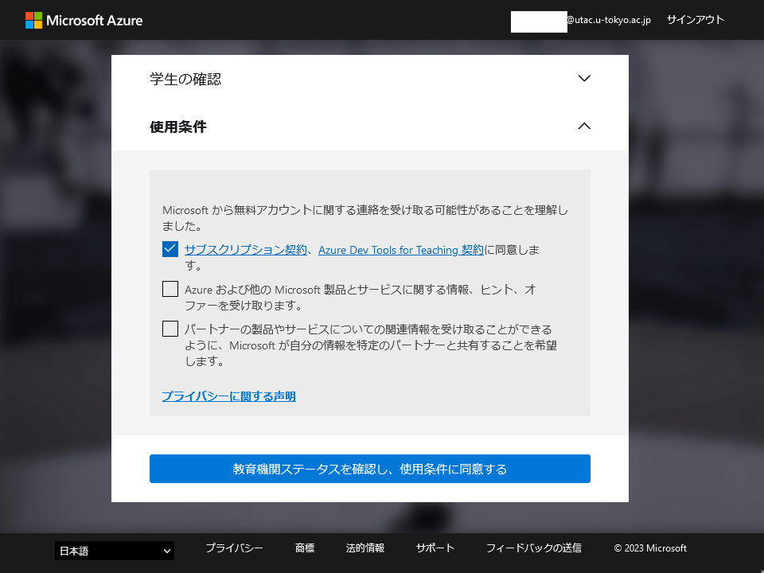
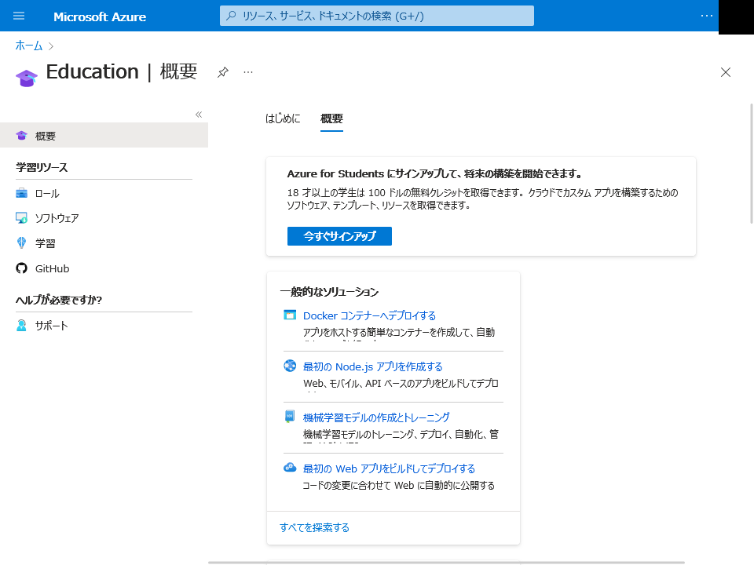
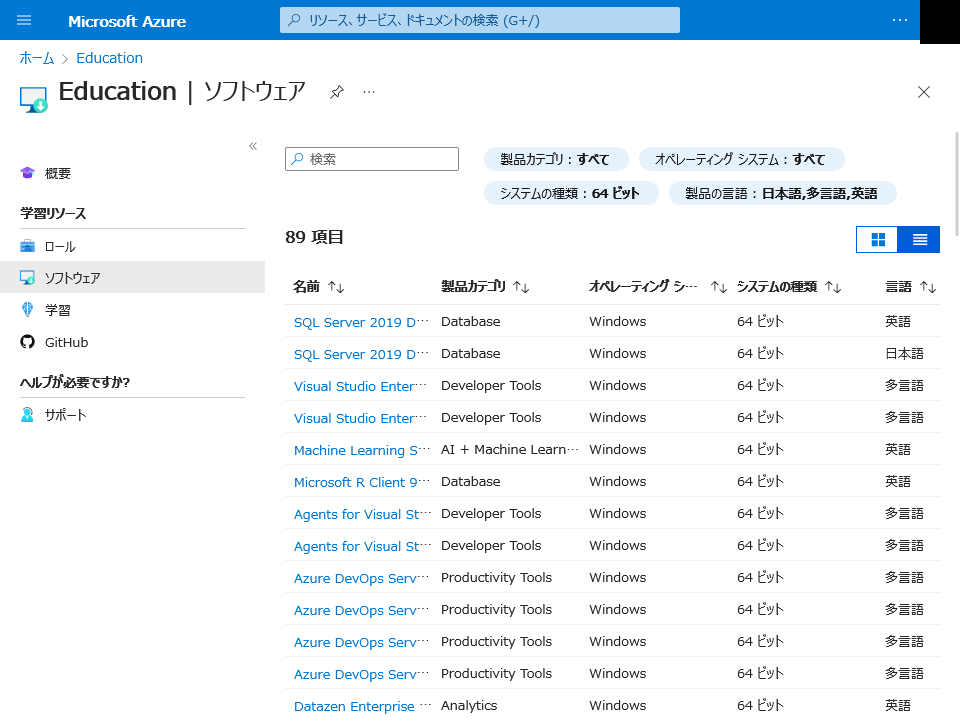

## 概要

「Azure Dev Tools for Teaching」は，Microsoft社の開発者用ソフトウェアが教育機関向けに提供されているものです．東京大学でも，[UTokyo Microsoft License](/microsoft/)の契約に付帯して利用できるようになっています．Microsoft社の利用規約に従って利用してください．

### 利用できる範囲

- **教育・研究での開発目的**に限って利用できます．
    - **業務目的等での利用はできません**．教育・研究活動であっても，開発ではなく一般的なPC環境として利用するような場合は認められません．
- 非営利目的での利用に限られます．教育・研究活動であっても，**営利目的にあたる場合は利用できません**．
- **東京大学の学生**が利用できます．また，教育・研究活動に直接携わる**東京大学の教職員**も利用できます．
    - 所属する学部・研究科等を問いません．

## 利用開始の手順

1. 以下のAzure Dev Tools for Teachingのページにアクセスしてください．
    <b class="box center"><a href="https://aka.ms/devtoolsforteaching/">Azure Dev Tools for Teaching</a></b>
1. 「Sign In」ボタンを押してください．
    {:.border.medium}
1. もしサインインしていなければサインイン画面が表示されるので， `0123456789@utac.u-tokyo.ac.jp` のように，10桁の共通ID（UTokyo Accountのユーザ名）の後に東京大学であることを表す記号 `@utac.u-tokyo.ac.jp` を付けたものを入力してください．
1. サインインが完了したら，順に「学生の確認」「使用条件」といった画面に移動します．表示される指示に従い，手続きを進めてください．
    <figure class="gallery"></figure>
1. 「Microsoft Azure」の画面が表示されたら，「Education」画面の左側にあるメニューから「ソフトウェア」を開いてください． ※「Eduction」の画面が表示されていない場合は，画面上の検索ボックスから検索して表示してください．
    {:.border.medium}
1. ソフトウェアの一覧が表示されますので，利用したいものをダウンロードしてください．
    {:.border.medium}

## その他

- 利用開始（サインイン・ダウンロード等）に関する問い合わせは[サポート窓口](/support/)で受け付けます．
    - 提供されている開発者用ソフトウェアの利用方法については，サポート窓口では対応できません．Microsoft社のヘルプ等を参考に，利用者自身で解決してください．
- 提供される内容（開発者用ソフトウェアの種類など）は，Microsoft社のサービス内容や東京大学における契約内容に応じて変更される可能性があります．
- 2023年6月より，Azure Dev Tools for TeachingをUTokyo Accountで利用できるようになりました．以前案内していた手順である，ECCSクラウドメール (`@g.ecc.u-tokyo.ac.jp`) のメールアドレスでのアカウント作成は，不要となっています．今後はUTokyo Accountで利用してください．
- 2019年4月の本サービス提供開始に伴い，工学系研究科・情報理工学系研究科等で提供されていたMicrosoft Imagine Premiumは本サービスに移行しました．本サービスを利用してください．
