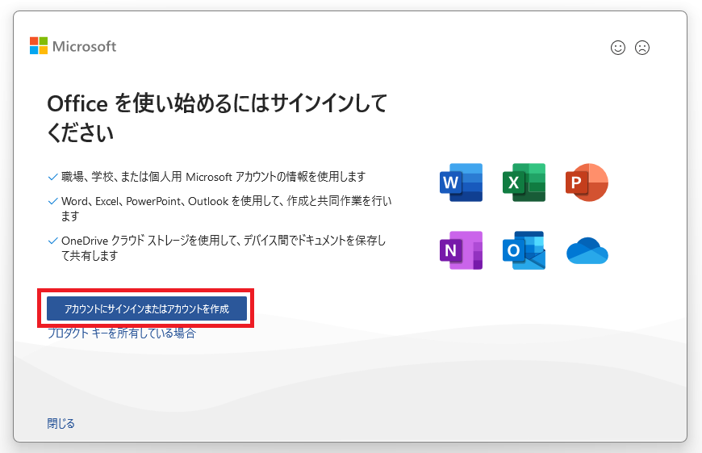
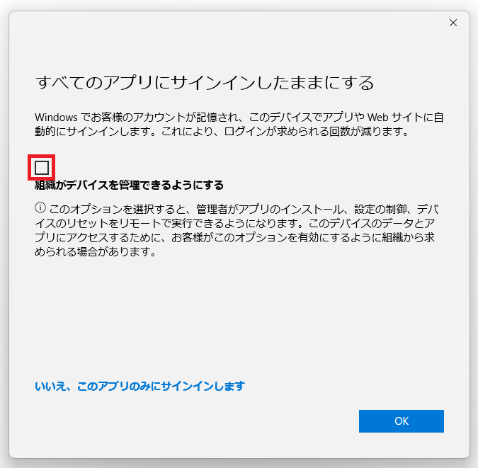

import HelpItem from "@components/utils/HelpItem.astro";
import InstallApps from "@components/ja/systems/microsoft/InstallApps.mdx";

## はじめに
{:#about}

このページでは，[UTokyo Microsoft License](../)のうち，PCにインストールして利用するOfficeアプリの利用方法について説明します．

## 注意事項
{:#caution}

- **PCにインストールして利用するOfficeアプリは，学生及び東京大学に雇用されている教職員のみが利用できます**．
- **インストールには[UTokyo Accountの多要素認証](/utokyo_account/mfa/)が設定済みであることが必要です**．
- 最大5台のPCにインストールすることが可能です．
- ライセンス認証のため，少なくとも30日に一度インターネットに接続する必要があります．ライセンス認証はインターネット接続時に自動で行われるため，特別な操作を行う必要はありません．

## 利用手順
{:#usage}

以下ではOfficeアプリの具体的な利用手順を説明します．手順は**[アプリのPCへのインストール](#install)**と，**[UTokyo Accountでのサインイン](#signin)**の二つの部分に分かれており，利用を開始するにはこれらの両方を完了させる必要があります．

### インストールする
{:#install}

<InstallApps support variant="individual" />

### サインインする
{:#signin}

1. Word，Excel，PowerPointなど，インストールされたOfficeアプリのうち，いずれかを一つ選んで起動してください．以下ではWordの場合を例にとって説明します．
1. 表示された画面を確認して，以下の指示に従ってください．
    - 以下のようなダイアログが表示された場合
      {:.medium}
      OfficeアプリにどのMicrosoftアカウントでもサインインしていない状態です．「アカウントにサインインまたはアカウントを作成」をクリックしてください．
    - 上記のような画面が表示されず，通常の編集画面が表示された場合
    
      OfficeアプリになんらかのMicrosoftアカウントでサインインしている状態です．右上の人型のアイコンをクリックした後，現在サインインしているアカウントを確認してください．UTokyo Accountでない別のアカウントでサインインしていた場合は「アカウントを追加する」を選択してください．
      {:.small}
1. [インストール](#install)時と同様のサインイン画面が表示されるので，サインインしてください．
1. Windows端末の場合，「すべてのアプリにサインインしたままにする」というダイアログが表示されることがあります．ここでの設定内容によっては，Officeアプリの利用中にエラーメッセージが発生しうることが確認されています．これを防ぐため，以下のように回答してください．
    まず，「組織がデバイスを管理できるようにする」の**チェックを外してください**．次に，Officeアプリ以外のMicrosoftのシステム（OneDriveなど）に自動でUTokyo Accountにサインインしたい場合は「はい」を，OfficeアプリのみにUTokyo Accountでサインインしたい場合は「いいえ，このアプリのみにサインインします」を選択してください．   
    <HelpItem lang="ja" type={"details"}>
    <Fragment slot="problem">上記と異なった選択をしてしまった場合</Fragment>
    <Fragment slot="solution">Officeアプリの利用中にエラーメッセージ（エラーコード：80180018など）が表示される場合があります．このエラーはUTokyo Accountの管理上の設定とOfficeアプリの動作が嚙み合わないために発生しているものであり，機器やその他のソフトウェア，保存されたデータなどに悪影響をもたらすものではないため，Officeアプリを問題なく利用できている状況であれば無視して構いません．一方で，このようなエラーメッセージがわずらわしい場合や，そもそもエラーによりOfficeアプリを利用することができない場合は，以下の手順を踏むことで上記の設定に修正し，このようなエラーの発生を防ぐことが可能です．</Fragment>
    1. WordやExcelといったOfficeアプリを全て終了してください．
    1. Windowsの「設定」アプリ（左下のWindowsマークのスタートメニューにある歯車マーク）を開いてください．
    1. 設定メニューのうち，「アカウント」>「職場または学校へのアクセス」を選択してください．
    1. 「職場または学校にアクセスする」の画面に，UTokyo Accountが表示されている場合は，「切断」を選択してください．
    1. 改めてOfficeアプリへのサインインをお試しください．
    </HelpItem>
    {:.small}
1. 右上の人型のアイコンをクリックし，UTokyo Accountでサインインしていることを確認してください．
    {:.small}

