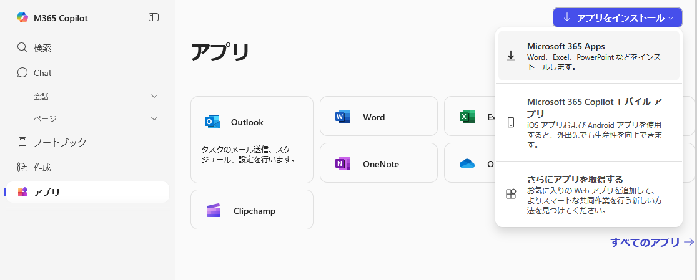
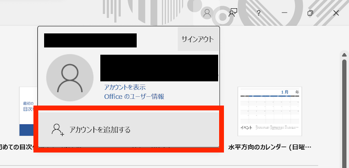
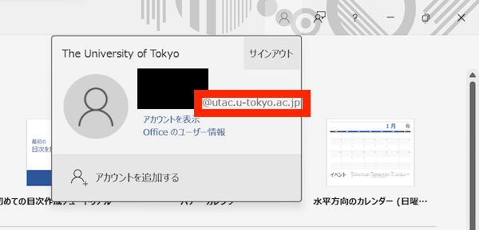

import HelpItem from "@components/utils/HelpItem.astro";

## はじめに
{:#about}

このページでは，[UTokyo Microsoft License](../) のうち，PCにインストールして利用する Office アプリの利用方法について説明します．

## 注意事項
{:#caution}

- **PCにインストールして利用する Office アプリは，学生及び東京大学に雇用されている教職員のみが利用できます**．
- 最大5台のPCにインストールすることが可能です．
- ライセンス認証のため，少なくとも30日に一度インターネットに接続する必要があります．ライセンス認証はインターネット接続時に自動で行われるため，特別な操作を行う必要はありません．

## 利用手順
{:#usage}

以下ではOffice アプリの具体的な利用手順を説明します．手順は**[アプリのPCへのインストール](#install)**と，**[UTokyo Account でのサインイン](#signin)**の二つの部分に分かれており，利用を開始するにはこれらの両方を完了させる必要があります．

## インストールする
{:#install}

1. 以下の Microsoft 365 ホームにアクセスし，UTokyo Accountでサインインしてください．
<b class="box center">[Microsoft 365 ホーム](https://portal.office.com/?auth=2)</b>
サインインの手順については，[**UTokyo Account を用いて Microsoft のシステムにサインインする**](../signin)をご覧ください．
1. Microsoft 365 ホームの右上にある 「アプリをインストール」 をクリックして表示されるメニューで，「Microsoft 365 Apps」 をクリックしてください．
    <HelpItem lang="ja" type={"details"}>
    <Fragment slot="problem">「Microsoft 365 Apps」 が表示されない場合</Fragment>
    <Fragment slot="solution">あなたは[利用対象者](#caution)ではありません．Office を利用する必要がある場合，代替手段の一つとして[Web版 Office](#office_web)があります．
    もし，自身が利用対象者であると思われるのにもかかわらず 「Microsoft 365 Apps」 が表示されない場合，自身の学籍や人事上の登録が正しいかどうか，所属の学部・研究科等の窓口（学生は学務・教務担当，教職員は人事担当）にご確認ください．</Fragment>
    </HelpItem>
    {:.medium}

1. 以後の手順は場合によって異なります．インストールの完了まで自動で進むこともあれば，確認ボタンを押したり，ダウンロードしたファイルを自分で開いたりといった操作の必要があるかもしれません．
1. インストールが完了した旨表示されれば終了です．続いて，下の「[サインインする](#signin)」の手順に進んでください．

## サインインする
{:#signin}

1. Word，Excel，PowerPointなど，インストールされた Office アプリのうち，いずれかを一つ選んで起動してください．以下では Word の場合を例にとって説明します．
1. 表示された画面を確認して，以下の指示に従ってください．
    - 以下のようなダイアログが表示された場合
      {:.medium}
      Office アプリにどの Microsoft アカウントでもサインインしていない状態です．「アカウントにサインインまたはアカウントを作成」をクリックしてください．
    - 上記のような画面が表示されず，通常の編集画面が表示された場合
      Office アプリになんらかの Microsoft アカウントでサインインしている状態です．右上の人型のアイコンをクリックした後，現在サインインしているアカウントを確認してください．UTokyo Account でない別のアカウントでサインインしていた場合は「別のアカウントでサインイン」を選択してください．
      {:.small}
1. [インストール](#install)時と同様のサインイン画面が表示されるので，サインインしてください．
1. Windows 端末の場合，「すべてのアプリにサインインしたままにする」というダイアログが表示されることがあります．ここでの設定内容によっては，Office アプリの利用中にエラーメッセージが発生しうることが確認されています．これを防ぐため，以下のように回答してください．
    まず，「組織がデバイスを管理できるようにする」の**チェックを外してください**．次に，Office アプリ以外の Microsoftの システム（OneDriveなど）に自動で UTokyo Account にサインインしたい場合は「はい」を，Office アプリのみに UTokyo Account でサインインしたい場合は「いいえ，このアプリのみにサインインします」を選択してください．    
    <HelpItem lang="ja" type={"details"}>
    <Fragment slot="problem">上記と異なった選択をしてしまった場合</Fragment>
    <Fragment slot="solution">Office アプリの利用中にエラーメッセージ（エラーコード：80180018 など）が表示される場合があります．このエラーは UTokyo Account の管理上の設定とOfficeアプリの動作が嚙み合わないために発生しているものであり，端末やその他のソフトウェア，保存されたデータなどに悪影響をもたらすものではないため，Officeアプリを問題なく利用できている状況であれば無視して構いません．一方で，このようなエラーメッセージがわずらわしい場合や，そもそもエラーによりOfficeアプリを利用することができない場合は， 以下の手順を踏むことで上記の設定に修正し，このようなエラーの発生を防ぐことが可能です．</Fragment>
    1. Word や Excel といった Office アプリを全て終了してください．
    1. Windows の「設定」アプリ（左下の Windows マークのスタートメニューにある歯車マーク）を開いてください．
    1. 設定メニューのうち，「アカウント」> 「職場または学校へのアクセス」 を選択してください．
    1. 「職場または学校にアクセスする」の画面に，UTokyo Account が表示されている場合は，「切断」 を選択してください．
    1. 改めてOffice アプリへのサインインをお試しください．
    </HelpItem>
    {:.small}
1. 右上の人型のアイコンをクリックし，UTokyo Account でサインインしていることを確認してください．
    {:.small}

