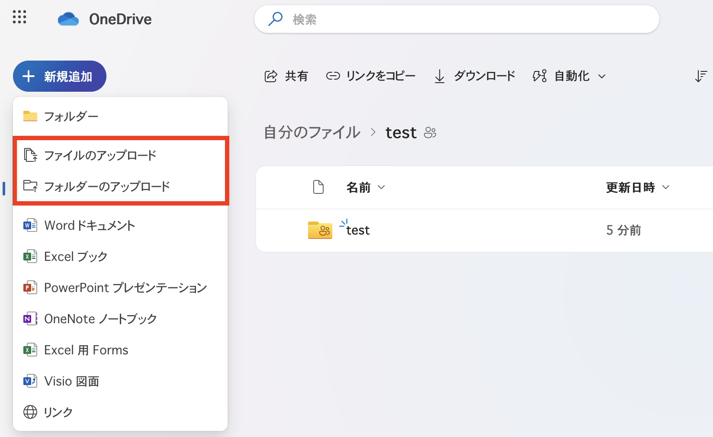
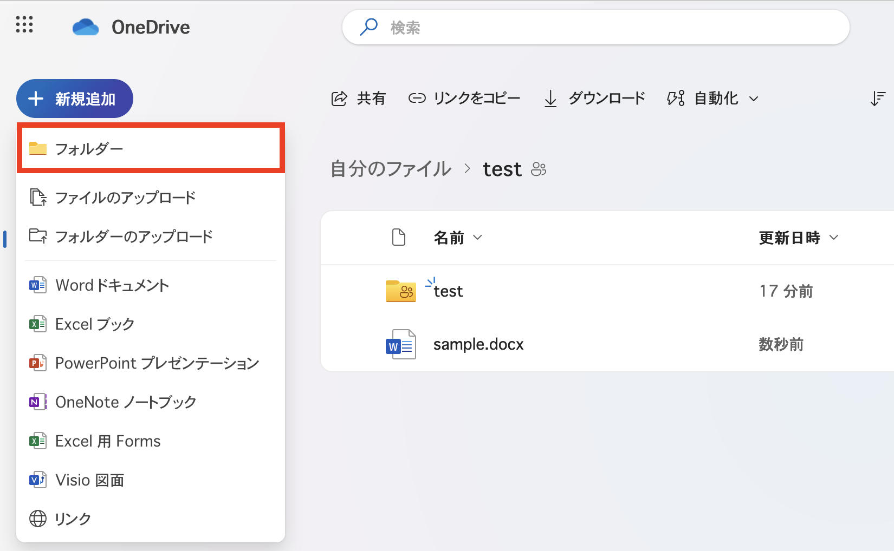

## はじめに
このページでは，OneDriveに保存されたファイルを取り扱う際の具体的な操作手順について説明します．

なお，OneDriveの利用についての全般的な説明は「[OneDrive](.)」に，ファイルを共有する方法については「[OneDriveでファイルを共有する](share)」に記載されています．あわせて参照してください．

<!-- 以降の手順を行うには，あらかじめUTokyo AccountでMicrosoftにサインインし，ブラウザ上でOneDriveを開いている必要があります．この作業が完了していない場合には，[OneDriveのページの「ブラウザ上でOneDriveを開く」](/microsoft/onedrive/#signin)を参照してください． -->

## About

This page explains the specific steps to take when handling files stored in OneDrive.

For general information about using OneDrive, please refer to "[OneDrive](.)". For information on how to share files, please refer to "[Sharing Files on OneDrive](share)".

<!-- To perform the following steps, you must first sign in to Microsoft with your UTokyo Account and open OneDrive in your browser. If you have not completed this process, please refer to the "Open OneDrive in Your Browser" section of the [OneDrive page](/microsoft/onedrive/#signin). -->

## ファイルの場所に移動する
ここでは，OneDrive上に存在するファイルが置かれているフォルダに移動する方法を説明します．

OneDriveのトップページ（「ホーム」）には，OneDrive上に存在するファイルの一部がその置き場所に関わらず一覧表示されており，フォルダの階層構造を反映したものにはなっていません．そのため，フォルダ間を移動して目的のファイルにアクセスするには，以下のような手順に従う必要があります．

1. 画面左側のメニュー内の「自分のファイル」を押してください．
    - 「自分のファイル」は，OneDriveにおける最上位のフォルダに相当します．{:.medium.center}
1. 目的のファイルが存在するフォルダに移動してください．
    - 現在表示されているフォルダ内にあるフォルダに移動するには，対応するフォルダ名を押してください．
    - 現在表示されているフォルダの上の階層にあるフォルダに移動するには，画面上部のパンくずリストに表示されているフォルダ名を押してください．

## To Move to a Folder

This section explains how to move to a folder where files are stored in OneDrive.

The top page of OneDrive ("Home") displays some of the files stored in OneDrive, regardless of their location, and does not reflect the folder hierarchy. Therefore, to move between folders and access the desired files, you need to follow the steps below.

1. Please click "My Files" in the menu on the left side of the screen.
    - "My Files" corresponds to the top-level folder in OneDrive. {:.medium.center}
1. Please move to the folder where the desired file is located.
    - To move to a folder within the currently displayed folder, click the corresponding folder name.
    - To move to a folder in a higher level than the currently displayed folder, click the folder name displayed in the breadcrumb list at the top of the screen.

## ファイルを作成する
ここでは，OneDrive上にファイルを作成する方法を説明します．

OneDriveで作成することのできるファイルの形式は，WordやExcelなどのOfficeアプリで用いられている標準的なものに限られます．作成可能なファイル形式は主に以下の通りです．

- Word 文書（拡張子 `.docx`）
- Excel ブック（拡張子 `.xlsx`）
- PowerPoint プレゼンテーション（拡張子 `.pptx`）

作成したファイルは，Web版のOfficeアプリを利用して編集することができます．

手順は次の通りです．

1. ファイルの作成場所となるフォルダに移動してください．
1. 画面上部の「新規追加」ボタンを押してください．{:.medium.center}
1. ファイル形式の一覧が表示されるので，作成したいファイル形式を選択してください．{:.medium.center}
1. ファイルが作成され，選択したファイル形式に対応するWeb版のOfficeアプリが新しいタブに表示されます．
    - 表示されたOfficeアプリを利用して，そのままファイルを編集することができます．

なお，Web版のOfficeアプリで作成されたファイルは，自動的にOneDrive上に保存されます．このことを利用して，OneDriveからではなく，Web版のOfficeアプリからファイルを作成することもできます．

## To Create a File

This section explains how to create a file in OneDrive.

The file formats that can be created in OneDrive are limited to standard formats used in Office applications such as Word and Excel. The following are the main file formats that can be created:

- Word document (extension `.docx`)
- Excel workbook (extension `.xlsx`)
- PowerPoint presentation (extension `.pptx`)

The created files can be edited using the web version of Office applications.

The steps are as follows.

1. Please move to the folder where you want to create the file.
2. Please click the "New" button at the top of the screen. {:.medium.center}
3. A list of file formats will be displayed. Please select the file format you want to create. {:.medium.center}
4. The file will be created, and the web version of the Office application corresponding to the selected file format will be displayed in a new tab.
    - You can edit the file directly using the displayed Office application.

Files created using the web version of Office applications are automatically saved in OneDrive. You can also create files from the web version of Office applications, not from OneDrive.

## ファイルを編集する
ここでは，OneDrive上のファイルを編集する方法を説明します．

OneDriveに保存されているファイルのうち，WordやExcel等のOfficeアプリで開くことができるファイルは，Web版のOfficeアプリを利用して編集することができます．

1. 編集したいファイルが存在するフォルダに移動してください．
1. 編集したいファイルのファイル名を押してください．新しいタブにWeb版のOfficeアプリが表示され，ファイルを編集することができます．

## To Edit a File

This section explains how to edit files stored in OneDrive.

Files stored in OneDrive that can be opened with Office applications such as Word and Excel can be edited using the web version of Office applications.

1. Please move to the folder where the file you want to edit is located.
2. Please click the file name of the file you want to edit. The web version of the Office application will be displayed in a new tab, allowing you to edit the file.

## ファイルをアップロードする
ここでは，OneDriveにファイルをアップロードする方法を説明します．

1. ファイルをアップロードするフォルダに移動してください．
1. 画面上部の「新規追加」ボタンを押してください．{:.medium.center}
1. 単一のファイルをアップロードする場合は「ファイルのアップロード」，あるフォルダ内のファイルをまとめてアップロードする場合は「フォルダーのアップロード」を選択してください．{:.medium.center}
1. ファイルの選択画面が表示されるので，アップロードするファイルまたはフォルダを選択してください．
1. ファイルまたはフォルダがアップロードされます．

## To Upload a File

This section explains how to upload files to OneDrive.

1. Please move to the folder where you want to upload the file.
2. Please click the "New" button at the top of the screen. {:.medium.center}
3. If you want to upload a single file, select "File Upload." If you want to upload multiple files in a folder, select "Folder Upload." {:.medium.center}
4. The file selection screen will be displayed. Please select the file or folder you want to upload.
5. The file or folder will be uploaded.

## ファイルをダウンロードする
ここでは，OneDrive上のファイルをダウンロードする方法を説明します．

1. ダウンロードしたいファイルが存在するフォルダに移動してください．
1. ダウンロードしたいファイルを右クリックし，「ダウンロード」を押してください．{:.medium.center}
    - 複数のファイルをまとめてダウンロードすることもできます．ダウンロードしたいファイルにカーソルを合わせ，アイコンの左側に表示されるチェックボックスをそれぞれオンにしてください．その後，画面上部の「ダウンロード」を押してください（「ダウンロード」ボタンが表示されない場合は，画面上部の3個の点が描かれたアイコンを押してください）．ファイルは`.zip`形式で圧縮された状態でダウンロードされます．
1. ファイルがダウンロードされます．その際，ダウンロード先のフォルダを選択する画面が表示される場合もあります．

## フォルダを作成する
ここでは，OneDrive上にフォルダを作成する方法を説明します．

1. フォルダの作成場所となるフォルダに移動してください．
1. 画面上部の「新規追加」ボタンを押し，「フォルダー」を選択してください．{:.medium.center}
1. 「フォルダーの作成」という画面が表示されるので，フォルダーの名前を入力してください．{:.medium.center}
1. 画面下部の「作成」を押してください．フォルダーが作成されます．

## ファイルを移動させる
ここでは，OneDrive上でファイルの置かれているフォルダーを変更する方法を説明します．

1. 移動させたいファイルを右クリックし，「移動」を押してください．{:.medium.center}
    - 複数のファイルをまとめて移動させることもできます．移動させたいファイルにカーソルを合わせ，アイコンの左側に表示されるチェックボックスをそれぞれオンにしてください．その後，画面上部の「移動」を押してください（「移動」ボタンが表示されない場合は，画面上部の3個の点が描かれたアイコンを押してください）．
1. フォルダの選択画面が表示されるので，画面上で，ファイルの移動先となるフォルダに移動してください．
1. 画面下部の「ここに移動」を押してください．選択したフォルダにファイルが移動されます．{:.medium.center}
