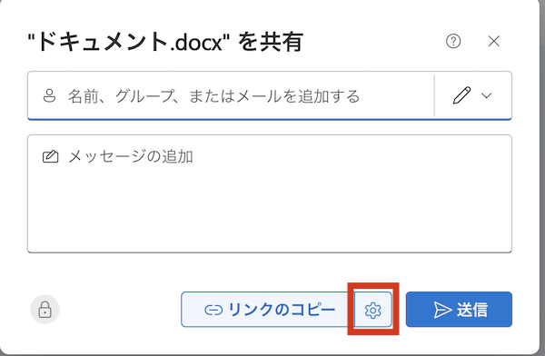
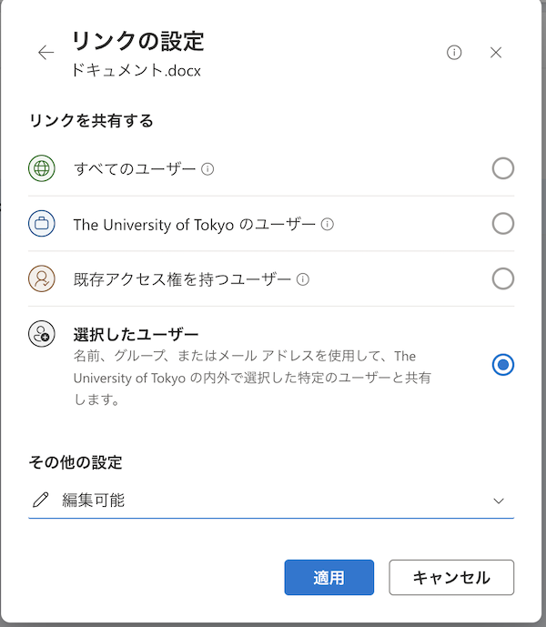

[OneDriveのページのトップに戻る](./)

## はじめに
このページでは，OneDriveに保存されたファイルを他人に共有する際の具体的な操作手順や設定内容について説明します．

なお，OneDriveの利用についての全般的な説明は「[OneDrive](./)」に，ファイルを作成・編集・アップロード・ダウンロードする方法については「[OneDriveの基本的な使い方](basic)」に記載されています．あわせて参照してください．

## ファイルやフォルダを共有する
OneDrive上のファイルやフォルダに対応する**共有リンク**を作成することで，ファイルを他人に共有することができます．すなわち，作成した共有リンクを共有したい相手に伝えることで，共有相手は共有リンクを経由してそのファイルを閲覧したり編集したりすることが可能になります．

特に，フォルダに対する共有リンクを作成した場合，このリンクを経由してそのフォルダ内に存在するすべてのファイルやフォルダにアクセスすることができるようになります．

### 作成可能な共有リンクの種類
{:#link-type}

OneDriveでは，共有の対象とする「**ユーザーの範囲**」と「**アクセス権**の種類」の組み合わせごとに複数の異なる共有リンクを作成することができます．

#### ユーザーの範囲
共有の対象とするユーザーの範囲は，以下の3種類の中から選ぶことができます．

- **すべてのユーザー**
    - このリンクを経由して，誰もがそのファイルにアクセスできます．アクセス時にMicrosoftアカウントにサインインしている必要はありません．
    - このリンクには**有効期限**を設定しなければなりません．共有リンクの有効期限を過ぎると，このリンクを経由してファイルにアクセスすることはできなくなります．
        - 東京大学では，設定することのできる有効期限は最大で60日後とされています．
        - 有効期限の異なる複数の共有リンクを作成することはできません．
    - 共有リンクに対して**パスワード**を設定することができます．パスワードが設定された共有リンクでは，正しいパスワードを入力しないとファイルにアクセスすることができません．
        - パスワードの異なる複数の共有リンクを作成することはできません．
        - パスワードを必要とする共有リンクと，パスワードを必要としない共有リンクは同時に存在することができます．例えば，パスワードを必要としない共有リンクが作成されている状態でパスワードを必要とする共有リンクを新たに作成しても，前者は引き続き有効です．
- **The University of Tokyoのユーザー**
    - UTokyo Accountを用いてMicrosoftにサインインしているユーザーだけが，このリンクを経由してファイルにアクセスできます．
    - 有効期限やパスワードを設定することはできません．
- **選択したユーザー**
    - 指定した人だけが，このリンクを経由してファイルにアクセスできます．
    - 共有の対象とする人を指定するには，次のいずれかの方法をとることができます．
        - **学内のMicrosoftアカウント**を指定する：共有相手のもつ学内のMicrosoftアカウントを指定すると，共有相手がリンクにアクセスした際，Microsoftアカウントにサインインするように要求されます．Microsoftアカウントは，名前や「10桁の数字＋`@utac.u-tokyo.ac.jp`」の形式のメールアドレスを入力することで検索できます．
            - `@mail.u-tokyo.ac.jp`で終わるメールアドレスを入力してMicrosoftアカウントを指定することもできます．
        - **メールアドレス**を指定する：共有相手のもつメールアドレスや，学外のMicrosoftアカウントを指定すると，共有相手がリンクにアクセスした際，メールアドレスにワンタイムパスコードが送信され，確認画面にパスコードを入力するよう要求されます．
    - 複数人を選択することができます．また，共有相手が異なる複数の共有リンクを作成することができます．
    - 有効期限やパスワードを設定することはできません．

#### アクセス権の種類
アクセス権は，以下の3種類の中から選ぶことができます．

- **表示可能**
    - ファイルを閲覧することはできますが，編集はできません．
    - アクセス権が「表示可能」の共有リンクに限り，**ダウンロードを禁止する**こともできます．このようなリンクでは，ファイルを閲覧することだけが可能で，ファイルをローカルに保存することはできません．
        - ダウンロードを禁止する共有リンクと，ダウンロードを禁止しない共有リンクは同時に存在することができます．例えば，ダウンロードを禁止しない共有リンクが作成されている状態でダウンロードを禁止する共有リンクを新たに作成しても，前者は引き続き有効です．
- **レビュー可能**（Word文書のみ）
    - ファイルを閲覧することに加えて，編集の提案を行ったりコメントを追加したりすることができます（レビューモード）．ファイルを直接編集することはできません．
- **編集可能**
    - ファイルの閲覧と編集の両方が可能です．

#### 「既存のアクセス権を持つユーザー」に対するリンク
{:#existing-access}

OneDriveには，「ユーザーの範囲」と「アクセス権の種類」を指定して作成する上記のリンクのほかに，すでに作成された共有リンクの共有対象者全員（「**既存のアクセス権を持つユーザー**」）がアクセスできるリンクが存在します．

- 「既存のアクセス権を持つユーザー」に対するリンクを経由してファイルにアクセスできる人は，以下の通りです．
    - ファイルの所有者
    - 現在有効な共有リンクを経由してファイルにアクセスしたことのある人
    - 「アクセス許可の管理」画面からアクセス許可を付与した人
- ユーザーが「既存のアクセス権を持つユーザー」に対するリンクを経由してファイルにアクセスした場合，ユーザーのアクセス権は，そのユーザーに対してすでに作成されている共有リンクのアクセス権に準じます．したがって，**このリンクを作成してもユーザーのアクセス権が変更されることはありません**．
    - 例えば，ユーザーの範囲が「The University of Tokyoのユーザー」，アクセス権が「表示可能」であるような共有リンクを経由してファイルにアクセスしたことのあるユーザーが，「既存のアクセス権を持つユーザー」に対するリンクを利用してファイルにアクセスした場合，このユーザーはファイルを編集することはできません．

### 手順
#### 共有リンクを新規作成する
{:#create-link}
共有リンクを新たに作成する手順は以下の通りです．

1. 共有したいファイルを右クリックし，「共有」を押してください．{:.medium.center}
    - 「共有」の代わりに「リンクをコピー」を押すと，共有の対象とするユーザーの範囲が「The University of Tokyoのユーザー」に設定された共有リンクが自動的に作成されます．意図しない共有リンクが作成されることを避けるため，「リンクをコピー」ではなく「共有」を経由してリンクを作成することを推奨します．
1. 画面上部の歯車のアイコンを押してください．{:.medium.center}
1. 必要に応じて，作成する共有リンクの設定を変更してください．各設定項目についての詳細は「[作成可能な共有リンクの種類](#link-type)」を参照してください．{:.medium.center}
    - 「**リンクを共有する**」：共有の対象とするユーザーの範囲を設定することができます．
        - 「既存アクセス権を持つユーザー」を選択すると，すでに作成された共有リンクの共有対象者全員がアクセスできるリンクを取得することができます．詳細は[「既存のアクセス権を持つユーザー」に対するリンク](#existing-access)を参照してください．
    - 「**その他の設定**」：アクセス権の種類を設定することができます．
    

        
有効期限を設定したい場合

        - 共有の対象とするユーザーの範囲が「すべてのユーザー」の場合，共有リンクに有効期限を設定することができます．「その他の設定」の「有効期限」から有効期限を設定してください．
    

    

        
パスワードを設定したい場合

        - 共有の対象とするユーザーの範囲が「すべてのユーザー」の場合，共有リンクにパスワードを設定することができます．「その他の設定」の「パスワードの設定」からパスワードを入力してください．
    

    

        
ダウンロードを禁止したい場合

        - アクセス権の種類が「表示可能」の場合，共有相手がファイルをダウンロードすることを禁止することができます．「その他の設定」の「ダウンロードを禁止する」というチェックボックスをオンにしてください．
    

1. 「適用」ボタンを押してください．
1. 共有の対象とするユーザーの範囲として「選択したユーザー」を選んだ場合は，「名前、グループ、またはメールを追加する」というフィールドで共有相手を指定してください．{:.medium.center}
    - 学内のMicrosoftアカウントを指定する場合：上記のフィールドに名前や「10桁の数字＋`@utac.u-tokyo.ac.jp`」の形式のメールアドレスを入力して，アカウントを検索してください．
        - `@mail.u-tokyo.ac.jp`で終わるメールアドレスを入力することでもMicrosoftアカウントを指定できます．
    - メールアドレスや学外のMicrosoftアカウントを指定する場合：上記のフィールドにメールアドレスを直接入力してください．
1. 「リンクのコピー」ボタンを押すと，共有リンクが新たに作成され，クリップボードにコピーされます．

#### 共有リンクを確認・編集・削除する
すでに作成した共有リンクを確認したり，編集や削除をしたりする手順は以下の通りです．

1. 共有したいファイルを右クリックし，「アクセス許可の管理」を押してください．{:.medium.center}
1. 「リンク」タブを押してください．{:.medium.center}
1. この画面から，すでに作成されている共有リンクの一覧を確認したり，編集や削除をしたりすることができます．{:.medium.center}
    - **ユーザーの範囲やアクセス権の種類を変更したい場合**
        - 共有の対象とするユーザーの範囲やアクセス権の種類を変更することはできません．ユーザーの範囲やアクセス権の種類を変更したい場合は，共有リンクを削除してから，別のアクセス許可を付与した新しい共有リンクを作成する必要があります．ただし，共有の対象とするユーザーの範囲が「選択したユーザー」である場合には，例外的にアクセス権の種類を変更することができます．
    - **共有リンクの有効期限を変更したい場合**
        - 共有リンクの有効期限を変更するには，共有リンクの右側にある歯車のアイコンを押し，「設定」から新しい有効期限を設定してください．
    - **共有の対象とするユーザーを変更したい場合**
        - 共有の対象とするユーザーの範囲が「選択したユーザー」であるような共有リンクでは，リンクのURLを保ったまま，対象ユーザーを新たに追加したり，ユーザーを削除したりすることができます．
        - 対象ユーザーを追加するには，共有リンクの右側にある歯車のアイコンを押し，「このリンクの対象ユーザーを指定」というフィールドに追加したいユーザーのMicrosoftアカウントを入力してください．
        - 対象ユーザーを削除するには，共有リンクの右側にある歯車のアイコンを押し，「このリンクは次のユーザーに機能します」欄の下部に表示されているユーザーの右側にある「×」アイコンを押してください．
    - **共有リンクを削除したい場合**
        - 共有リンクを削除するには，共有リンクの右側にあるゴミ箱のアイコンを押してから，「削除」ボタンを押してください．共有リンクを削除すると，そのリンクは無効になり，それを経由してファイルにアクセスすることはできなくなります．
    - **すべての共有リンクを一括して削除したい場合**
        - すべての共有リンクをまとめて削除するには，画面上部の「共有停止」を押してから，「共有を停止」ボタンを押してください．これにより，すべての共有リンクが削除され，所有者以外のユーザーがファイルにアクセスすることはできなくなります．

## ファイルを受け取る
OneDriveでは，あらかじめフォルダに対して**ファイル要求リンク**を作成しておき，他人にファイルのアップロードを依頼することで，その人からファイルを受け取ることができます．ファイル要求リンクを受け取った人は，リンク先にアクセスすることで，リンク作成者のフォルダ内にファイルをアップロードすることが可能になります．

ファイル要求リンクには次のような特徴があります．

- ファイル要求リンクを経由してアクセスした人は，フォルダ内に存在する別のフォルダを表示・編集することはできません．
- ファイル要求リンクを経由してファイルをアップロードすることができるのは，リンクを知る全員です．対象とするユーザーの範囲が限定されたリンクを作成することはできません．
- ファイル要求リンクを経由してアップロードされたファイルの名前は，もとのファイル名の先頭に，アップロードしたユーザーを識別する文字列が付加されたものになります．
    - アップロードした人がMicrosoftアカウントにサインインしている場合，ファイル名の先頭に付くのは，アカウントに紐付けられている名前です．そうでない場合，ファイル名の先頭には，アップロード時に入力を求められるフルネームが付加されます．

### 手順
#### ファイル要求リンクを新規作成する
{:#create-request-link}
ファイル要求リンクを新たに作成する手順は以下の通りです．

1. ファイルのアップロード先に指定するフォルダを右クリックし，「ファイルを要求する」を押してください．{:.medium.center}
1. 必要ならばテキストフィールドに説明を入力し，続いて，「次へ」を押してください．{:.medium.center}
    - 入力した説明は，相手がファイル要求リンクにアクセスする際に表示されます．
1. 「リンクのコピー」ボタンを押すと，ファイル要求リンクが新たに作成され，クリップボードにコピーされます．{:.medium.center}

#### ファイル要求リンクを確認・削除する
すでに作成したファイル要求リンクを確認したり，削除したりする手順は以下の通りです．

1. ファイル要求リンクを作成したフォルダを右クリックし，「アクセス許可の管理」を押してください．{:.medium.center}
1. 「リンク」タブを押してください．{:.medium.center}
1. この画面から，すでに作成されているファイル要求リンクを確認したり，削除したりすることができます．{:.medium.center}
    - **ファイル要求リンクを削除したい場合**
        - ファイル要求リンクを削除するには，ファイル要求リンクの右側にあるゴミ箱のアイコンを押してから，「削除」ボタンを押してください．ファイル要求リンクを削除すると，そのリンクは無効になり，それを経由してファイルをアップロードすることはできなくなります．
