## 概要
{:#about}

Windows では，パソコンセットアップ時のユーザーアカウントの作り方として，以下のような方法があります．

1. 新しくそのパソコンだけで使えるユーザーアカウント（**ローカルアカウント**）を作成する
1. Microsoft アカウントをパソコンのユーザーアカウントとして使う

このページでは 1. の新しくローカルアカウントを作成することでパソコンのセットアップをする方法について説明します．

※ 作成するアカウントの得失についての判断材料は後半のFAQにおいて示してあります．ご確認ください．
※ 以下の手順は， Microsoft 社が公式に示したものではありません．今後のアップデートなどで，同手順でのセットアップができなくなる可能性があります．

## ローカルアカウントでのセットアップ手順
{:#procedure}

1. もし LAN ケーブルを接続されている場合は，必ず抜いてください．
1. そのままネットワークに接続されていない状態で，パソコンの電源を入れてください．
1. パソコンが起動し，セットアップ画面になります．この画面のまま， **Shift キーを押しながら F10 キー**を押してください．
   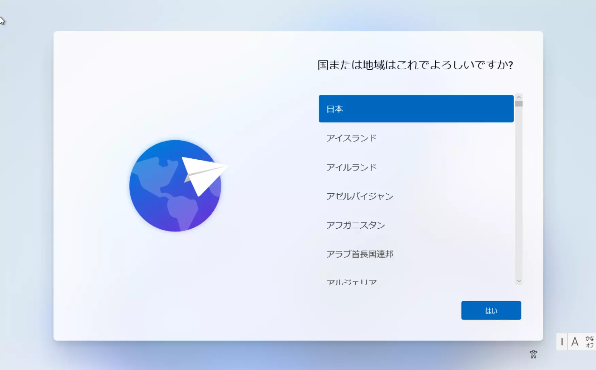{:.medium}
1. 黒いウィンドウ（コマンドプロンプト）が開くので，黒いウィンドウ内を一度クリックし，「`oobe¥BypassNRO.cmd`」と入力， Enter キーを押してください．パソコンが再起動します．
   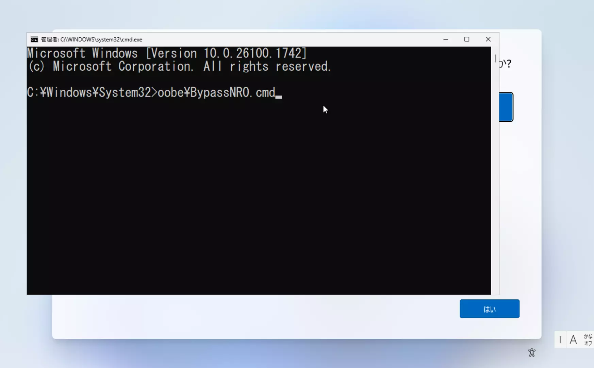
   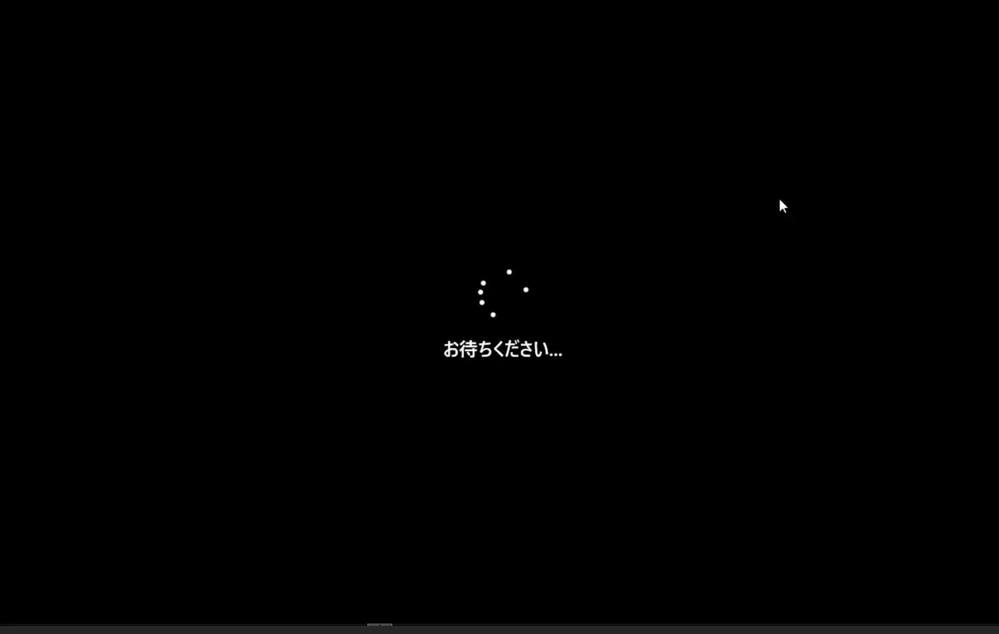{:.medium}
1. 再起動後，もう一度セットアップ画面が開きます．**ネットワークのセットアップはしない**ように気をつけながら，指示に従いセットアップを進めてください．
   {:.medium}
   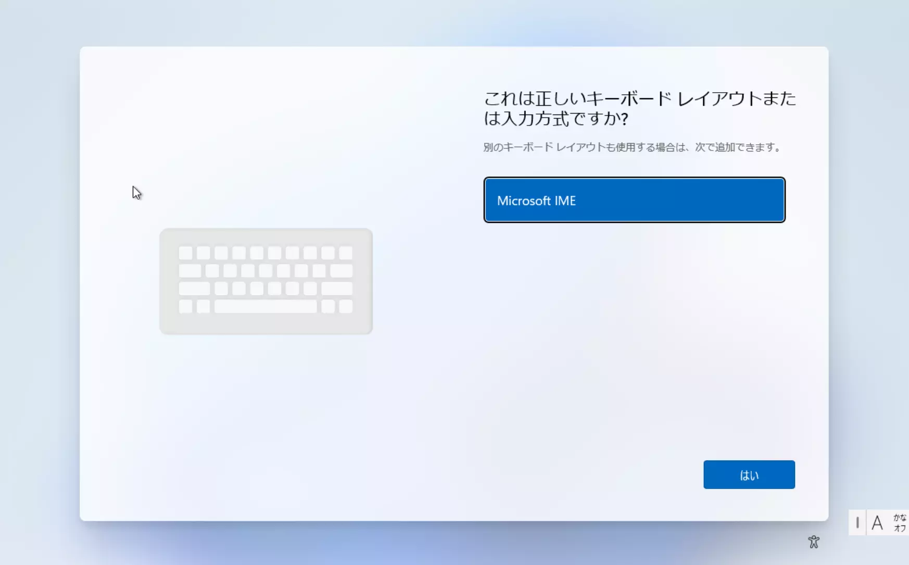{:.medium}
   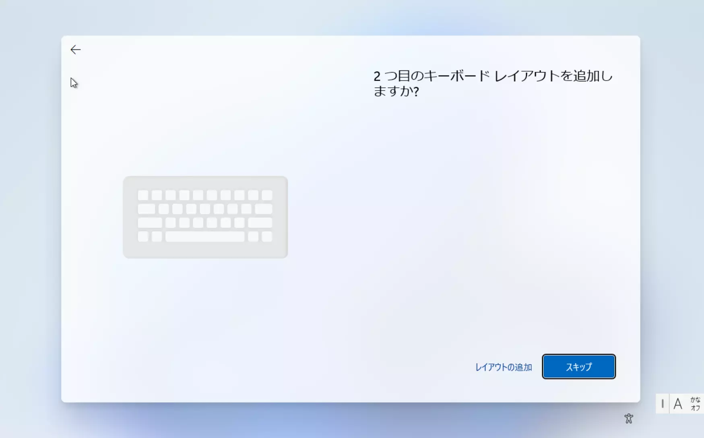{:.medium}
1. ネットワークのセットアップ画面で，ネットワークに接続せずに「**インターネットに接続していません**」を選択してください．
   ※ ネットワークにはセットアップ後に接続可能です．
    

      
「インターネットに接続していません」を選択できない画面が表示されたとき

      **Shift キーを押しながら F10 キー**を押し，手順 3. に戻ってください．
    

   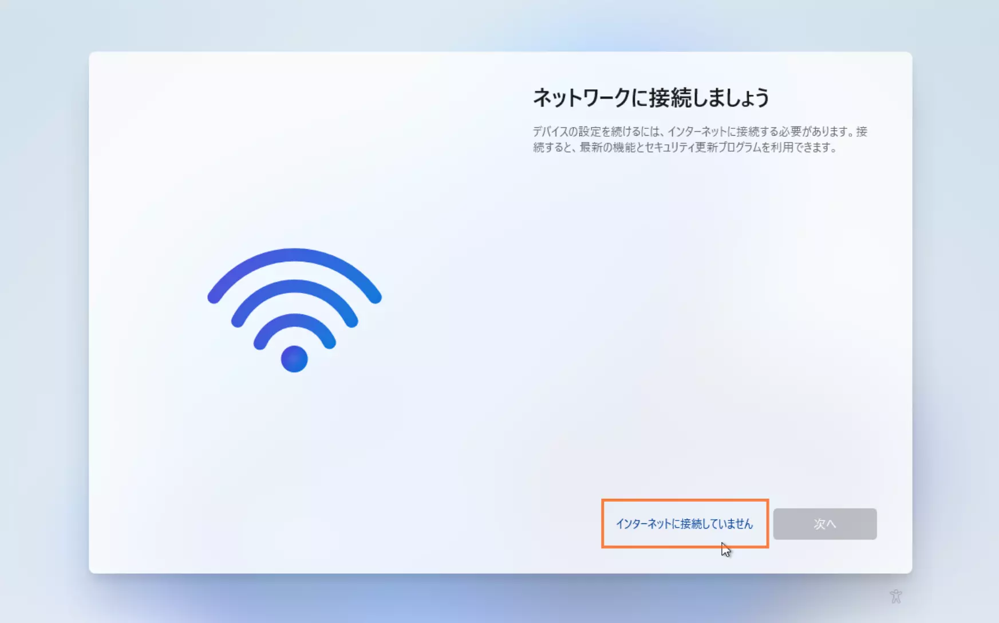
1. ここで再度ネットワークに接続するか問われた場合には，「**制限された設定で続行**」を選択してください．
   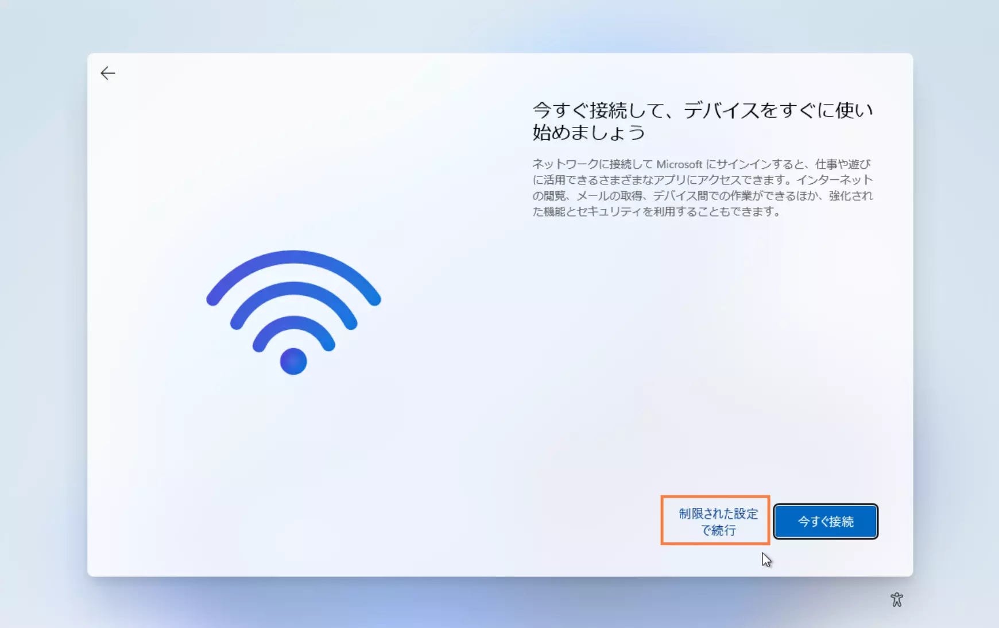{:.medium}
1. 作成するローカルアカウントのユーザー名の入力を求められます．好きなユーザー名を入力してください．
   - プログラミングなどをする上では，ユーザー名にスペースや全角文字を使用しないほうが便利な場合もあります．
   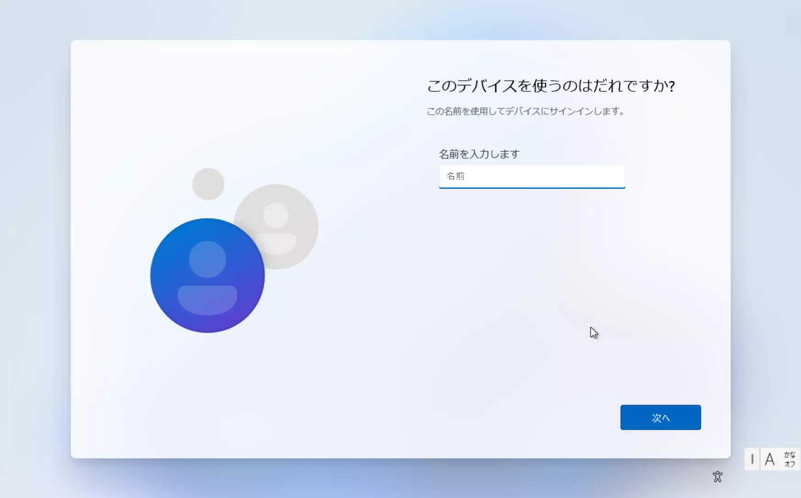{:.medium}
1. パスワードを設定します．起動時などに，このパソコンにサインインする際に使用するパスワードです．このパスワードを忘れるとサインインできなくなりますので注意してください．
   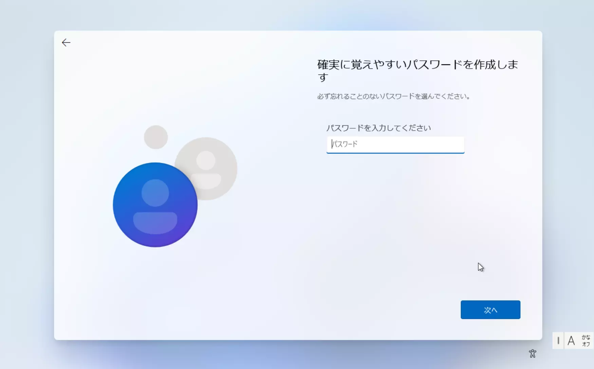{:.medium}
   {:.medium}
1. パスワードを忘れた際に復旧するための秘密の質問を 3 つ求められるので，設定してください．
   {:.medium}
1. プライバシー設定の選択をします．お好みで選択してください．
   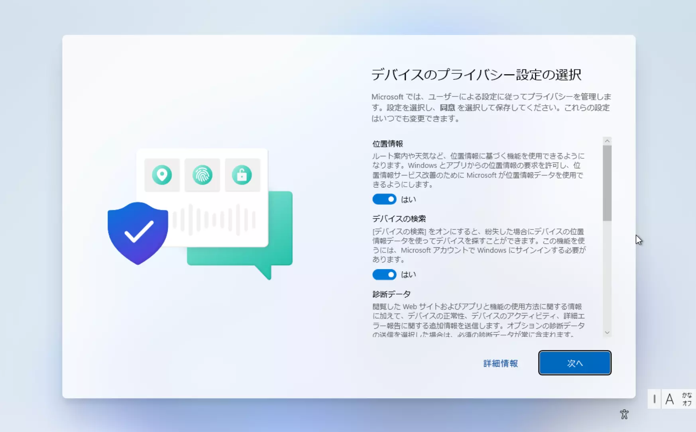{:.medium}
1. あと少しで終了する旨などが表示されるので，しばらく待ってください．
   {:.medium}
   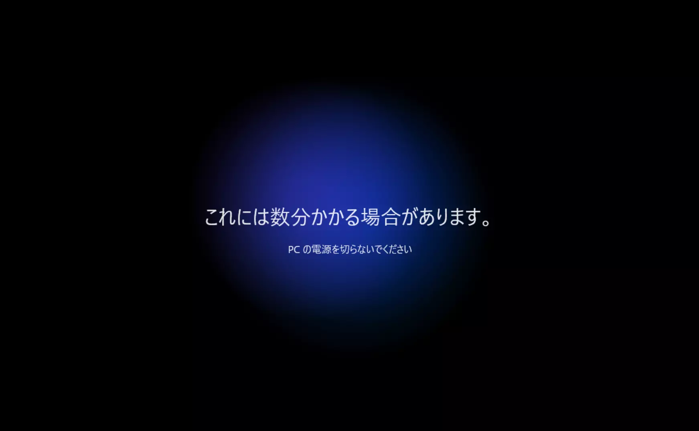{:.medium}
1. 下記画面が表示されましたら，ローカルアカウントを作成したセットアップはこれで完了です．
   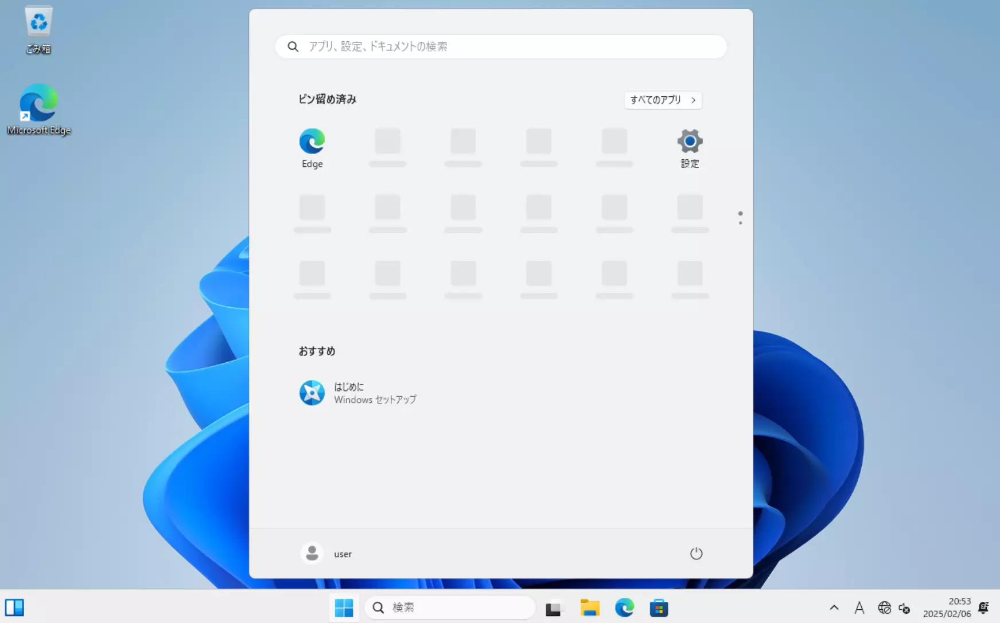{:.medium}
1. ネットワークの設定， Windows Update を行ってください．
   **[UTokyo Wi-Fi （学内無線 LAN）](/utokyo_wifi/)**{:.box.center}
   **[Windows Updates をインストールする（Microsoft サポート）](https://support.microsoft.com/ja-jp/windows/windows-%E3%81%AE%E6%9B%B4%E6%96%B0-3c5ae7fc-9fb6-9af1-1984-b5e0412c556a)**{:.box.center}
1. 適宜 Office アプリのセットアップ， OneDrive アプリへのサインイン等を行ってください．
   **[UTokyo Microsoft License （Office アプリ，OneDrive）](/microsoft/)**{:.box.center}

## FAQ
{:#FAQ}

### Windows PC で作成するアカウントについて
{:#msaccount}
現在、販売されている Windows11 での通常のセットアップ手順では Microsoft アカウントを用いることとなります．従前から利用できたローカルアカウントを利用した方がよい場合もあるため，本ページを用意しました．以降のFAQも参照の上，適切に判断してください．

### Microsoft アカウントを用いてセットアップした方が良い場合を知りたい
{:#difference}
ローカルアカウントを作成した場合と個人の Microsoft アカウントを用いた場合では細かい違いが数点ありますが，どちらにしたほうが良いかは状況などによります．

#### Microsoft アカウントを用いたセットアップが効果的な場合
{:#merit-personal}
既に Microsoft 365 Personal を契約している，Microsoft アカウントで Windows PC を利用しているなど，主として**個人の** Microsoft アカウントのサービス（OneDrive など）を利用したい場合には，本ページのローカルアカウントを作成してセットアップする方法を使わずに，Microsoft アカウントを用いてセットアップいただくとスムーズです．Microsoft アカウントを用いてセットアップした場合には OneDrive の同期やブラウザへのサインインが自動で開始されます．

#### ローカルアカウントを作成しセットアップする方法が効果的な場合
{:#merit-local}

前項のサインイン，同期機能を望まない場合や，個人の Microsoft アカウントを今回セットアップするパソコンに利用したくない場合，本ページのローカルアカウントを作成してセットアップする方法を用いるとよいです．パソコン単体のシンプルな状態でスタートできます．

もちろん，ローカルアカウントを作成しセットアップを行っても，個人の Microsoft アカウントが使用できないわけではありません．適宜，個人の Microsoft アカウントや UTokyo Account を用いて OneDrive や Office アプリを使用することが可能です．

### BitLocker 回復キーをクラウドバックアップできるか
{:#bitlocker}

ローカルアカウントでのセットアップ後に， UTokyo Account に適切にサインインすることで UTokyo Account を利用した [BitLocker](https://learn.microsoft.com/ja-jp/windows/security/operating-system-security/data-protection/bitlocker/) [回復キー](https://learn.microsoft.com/ja-jp/windows/security/operating-system-security/data-protection/bitlocker/recovery-overview)のバックアップが可能です．

1. パソコンで Office アプリ等にサインインしてください．
1. サインイン直後に表示されるウィンドウで，組織がこのデバイスを管理できるようにしますか？のチェックボックスを**オフ**にしてください．
   - ※ オンにしてしまうと様々な制約がかかってしまい，かつ**元に戻すには初期化等が必要です**．特に注意してください．
1. そのまま OK を押してください．
   - 「いいえ，このアプリのみにサインインします」を選択すると BitLocker 回復キーは**バックアップされません**．
1. UTokyo Account がパソコンに接続されます． BitLocker 回復キーがバックアップされます．

BitLocker 回復キーを Microsoft アカウントに保存する代わりに， [USB メモリなどの外部ストレージにバックアップする](https://support.microsoft.com/ja-jp/windows/e63607b4-77fb-4ad3-8022-d6dc428fbd0d)ことも可能です．

### 個人で専有しない，共用のパソコンでも同じ手順でよいか
{:#shared-pc}

（共用パソコンを管理する教職員向けです）

この方法でセットアップしていただいても構いません．ただし，セットアップで作成したローカルアカウントはパソコンの管理者のアカウントとし，**個々の利用者には，それぞれ別のローカルアカウント**を作成し，使用していただくようにしてください．

詳しくは以下のページをご参照ください．
**[共用 PC 等向け Microsoft ライセンス](https://univtokyo.sharepoint.com/sites/utokyoaccount/SitePages/Microsoft-license-for-shared-PC.aspx)**{:.box.center}
