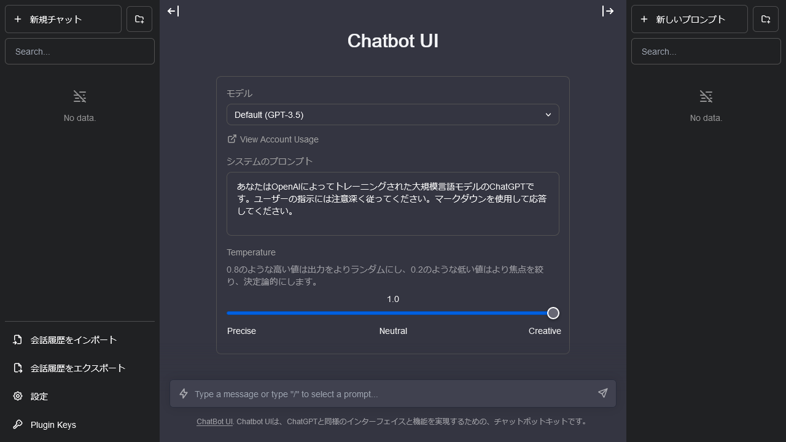

2023年10月20日公開

利用者多数により，申請を行ってから利用できるようになるまで時間がかかっている状況です．ご期待に添えず申し訳ありません．詳細は本ページ末尾をご覧ください．

いつも本学の情報システムの運営にご協力いただきありがとうございます．

このたび情報システム本部では，教育・研究にお使いいただくため，全学の構成員に向けて生成AIチャットサービスの実験的な提供を行うことにしました．

東京大学では，生成AIツールの利用を一律に禁止することはせず，教育・研究等における利用の可能性を積極的に探るとともに，活用上の実践的な注意を発信していく方針を取っています．この方針を踏まえ，教育・研究活動に関係する方々，特に学生の皆様が生成AIを利用できるような環境を整備すべく，本サービスの提供を行うこととしたものです．

本サービスは，Mckay Wrigley氏が開発している「[Chatbot UI](https://github.com/mckaywrigley/chatbot-ui)」というソフトウェアを用い，OpenAI社のAPI <ins class="alert">およびMicrosoftの「Azure OpenAI」サービスのAPI</ins> をWeb上のチャット画面から利用できるようにしたものです．OpenAI社のAPIは大学としてサービス契約したものを用いており，利用者に個別の費用負担が生じることはありません．詳細は以下の通りです．

<ins class="alert">※（2023年11月21日追記）OpenAI社のAPIの使用には上限があるため，多くの利用者の方に提供できるよう，今後，Microsoftの「<a href="https://azure.microsoft.com/ja-jp/products/ai-services/openai-service">Azure OpenAI</a>」サービスを併用することを計画しています．Azure OpenAIではOpenAI社のAPIと同じモデルが提供されており，同等に利用することができます．</ins>

（参考）関連して「[Bing Chat Enterpriseによる生成AIチャットの利用について（教職員限定）](https://univtokyo.sharepoint.com/sites/utokyoportal/Lists/ListNotification/DispForm.aspx?ID=5422)」も案内を行っていますので，こちらの利用対象となる方はあわせてご利用ください．本サービスはAPIの使用上限・従量課金がありますので，利用の分散にご協力をお願いします．

## 本サービスの概要

### 利用対象者

UTokyo Accountを持つ本学の構成員．**[情報セキュリティ教育](https://univtokyo.sharepoint.com/sites/Security/SitePages/Information_Security_Education.aspx)の受講と[UTokyo Accountの多要素認証](/utokyo_account/mfa/)の有効化を必須**とします．

利用者が多数となった場合は，別途制限を設ける可能性があります．

### サービス内容

OpenAI社のAPI <ins class="alert">およびMicrosoftの「Azure OpenAI」サービスのAPI</ins> を，以下のようなチャット画面から利用できます．

モデルはGPT-3.5およびGPT-4から選択することができます．

直接APIを利用することはできませんので，単純なチャットを越える機能（function calling等）は利用できません．また，チャット画面はサードパーティのソフトウェアであり，OpenAI社のChatGPTとは異なるものであるため，ChatGPTのプラグイン（たとえばCode Interpreter等）を利用することもできません．

### 提供期間等

本サービスは，生成AIに関する現状に鑑み実験的に提供を行うものであり，継続して提供することを前提としていません．

サービスの利用状況，OpenAI社 <ins class="alert">およびMicrosoftのAzure OpenAI」</ins> のサービス内容の状況，OpenAI社との契約 <ins class="alert">および「Azure OpenAI」の契約状況</ins> 状況，生成AIにまつわる技術・社会の状況等により，予告なく内容を変更する可能性や，提供を終了する可能性があります．

### 利用目的

**東京大学における教育・研究活動を目的とした利用**に限ります．それ以外の目的での利用はできません．

### 利用上限

APIの使用には上限があり，また従量課金となっていることから，本サービスでは利用に上限を設けます．上限はOpenAI社の課金に用いられる「トークン」に基づいて定めます．具体的には，

- GPT-3.5モデルに関しては
    - 入力1トークンあたり3単位
    - 出力1トークンあたり4単位
- GPT-4モデルに関しては
    - 入力1トークンあたり60単位
    - 出力1トークンあたり120単位

とした上で，1アカウントにつき1ヶ月あたり**2,000,000単位** <ins class="alert">または800,000単位（本ページ末尾参照）</ins> を上限とします（あくまで大まかな目安ですが，2,000,000単位はGPT-4モデルで日本語の文章1.5万字前後に相当します）．ただし，利用の状況により変更する可能性があります．

トークンに関する詳細は，OpenAI社の記事「[What are tokens and how to count them?](https://help.openai.com/en/articles/4936856-what-are-tokens-and-how-to-count-them)」やその他インターネット上の情報を参照してください．

## 利用にあたっての注意事項

### 機密情報や個人情報を入力しない

本サービスに入力した文章（プロンプト）はOpenAI <ins class="alert">およびMicrosoft</ins> のシステムに送信されます．OpenAIの利用規約 <ins class="alert">およびMicrosoftの技術情報</ins> によれば，APIで利用した情報はサービス改善（いわゆるモデルの学習）のために利用されることはないとされていますが，サービスへの送信自体は行われていることに注意してください．そのため，取り扱いに注意を要する情報（試験やレポートの問題，業務で知り得た機密情報，発表・公開すべきでない研究内容，その他関係者以外が知りえない情報）を入力しての利用は行わないでください．また，機密情報にあたらない情報であっても，実在する個人名・部署名や連絡先はそのまま入力せず固有名詞を置き換える等して利用してください．

[情報セキュリティポータルサイト](https://univtokyo.sharepoint.com/sites/Security/)の情報も参照してください．

### 生成AIの性質を踏まえて出力の取り扱いに注意する

本サービスに用いられている生成AI（大規模言語モデル）は，入力した文章に続くような確率的にもっともらしい文章を出力するという仕組みであり，その結果として言語的に非常に自然な文章が出力されるという特徴を持っています．利用者から入力される文章や生成AI自身が出力する文章の意味を認識したり，文章の意味から正しい出力をしたりするといったものではありません．そのため，ChatGPTから回答された文章には「まるで本当であるかのように話される嘘」が含まれることがあります（ハルシネーションと呼ばれています）．前提として，大規模言語モデルは原理的にそもそも質問に対して正しい回答を出力する技術ではないということを理解した上で利用してください．

また，生成AIを利用してはいけない場面や，利用の条件が決まっている場面もあります．特に**授業においては，生成AIの利用の可否について，授業の特性に応じて担当教員が判断する**ことになっています．所属学科や専攻および各授業の担当教員の**指示に従い，認められていない場合には利用しない**でください．論文誌への投稿についても，生成AIの利用が禁止されている場合や，制限・条件が付けられている場合があるため，十分に注意してください．

加えて，生成AIの出力には著作権など法的なリスクを伴う内容が含まれている可能性があります．生成AIの出力を利用した結果についての責任は，あくまでも利用者の側にあることを認識してください．

以下も参照してください．

- [東京大学の学生の皆さんへ：AIツールの授業における利用について](/docs/ai-tools-in-classes-students)（2023年5月26日付／2023年5月29日掲載）
- [AIツールの授業における利用について](/docs/ai-tools-in-classes)（2023年4月28日付／2023年5月16日掲載）
- [生成系AI(ChatGPT, BingAI, Bard, Midjourney, Stable Diffusion等)について](/docs/20230403-generative-ai)（2023年4月3日／太田邦史理事・副学長）

### 別件の会話は新しいセッションを作成しなおして行う

本サービスでは，それまでのチャットの内容を参照し文脈に沿った出力を行ってくれます．これは，それまでのチャット内容をその都度すべてAPIへの入力として送信することにより実現されているため，過去のやり取りを含めたまま次々に別の質問を続けると，過去の会話の文字数（トークン数）までAPIへの入力としてカウントされてしまいます．一つのやり取りを終えてまったく別の話題であらためて利用する場合は，新しいまっさらなチャット（セッション）を作成してください．本サービスでは，複数のチャット（セッション）を作れる仕組みになっています．

### 会話履歴はブラウザ上に保存される

本サービスへの入力プロンプトや出力（会話履歴）はブラウザの内部（ローカルストレージと呼ばれる領域）に保存されます．そのため，使用ブラウザや端末を変えた場合や，プライベートウィンドウで利用していてタブを閉じた場合には，会話履歴が消えます．会話履歴のエクスポート機能があるため，必要に応じてご活用ください．

### その他の注意事項

以上で説明した制限のほか，OpenAI社のAPIには[Rate limits](https://platform.openai.com/docs/guides/rate-limits)などの制限が設けられています．抵触すると利用者全体に影響が及びますので，必要な範囲を超えて過度に利用することは控え，ゆずりあって利用してください．

本サービスは実験的なものであり，問題が生じた場合には提供を取りやめざるを得なくなります．利用者の皆様の節度ある行動を期待します．

また，利用にあたってはOpenAI社の[Terms of Use](https://openai.com/policies/terms-of-use) <ins class="alert">およびMicrosoft Azureの<a href="https://www.microsoft.com/licensing/terms/productoffering/MicrosoftAzure/EES#ServiceSpecificTerms">Product Terms</a></ins> も参照し，適切に利用してください．

## 利用方法

本サービスの利用には**[情報セキュリティ教育](https://univtokyo.sharepoint.com/sites/Security/SitePages/Information_Security_Education.aspx)の受講と[UTokyo Accountの多要素認証](/utokyo_account/mfa/)の有効化を必須**とします．あらかじめこれらを済ませた上で，以下の手順に進んでください．

1. 以下の申請フォームを入力・送信してください．<b class="box center"><a href="https://forms.office.com/r/nAv0y1uwsR">申請フォーム</a></b>
1. **申請後，利用できるようになるまでに時間がかかる場合があります．下の「申請の受付状況について」をご覧いただき，利用できるようになるまでしばらくお待ちください．**{:.alert}
    - 利用できるようになった際の個別の連絡はしません．お手数ですが，本ページや，下で説明している「UTokyo ARC」Slackワークスペースにて，各自ご確認ください．
1. 利用できるようになったら，以下のリンクにアクセスしてください．<b class="box center"><a href="https://aichat.adm.u-tokyo.ac.jp/">https://aichat.adm.u-tokyo.ac.jp/</a></b>
    

        
ヘルプ：「申し訳ありませんが、サインイン中に問題が発生しました。」または「Sorry, but we’re having trouble signing you in.」というエラーが表示される場合

        まだ利用できるようになっていないか，あるいは，本サービスの利用に必要な<a href="https://univtokyo.sharepoint.com/sites/Security/SitePages/Information_Security_Education.aspx">情報セキュリティ教育</a>の受講が完了していないために，申請が却下されています．申請時刻からは利用できるようになっているはずと思われる場合は，情報セキュリティ教育の受講を完了（確認テストに合格）してから，もう1度申請をし直してください．
    

    

        
ヘルプ：「これに対するアクセス権がありません」または「You don’t have access to this」というエラーが表示される場合

        本サービスの利用に必要な<a href="/utokyo_account/mfa/">UTokyo Accountの多要素認証</a>の申請およびその反映が完了していない可能性があります．「<strong><a href="/utokyo_account/mfa/initial">UTokyo Account多要素認証の初期設定手順</a></strong>」を<strong>最後の「手順4：多要素認証の利用を申請する」まで確実に</strong>行って，UTokyo Accountの多要素認証を有効化してください．その後，多要素認証の設定が<strong>システムに反映されるまで約40分かかるので，それまでしばらくお待ちください</strong>．
    

※情報セキュリティ教育の受講が完了していない（確認テストに合格していない）状態で申請した場合，そのデータは破棄されます．受講が完了した後に，もう1度申請をし直してください．

※**利用者が多数となった場合は，申請の受付を急遽停止する可能性や，申請をした方へのサービス提供を急遽制限・停止する可能性があります．**{:.alert}その際は，このページを更新するとともに，下で説明している「UTokyo ARC」Slackワークスペースでお知らせします．

### 申請の受付状況について

利用者多数により，申請の受付を一時停止するなどご期待に添えない状況が生じており，申し訳ありません．

- 10月20日19時40分頃：受付を一時停止しました．
- 10月20日20時00分頃：申請再開待ち登録に切り替えました．
- 10月24日19時00分頃
    - 10月22日2時30分頃までに登録していた方について，上限を当初の40%（800,000単位）に設定した上で，利用できるようにしました． ※当初から利用できている方の上限に変更はありません．
    - 10月22日2時30分頃以降に登録した方についても，段階的に受け入れるべく調整中です．大変おそれいりますが，引き続きいましばらくお待ちください．
- 11月21日20時30分頃
    - 10月22日2時30分頃までに登録していた方について，本来より低い上限でご利用いただいていましたが，上限を当初の値（2,000,000単位）に引き上げました．
    - 11月14日20時30分頃までに登録していた方について，当初の上限（2,000,000単位）で利用できるようにしました．大変お待たせいたしました．
    - それ以降に登録していた方について，上限を当初の40%（800,000単位）に設定した上で，利用できるようにしました．
    - 申請再開待ち登録から即時受付に切り替えました．現在，申請された方は，当初の40%の上限（800,000単位）で，申請直後から利用できるようになっています．ただし，今後も状況により一時停止などの可能性がありますことをご了承ください．

## 情報共有・問い合わせ先

本サービスに関する情報共有のため，UTokyo Slack内に設けられている「UTokyo ARC」ワークスペースに専用のチャンネル `#arc-aichat-users` を作成しています．「[UTokyo Slackに自由に参加できるワークスペースの中から選んで参加する](/slack/join)」ページの手順に従って自身で参加してください．

本サービスは実験的に提供するものであり，対応のリソースが限られているため，メールやuteleconサポート窓口での問い合わせは受け付けません．質問はSlackへ投稿してください．
