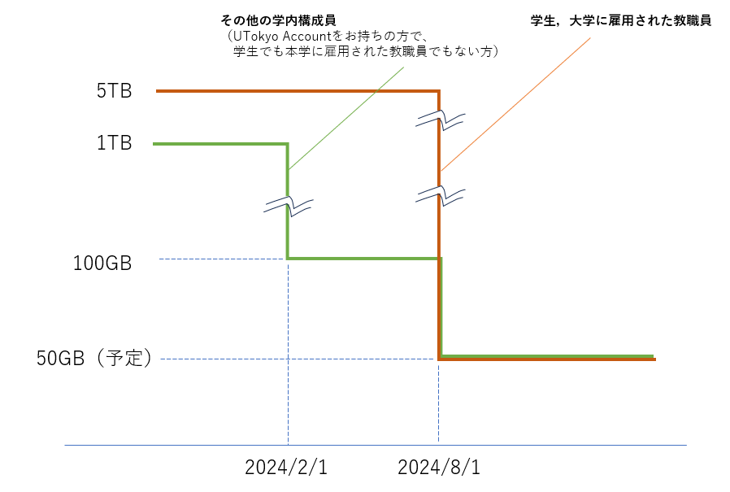
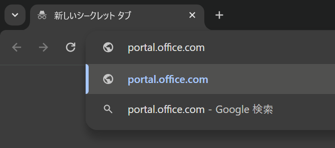
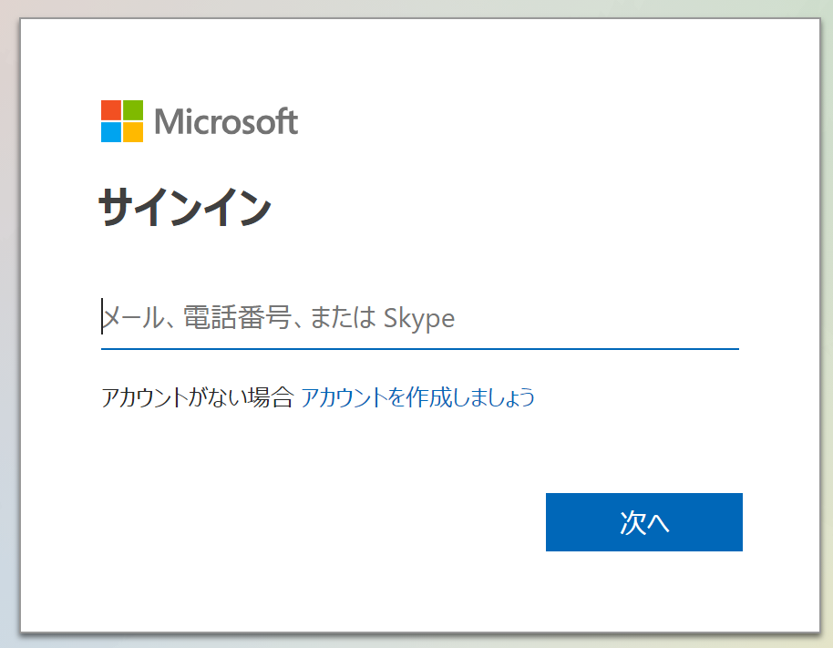
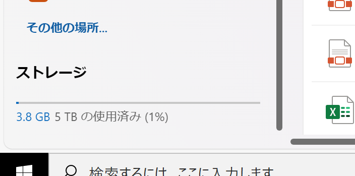

UTokyo Account 利用者各位

情報システム本部

Microsoft社によりMicrosoft 365 for Educationクラウドストレージの容量制限の仕様が変更されることになり，東京大学でも利用上限を縮小することになりました．現在，個人に割り当てるストレージ上限の見直し，上限を超えるストレージ利用方法の検討を行っているところですが，現時点で決まっている内容についてお知らせします．

仕様変更は，2024年2月1日と2024年8月1日の2段階に分けて行われます．また，東京大学への在籍形態によって適用の時期・内容が異なります．

{:.border}

## 2024年2月1日：学生でも教職員でもないUTokyo Account保持者の上限が縮小

UTokyo Accountをお持ちの方のうち，学生でも本学に雇用された教職員でもない方については，Microsoftのサービスを無償ライセンスでご利用いただいていたため，先行して影響が生じます．

具体的には，2024年2月1日から，OneDriveの利用上限が1TBから100GBに縮小されます．なお，100GBは一時的な値で，さらに2024年8月1日の大学全体での上限縮小に伴う制限が行われる予定です．

（参考）[Microsoft 365 Educationのストレージの仕様変更](https://www.microsoft.com/ja-jp/education/products/microsoft-365-storage-options)

100GBを超えて OneDrive を利用している方には個別に通知します．100GBを超えていると2月1日以降，新たなファイルの書き込みができなくなります．該当の方は，データの削減など必要な整理をお願いします．

※自分が上記に該当するかどうかを確認する方法：ウェブブラウザでOneDriveにアクセスし，画面左下の「ストレージ」の上限が1TBになっている場合は，2024年2月1日からの上限縮小の対象となりますので，至急対応をお願いします．手順については下記「[OneDriveのストレージ上限値の確認方法](#procedure)」を参照してください．

## 2024年8月1日：大学全体の上限がさらに縮小

2024年8月1日から，東京大学全体で使用できるストレージの総量が大幅に縮小されます．これに伴い，学生・教職員を含むUTokyo Accountをお持ちの方全員について，OneDriveの利用上限を50GBに縮小する予定です．具体的な制限の詳細については検討中ですが，50GB以上のストレージ利用を行っている方は，データ整理の準備を行っていただきますようお願いいたします．

## 学内で提供されているストレージ関連サービス

- Microsoft Teams（SharePoint）※教職員限定
    - 共同作業のためのワークスペースとして，チャットやファイル共有のためのストレージサービス機能（SharePoint）などが利用可能
    - ※現在は上限500GBとしていますがストレージ上限の見直しを予定しています．有償で追加のストレージを利用できる方法を準備しています．
    - →[Teamsチームの作成方法について](https://univtokyo.sharepoint.com/sites/utokyoportal/wiki/d/IT_Tool_020.aspx)
- ECCSクラウドメール (Google Workspace)
    - Google WorkspaceのサービスとしてGoogleドライブを100GBまで費用負担なく利用可能
    - 大学予算での支払いに限り有償で100GBを超えた利用も可能
    - →[ECCSストレージ管理システムについて](https://www.ecc.u-tokyo.ac.jp/storage_mgt/index.html)

## 参考リンク

[OneDriveの利用方法](https://utelecon.adm.u-tokyo.ac.jp/microsoft/onedrive/)

## OneDriveのストレージ上限値の確認方法
{:#procedure}

1. ブラウザのアドレスバーに「 [portal.office.com/onedrive](https://portal.office.com/onedrive) 」と入力します
    {:.medium}
1. 「サインイン」ボタンを押して、UTokyo Account(共通ID＋@utac.u-tokyo.ac.jp)を入力します 
    {:.medium}
1. 画面の左下に表示される「ストレージ」を確認
    - 学生でも教職員でもないUTokyo Account保持者 は「1TB の使用済み」と表示されます
    - 上記以外の方（学生／教職員）は「5TB の使用済み」と表示されます

    {:.medium}
 