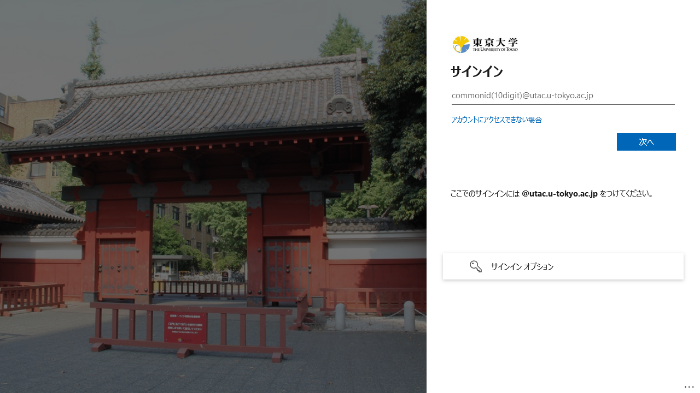

2024年3月12日（予定）に，UTokyo Accountの認証基盤においていくつかのシステム変更を行います．これらのシステム変更は，UTokyo Accountの多要素認証の利用必須化に向け，それを利用しやすくするためのものです．多要素認証の利用必須化につきましては，「[UTokyo Accountにおいて多要素認証の利用を必須化します](./mfa100-schedule)」を参照してください．

## より多くの情報システムでサインイン時に `@utac.u-tokyo.ac.jp` の入力が必須になります
{:#require-utac-u-tokyo-ac-jp}

UTokyo Accountでサインインする際に，これまでは以下の1枚目の画面が表示され，`@utac.u-tokyo.ac.jp`を省略して共通ID（数字10桁）とパスワードでサインインできる場合がありました．今回のシステム変更により，より多くの情報システムにおいて，以下の2枚目の画面が表示され，「10桁の共通ID＋`@utac.u-tokyo.ac.jp`」と入力することが必要になります．

<figure class="gallery">
    
    
</figure>

※右の画面は今までも表示されることがあった画面ですが，背景画像やレイアウトが変更されます．

この変更の対象となるのは，[UTokyo Account Service Directory](https://login.adm.u-tokyo.ac.jp/utokyoaccount/)において「SSO」欄が「○」となっている情報システムです．代表的な例は以下の通りです．

- UTAS
- ITC-LMS/UTOL
- Zoom
- ECCSクラウドメール（Google Workspace）
- 東京大学MyOPAC
- EZproxy

この変更は，次に説明するパスワードレスサインインを広く利用可能にするために必要な変更ですので，ご理解ください．

## パスワードレスサインインが広く利用可能になります
{:#passwordless-signin}

「パスワードレスサインイン」は，パスワードを入力せずにサインインする仕組みのことです．UTokyo Accountにおいて，パスワードレスサインインは，これまで非常に限られた場合でしか利用できませんでした．今回のシステム変更により，多くの場合でパスワードレスサインインが利用できるようになります．

この変更の対象となるのは，[UTokyo Account Service Directory](https://login.adm.u-tokyo.ac.jp/utokyoaccount/)において「SSO」欄が「○」となっている情報システムです．代表的な例は以下の通りです．

- UTAS
- ITC-LMS / UTOL
- Zoom
- ECCSクラウドメール（Google Workspace）
- 東京大学MyOPAC
- EZproxy

UTokyo Accountで利用できるパスワードレスサインインの方法は，FIDOセキュリティキーによるものと，Microsoft Authenticatorによるものの2種類です．それぞれの利用方法について，以下に説明します．

なお，これらのパスワードレスサインインの方法については，それだけで多要素認証の本人確認を行ったことになるため，他の本人確認方法は必要ありません．

### FIDOセキュリティキーでパスワードレスサインインを利用する
{:#passwordless-signin-fido}

UTokyo Accountの多要素認証の本人確認方法としてFIDOセキュリティキーを利用している方は，FIDOセキュリティキーでパスワードレスサインインを利用することができます．初期設定の方法および，利用できるOSとブラウザの組み合わせについては，[FIDOセキュリティキーの初期設定](/utokyo_account/mfa/fido-security_key/)を参照してください．

サインインの流れは以下の通りです．

1. サインイン画面が表示されたら，「サインイン オプション」を押してください．
2. 選択肢が複数表示されるので，「セキュリティ キーでサインイン」を選択してください．
3. 画面の指示に従って，PINの入力あるいは生体認証，セキュリティキーのタップなどを行った後，サインインが完了します．
    - アカウントを選択する画面が表示される場合がありますが，その場合はUTokyo Accountを選択してください．

### Microsoft Authenticatorでパスワードレスサインインを利用する
{:#passwordless-signin-msauth}

UTokyo Accountの多要素認証の本人確認方法としてMicrosoft Authenticatorを利用している方は，追加の設定を行うことで，Microsoft Authenticatorでパスワードレスサインインを利用できるようになります．

設定方法は以下の通りです．

1. Microsoft Authenticatorを本人確認方法として登録していない場合は，「[UTokyo Account多要素認証の初期設定手順](/utokyo_account/mfa/initial/)」に従って，Microsoft Authenticatorを本人確認方法として登録してください．
1. スマホでMicrosoft Authenticatorアプリを起動し，アプリ上に表示されている自分のUTokyo Accountを選択してください．
1. 「電話によるサインインを有効にする」を押してください．
1. 「続行」を押してください．
1. 指示に従ってサインインしてください．
1. 「デバイスの安全を保つためにご協力ください」と表示されるので，「登録」を押してください．設定が完了します．

サインインの流れは以下の通りです．
1. サインイン画面が表示されたら，「10桁の共通ID＋`@utac.u-tokyo.ac.jp`」を入力してください．
1. 表示される数字をMicrosoft Authenticatorアプリに入力してください．
1. サインインが完了します．

## 多要素認証に対応する全ての情報システムでFIDOセキュリティキーが利用可能になります
{:#fido-for-all-mfa-systems}

これまで，多要素認証に対応するシステムの一部はFIDOセキュリティキーに対応していませんでした．これからは，多要素認証に対応する全ての情報システムにおいてFIDOセキュリティキーが利用できるようになります．今回新たにFIDOセキュリティキーに対応する情報システムの例は以下の通りです．

- 東京大学MyOPAC
- EZproxy
- 出張旅費システム
- 学術認証フェデレーション
