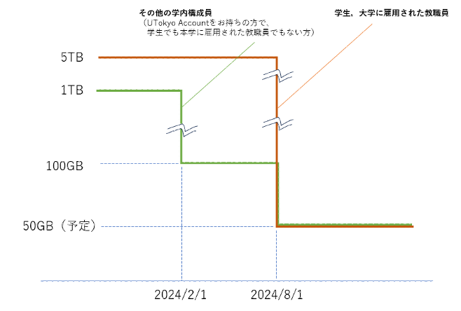
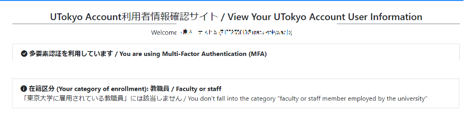
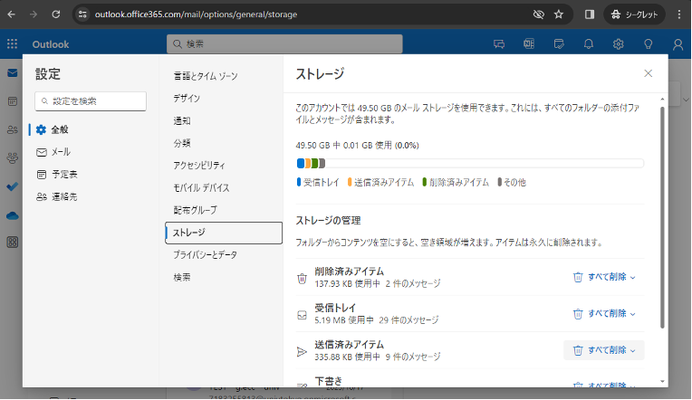
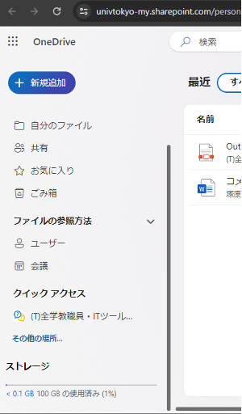

  発出: 2024年4月22日 
  更新: 2024年7月12日

UTokyo Account 利用者各位

情報システム本部

Microsoft社によりMicrosoft 365 for Educationクラウドストレージの容量制限の仕様が変更されることになり，東京大学でも利用上限を縮小することになりました．現在，個人に割り当てるストレージ上限の見直し，上限を超えるストレージ利用方法の検討を以下のように行いました．

仕様変更は，2024年2月1日(実施済み)と2024年8月1日の2段階に分けて行われます．また，東京大学への在籍形態によって適用の時期・内容が異なります．

{:.center}

なお，Microsoft 365 Educationのストレージの仕様変更の詳細に関しましては，[Microsoft社による説明](https://www.microsoft.com/ja-jp/education/products/microsoft-365-storage-options)をご参照ください．

## 2024年2月1日：東京大学に雇用されている教職員には該当しないUTokyo Account保持者（学生は除く）のストレージ上限が縮小

2024年2月1日にMicrosoft社にて実施済みです．

自分が「東京大学に雇用されている教職員」であるか確認する方法

1.  「[UTokyo Account利用者情報確認サイト](https://login.adm.u-tokyo.ac.jp/my/)」を開いてください．
2.  右上の「Sign in」ボタンを押してください．
3.  既にUTokyo Accountにサインイン済みの場合を除き，UTokyo Accountのサインイン画面が表示されるので，サインインしてください．
4.  「情報を表示」ボタンを押してください．
5.  「在籍区分」に「東京大学に雇用されている教職員には該当しません」とある場合，この変更の対象となります．
    

## 2024年8月1日：UTokyo Accountをお持ちの方全員のストレージ上限が縮小

2024年8月1日から，東京大学全体で使用できるストレージの総量が大幅に縮小されます．これに伴い，学生・教職員を含むUTokyo Accountをお持ちの方全員について，OneDrive及び，職員メールの利用上限をそれぞれ50GBに縮小します．50GB以上のストレージ利用を行っている方はファイルの追加や編集ができなくなりますので，データ整理の準備を行っていただきますようお願いいたします．OneDriveは容量の拡張ができませんので，必要な容量が不足する場合は後述の「[学内で提供されているストレージ関連サービス](#services)」の利用をご検討ください．

データ使用量を確認する方法

- 職員メールのデータ使用量の確認
  1.  ブラウザ上で[Outlook](https://outlook.com/utac.u-tokyo.ac.jp)にログインしてください．
  1.  歯車マークから，「設定」→「全般」→「ストレージ」の順に開いてください．
  1.  データ使用量が確認できます．
      

- OneDriveのデータ使用量の確認
  1.  ブラウザ上で[OneDrive](https://univtokyo-my.sharepoint.com/)にログインしてください．
  1.  画面左下の「ストレージ」に使用量が表示されています．
      - 「使用済み容量」ボタンを押すことで，サイズの大きいファイルを確認することができます．
      

データ使用量の削減方法

またOneDriveではバージョン管理が有効になっているため，サイズの大きいファイルの不要なバージョンを削除することで空き容量を増やすことができます．詳しくは[OneDriveでサイズの大きいファイルを表示させる、バージョン履歴を削除する方法（学内限定）](https://univtokyo.sharepoint.com/:v:/s/utokyoaccount/ESkNKTQEvV5Er9Ynu3VLFVIBnoYu1cgwI0_KqkwMWlRKRQ?e=uIWA8q)を参照してください．

## 学内で提供されているストレージ関連サービス
{:#services}

### Microsoft Teams（SharePoint）※教職員限定

共同作業のためのワークスペースとして、申請してTeamsチームを作成することで、グループチャットやファイル共有のためのストレージサービス機能（SharePoint）が利用可能です．ただし、組織（係、チーム等）で利用するデータを共有することが前提になるため、個人のデータを保管するために申請することはできません．また、連続して400日間アクセスされなかったTeamsチームは自動的に削除されますので、ご注意ください． 

詳しくは[Teamsチームの作成方法について](https://univtokyo.sharepoint.com/sites/utokyoportal/wiki/d/IT_Tool_020.aspx)をご参照ください．

※現在は上限500GBとしていますがストレージ上限を100GBに変更します．ストレージ容量が不足する場合は、有償で追加のストレージを利用できる方法を公開しています．詳しくは[Teamsチームフォルダの拡張方法](https://univtokyo.sharepoint.com/sites/utokyoportal/wiki/d/Teams_Change_Storage_Limit.aspx)をご参照ください．

### ECCSクラウドメール (Google Workspace)

Google WorkspaceのサービスとしてGoogleドライブを100GBまで費用負担なく利用可能です．
また大学予算での支払いに限り有償で100GBを超えた利用も可能です．

詳しくは[ECCSストレージ管理システムについて](https://www.ecc.u-tokyo.ac.jp/storage_mgt/index.html)をご参照ください．

## 今後の予定

- 5月～6月頃　OneDrive，職員メールのストレージ使用量が上限の50GBを超えているアカウントに個別通知をしました
- 7月頃　SharePointのストレージ容量の拡張する手順を整備し学内に公開しました
- 8月1日　東京大学のクラウドストレージ容量の制限が実施されます
- 10月頃　ストレージ容量拡張の負担金等の概要説明をパソコン管理者合同連絡会等で実施します

## 参考URL  

[OneDriveの利用方法](https://utelecon.adm.u-tokyo.ac.jp/microsoft/onedrive/)

## 更新履歴

- 2024年7月12日：今後の予定やOneDriveの容量確認方法などを追記

## 本件に関する問い合わせ先

情報システム本部・本部情報支援課業務支援チーム: dics-shien.adm@gs.mail.u-tokyo.ac.jp
