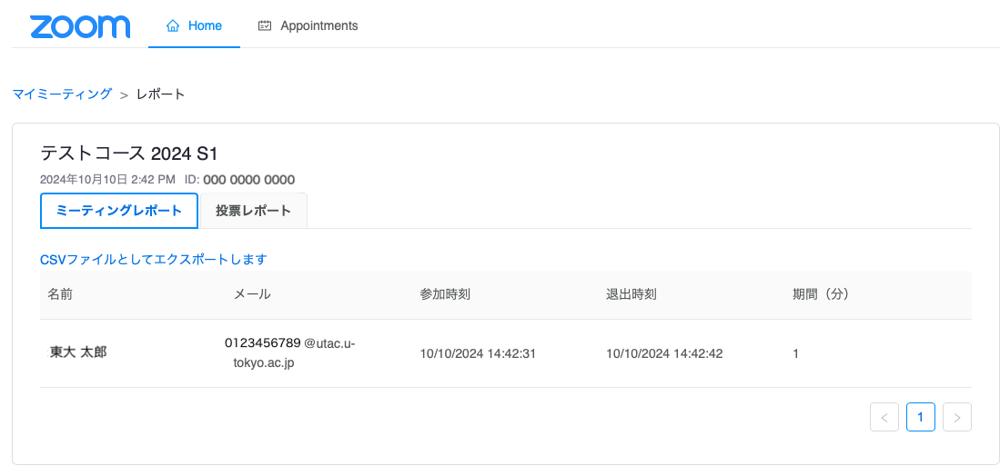

2024年11月15日 
情報基盤センター 

## 概要

通常 Zoom ミーティングを作成すると「招待リンク」という URL が表示されます．ミーティング参加者に電子メール等でこの URL を予め連絡することでミーティングを開催します．

LTI連携機能を用いると，オンライン授業を実施するコース(科目) に参加する学生・教職員であれば，ミーティングURL等を知らずともUTOL の画面からの操作のみでミーティングに参加できるようになります．また担当教員は，招待リンクをオンライン授業情報欄に入力する必要がありません．

本稿ではUTOLのLTI連携機能を用いて，Zoom ミーティングを利用する方法を紹介します．

※なお本学では，オンライン授業のURLを連絡するには，原則として UTOL(UTokyo LMS) の「オンライン授業情報」欄を利用することになっています．詳しくは「[授業URLの連絡方法（教員向け）](/faculty_members/url)」のページをご覧ください． 

## ミーティングの準備と実施

### 事前準備

* 利用予定のコース(科目)の時間割コードや名称を UTOL 担当にご連絡下さい．設定が完了したら， UTOL 担当が電子メールでご連絡します．他の業務の都合によっては数日を要する場合があります．ご了承願います．  
* 利用するコースのコーストップ画面で，左メニューの「コース設定 \> LTI 利用設定」を選択してください．

* 「Zoom」 で「利用する」をチェックして「確認画面に進む」\>「登録する」ボタンをクリックしてください．  
* コースで Zoom を LTI 連携で利用可能となります．

### ミーティングの設定

* コーストップ画面に戻ったら「外部連携」の欄にある「Zoom」をクリックして下さい．
  {:.small}

* Zoom の画面が表示されたら「新しいミーティングをスケジュールする」ボタンを押して，適宜 Zoom のミーティングを作成して下さい．  
  * 設定する内容は通常の Zoom ミーティングと同様なので，詳細を省きます．

  

### ミーティングの開始 \- 教員 (担当教員) \-

* コーストップ画面の「外部連携」の欄にある「Zoom」をクリックして下さい．  
* 表示されているミーティングの「開始」ボタンを押して下さい．Zoom のアプリケーションが起動します．
  

### ミーティングの参加 \- 学生 (履修者他) \-

* 「コーストップ画面の「外部連携」の欄にある「Zoom」をクリックして下さい．  
* 表示されているミーティングの「参加」ボタンを押して下さい．Zoom のアプリケーションが起動します．  
  * Zoom の言語設定が「English」になっている場合は「Join」ボタンを押して下さい

  

## 過去のミーティング

### ミーティングのレポート \- 教員 (担当教員) \-

* Zoom ミーティングの「前回のミーティング」タブを選択すると，過去にこのコースで利用したミーティングが表示されます．
  

* 各ミーティングの「レポート」をクリックすると，ミーティングの参加者を確認できます．
  

### クラウド記録の閲覧 \- 学生 \-

* 担当教員がミーティングを「レコーディング」した場合，学生は Zoom の画面の「クラウド記録」のタブからレコーディングした動画を閲覧可能です．
  

## 補足事項

* 上記の手順に示したように Zoom ミーティングの URL を事前に学生に示す必要はありません．  
  * 但し Zoom ミーティングの実施時に， UTOL にログインできないと，ミーティングに参加できないことになります．  
  * 万が一の事態を考えるのであれば，Zoom ミーティングの URL を「オンライン授業情報」にも書いた上で「UTOL にログインできなくて URL を確認できない場合は，[東京大学オンライン講義検索システム（UTAS Lite2）](https://utelecon-directory.adm.u-tokyo.ac.jp/ja/login/?next=/ja/)を見るように」と伝えた方が良いでしょう．  
* コース内に担当教員が複数登録されている場合，ある担当教員が作成した Zoom ミーティングの「代替ホスト」として他の担当教員は自動的に登録されます．  
  * 但し，他の担当教員がミーティング作成後に初めて「次回のミーティング」にアクセスした際には，学生(履修者)と同様に「参加」ボタンが表示されることがあります．

## 参考資料

* [授業URLの連絡方法（教員向け）](/faculty_members/url)  
  * 教員から学生にオンライン授業のURL（Zoomなどの会議室のURL）を連絡する方法です．  
* [東京大学における情報システムの準備について（教員向け）](/faculty_members/)  
  * 主に教育活動に利用する情報システムの使い方を紹介しています．   
  * ページの中程の「授業URLの連絡」と「Zoomを使う」もご覧ください．
