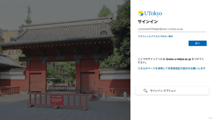

  発出: 2025年2月3日

UTokyo Account 利用者（東京大学の構成員）の皆様

情報システム本部

日頃より、情報システムを活用いただきありがとうございます。 

皆様に利用いただいているUTokyo Accountの認証基盤のバージョンアップを実施させていただくこととなりました。バージョンアップによって、より簡単に安全にご利用いただけるよう改善いたしますのでご協力いただけますようお願いいたします。 

- 作業の日時：2025年2月22日（土）午前9時から2月23日（日）正午 
- 作業の影響：UTokyo Accountでのサービスへのサインインには影響ありません（通常通り利用できます）。ただし、以下の機能が停止します。
  - アカウント利用者：パスワード変更、多要素認証利用申請ができなくなります。
  - 部局アカウント管理者：パスワード通知書の発行を含め管理機能は利用できません。
- 主な改善点：UTokyo Accountのサインイン画面を統一し利用しやすくします。今後はすべて赤門を背景としたサインイン画面になり、安田講堂を背景とした画面は現れなくなります。
  {:.center}

- 注意事項：2月23日正午以降に、サービスによってはUTokyo Accountの再サインインを求められることがあります。 

## 本件に関する問い合わせ先
情報システム本部 dics-senryaku.adm@gs.mail.u-tokyo.ac.jp  

