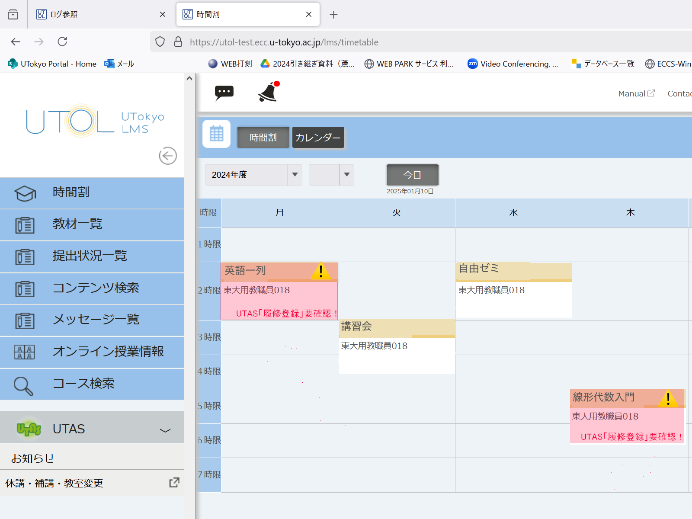
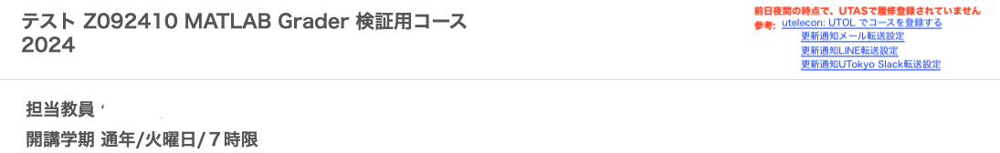

2025年2月14日 
情報基盤センター 

## 概要

UTOL(UTokyo LMS)における「履修」という用語が，教務的な（学部通則等で用いる）「履修」とは異なる用法で使用されていることによる混乱を解消するため，2025年3月25日(火)に時間割表やコーストップ画面の一部を修正します．

## 変更内容

### 時間割表

UTASで履修登録していない科目(コース)については，UTASでの履修登録を促すべく以下を表示する
『UTAS「履修登録」要確認！』と表示
コマの背景色を桃色にする
コース名の末尾に警告用の記号⚠️を付加

例えば、以下の画面の場合、
参考: 学生の時間割表画面の例

月曜2限の「英語一列」と木曜3限の「線形代数入門」は，UTAS で履修登録していない
火曜3限の「講習会」と水曜2限の「自由ゼミ」は，UTAS で履修登録済みか，ローカルのコースか(もしくは履修者ではない権限で登録済み)

これまで各コマに表示していた，当該ユーザのコース内の権限は非表示となります．

### コーストップ画面

UTAS で履修登録していない科目(コース)については，UTAS での履修登録を促すべく，画面右上付近に以下の2行を入れる．
前日夜間の時点で、UTASで履修登録されていません

参考: 連携コースで，「学生」ユーザが「履修者」として参加しているが，UTAS で履修登録をしていないコースの場合

参考: [UTOLでコースを登録する](/utol/students/course_registration/)

## 今後の予定

2025年3月25日(火)12:00-14:00のメンテナンス後に修正が適用される予定

## 補足事項

UTAS 連携でないコースについては，上記のような警告を表示しません．
