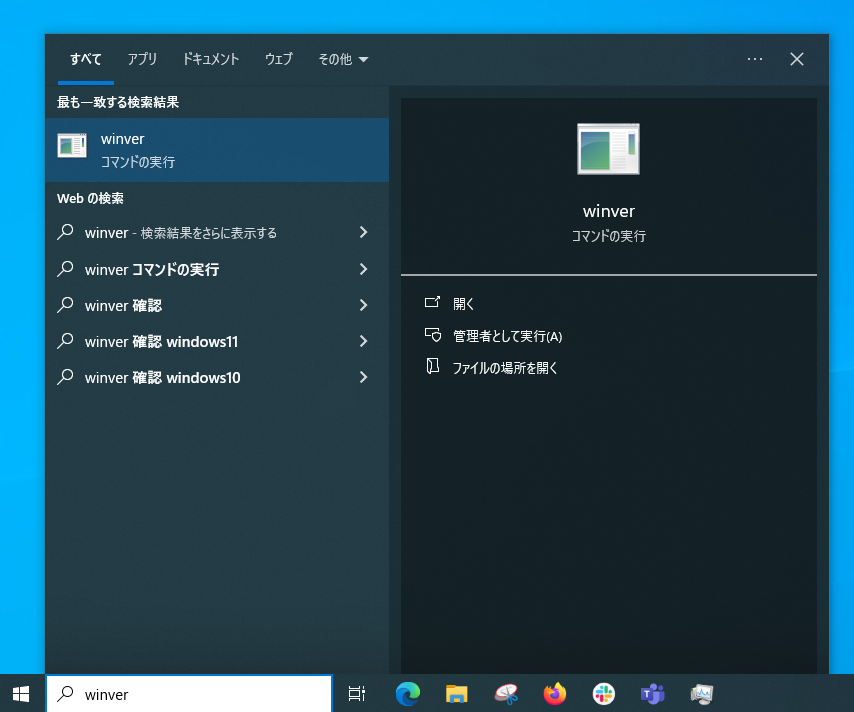
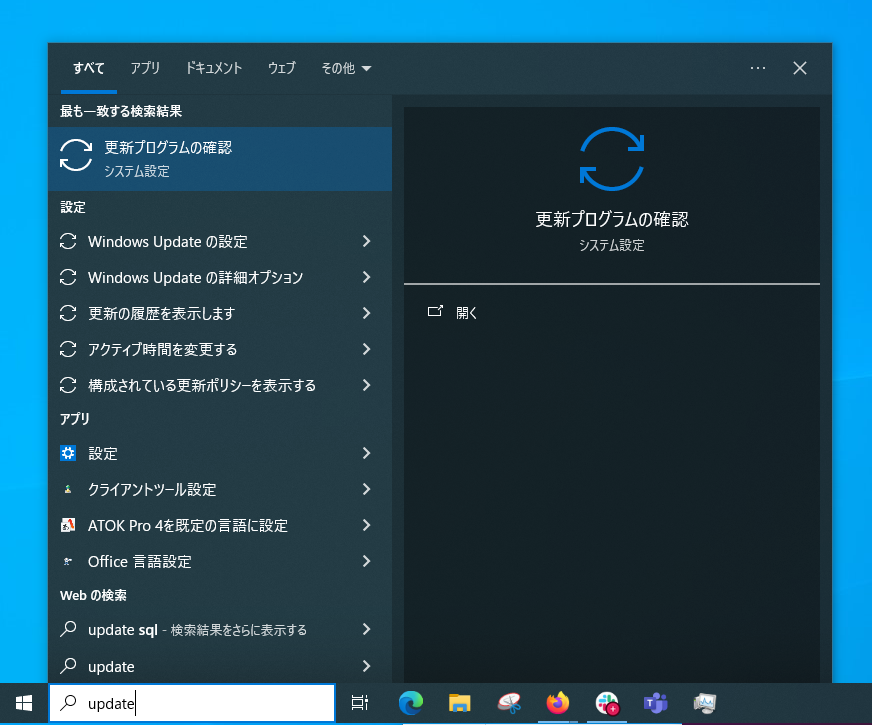

**2025年10月14日**をもって，Windows10のサポート期間が終了します（[Microsoftによる説明](https://www.microsoft.com/ja-jp/windows/end-of-support)）．サポートが終了したOSにはセキュリティ修正プログラムの提供などが行われなくなり，これを利用し続けることには重大な問題があります．WindowsがインストールされているPCの管理を担当している方は，**Windows11へのアップグレードなどの対応を必ず行ってください**．

Windows10は，原則として無償でWindows11にアップグレードできるため，特段の理由がなければアップグレードの操作だけで済むケースが大半です．ただし，**ハードウェアが要件に合致しない場合はアップグレードできない**ため，PCの買い替えなどの対応を行ってください．

## Windows10からWindows11へのアップグレードについて
{:#upgrade}

### 手順1：現在のバージョンの確認
{:#step1}

まず，利用中のOSのバージョンを確認してください．

1. ウィンドウ左下の検索窓に`winver`と入力し，コマンドを実行してください．{:.medium}{:.border}
2. 「Windowsのバージョン情報」という画面が表示されます．
   * 「Windows10」と表示された場合は，次の手順2を行ってください．
   * 「Windows11」と表示された場合は，アップグレードの必要はありません．ただし日常的にWindows Updateを適用するなどのセキュリティ確保は引き続きお願いいたします．
   * もしも「Windows8.1」などそれ以外の表示であった場合は，内容に応じて適切な対応をとってください．対応方法が不明な場合は問い合わせてください．

### 手順2：アップグレード可能かの確認とアップグレードの実行
{:#step2}

Windows10からWindows11へのアップグレードには「Windows Update」を利用します．Windows Updateでただちにアップグレード可能な場合は，そのまま実行してください．アップグレードできない場合は，「正常性 チェック アプリ」を利用して，アップグレード可能かどうかを確認してください．

1. ツールバーの検索窓に`update`などと入力し，「更新プログラムの確認」を選択してください．Windows Updateの画面が表示されるので，アップグレードのメニューが出ているか確認してください．{:.medium}{:.border}
   * 詳しくは[Microsoftの説明ページ](https://support.microsoft.com/ja-jp/windows/e0edbbfb-cfc5-4011-868b-2ce77ac7c70e)も参照し，「**Windows 11をインストールするための推奨される方法**」の手順に従ってください．
   * アップグレードのメニューがある場合には，アップグレードを実施してください．データ等はそのまま保持されます．アップグレードをして動かなくなるといった心配のあるアプリケーションがあるなどの場合は，ご相談ください．
   * アップグレードのメニューが表示されない場合は，「正常性 チェック アプリ」を利用して，アップグレードが可能であるか確認してください．
2. 正常性チェック アプリをダウンロードし，実行してください．詳しくは[Microsoftの説明ページ](https://support.microsoft.com/ja-jp/windows/9c8abd9b-03ba-4e67-81ef-36f37caa7844)を参照してください．
   * 要件を満たす場合は，Windows Updateを経由してアップグレード可能となるはずですので，再度更新プログラムの確認をお試しください．
   * 要件を満たさない場合は，残念ながらアップグレードはできません．そのようなPCは買い替えが必要です．

## すぐにPCを買い替えられない場合
{:#esu}

Windows10からWindows11へのアップグレードが実行できず買い替えが必要になった場合で，買い替えまでの間，Windows10を動作させる必要がある場合には，「拡張セキュリティ更新プログラム」（Extended Security Update：ESU）という特別なサポート契約が必要です．Windows Updateの画面から登録できるので，契約して利用してください（大学全体での契約はありません）．費用は，1年目$30，2年目$60，3年目$120で，最大3年間延長できるとのことです．詳しくは，[Microsoftの説明ページ](https://www.microsoft.com/ja-JP/windows/end-of-support)を参照してください．

## 参考：Officeアプリについて
{:#office-eol}

**2025年10月14日**をもって，Office2016・Office2019についても，サポート期間が終了します（[Microsoftによる説明](https://support.microsoft.com/ja-jp/office/818c68bc-d5e5-47e5-b52f-ddf636cf8e16)）．サポートが終了したソフトウェアにはセキュリティ修正プログラムの提供などが行われなくなり，これを利用し続けることには重大な問題があります．PCの管理を担当している方は，ご利用中のOfficeアプリ（Word・Excel・PowerPointなど）がこれに該当するか確認の上，該当する場合は**適切な対応を必ず行ってください**．

まず，[Microsoftの説明ページ](https://support.microsoft.com/ja-jp/office/8e83dd74-3b83-4528-bda6-6ff6118f8293)の手順に沿って，使用中のOfficeのバージョンを確認してください．Microsoft365 AppsやOffice LTSC 2021などの場合，対処の必要はありません．
Office2016またはOffice2019の場合，対応が必要です．例えば次のようなものが考えられます．

* **学生ひとり，または東京大学に直接雇用されている教職員ひとりが，占有して利用するPC**の場合，UTokyo Microsoft Licenseで提供しているMicrosoft365 Appsを利用してください．費用負担は不要です．
  * サポート切れとなるOfficeはアンインストールしてください．
  * Microsoft365 Apps（Officeアプリ）のインストール方法については，[UTokyo Microsoft Licenseのページ](/microsoft/install/)を確認してください．
* **複数の教職員で共用しているPC**や，**直接雇用されていない教職員が利用者に含まれる**場合，[共用PC等向けMicrosoftライセンスのページ](https://univtokyo.sharepoint.com/sites/utokyoaccount/SitePages/Microsoft-license-for-shared-PC.aspx)（要UTokyo Accountサインイン）の説明をよく読んで，適切なものを利用してください．費用負担は不要です．
  * サポート切れとなるOfficeはアンインストールしてください．

## 問い合わせ先
{:#inquiries}

[uteleconサポート窓口](/support/)から問い合わせてください．
