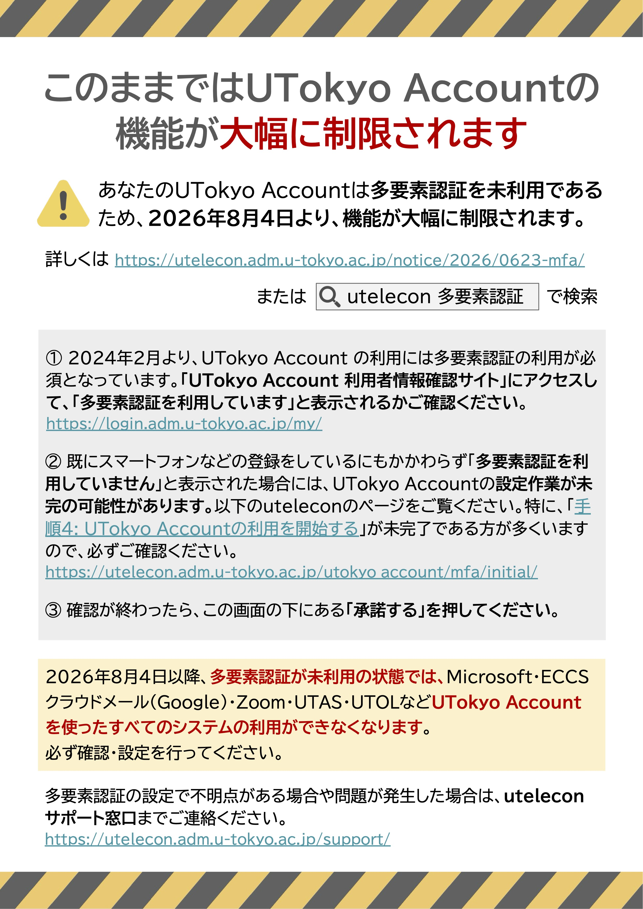

  最高情報セキュリティ責任者・情報システム本部長 田浦健次朗

日頃より東京大学の情報セキュリティ向上に協力いただき，ありがとうございます．本学のほとんどの全学情報システム利用のための共通アカウントであるUTokyo Accountでは，セキュリティ強化のために，多要素認証を導入しています．2021年9月に導入し，2024年2月からはその利用を必須とし，繰り返しアナウンスならびに未使用ユーザへの個別連絡を行ってきました．現在は教職員の94.4％，学生の97.7%が多要素認証を使用しています．しかしながら，教育・研究・業務への影響を避けるため，多要素認証導入以前から使われていた多くのサービス（UTAS, UTOL, Google, Microsoft, Zoomなど）は，多要素認証を使用していなくても利用可能としてきました． 

しかし昨今，サイバー攻撃が世界的に激しさを増しており，本学も日頃より攻撃を受けています．サイバー攻撃は総当り的に行われ，見つかった脆弱なユーザやシステムを入口として組織全体に及ぶのが通常です．わずかに残った多要素認証未使用のアカウントの存在がセキュリティホールとなり，東京大学全体に危険が及ぶのを防ぐ必要があります．そのためこのたび，多要素認証の使用を，全てのサービスの利用の要件とすることにいたしました． 

この変更により，すでに多要素認証を使用されている方（ほとんどの方）のシステム利用に影響はありません．未使用の方は，UTokyo Accountでシステムにサインインする際に多要素認証の設定が求められ，設定後にシステムを利用できるようになります． 

この変更は，全学の学事スケジュールを勘案し，**2026年8月4日**に実施します． 

実施に際しては周知に努めるとともに，多要素認証を未使用の方のUTokyo Accountでのサインイン時に警告ならびに設定方法を伝える以下のような画面を表示いたします（6月26日より実施します）． 

{:.border}

また，設定支援，トラブルシューティングについては[uteleconサポート窓口](/support/)で対応します．ご理解ご協力をお願いいたします． 

  本件連絡先：情報システム本部 dics.adm@gs.mail.u-tokyo.ac.jp

