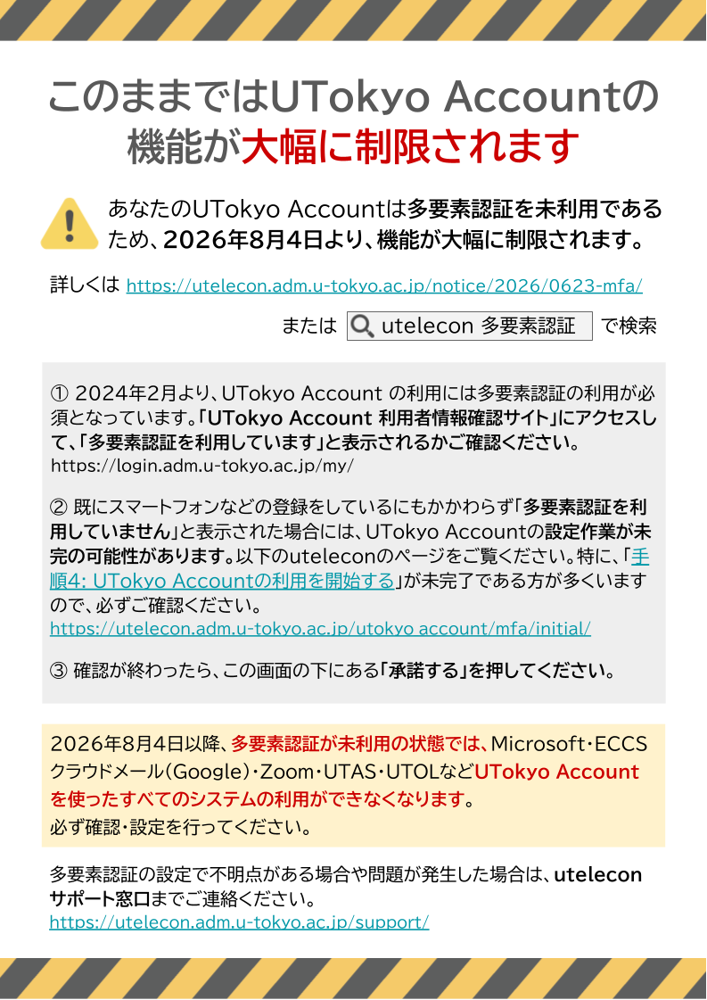

本ページでは、UTokyo Accountの利用時に以下のような画面が表示された方を対象に、必要な対応をお知らせします。

{:.small.center.thin-border}

（画面の文言やデザインは、表示された時期によって異なる場合があります。）

## このままにするとどうなるか

あなたのUTokyo Accountは多要素認証を利用していない状態であるため、**2026年8月4日から機能が大幅に制限されます**。この後の「必要な対応」の手順に従って、多要素認証の設定を行ってください。

<b class="box">
2026年8月4日以降、多要素認証を利用していない状態では、Microsoft・ECCSクラウドメール（Google）・Zoom・UTAS・UTOLなど、**UTokyo Accountを使うすべてのシステムを利用できなくなります**。
</b>

多要素認証とは何か、どのように利用すればよいかについては、「[UTokyo Accountにおける多要素認証の利用について](/utokyo_account/mfa/)」をご覧ください。

すべての皆さまに多要素認証の利用をお願いする理由については、お知らせ「[UTokyo Account 多要素認証が全サービスで必要となります](/notice/2026/0623-mfa/)」をご覧ください。

## 必要な対応

1. 「UTokyo Account 利用者情報確認サイト」にアクセスし、「多要素認証を利用しています」と表示されるか確認してください。

<b class="box center">
  [UTokyo Account 利用者情報確認サイト](https://login.adm.u-tokyo.ac.jp/my/)
</b>

2. 「多要素認証を利用していません」と表示された場合は、「[UTokyo Account多要素認証の初期設定手順](/utokyo_account/mfa/initial/)」のページを参照しながら、多要素認証の初期設定を行ってください。

<b class="box center">
  [UTokyo Account多要素認証の初期設定手順](/utokyo_account/mfa/initial/)
</b>

3. すでにスマートフォンなどを登録しているにもかかわらず、「UTokyo Account 利用者情報確認サイト」で「多要素認証を利用していません」と表示される場合は、UTokyo Accountの設定作業が最後まで完了していない可能性があります。

  - 特に、「[手順4: UTokyo Accountの利用を開始する](/utokyo_account/mfa/initial/#step4)」が未完了である方が多くいます。必ずご確認ください。

4. 多要素認証の設定が完了すると、警告画面は表示されなくなります。

## お問い合わせ

多要素認証の設定で不明点がある場合や問題が発生した場合は、[uteleconサポート窓口](/support/)までご連絡ください。