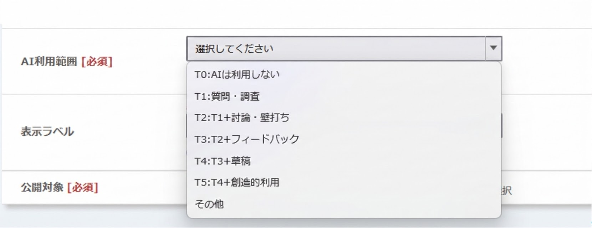
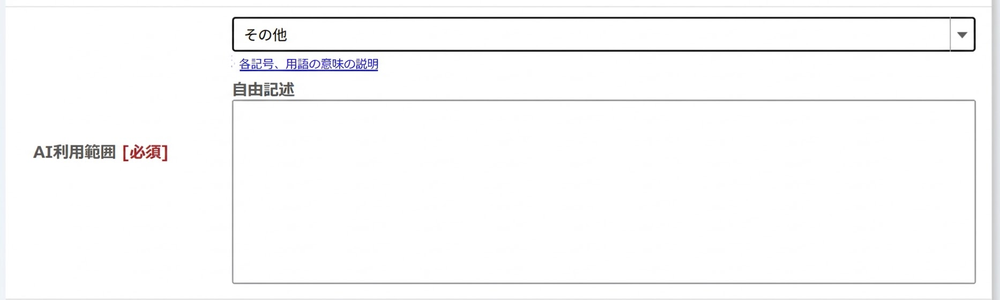
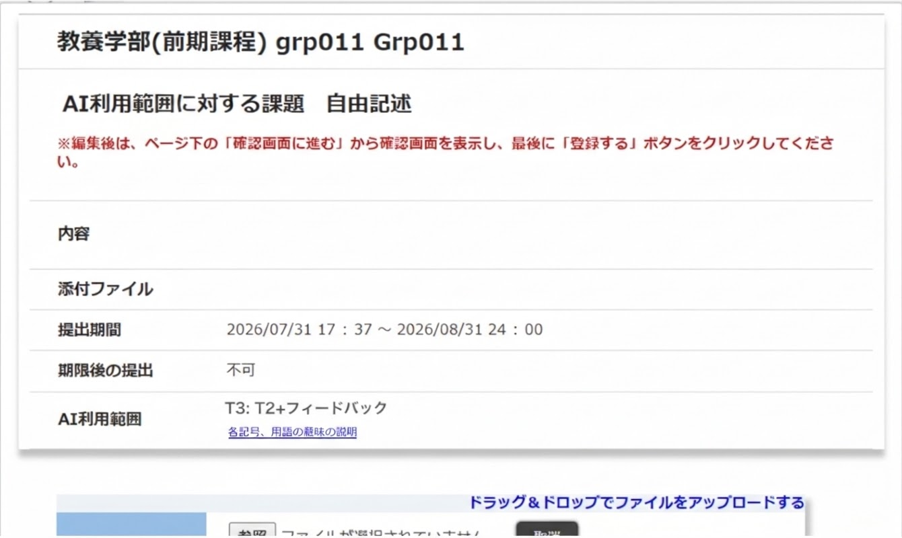

作成: 2026年9月28日 
情報基盤センター 

## 概要

本学では，生成AIの授業における利用について「\[2\] 授業や課題ごとに，言語生成系AI利用に対する教員のスタンスを明示する」とアナウンスしてきました（詳しくはuteleconのウェブページ「[AIツールの授業における利用について（ver. 1.0）](/docs/ai-tools-in-classes/)」をご覧ください）．そこで2026年度Aセメスターに向けて，UTOL(UTokyo LMS)で教員が作成する「課題」において**AI利用範囲**を設定可能とします．

なお2026年9月現在本機能は開発中です．実際の運用時のUTOLの各画面は以下に示す図とは異なる可能性があります．予めご了承願います．またUTOLへのリリース作業は9/29(火)昼休みを予定しています．

## AI利用範囲

本学ではAIの典型的な利用場面を表1の5つに分類しています．詳細については「[授業課題・取り組みにおけるAI利用範囲類型](/gen-ai/education/ai-use-policy-levels/)」をご覧ください．

<figure>
<figcaption>表1: AIの典型的な利用場面</figcaption>

| 場面 | 名称 | 補足 |
| :---- | :---- | :---- |
| S1 | 質問・調査 | 質問をする，背景知識を調査する，など |
| S2 | 議論・壁打ち | AIと議論，壁打ち，テーマ相談をする |
| S3 | フィードバック | 解答/レポートに対するフィードバックを得る |
| S4 | 草稿 | 提出物の草稿を作成させその後それを元に提出物に仕上げる |
| S5 | 創造的利用 | 学習補助利用を越えた創造的利用（AIの出力の批判的吟味，AIを実験対象にする，など） |

</figure>

そこで課題に取り組む際に，AIの利用を全く許さないか，上記の分類のどこまでを許すかを，表2に示すAI利用範囲として指示することとします．

<figure>
<figcaption>表2: AI利用範囲</figcaption>

| 範囲ラベル | 説明 | [AIAS](https://aiassessmentscale.com/) による分類名 |
| :---- | :---- | :---- |
| T0 | AI は利用しない | No AI |
| T1 | 質問・調査 | AI Planning |
| T2 | T1 \+ 議論・壁打ち | AI Planning |
| T3 | T2 \+ フィードバック | AI Collaboration |
| T4 | T3 \+ 草稿 | Full AI |
| T5 | T4 \+ 創造的利用 | AI Exploration |

</figure>

(注: TiはS1からSiまでの場面でのAIの利用を許容することを意味します．AIASは「[The AI Assessment Scale (AIAS)](https://aiassessmentscale.com)」を指しています．)

但し表2のいずれの範囲にも当てはまらない場合は，出題する教員が当該課題におけるAI利用範囲を具体的に説明してください．

## 課題機能の変更点

### 教員・TA向け

教員やTAが操作する課題編集画面を図1，2に示します．課題を作成する際には表2のいずれかの範囲を図1のドロップダウンメニューから選択して下さい．

<figure>

<figcaption>図1: 課題編集画面のAI利用範囲の選択肢</figcaption>
</figure>

出題する課題のAI利用範囲が表2のいずれの選択肢にも当てはまらない場合は「その他」を選択してください．図2のようにテキスト入力フォームが現われますので，当該課題におけるAI利用範囲を説明して下さい．

<figure>

<figcaption>図2: 課題編集画面のAI利用範囲の説明入力</figcaption>
</figure>

### 学生向け

学生が操作する課題提出画面を図3に示します．

出題された課題に教員が設定したAI利用範囲が表示されます．用語や記号の意味が分からない場合は，直下にあるリンクをクリックして詳細を説明するウェブページを参照してください．

<figure>

<figcaption>図3: 課題提出画面</figcaption>
</figure>

## 備考

* 9/29(火)昼休みのリリース作業完了後より，課題にAI利用範囲を設定可能となります．
* リリース作業以前にUTOL上に作成された課題には，AI利用範囲は設定されていません．2026年度Aセメスターに開講するコース（科目）の課題であっても，AI利用範囲が設定されていないことがあります．
* 提出期間の開始日以降，つまり学生が当該課題を参照可能になって以降は，AI利用範囲を変更できません．
* 学生が提出した成果物が，課題に設定したAI利用範囲に合致するかをUTOLが調べる訳ではありません．
