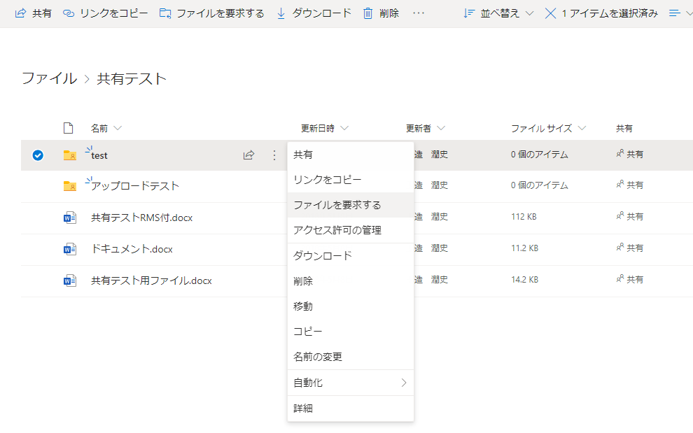
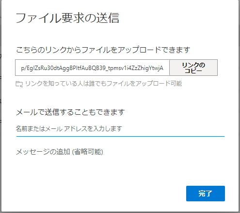

**情報システム本部**

オンライン試験などのため学外者からのファイル受け取りに利用できるサービスとして、[UTokyo  Microsoft License（Officeソフトウェア）](https://www.u-tokyo.ac.jp/adm/dics/ja/mslicense.html)に付帯しているOnedriveサービスを以下の様に変更し提供します。

1. Onedrive上のファイルの共有可能範囲を"リンクを知っているThe University of Tokyo のユーザー"（UTokyo Account保有者） から "リンクを知っているすべてのユーザー" に変更します。Onedrive 上のファイル・フォルダの共有メニューで表示されたリンクの設定で、グレーアウトしていたリンクを知っているすべてのユーザーが選択可能となります。

1. 加えて、フォルダには"ファイルを要求する"機能が表示されるようになり、学外者からのファイルを受け取ることができます。この"ファイルを要求する"によってアップロードされたファイルは、ファイルの受け取り者のみ見ることができます。

"どのようなファイルが必要ですか？"の画面で、求めるファイルの説明を入力します。

すると、ファイルを要求するの送信画面にファイルをアップロードするリンクが表示されますので、このリンクを学外者に送付してください。

今後のOnedriveの利用にあたっては、ファイルの共有範囲を考慮して適切なリンクを作成してお使いください。
リンクの有効期限は60日となっています。