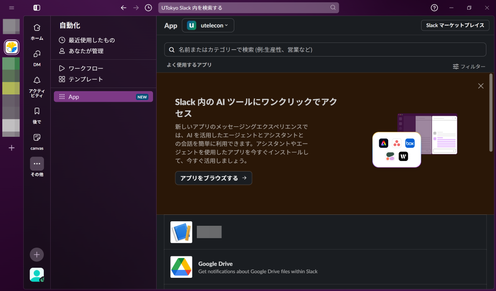
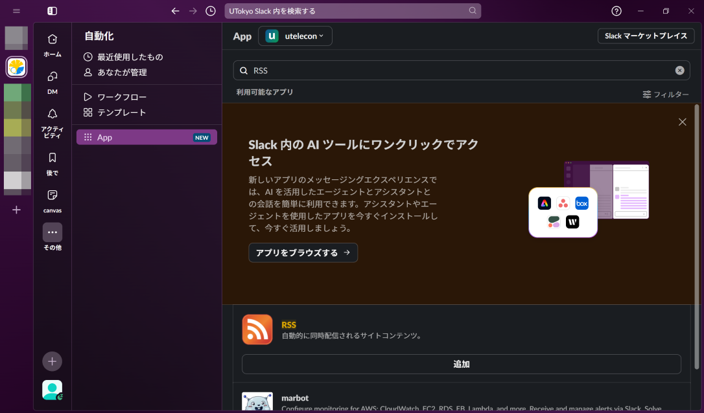
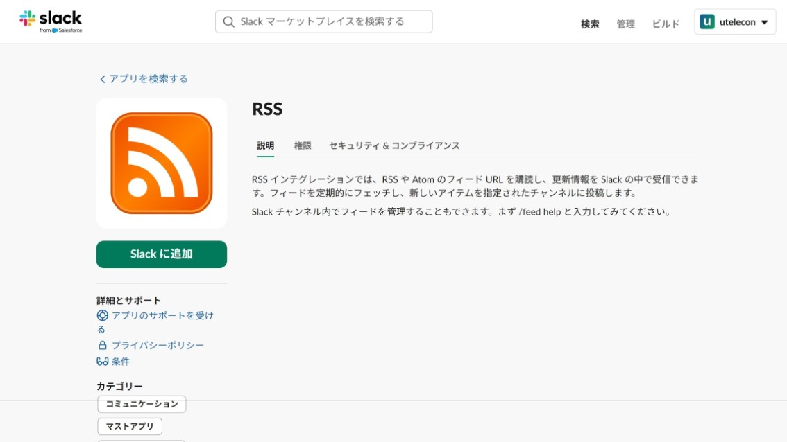
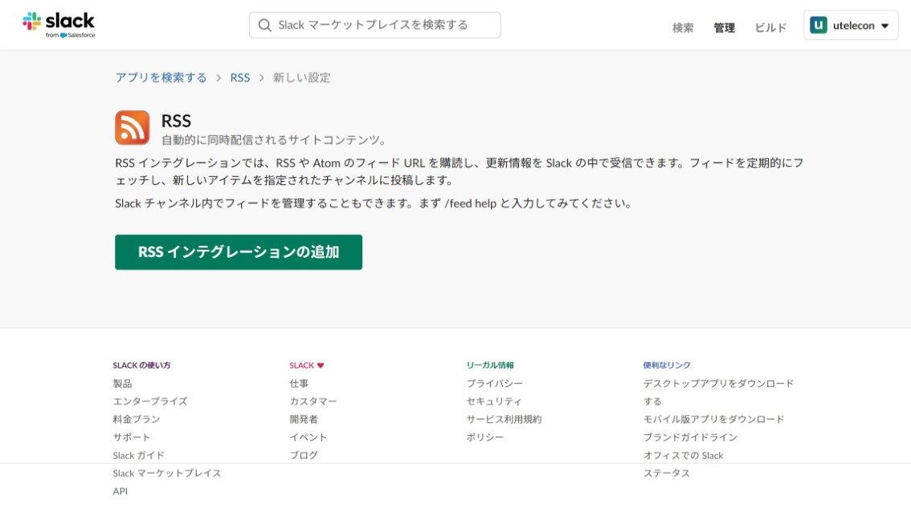
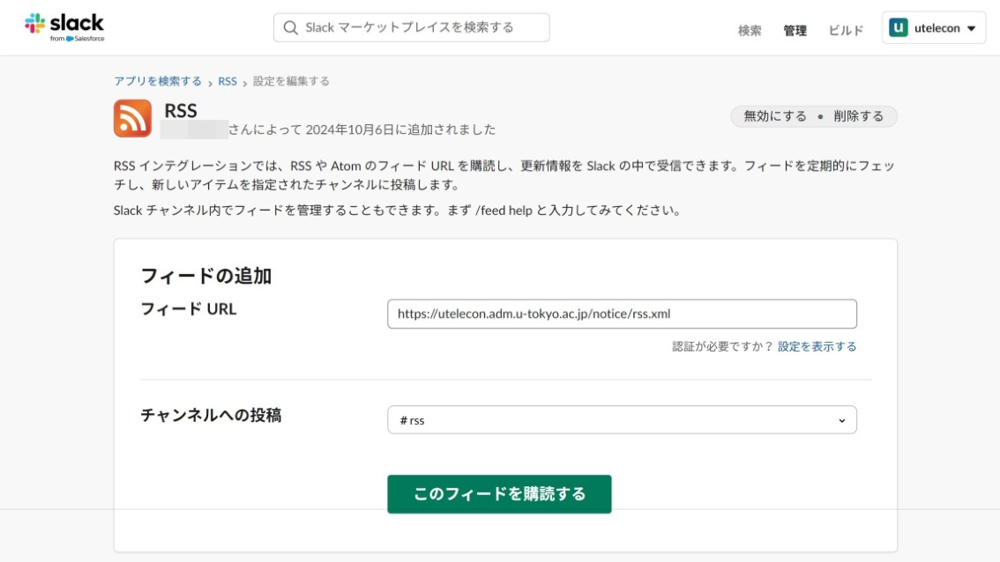
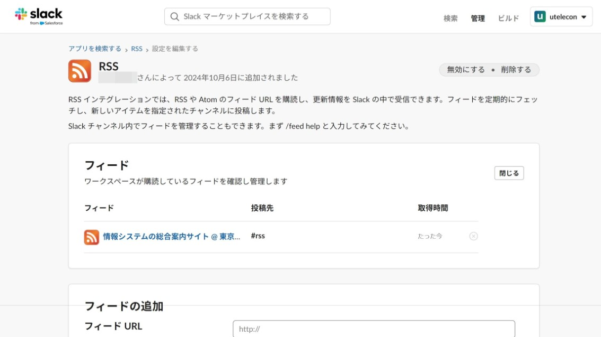

uteleconでは，RSSを用いて[お知らせ](/notice/)の更新情報を配信しています．RSSはウェブサイトの更新情報を機械的に配信する仕組みです．

uteleconのお知らせのRSSフィードのURLは以下のとおりです．

<b class="box center">
`https://utelecon.adm.u-tokyo.ac.jp/notice/rss.xml`
</b>

## RSSで配信される内容について

uteleconでは，お知らせの更新情報のみをRSSで配信しています．その他のページも随時更新しておりますが，その更新情報はRSSで配信しておりません．

## RSSの使い方

RSSを利用してウェブサイトの更新情報を受け取るには，たとえば次の方法があります．

- RSSリーダーから通知を受け取る：専用のアプリにRSSフィードのURLを設定し，更新情報をスマートフォンの通知などの形で受け取ります．
- Slackのチャンネルに自動投稿する：SlackのRSSアプリを利用すると，お使いのワークスペースのチャンネルに更新情報を自動で投稿できます．
  - UTokyo Slackでの利用は，以下の[UTokyo Slackでuteleconのお知らせを受け取る方法](#utokyo_slack)を参照してください．
- その他：RSSに対応したツールやアプリであれば，更新情報を受け取ることが可能です．

### UTokyo Slackでuteleconのお知らせを受け取る方法
{:#utokyo_slack}

1. UTokyo Slackを開いてください．左側の「その他」→「App」の順に選択してください．
   
2. RSSアプリを追加するワークスペースを画面上部のドロップダウンリストで選択してください．
3. 検索欄に「RSS」と入力して表示される「RSS」アプリの「追加」を選択してください．
   
4. ブラウザが起動し，アプリのページが表示されます．ワークスペース名が意図したものであることを確認して「Slackに追加」を押してください．
   {:.border}
5. 遷移したページで「RSSインテグレーションを追加」を押してください．
   {:.border}
6. フィードの追加画面が表示されます．上記に示したRSSフィードのURLとお知らせを投稿するチャンネルを設定して「このフィードを購読する」を押してください．
   {:.border}
7. 以下の画面になれば設定が完了しています．
   {:.border}
