## はじめに
2020年度Sセメスターの授業は，新型コロナウイルスの感染拡⼤防止のため，そのほぼ全てがオンラインでの開講となりました．このアンケートは，2020年9月3日から9月16日にかけて，本学で授業または研究を行う教員の皆さまを対象に実施されたもので，合計592名から，Sセメスターのオンライン教育に対する評価や感想などをご回答いただきました．今回の結果概要では，オンライン授業に関して数値化できる回答の集計結果を中心にご紹介いたします．

## 調査方法について
- アンケート実施期間：2020年9月3日～9月16日
- アンケートの実施形式：オンライン（Microsoft Forms）上での実施
- アンケートの対象者：教員

## 結果の表示について  
   
- 対象者のうち合計592名から得られた回答を集計および分析したものです．  
- 数値化できる回答の集計結果を中心とし，自由記述の回答については一部抜粋してご紹介します．  
- グラフ中の数字は回答者数を表しています．  
- それぞれのグラフの説明⽂に記されているパーセンテージは，⼩数点以下を四捨五⼊しているため，合計が100%にならない場合があります．また，複数回答可の問題においても，合計が100%にならない場合があります．  
   
## 回答者の属性
### 職位
本学の全職員3,817名のうち414名（回答率10.8%），全特任教員927名のうち78名（回答率8.4%）からご回答をいただきました．また，83名の非常勤の先生方からもご回答いただきました．   

### 所属
所属として最も多いのは「研究科・学部」で389名（66%）でした．次いで多いのは「附置研究所・学内研究施設・センターなど」の所属181名（31％）です．  

## 授業環境に関する質問

### 場所：オンライン授業や研究などのために，主にどこからインターネットに接続していましたか？
インターネット接続は，71%が自宅から，25%が大学から，1.9%がその両方からでした．職場（研究所や大学外など），その他からの接続は合わせて2.3%ほどでした．  

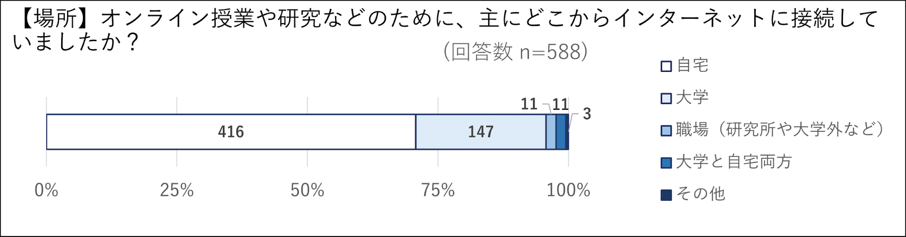

### 使用した機器：オンライン授業や研究などのために，どの機器を使ってインターネットに接続していましたか？（複数選択可）
使用機器に関しては，86%がノートPCを使用していました．続いて，28%がデスクトップPCを使用していました．タブレット端末は15%，スマートフォンは6%でした．  
上記使用機器の合計が100%を越えていることから，複数の端末を組み合わせて活用する先生も多く見られました．複数デバイスの活用法には，例えば，PCを使って授業を配信する傍ら，受講生からの質問をスマートフォンによるチャットで受け付ける方法や，学生に配信されている動画の内容を別端末から確認する方法，電子ペンでタブレットに板書して画面共有する方法などがあります．   

### 回線環境：オンライン授業や研究などのために，どのインターネット環境を使っていますか？
78%が自宅の有線契約あるいはキャンパスのネットワークを使用していました．Wi-Fiルーターまたは携帯などの無線回線の使用は，合わせて19%でした．また，大学から貸し出していたモバイルWi-Fiルーターにも一定数の需要があり，8%の先生が使用していました．  

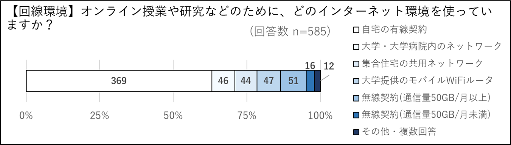

## 授業方法の実態に関する質問
### 担当講義の有無：2020年度Sセメスターに授業を1つ以上「担当」されていましたか？（新型コロナの影響で開講しなかったものを含む）
お答えいただいた先生の70%が，1科目以上の授業を担当されていました．ただし新型コロナウイルス感染拡大の影響により，実際には開講されなかったものも回答に含まれています．   

### 授業形式：担当した授業の科⽬数を，実施形式ごとに教えてください．（本学以外でも授業を担当している先⽣は，本学で担当した授業のみお答えください）
オンライン授業には，いくつかの代表的な形式があります．本学で1つ以上の授業を担当していた先生に，どの形式で何科目を担当したかをお答えいただきました．約380名の先生にご回答いただきました．  
担当した授業の形式について伺いました．回答された先生の87%が講義中心のライブ授業を1科目以上実施されていました．続いて，グループワークや議論中心の授業を1科目以上担当された先生は回答者全体の52%でした．事前に録画した講義動画を配信するオンデマンド形式の授業，ほぼ資料配信と課題提示のみの授業，その他（ライブとオンデマンドの混成など）の形式の授業を1科目以上担当された先生は，いずれも6%以下にとどまりました．また，2.6%の先生が，このSセメスターに担当した授業を開講しなかったと回答しました．

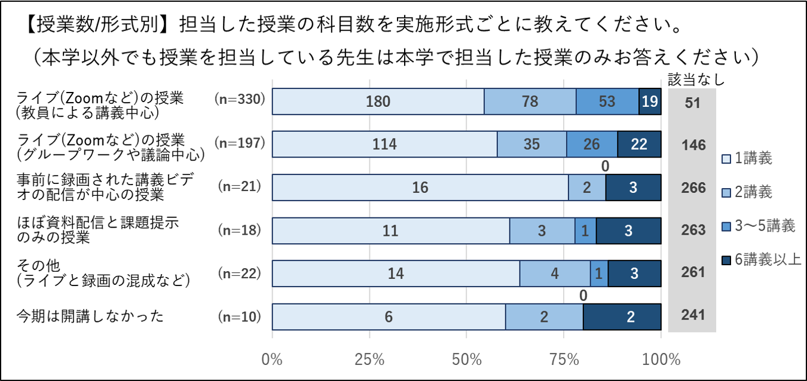

またこのデータを用い，それぞれの形式について行われた授業数の推定を行いました．  
結果を下記に示します．Zoomなどを用いたライブ形式の授業は88%を占めており，53%の授業は教員による講義中心の形式で，35%の授業は学生のグループワークや議論を中心とした形式で行われていました．一方，事前に録画された講義ビデオの配信が中心の授業は3%，ほぼ資料配信と課題提示のみの授業は3%，ライブと録画の混成等の授業は4%でした．  
※各回答者の各形式における授業の実施数を足していくことで，形式別の授業数を計算することができます．なおここでは，アンケートである形式を「6講義以上」と回答をされた場合，その形式の授業を6講義担当されたものと仮定して計算しました．また，オムニバス講義等では，同一の授業に対して複数の教員が回答している可能性があるため，重複して計上されている可能性があります．

### 形式別の⾃⼰評価：オンライン授業はうまくいきましたか．実施形式ごとの⾃⼰評価を教えてください．
各形式にて授業を実施した感触（自己評価）をたずねました．ライブで行った授業については満足度が高い一方，それ以外についてはやや低くなる傾向があります．  

#### ライブ形式の授業（教員による講義中心）：
実施した先生のうち78%が「大変うまくいった」「うまくいった」と回答しています．  
学生アンケートの同じ項目においても，69%の学生が「大変良かった」「良かった」と評価しており，双方の満足度が比較的高い形式であることがうかがえます．
#### ライブ形式の授業（グループワークや議論中心）：
実施した先生のうち73%の先生が「大変うまくいった」「うまくいった」と回答，4%が「うまくいかなかった」「全くうまくいかなかった」と回答しています．  
学生アンケートでは，同じ項目について「大変良かった」「良かった」が57%，「良くなかった」「全く良くなかった」が21%という結果になっており，教員側の感触との間にやや差が見られます．
#### 事前に録画された講義ビデオを中心とした授業：
実施した先生は大変少数でしたが，55%の先生が「大変うまくいった」「うまくいった」と回答しました．  
学生アンケートでは，54%が「⼤変良かった」「良かった」と回答．同じ講義中心の授業のみで比較すると，オンデマンドよりもライブの方が，教員と学生，双方の満足感が高い結果となりました．  
#### 資料配信と課題提示のみの授業：
実施した先生は大変少数でした．50%が「うまくいった」と回答しました．「大変うまくいった」という回答はありませんでした．  
#### その他（ライブと録画の混成など）の授業：
実施した先生は大変少数でしたが，61%の先生が「大変良かった」「良かった」と回答しました．

### 授業要素の実施の有無：授業⽅法について，下記項⽬の，従来（昨年度以前）および今回（今年度）の実施の有無について教えてください．
昨年度までの従来の授業と，今回のオンライン授業における，各授業要素「出席管理」「課題」「試験」「授業資料の電子的な配布・共有」の実施状況の比較をご回答いただきました．たとえば「従来実施していなくて今回実施した」場合には「従来 無，今回 有」となります．  
出席管理，課題，試験については，従来から変更していない授業が多数で「従来 無，今回 無」「従来 有，今回 有」が合わせて83%以上でした．しかし，もう少し詳しくみると，課題については「無→有」という変化が，試験については「有→無」という変化が他方よりも大きくなっています．出席管理については，「無→有」「有→無」両方の変化がみられました．  
授業資料の電子的な配布・共有は「無→有」の割合が大きく，オンライン授業によって資料のデジタル化が進んだことがうかがえます．  

### 授業準備にかかった時間：担当した全ての授業について，資料作成・（オンデマンドの）講義録画・講義録画の編集やアップロードなど，今年度オンライン授業に対応するために発⽣した，授業時間外の作業時間の総時間数を教えてください（単位：時間，100時間であれば100と⼊⼒）．
オンライン授業の実施によって，従来よりもかなり授業準備に時間を要したことがうかがえる結果となりました．  
中央値は40時間，平均値は77時間でした．教員間で大きな差があり，結果は広い分布となりました
（1授業あたりではなく担当した全ての授業における準備の総時間数である点にご留意ください）．   

### 出席の取り⽅：出席をどのようにとりましたか．
何らかの形で出席をとった先生は，全体の61%でした．出席をとった回答者のうち，36%は「Zoomなどのウェブ会議システムにおいて時間内に点呼をとった」，22%は「ITC-LMSの出席管理機能を利用した」，15%が「ウェブ会議システムのログや投票で確認した」，8%が「Google Formsなどで時間内に簡単なクイズやアンケートなどで確認した」と回答しました．また18%が「その他」と回答しています．「その他」の回答として多かったのは，「TAまたは教員が授業中に名前一覧を確認」（5%），「授業後に簡単な課題を提出してもらって出席にかえる」（5%），「ウェブ会議システムのチャットに記名してもらった」（4%）という回答でした．  
出席を取らなかった先生は全体の38%で，そのうち49%が「クラス内の活動で自然に把握できるため出席をとらなかった」，51%が「出席はとらなかった（気にしていない）」とのことでした．   

### 学⽣側のカメラの取り扱い：カメラについて学⽣にはどのようなことを求めましたか．
ウェブ会議システムを使用した授業において，学生側のカメラオンを求めたかどうかを質問しました．「全員にカメラオンを求めた」は4%，「ネット環境の悪い者などを除き原則的にカメラオンを求めた」は5%でした．部分的なカメラオンを求める授業もあり，20%が「発言時や指名時にカメラオンを求めた」，36%が「任意とした」と回答しました．一方で，全体の36%が「全員カメラオフとした」と回答しました．  
通信量の軽減や配信の安定化のため，独自にカメラオフを取り決めている部局もあったようです．学生向けアンケートでは，オンライン授業においてやめてほしいと感じた点をたずねる質問に，全回答中16%が，カメラオンを求められたことと回答していました．  

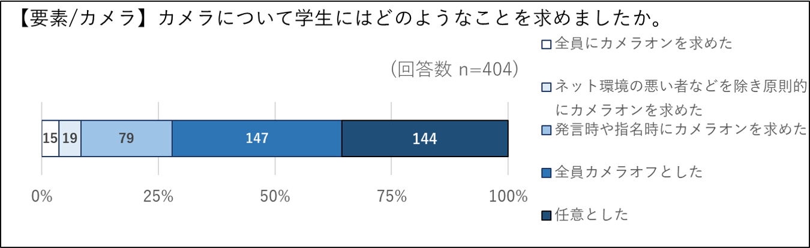

### 録画の取り扱い：講義録画はどのように提供しましたか？　（本学では，ネットワークトラブルなどで講義を受講できなかった学⽣のために講義を録画していただくことを原則にしておりました）
録画した授業動画の提供について，どのような形をとったかご回答いただきました．46%が動画を提供しており，「受講生なら自由に見られるように提供した」，「明示的に連絡があった場合のみ対応して提供した」は，それぞれ23%でした．43%が録画の提供を行っていませんでした．「その他（要望がなかった，補講を行ったなど含む）」は10%でした．  
学生アンケートにおける，オンライン授業のメリットをたずねる質問に対し，38%の学生が，授業の録画の配信によって予習や復習がしやすくなったと回答しています．また同アンケートの，オンライン授業においてやめてほしいと感じた点についての質問では，授業の録画を提供されなかった点が最も多く挙げられており，全回答中の48%でした．  

### 課題の取り扱い：1授業科⽬あたり，どの程度の課題を設けましたか？　複数授業を担当している場合は，最も課題が多い授業科目について回答してください．
1授業科目あたりどの程度の課題を設けたかをたずねました．「毎週〜隔週で実施する小さいもの」を行った回数は，1回の実施から11回以上まで幅広く分布があり，全く行っていない先生は37%でした．「中間や期末で実施する大きいもの」は，44%が1回，14%が2回，7％が3〜5回で，全く行っていない先生は34%でした．   

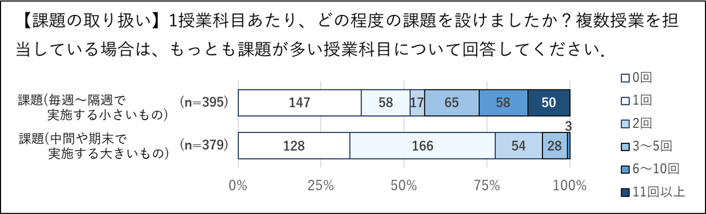

### 学⽣に期待していた学習時間：前問の授業に対して，平均的な学⽣が授業時間外に課題にかけたと思われる総時間をおおよそで良いので教えてください．（例：10時間30分であれば「10.5」と⼊⼒）
学生が，授業時間外にどの程度の学習時間をとると期待したか，お答えいただきました．回答には幅広い分布が見られ，平均は11時間，中央値は6時間でした．  
学生アンケートでは，43%と比較的多くの学生が，オンライン授業において課題の量が多いと感じていることが分かっています．  

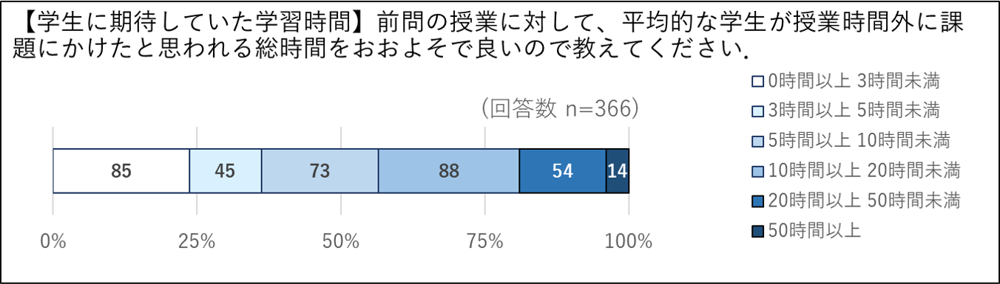

### メリット：オンライン授業が対⾯授業より良いと感じた点にチェックをしてください（複数選択可）．
対面授業と比較した際のオンライン授業のメリットを複数選択可能な選択肢から挙げていただきました．最も多い回答は「通勤時間が不要」で，80%の先生がこの項目をメリットとして挙げました．次いで59%が「キャンパス間の移動が不要」，52%が「講義資料が電子化され，印刷・配布の手間がかからない」，41%が「（教室の黒板と比べて）PCの画面のほうが資料などを見せやすい」でした．また39%が「（オンライン授業の方が）質問がしやすい・受けやすい」と回答しています．  
学生アンケートでも，類似の項目でメリットについてたずねています．教員の回答結果と15ポイント以上の差が見られた点を紹介します．教員の方が多くメリットと挙げていたのは「キャンパス間の移動が不要」（教員の方が18ポイント高い）という点でした．学生の方が多くメリットと挙げていたのは，「講義の録画が見られて／見せることで復習や確認がしやすい／してもらいやすい」，「通勤・通学時間が不要」（両方の回答とも学生の方が16ポイント高い）という点でした．   

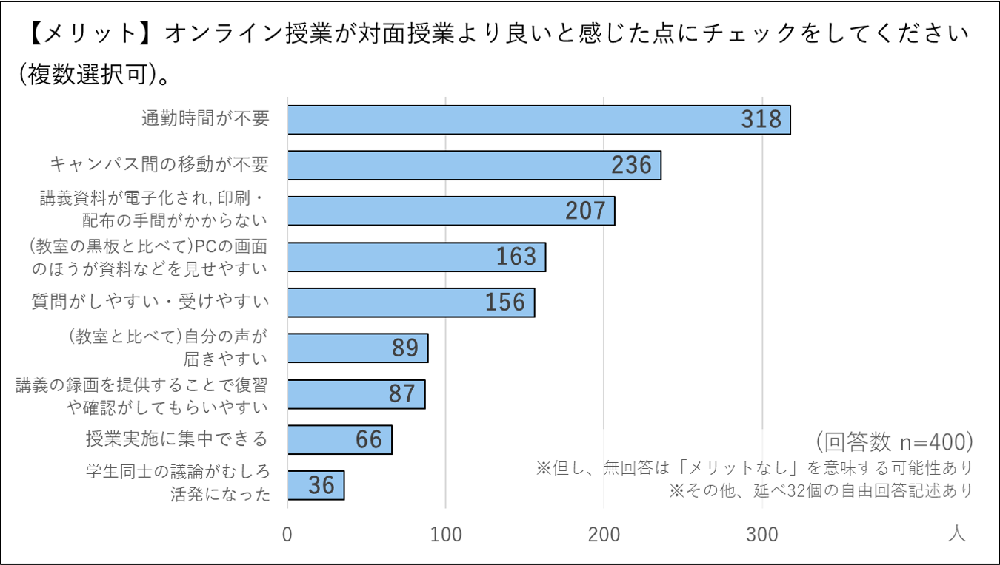

### デメリット：オンライン授業を実施してみて感じたデメリットをチェックしてください．（複数選択可）
前問とは反対に，オンライン授業のデメリットを挙げていただきました．最も多かったのは「学生の反応を把握しにくい」で，全体の87%が挙げました．続いて，52%が「学生同士のコミュニケーションがなかった（少なくなる）」，44%が「授業準備が大変だった」，29%が「目の疲労や肩こりなど，身体的に疲れた」，29%が「質問を投げかけたり，質問を受けにくかった」という結果となりました．「（自分がWeb会議，機器に慣れていないので）授業が滞ったり指示が分かりづらかったりした」は14%，「（学生がPCやWeb会議利用に慣れていないので）授業実施にあたり障壁になった」は6%，「課題を多く出す傾向にあった」は8%，「授業に集中できなかった」は3%，「ファイル形式や再生ソフトの問題で録画の視聴に問題があった」は3%と，少数でした．  
学生アンケートでも，類似の項目でデメリットについてたずねています．教員アンケートの回答結果と30ポイント以上の差が見られたものをまとめます．「授業に集中できなかった」という回答は，教員よりも学生の方が42ポイント高い結果でした．また，「課題を多く出しがちだった」を挙げた教員は全体の8%でしたが，学生の42%は「課題が多く出る傾向にあった」と回答しており，34ポイントの差が出ています．そして，通信状況に関しても差があり，「通信環境などのせいで映像や音声が途切れると言われることがあった」と答えた学生は，教員よりも33ポイント多くいました．   

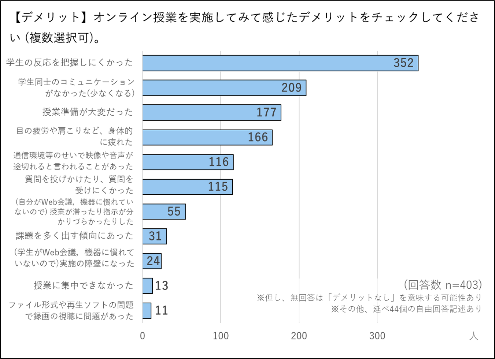

## オンライン授業で⽤いたツールに関する質問
### ツール：実施したオンライン授業で使⽤したツールは何でしたか？（複数選択可）
授業でどのオンラインツールを利用したか，たずねました．最も多いのはZoomで，98%が使用していました．課題提出や授業資料の配布に使われる学内システムITC-LMSの利⽤率は42%，ECCSアカウントにひも付くGoogle系のサービスが21%でした．   

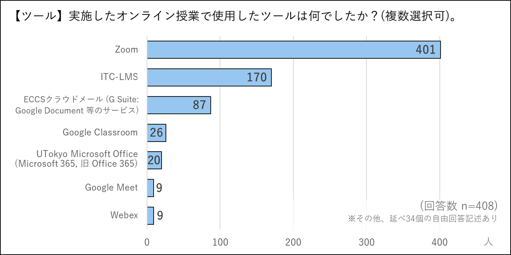

### ツールの使⽤法の調査⼿段：上記ツールの使い⽅を習得するとき，またはわからないときに利⽤した⼿段はどれですか？（複数回答可）
オンライン授業やその準備に必要なツールの使用に際し，使用方法の習得時，または使用方法がわからないときに，どのように調べたかをたずねました．最も多かったのは「Googleなど検索エンジンで調べた」で，70%でした．続いて「オンライン授業ポータル (`https://utelecon.github.io/`) を⾒た」が56%，「全学で開催された説明会・講座・オンライン授業情報交換会に参加した」が40%，「同僚に聞いた」が35%，「所属の学部，研究科の説明会などに参加した」が22%でした．  
本学で提供したサイトの記事の閲覧，開催した説明会などは，比較的よく活用されていたようです．一方，オンライン授業ポータルのQAフォーラム，問い合わせメール (utelecon-inquiries) ，チャットなどのサービスの利用率は少数でした．   

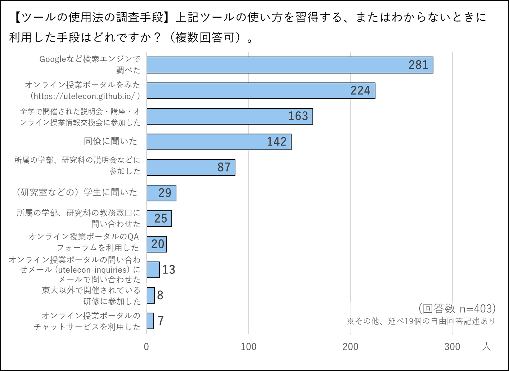

### ツール習得の難易度：オンライン授業を実施するために使ったツールを習得するのにどのくらい苦労をしましたか？（10を「最も難しい」，0を「最も容易」とする11段階評価）
オンライン授業に使用するツールの習得がどの程度困難に感じられたか，数値化しました．数字が⼤きいほど困難に感じたことを⽰しています．平均は3.7でした．  
学生アンケートの同じ項目「オンライン授業を受けるために使ったツールを習得するのにどのくらい苦労をしましたか？」においては，回答結果は2.6以下で，学生のほうが相対的に困難を感じた人は少なくなっています．その一方，強い困難を感じている教員や学生が一定数いることから，情報提供などの支援は引き続き必要であると考えられます．   

### オンライン授業に対する評価：この3か⽉間のオンライン授業に対する，あなたの総合的な評価を教えてください．（10を最⾼，0を最低とする11段階評価）
オンライン授業に対して，11段階評価での平均点を求めました．数字が⼤きいほど満⾜度が⾼いことを⽰しています．全体での平均は6.6となりました．  
学生アンケートの同じ項目の平均は6.5となり，回答の傾向が類似していました．   

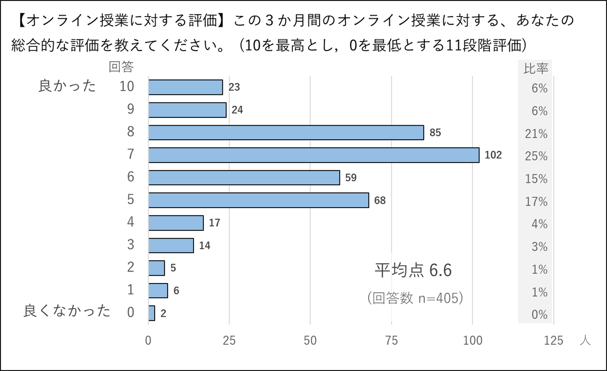

## 今後のオンライン授業に対する印象の質問
### オンライン授業への期待：今後，オンライン授業を授業形態の1つとして取り⼊れていったほうが良いと思いますか？
今後，オンライン授業を授業形式の1つとして取り入れていくべきかどうかをたずねました．全体の86％という多数が，「⼤変そう思う」「そう思う」と回答しました．「全くそう思わない」は全体の2%でした．   

### 形式別／今後のオンライン授業への印象：以下の項⽬について，どの程度オンライン授業にした⽅がよいと思いますか？
授業の形式ごとに，オンライン化についてうかがいました．「教員による講義中心の授業（大人数）」については，55%が「確実にオンライン授業にしたほうがよい」「オンライン授業にした方がよい」と支持しました．一方，「大人数の講義中心の授業」以外の「教員による講義中心の授業（少⼈数）」は25%，「学生のグループワークや議論中心の授業」は6%，「演習」は5%となり，オンライン化への支持が低くなりました．特に演習は「絶対にオンライン授業にしない方がよい」が31%となりました．    

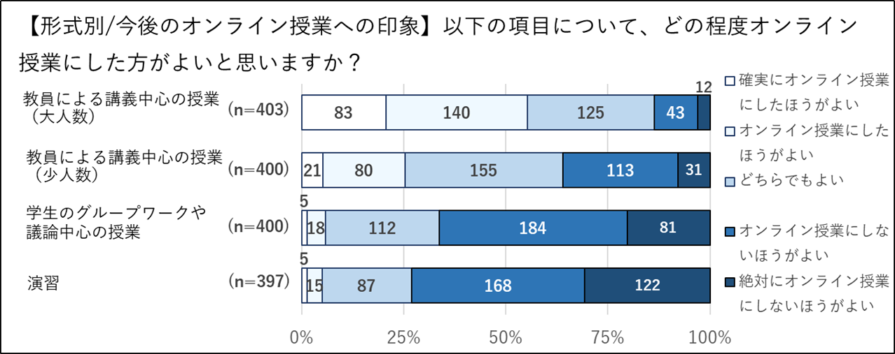

## クラスサポーター制度
### 利⽤の有無：クラスサポーター制度を利⽤しましたか．利⽤した⽅は，制度は有⽤でしたか？
クラスサポーター制度の利用状況についてたずねました．  
クラスサポーターとは，オンライン授業のスムーズな進行を支援する学生サポーターのことで，主にTAの付いていないオンライン授業について，事前の機材テスト，授業中のウェブ会議システムトラブルへの対応，ライブ授業中に学生から届く質問のピックアップなどを補佐します．（詳細はuteleconの「[クラスサポーター制度のご案内](/supporters/class_a.html)」をご参照ください）  
回答者のうち21%が，サポーター制度を利用していました．一方，利用された先生86名のうち80%が「大変有用であった」「有用であった」と回答しました．   

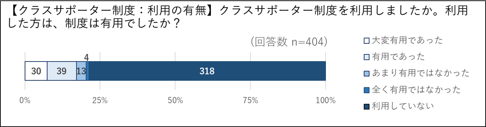

### 作業の種類：クラスサポーターにどのような仕事をお願いしましたか？（複数選択可能）
前問でクラスサポーターを利用したと回答した先生に，実際にどのような業務を依頼したかをご回答いただきました．67%が「授業における，教員の画面共有ができていない場合などのモニタリング」，45%が「授業における，学生をミュートにする，などの補助」，28%が「授業開始前のテレビ会議システムの使い方の練習」を選択しました．その他自由記述には，トラブル対応，録画の配布，出席確認のサポートなどが挙げられました．  
uteleconの「グッドプラクティスの共有」では，[クラスサポーターの活用例](/events/luncheon/2020-12-15/)がいくつか紹介されているので，是非ご参照ください．     

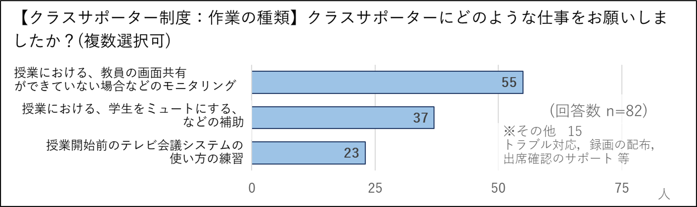

### 利⽤しなかった理由：クラスサポーター制度を利⽤しなかった理由を教えてください．（複数選択可能）
クラスサポーターを利用しなかった先生に理由をたずねたところ，56%が「必要性を感じなかった」，39%が「制度を知らなかった」と回答しました．その他自由記述には，「TA・スタッフによる支援があった」「授業内で募集したが集まらなかった」という回答がありました．   

