## はじめに
2020年度Sセメスターの授業は，新型コロナウイルスの感染拡⼤防止のため，そのほぼ全てがオンラインでの開講となりました．このアンケートは，2020年7月22日から8月26日にかけて，本学の学部生，大学院生，聴講生，研究生，研究員（ポスドクなど）を対象に実施されたもので，Sセメスターのオンライン教育に対する評価や感想などの回答を，合計5,696名から得ることができました．今回の結果概要では，オンライン授業に関して数値化できる回答の集計結果を中心にご紹介いたします．  
  
## 調査⽅法について  
- アンケート実施期間：2020年7月22日～2020年8月26日  
- アンケートの実施形式：オンライン（Microsoft Forms）上での実施  
- アンケートの対象者：東京⼤学の学⽣（学部⽣，⼤学院⽣），聴講⽣，研究生，研究員（ポスドクなど） 
  
## 結果の表示について  
   
- 対象者のうち合計5,696名から得られた回答を，集計および分析したものです．  
- 数値化できる回答の集計結果を中心とし，自由記述の回答については一部抜粋してご紹介します．  
- 分析を進めていったところ，学年によって回答結果の傾向が大きく異なる項目が多数存在したため，必要に応じ「学部1年生」「学部2年生」「学部3年生以上」「大学院生」「その他」に分けて示しました．  
- グラフ中の数字は回答者数を表しています．  
- それぞれのグラフの説明⽂に記されているパーセンテージは，⼩数点以下を四捨五⼊しているため，合計が100%にならない場合があります．また，複数回答可の問題においても，合計が100%にならない場合があります．  
   
## 分析結果の要点  

- 全体として，Sセメスターのオンライン授業全体への評価は，0〜10の11段階評価において平均6.5でした．また「今後，オンライン授業を授業形態の1つとして取り⼊れてほしいですか？」という問いに対し，80%が肯定的な回答をしました．ここで，学部1年生のオンライン授業全体への評価は平均5.1，「今後取り入れてほしいか」についての肯定的な回答は62%にとどまりました．入学後にキャンパスに登校できない状況が続いたことが強く影響していると思われます．Aセメスターでは対面授業が一部導入され，結果に変化があると予想されます．
- 授業の形式としては，大人数向けの講義を中心とした同期的な授業の満足度が高い結果となりました．一方，それ以外の形式に対して何らかの苦労を感じている学生が多いことが分かりました．オンライン授業には，同期／非同期，一方向／双方向，これらの混合など，多様な形式があります．同期型以外の形式をとる場合は，ノウハウの蓄積と共有などが必要となりそうです．
- 技術面において，オンライン教育ツールやソフトウェアの使用に困難を感じなかったという回答が多数となりました．
  
## 回答者の属性  
### 学年・身分   
アンケート実施期間内に回答した5,696名のうち，50%が学部生，28%が修⼠課程，19%が博⼠課程でした．その他，研究⽣，ポスドク研究員等からも回答を得ました．本学学⽣の全数は，学部が14,062名，修⼠課程学⽣が7,246名，博⼠課程が5,787名なので（2020年5月現在），各学年・身分の回答率は19～22%程度ということになります．  

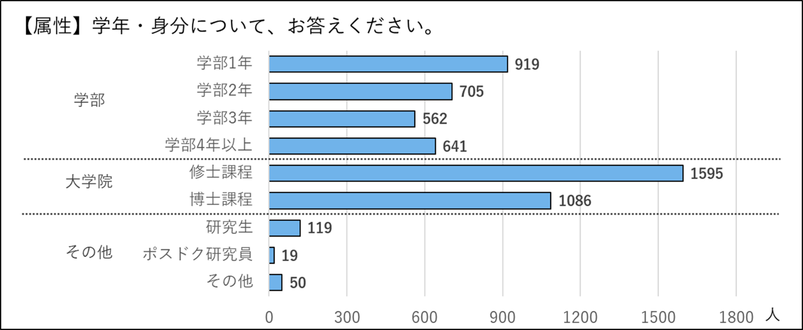

### 所属  
回答者の所属は次の通りです．  

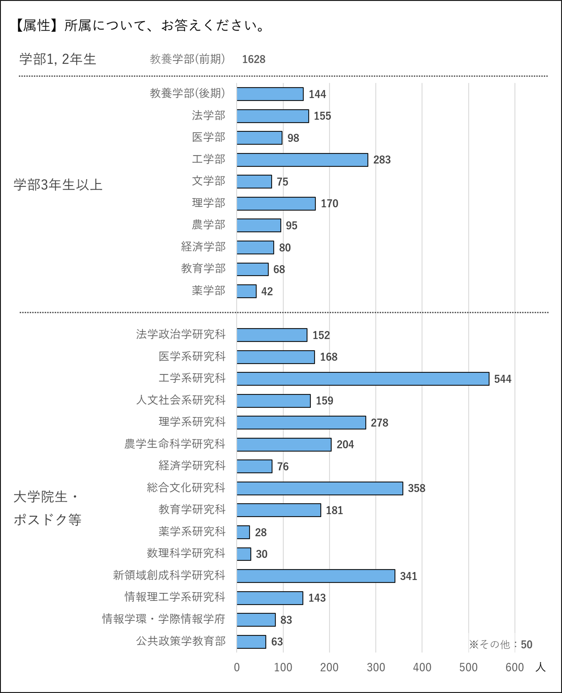

## 授業の履修環境に関する質問  
### 場所：オンライン授業や研究などのために，主にどこからインターネットに接続していましたか？  
全体のうち，42%が⼤学に近い実家，13%が⼤学から遠い実家，34%が⼀⼈暮らしの自宅から接続していました．寮などの下宿先は7%と比較的少数でした．  
  
特に学部1年⽣は，大学から遠い場所にある実家からの接続が29%と，他の学年に比べて高く，大学入学時に⼀⼈暮らしを開始できなかった学生が多くいることがうかがえました．  
  
「その他」の自由記述欄には，学内，勤務先，カフェなどに加え，海外からという回答が寄せられ，学生の受講環境は多様であることがうかがえました．  

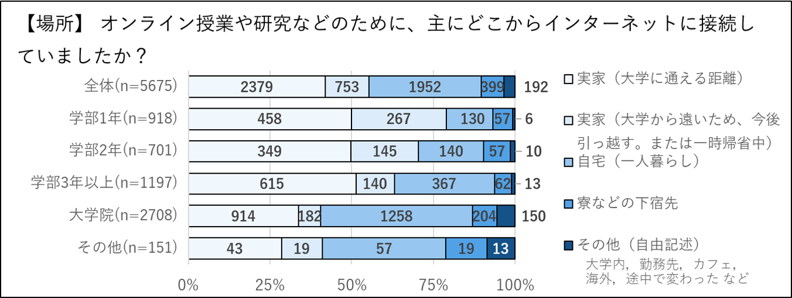

### 使用した機器：オンライン授業や研究などのために，どの機器を使ってインターネットに接続していましたか？（複数選択可）  
91%がノートPCを使用していました．スマートフォンからの接続が21%，タブレット端末が18%と，PC以外の使用も一定数見られました．    

### 回線環境：オンライン授業や研究などのために，どのインターネット環境を使っていますか？
全体的に約60%が⾃宅や寮などに備えられた回線から接続，50GB以上の無線回線の使用は各学年の21～28%程度，また，少数派ではありますが⼤学から貸与されるモバイルルーターや低容量の回線での接続も⼀定数見られました．  

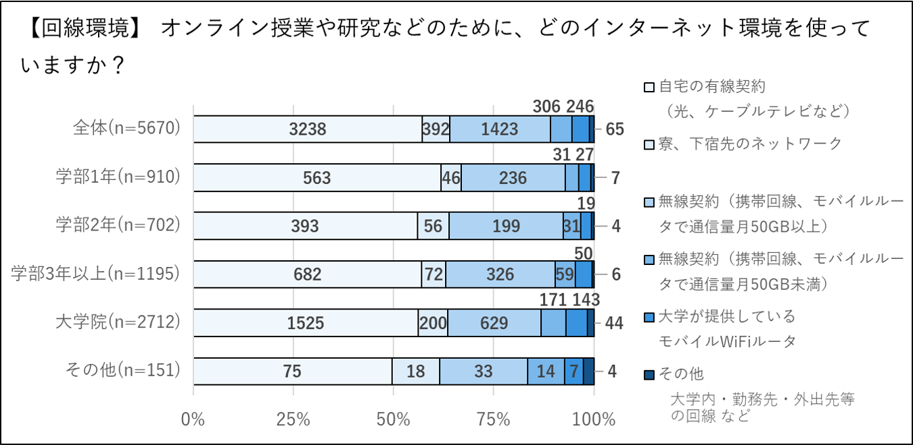

  
## 学習実態に関する質問  
学習実態に関する質問の中で，授業形式以降の問いには，オンライン授業の受講経験がある学生のみが回答しています．  
### 授業履修の有無：今学期に授業を1つ以上受けていますか？
Sセメスターにオンライン授業を1つ以上受けた経験を持つ学生は，学部生で97%以上，⼤学院生では73%と，多数でした．  

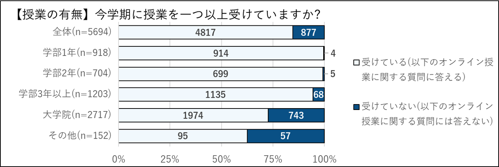

### 授業形式：週に受けているオンライン授業のコマ数（ほとんど出席していないものは除く）を，形式ごとに教えてください．
受けている授業の形式としては，教員の講義を中⼼とするライブ授業（同期型）が最も多く，グループワークを中心とする授業や，事前に録画した講義ビデオを配布するオンデマンド授業（非同期型）など，他の形式の授業は比較的少数という結果になりました．また，資料と課題のみの授業はごくわずかでした．  

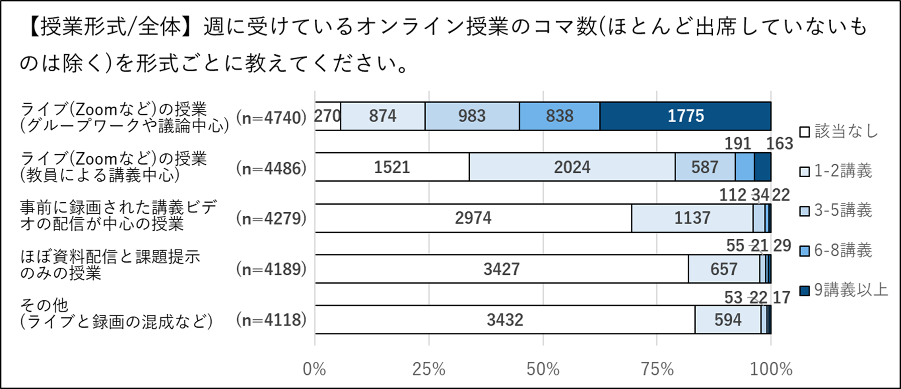

#### 1.ライブ（Zoomなど）の授業（教員による講義中⼼）  
この形式の授業を受講したという回答が最も多く，学部1年⽣は平均12.2コマ，学部2年⽣は平均7.8コマ，学部3年生以上は平均7.6コマ，⼤学院生は平均3.8コマの講義を受講していました．  
※平均値の算出には回答区分の中位値と，最上位区分の最⼩値を⽤いました．以下全て同様に計算しています．   

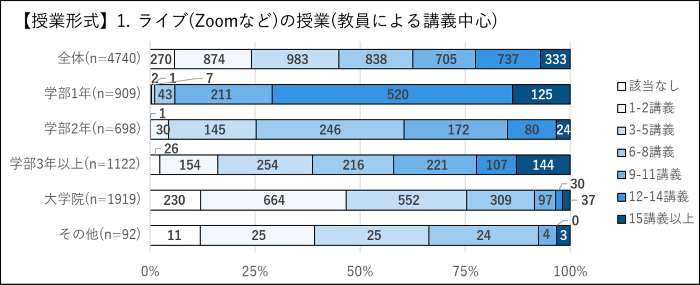

#### 2.ライブ（Zoomなど）の授業（学⽣のグループワークや議論中⼼） 
この形式の授業はどの学年の学生も経験していたものの，講義中心の授業に⽐べて少数でした．学部1年⽣は平均2.5コマ，学部2年⽣は平均1.0コマ，学部3年以上は平均2.2コマ，⼤学院生は平均1.8コマの講義を受講していました．

#### 3.事前に録画された講義ビデオの配信が中⼼の授業  
こちらは講義形式ではありますが，同時配信ではなく，事前に教員が録画してアップロードされた講義ビデオを学生が後から視聴するオンデマンド型の授業です．学部1年⽣は平均0.8コマ，学部2年⽣は平均0.7コマ，学部3年生以上は平均0.7コマ，⼤学院は平均0.4コマの講義を，この形式で受講していました．  

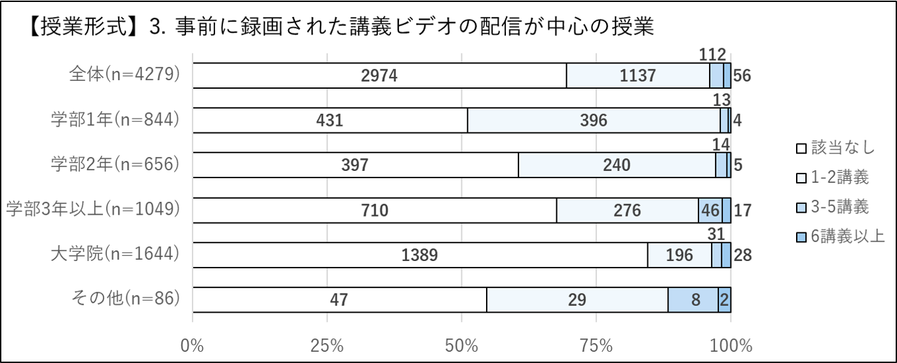

#### 4.ほぼ資料配信と課題提⽰のみの授業  
各学年の学生とも，資料配信と課題提⽰のみの授業はほとんどありませんでした（最⼤は，学部1年⽣の平均0.6コマでした）．  

#### 5.その他（ライブと録画の混成など）  
1〜4の形式を組み合わせた形式，またはそのどれにも該当しない形式の授業を「その他」としましたが少数でした．  

### 出席率：ライブで⾏われている授業の出席率（実際にライブで聞いている割合）はどのくらいですか？  
学部1年生の91%，学部2年生の81%，学部3年生以上の76%，大学院生の86%と，多くの学生がライブで配信されている授業に80〜100%，ライブ（リアルタイム）で出席したと答えました．  

### 授業外学習時間：授業に参加している以外（予習，復習，課題など）で平均週何時間を⼤学の勉強に使いましたか？  
学生が授業時間外で学習にかけた時間の平均値は，学部1年⽣が12.4時間，学部2年⽣が8.4時間，学部3年生以上が9.4時間，⼤学院生が9.1時間となりました．  

## オンライン授業の質と評価に関する質問  
### 授業方法別の評価  
授業形式ごとに，実際に受講してどのように感じたか，その評価をたずねました．ライブ授業に対しては評価が⾼い⼀⽅，それ以外の授業形式ではやや低くなることが分かります．  

#### 1.ライブ（Zoomなど）の授業（教員による講義中⼼）
最も多く採用されたこの形式に対し，学生の満⾜度は⾼く，69%が「⼤変良かった」「良かった」と回答しています．ただし学年が上がるほど満⾜度が上がる傾向があり，「大変良かった」「良かった」と答えた学生は，大学院では75%にのぼりますが，学部1年⽣では55%にとどまっていることは，留意すべき点でしょう．  

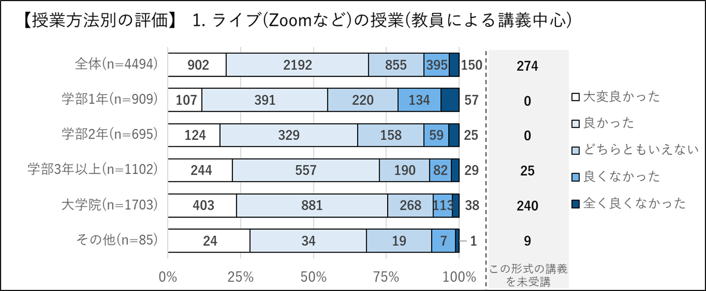

#### 2.ライブ（Zoomなど）の授業（学⽣のグループワークや議論中⼼）  
全体で57%（学部1年⽣：50%，学部2年⽣：57%，学部3年生以上：52%，⼤学院生：64%）が，「大変良かった」「良かった」と回答しました．  

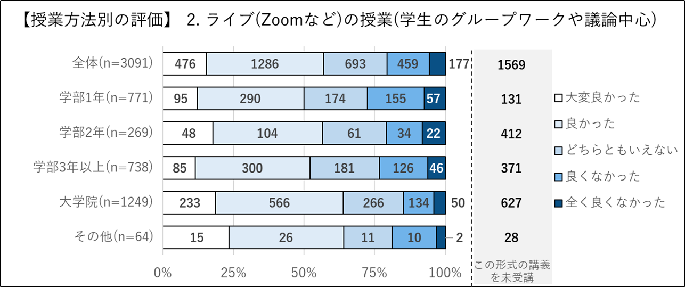

     
#### 3.事前に録画された講義ビデオの配信が中⼼の授業  
全体で54%（学部1年⽣：50%，学部2年⽣：51%，学部3年生以上：57%，⼤学院生：57%）が，「大変良かった」「良かった」と回答しました．ライブ中心よりもオンデマンド中心の方が評価が低くなっている結果となりました．  

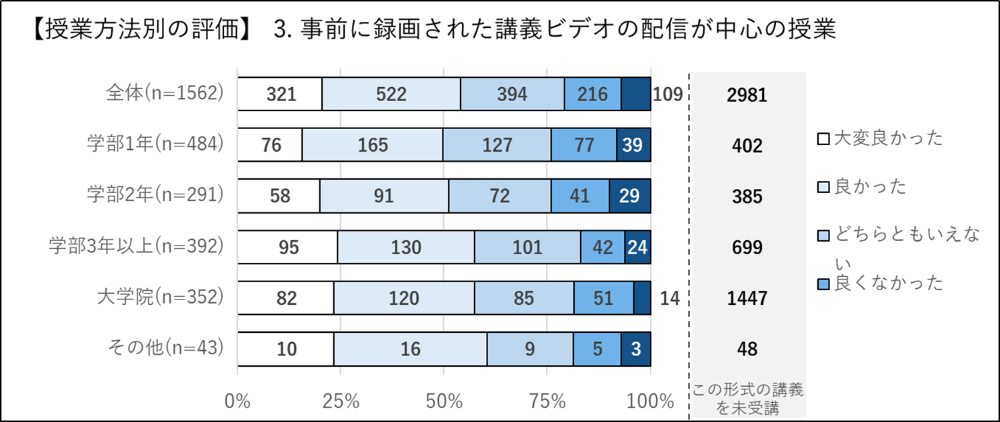

  
#### 4.ほぼ資料配信と課題提⽰のみの授業  
全体で37%（学部1年⽣：36%，学部2年⽣：27%，学部3年生以上：41%，⼤学院生：44%）が，「大変良かった」「良かった」と回答し，何らかの形で講義や議論がある授業よりも低い評価となりました．

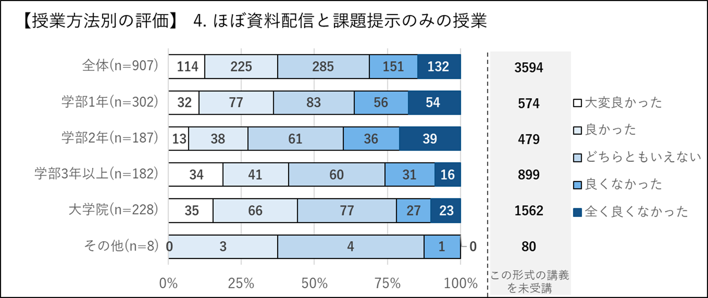

#### 5.その他（ライブと録画の混成など）  
全体で52%（学部1年⽣：42%，学部2年⽣：52%，学部3年生以上：63%，⼤学院生：55%）が「大変良かった」「良かった」と回答しました．「良くなかった」「大変良くなかった」は少数にとどまっています．  

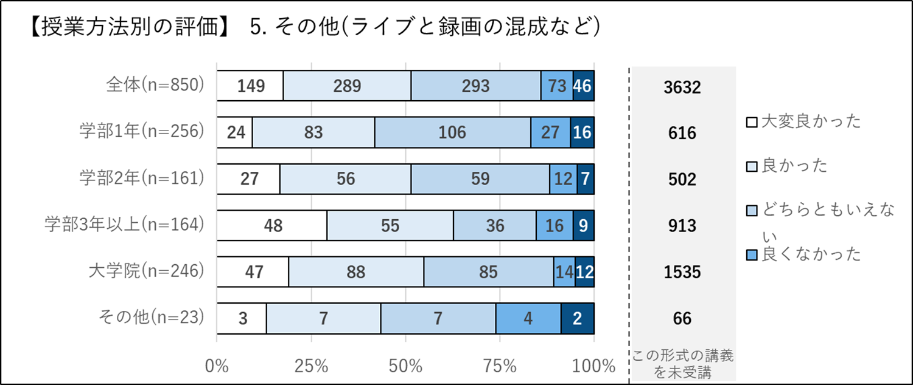

    
### メリット：オンライン授業が対⾯授業より良いと感じた点にチェックをしてください．（複数選択可）  
ここでは，授業がオンライン化されたことにより，対面授業と比較してどのようなメリットを感じたかを回答してもらいました．  
  
最も多い回答は「通学時間が不要」で，95%という多数がメリットとして挙げました．2018年の「東京大学 学生生活実態調査報告書」では学⽣の平均通学時間が⽚道50分となっていますから，例年よりも1日100分ほど節約できたことになり，これは学習時間を確保する上でも確かに大きなメリットと言えるでしょう．また，コンテンツが電子化されたことにより「予習復習や確認がしやすい」「（教室の黒板と比べて）PCの画面のほうが資料などが見やすい」という回答も⽬⽴ちました．講義資料の電⼦化に対しては56％が，講義そのものの録画に対しては38%が良かったと感じていました．「キャンパス間の移動が不要なので授業選択の幅が広がった」は，⼤学院⽣が最も多く51%がそのように回答しました．⾃由記述には「服装，姿勢等を気にしなくてよい」「本，ネットなどから情報収集しやすい」といった点が挙げられていました．

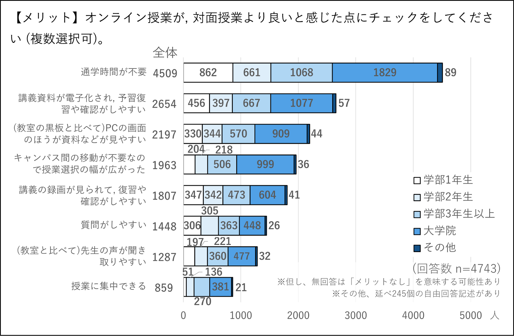

### デメリット：オンライン授業を受けてみて感じたデメリットをチェックしてください．（複数選択可）  
前問でメリットを挙げたのに対し，この問では，オンライン授業のデメリットだと感じる点を挙げてもらいました．
  
最も多い回答は「他の学⽣とコミュニケーションがない（少なくなる）」という点で，全体の71%でした．特に学部1年⽣では割合が大きく，84%もの学生がデメリットに感じていました．続いて，67%が「⽬の疲労や肩こりなど，⾝体的に疲れた」などの身体的不調，62%が「通信環境などのせいで映像や⾳声が途切れることがあった」，45%が「授業に集中できなかった」，43%が「課題が多く出る傾向にあった」という点を挙げました．Web会議システムなどソフトウェアの使⽤に関する技術的な問題については，いずれも30%以下でした．  

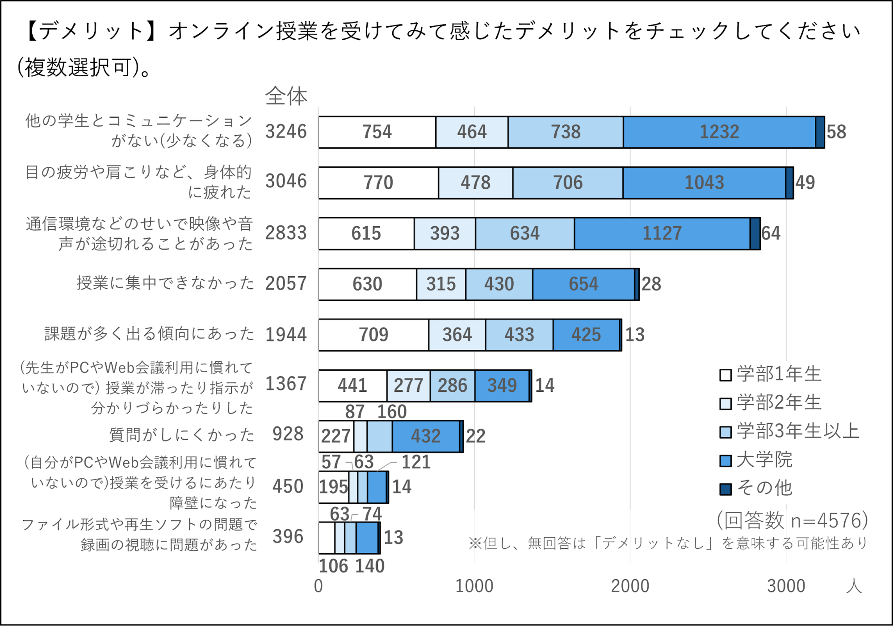

  
### やめてほしいと思った点：受講したオンライン授業で実際に経験し「やめてほしい」と思ったことがあればチェックしてください．（複数選択可）  
最も多い回答は「講義録画が提供されなかった（見るための手順が面倒で見られなかった）」（48%）というものでした．僅差で「課題の量が多すぎた」（48%）が挙げられています．とりわけ学部1年⽣は，796名中の629名と79%が課題の多さを感じていました．次いで「講義資料が提供されなかった」（30%），「授業時間が守られなかった（授業が延びる等）」（25%），「常時カメラオンを求められた」（16%）が続きました．  

  
### オンライン授業に対する評価：この3か⽉間のオンライン授業に対する，あなたの総合的な評価を教えてください（10を最⾼とし，0を最低とする11段階評価）．
Sセメスターのオンライン授業全体に対して，11段階で評価してもらいました．アンケート回収後，その回答から平均点を算出しました．数字が⼤きいほど満⾜度が⾼いことを⽰しています．全体では平均6.5でした．学年が低いほど点数が低い傾向があり，学部1年⽣は平均5.1でした．  

  
## オンライン授業で用いたツールに関する質問
### ツール：あなたが受講したオンライン授業で使⽤したツールは何でしたか？（複数選択可）
実際にオンライン授業を受講する際に使⽤したオンラインツールについて質問しました．ほぼ全ての回答者が，Zoomを利用していました．次いでITC-LMSの利⽤率は61%でした．ITC-LMSは学内のオンライン教育システムで，主に課題提出や授業資料の配布に使用されています．そして，ECCSクラウドメール（Google Drive，Google ドキュメントなどのサービス）の利用は38%，UTokyo Microsoft Office（OneDrive，Word，PowerPointなどのサービス）が20%．その他，Webex(Cisco Webex Meeting)やGoogle MeetなどのWeb会議システムの使用は他と比較すると少数となりました．  

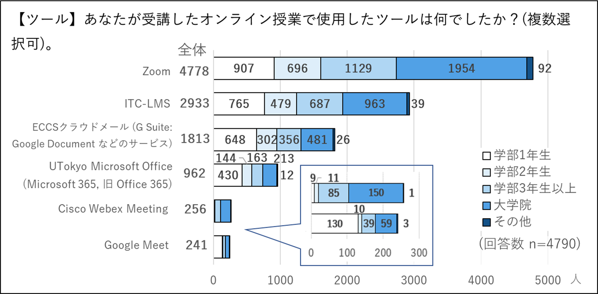

  
### ツールの使⽤法の調査⼿段：上記ツールの使い⽅を習得する，またはわからないときに利⽤した⼿段はどれですか？（複数選択可）  
オンライン授業の受講に必要なツールを使⽤するにあたり，使用法を学びたいとき，または使い方が分からなかったとき，どのような⼿段で調べたかを質問しました．最も多かったのは「Googleなど検索エンジンで調べた」という回答で69%でした．続いて「友達・知り合いに聞いた」が44%，学内で提供しているサイト「[オンライン授業ポータル utelecon](/)を見た」との回答は33%でした． 

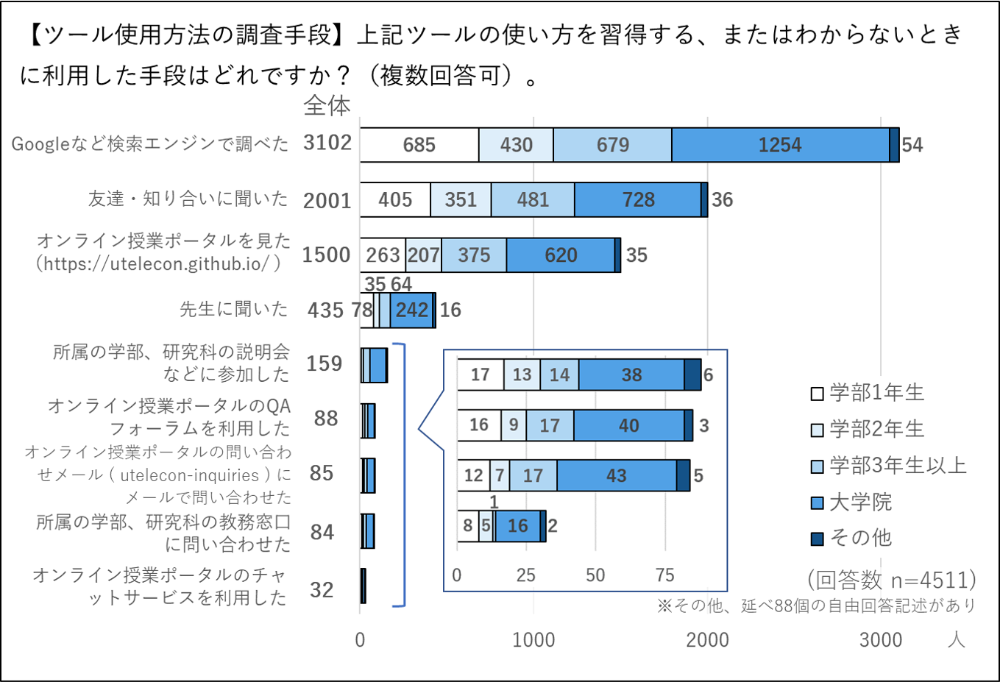

   
### ツール習得の難易度：オンライン授業を受けるために使ったツールを習得するのにどのくらい苦労をしましたか？（10を最高とし，0を最低とする11段階評価）  
この問いでは，オンライン授業の受講に必要なツールの習得がどのくらい困難に感じられたかを数値化しました．数字が⼤きいほど，習得を難しく感じたことを⽰しています．学部2年⽣以上は2.6以下と，あまり苦労しなかったと感じているようでした．学部1年⽣は4.0と，他の学年に比べると，やや強く困難を感じていることが見受けられました．しかし，総じて困難を感じている学生の割合は少数となりました．

## 今後のオンライン授業に対する印象の質問
### オンライン授業への期待：今後，オンライン授業を授業形態の1つとして取り⼊れてほしいですか？  
「⼤変そう思う」「そう思う」と回答したのは全体で80%（学部1年⽣：62%，学部2年⽣：77%，学部3年生以上：84%，⼤学院生：87%）でした．既出の「オンライン授業に対する評価：この3か⽉間のオンライン授業に対する，あなたの総合的な評価を教えてください」の結果との関連が見られ，オンライン授業に対する評価が高い⾼学年ほど，引き続きオンライン授業を取り入れることに肯定的であることが分かります．  

  
### 形式別／今後のオンライン授業への印象：今後，オンライン授業を授業形態の1つとして取り⼊れてほしいですか？  
授業形式によっては，対面授業時の内容やスタイルをそのままオンライン化することが困難なものも存在します．この問いでは，対面授業時の授業形式を挙げ，それら各形式をオンライン化することに対してどのように感じるかを質問しました．座学の授業についてはオンライン化への期待が⼤きい⼀⽅，少⼈数のクラス，ゼミ，グループワークなどインタラクションが多く見込まれる授業については，オンライン化への抵抗感が強い傾向が見受けられました．
#### 教員による講義中⼼の授業（⼤⼈数）
「確実にオンライン授業にしてほしい」「オンライン授業にしてほしい」の合計は，全体で61%（学部1年⽣：41%，学部2年⽣：59%，学部3年生以上：70%，⼤学院生：67%）でした．  

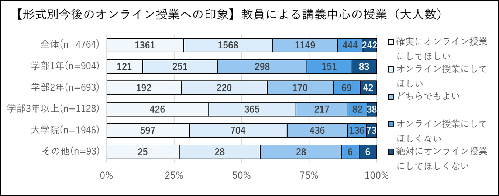

  
#### 教員による講義中⼼の授業（少⼈数）  
全体で見ると賛成意⾒と反対意⾒が拮抗していますが，学年によって結果に差が見られました．「確実にオンライン授業にしてほしい」「オンライン授業にしてほしい」を合わせて，全体の30%（学部1年⽣：13%，学部2年⽣：22%，学部3年生以上：37%，⼤学院生：36%）が賛成していました．  

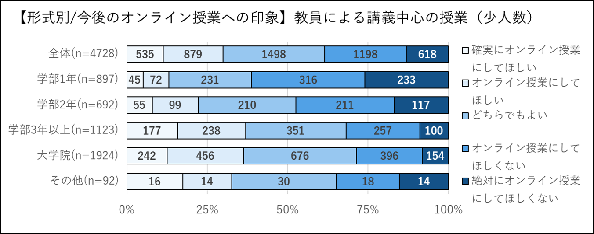

#### 学生のグループワークや議論中心の授業
反対意⾒の⽅が多数となりました．「確実にオンライン授業にしてほしい」「オンライン授業にしてほしい」は全体で14%（学部1年⽣：7%，学部2年⽣：8%，学部3年生以上：15%，⼤学院生：18%）にとどまりました．  

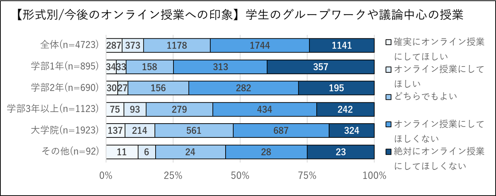

  
#### 演習
反対意⾒の⽅が賛成意見よりも多い結果となりました．「確実にオンライン授業にしてほしい」「オンライン授業にしてほしい」は全体で17%にとどまりました．  

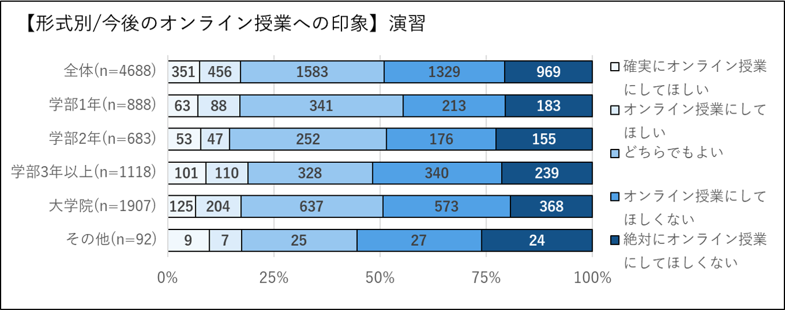

   