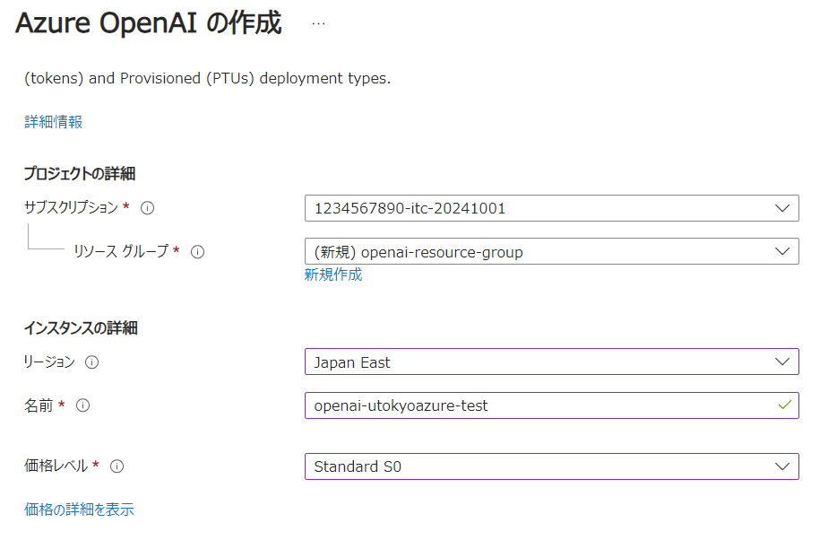
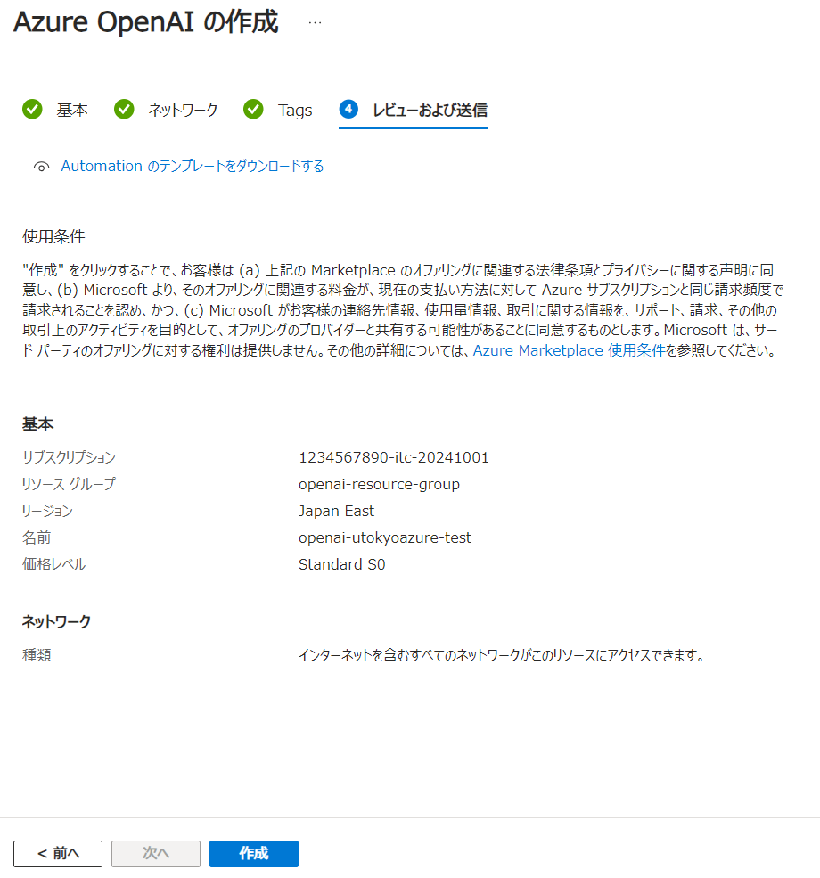
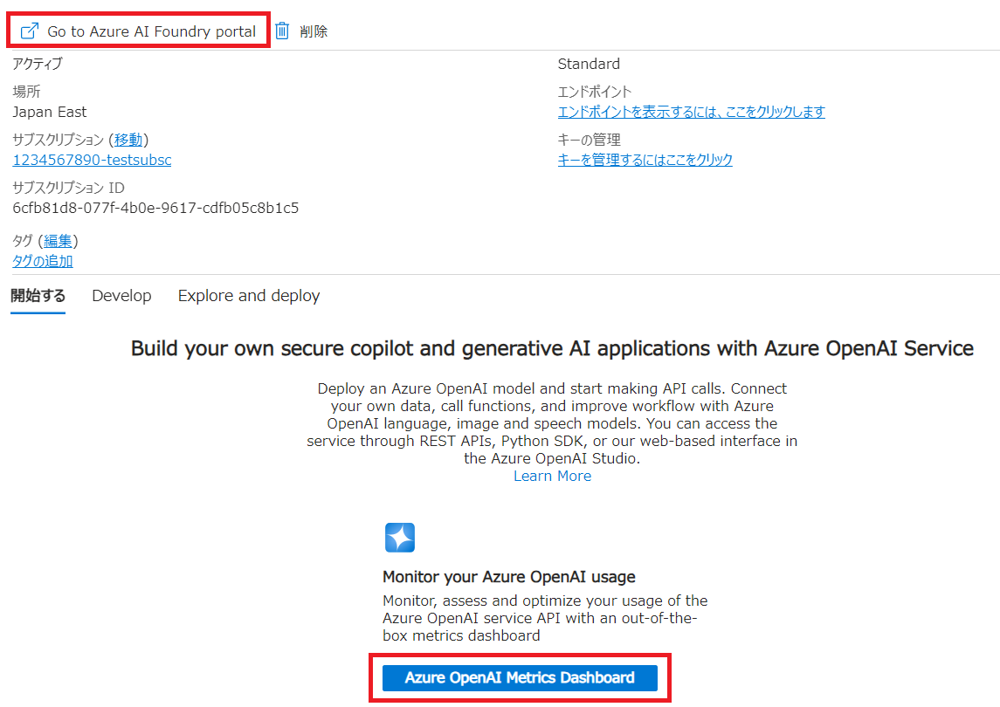
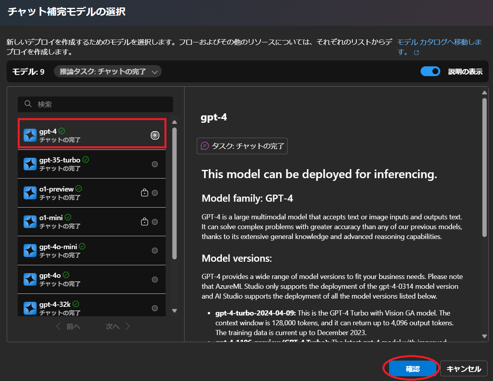
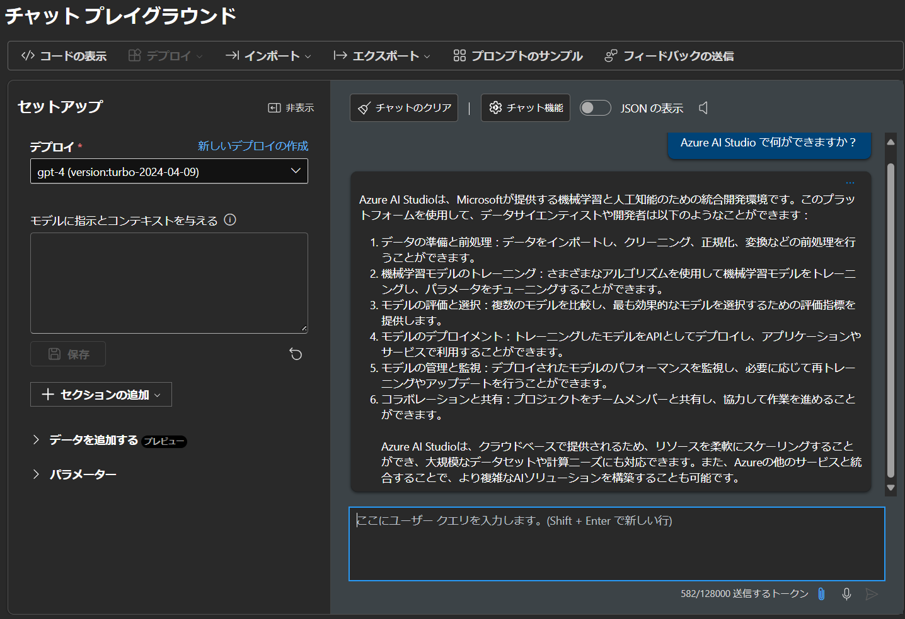

## 概要
{:#about}

Azure Machine Learning なら Jupyter notebook のようなインタフェースで gpu を使ったPython プログラミング等ができます．
このページは Azure Machine Learning を本サービスで利用する場合の初期手続き例です．

## １．サービスを選択する
{:#select_service}

- まだサブスクリプションをお持ちでない場合は，事前に以下サイトよりサブスクリプションを申請してください．
  - [UTokyo Azure新規利用申請ページ](http://azure.itc.u-tokyo.ac.jp/) ※学内アクセス限定．UTokyo Account 所持者のみログイン可

- [Azure portal](https://portal.azure.com/)に[UTokyo Account](/utokyo_account/)でログインし、リソースの欄に申請したサブスクリプションがあることを確認してください．（新規申請された場合は表示されるようになるまで時間がかかります）

- Azureサービスの一覧の中から`Azure Machine Learning`を選択します．
    - 一覧に無い場合，画面上部の検索窓から検索するか，一覧の右にある`その他のサービス`を選択，左側にあるリストから`AI + Machine Learning`を選択すると， 右側に表示されるメイン画面の`Azure AI + Machine Learning platforms`の中にあります．

{:.medium.center.border}
{:.medium.center.border}

1. Azure Machine Learning のメインページが表示されたら，画面左上にある`＋作成`をクリックします．
2. `新しいワークスペース`または`新しいレジストリ`の選択が現れるので，ここでは`新しいワークスペース`を選択します．

{:.medium.center.border}

## ２．Azure Machine Learning の workspace を構成する
{:#aihub}

**補足**：説明のない項目は，基本的に初期設定のままで構成することを前提としています．

1. **Resource group**：ない場合は新しく入力してください．既存のものがある場合はそれを使ってもよいです．
2. **Workspace details**：名前だけ入力すれば他は自動で埋められます．

{:.medium.center.border}

3. `Revew+create`をクリックし，続けて`create`をクリックしてください．Workspace ができるまで少し時間がかかります．

{:.medium.center.border}

4. `Go To Resource`

#### インスタンスの詳細

- **リージョン**：AIハブをどの地域（リージョン）にあるデータセンターにデプロイするかを指定します．使いたい機能が特定の国のリージョンにしかない場合は，その国のリージョンを選択ください．パブリッククラウド上での情報管理に不安がある場合は日本国内（`Japan East` か`Japan West`）のリージョンを選択することも可能です．
- **名前**：リソースの Azure ポータルでの名称を設定します．ここでは`openai-utokyoazure-test`としています．
- **価格レベル**：`Standard S0`を選択してください．

{:.medium.center.border}

### ネットワークパート
{:#network}

ここでは初期設定(すべて許可) のまま進めます．

### タグパート
{:#tag}

ここでは初期設定のまま進めます．

### 確認及び作成パート
{:#execute}

Azure ポータルによる検証が成功したら，画面左下の`作成`ボタンをクリックし，しばらくしてデプロイが正常に完了しましたら，`リソースに移動`をクリックしてください．

{:.medium.center.border}

Azure OpenAI Studio のトップページに遷移するので，`Go to Azure OpenAI Studio`をクリックしてください．

なお，ここで`Explore Azure AI Studio`をクリックすると，[Azure AI Studio](https://ai.azure.com/) でも利用が可能です．

{:.medium.center.border}

## ３．Azure OpenAI Studio でモデルをデプロイする
{:#aistudioproject}

**一例として GPT4 モデルのデプロイ手順を進めます．**

- Azure OpenAI Sutdio に遷移すると以下のような画面になりますので，画面左側のリストから，`チャット`を選択します．

{:.medium.center.border}

- メイン画面がセットアップになりますので`＋デプロイを作成`をクリックし，現れるプルダウンリストから`基本モデルから`を選択してください．

{:.medium.center.border}

- モデル選択画面になりますので，左側のリストから`gpt-4`を選択し，右下にある`確認`をクリックしてください．

{:.medium.center.border}

- 確認画面になるので，`デプロイ`をクリックしてください．

{:.medium.center.border}

- チャットプレイグランドが下図のようになりましたら完了です．
  - `デプロイ`をクリックしてからデプロイ完了まで時間がかかる場合があります．
  - 5分以上待っても変化がない場合は，ブラウザを再読み込みしてみてください．それでもチャットグランドが表示されない場合は，改めてデプロイしなおしてみてください．

{:.medium.center.border}

### 補足

- テキストボックスにメッセージを入力し，三角形をクリック（または「Enter」キーを押す）してモデルに送信します．
- 画面右下のトークン数は，このメッセージのトークンとこのモデルのトークン制限を表します．
  - 一例として下図では，このメッセージを送信するには582トークンが使用され，全体のトークン制限は128000トークンです．
  - 画面左の**モデルに指示とコンテキストを与える**テキストボックスに「システムプロンプト」（またはGPTへの指示）を入力できます．

{:.medium.center.border}

**注意**：GPTにメッセージを送信するたびに新しいメッセージと一緒にメッセージ履歴全体が送信され，トークンの消費量はその累積ベースで計算されます．
 
- たとえば，これまでのメッセージと返信がそれぞれ2，5，1，7，11，1トークンで構成されている場合，新たに9トークンで構成されるメッセージを送信すると，この送信要求は実際には2+5+1+7+11+1+9=36トークンで構成されます．
- この考え方で累積全体のトークン消費を計算すると，(2) + (2+5) + (2+5+1) + (2+5+1+7) + (2+5+1+7+11) + (2+5+1+7+11+1) + (2+5+1+7+11+1+9)=121 トークンとなります．
- OpenAI が提供する ChatGPT アプリケーションとは異なり，Azure の OpenAI サービスはトークンによって課金されるため，トークンの消費方法に注意してください．

### [デプロイしたモデルのクォータを管理する](/research_computing/utokyo_azure/ai/quota)

### [デプロイしたモデルを Python API から利用する](/research_computing/utokyo_azure/ai/python)
