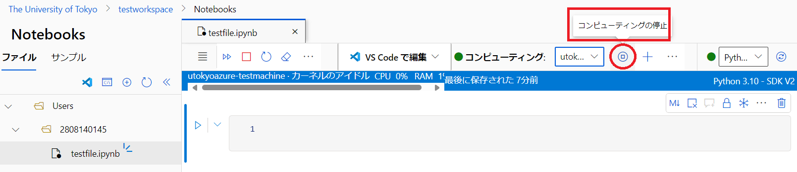

## 概要
{:#about}

Azure Machine Learning なら Jupyter notebook のようなインタフェースで GPU を使った Python プログラミング等ができます．
このページは Azure Machine Learning を本サービスで利用する場合の初期手続き例です．

## １．サービスを選択する
{:#select_service}

- まだサブスクリプションをお持ちでない場合は，事前に以下サイトよりサブスクリプションを申請してください．
  - [UTokyo Azure新規利用申請ページ](http://azure.itc.u-tokyo.ac.jp/) ※学内ネットワークからのアクセスに限定．UTokyo Account 所持者のみログイン可

- [Azure portal](https://portal.azure.com/)に[UTokyo Account](/utokyo_account/)でログインし、リソースの欄に申請したサブスクリプションがあることを確認してください．（新規申請された場合は表示されるようになるまで時間がかかります）

- Azureサービスの一覧の中から`Azure Machine Learning`を選択します．
    - 一覧に無い場合、一覧の右にある`その他のサービス`を選択、左側にあるリストから`AI + Machine Learning`を選択すると， 右側に表示されるメイン画面の`Azure AI + Machine Learning platforms`の中にあります．

{:.medium.center.border}

- Azure Machine Learning のメインページが表示されたら，画面左上にある`＋作成`をクリックします．
- `新しいワークスペース`と`新しいレジストリ`の選択肢が表示されますが，ここでは`新しいワークスペース`として進めます．

## ２．Azure Machine Learning のワークスペースを構成する
{:#amlproject}

**補足**：説明のない項目は，基本的に初期設定のままで構成することを前提としています．

### 基本パート
{:#base}

#### リソースの詳細

- **サブスクリプション**：事前に申請したサブスクリプションがすでに設定されていますので、通常はそのままで問題ありません．設定が無い場合はサブスクリプションが作成完了しているかどうか確認ください．
- **[リソースグループ](https://learn.microsoft.com/ja-jp/azure/azure-resource-manager/management/manage-resource-groups-portal)**：ここでは新規に`aml_resource_group`というリソースグループ名で作成し，以下に作成される各リソースをまとめます．まとめられたリソースは，権限の継承や削除などを一括で対応することが可能となります．

#### ワークスペースの詳細

- **名前**：リソースのポータルでの名称を設定します．ここでは`testworkspace`としています．
- それ以外の必須項目は自動入力されるので，ここではそのまま進めます．

{:.medium.center.border}

### ネットワーク、暗号化、ID、タグの各パート
{:#etcpart}

ここでは初期設定のまま進めます．

- 最後に`確認及び作成`をクリックします．

### 確認及び作成パート
{:#execute}

ポータルによる検証が成功したら，画面左下の`作成`ボタンをクリックし，しばらくしてデプロイが正常に完了しましたら，`リソースに移動`をクリックしてください．

{:.medium.center.border}

AI ハブ のトップページに遷移するので，`スタジオの起動`をクリックしてください．

{:.medium.center.border}

ここからは **Machine Learning Studio** の環境で進めます．

## ３．テスト用のマシンを作成する

一度ワークススペースを作成すれば他のユーザと共有が可能となり，共有ユーザーは画面の Users の下に他のユーザのフォルダが表示されます．ただし Notebook を利用するには各自が実行用の仮想マシンをワークスペース内に作らなければなりません．
そこでプログラムを実行するマシンを用意します．

- トップページ画面左側のリストから，`Notebook`をクリックします．

{:.medium.center.border}

- `コンピューティングの作成`をクリックしてください．

{:.medium.center.border}

### コンピューティング インスタンスの作成

#### 必須の設定

- **コンピューティング名**：適当な名前を命名ください．注意点として，マシンが置かれるリージョン内でユニークである必要があるので，すでにある名前とエラーになった場合は別の名前をお試しください．
- その他の項目は初期選択のままで進めます．

{:.medium.center.border}

#### スケジュール設定、セキュリティ、アプリケーション、タグ

- この構成では初期値のまま進めます．

#### 作成

- `確認と作成`をクリックしてください．レビュー（確認画面）になりますので，そのまま`作成`をクリックしてください．
- 画面上部に作成中である旨表示され，それが消えたら作成完了です．
- 左の一覧から`コンピューティング`を選択すると，作成したマシンのステータスが表示されます．

{:.medium.center.border}

## ４．ファイルを作成する

Python 等のコードを書くためのファイルを作成します．

- `Notebook`の画面で`＋ファイル`から`新しいファイルの作成`をクリックしてください．

{:.medium.center.border}

- ファイル名を入力して`作成`をクリックしてください．

{:.medium.center.border}

- 以下の図のような感じでファイルが作成されます．ここに，Notebook ライクで Python のコードを入力することができます．

{:.medium.center.border}

## ４．一時休止

**仮想マシンはそのままにすると利用料金が課金され続ける**ので．終了時には仮想マシンを止めておきます．

- ファイル編集画面の上部に、`コンピューティングの停止`ボタンがあるのでクリックする．

{:.medium.center.border}

- 確認のウィンドウが表示されるので，`確認`をクリックして停止する．
