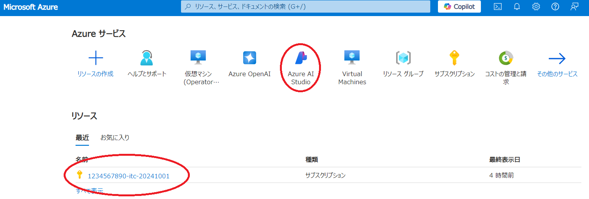
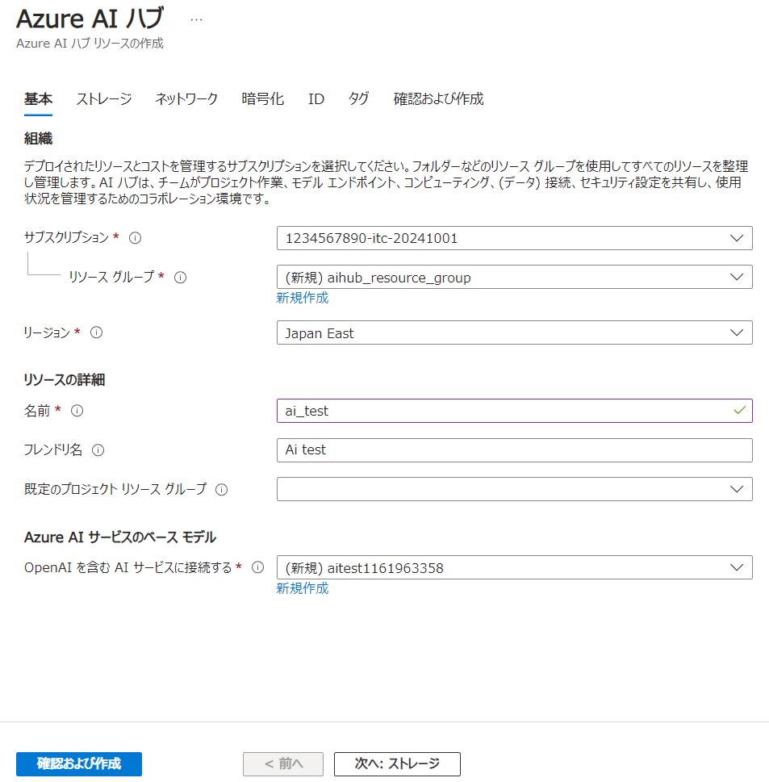
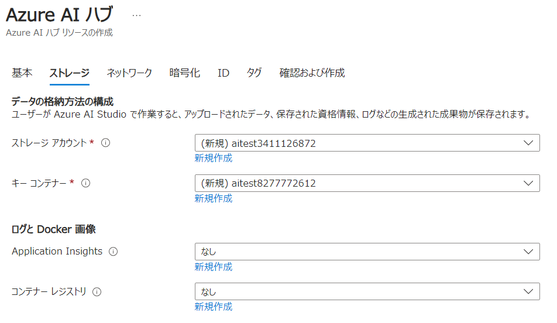
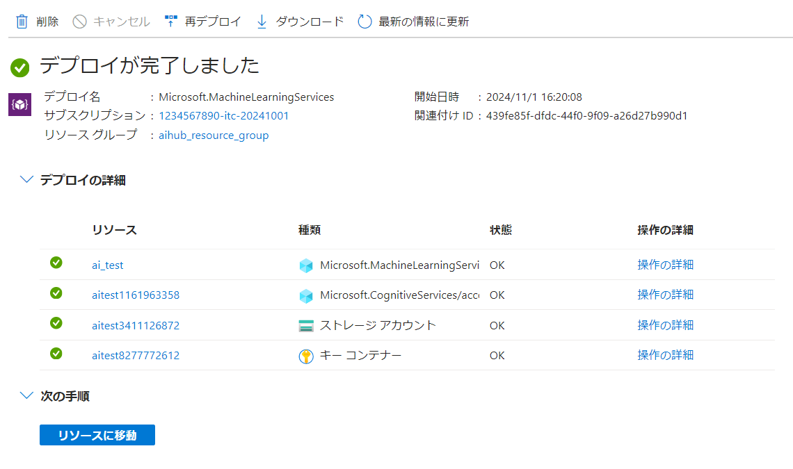
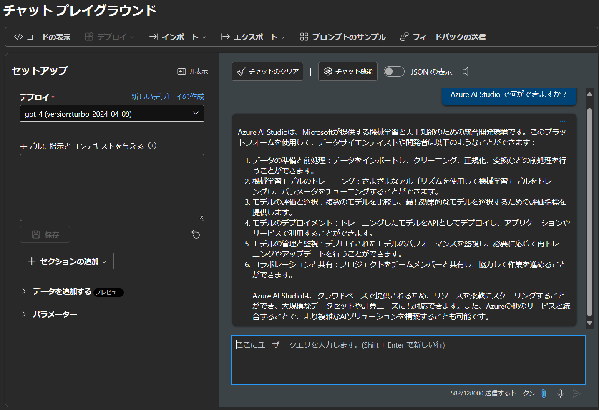

import FirstTimeUsing from "@components/ja/systems/utokyo_azure/FirstTimeUsing.mdx";

## 概要
{:#about}

Microsoft Foundry（旧称 Azure AI Foundry）でポータルを構築する初期手続き例です．

### 注意（2026年1月現在）

- Azure Portal において，Azure AI Foundry から移行中のページやリソースがまだ多数あります．当面は頻繁な仕様変更が想定されますので，ここに記載の内容と一致しない場合は[Microsoft Learn](https://learn.microsoft.com/ja-jp/azure/ai-foundry/what-is-azure-ai-foundry?view=foundry-classic)をご参照ください．
- あたらしい Foundry が提供されているリージョンはまだ限られている模様です．日本のリージョンでは Japan East では提供済みですが，Japan West は未提供となっています．ご利用される場合は，選択するリージョンで利用可能か事前にご確認ください．
  - [Microsoft Learn:クラウド リージョン間での Microsoft Foundry 機能の可用性](https://learn.microsoft.com/ja-jp/azure/ai-foundry/reference/region-support?view=foundry)

## １．サービスを選択する
{:#select_service}

<FirstTimeUsing type="details" />

- Azureサービスの一覧の中から`Azure AI Foundry`を選択します．
  - 2026年1月以降，アイコンのサービス名が`Microsoft Foundry`に変更になる可能性があります．
  - 一覧に無い場合，Portal 画面上部にある検索窓に`Azure AI Foundry`や`Foundry`などと入力すると表示されます．

{:.medium.center.border}

- Azure AI Foundry のメインページが表示されたら，画面左にあるリストから`Use with Foundry → Foundry`をクリックします．

## ２．Foundry ポータルを構成する
{:#aihub}

**補足**：説明のない項目は，基本的に初期設定のままで構成することを前提としています．

### 基本情報パート
{:#base}

#### インスタンスの詳細

- **サブスクリプション**：事前に申請したサブスクリプションがすでに設定されていますので、通常はそのままで問題ありません．設定が無い場合はサブスクリプションが作成完了しているかどうか確認ください．
- **[リソースグループ](https://learn.microsoft.com/ja-jp/azure/azure-resource-manager/management/manage-resource-groups-portal)**：ここでは新規に`rg-roletest-ai`というリソースグループ名で作成し，以下に作成される各リソースをまとめます．まとめられたリソースは，権限の継承や削除などを一括で対応することが可能となります．
- **リージョン**：Foundryをどの地域（リージョン）にあるデータセンターにデプロイするかを指定します．使いたい機能が特定の国のリージョンにしかない場合は，その国のリージョンを選択ください．
  - （2026年1月現在）[Japan West は Foundry サービスがまだ未提供です](https://learn.microsoft.com/ja-jp/azure/ai-foundry/reference/region-support?view=foundry)．

#### 最初のプロジェクト

- **Default project name**：適当なプロジェクト名を入力してください．ここでは`proj-test-ai`としています．

{:.medium.center.border}

### Storageパート
{:#storage}

ここでは，完全に新規利用の想定で初期設定のまま進めます．
- Azure 上にある既存データを利用する場合は`Key Vault`や`Storage Account`などの設定を行ってください．

### ネットワーク，Identity，暗号化，タグの各パート
{:etcpart}

ここでは，初期設定のまま進めます．

### 確認及び作成パート
{:#execute}

- ポータルによる検証が成功したら，画面左下の`作成`ボタンをクリックし，しばらくしてデプロイが正常に完了しましたら，`リソースに移動`をクリックしてください．
- Foundry のトップページに遷移するので，`Go to Foundry Portal`をクリックしてください．

{:.medium.center.border}

Foundry ポータルが立ち上がりますので，以降は Foundry ポータル上でモデルのデプロイを進めます．

{:.medium.center.border}

## 補足１：モデルデプロイを進めるにあたっての注意事項

- モデルによって，デプロイするためには事前登録が必要であったり，必要な入力情報やデプロイ手順が違ったりします．デプロイボタンがグレーアウトしていてデプロイできない場合は，必要条件がそろっているかどうかご確認ください．
- Foundryポータル上部にある`新しいFoundry`スイッチを切り替えると，UIが新しいバージョンに更新されます．本ページでは旧バージョン（クラシック版）で説明していますのでご注意ください．新しいバージョンのUIで使う場合は，Microsoft Learn の[Microsoft Foundry（新しい）ポータル](https://learn.microsoft.com/ja-jp/azure/ai-foundry/what-is-azure-ai-foundry?view=foundry&preserve-view=true)を参照してください．

## 補足２：利用しない期間のリソース停止や削除

**仮想マシンはそのままにすると利用料金が課金され続けます．**

モデルによっては最低でも100近いCPUコアを要求し1日で数百ドルを超える使用料が発生し続ける場合もありますので，利用が一旦終了した際は，

- VMを停める機能がある場合はVMを停める．
- VMを停める機能が見当たらない場合は，リソースまるごと一旦削除する．

等を実施ください．

## 補足３：OpenAIのトークンについて

- テキストボックスにメッセージを入力し，三角形をクリック（または「Enter」キーを押す）してモデルに送信します．
- 画面右下のトークン数は，このメッセージのトークンとこのモデルのトークン制限を表します．
  - 一例として下図では，このメッセージを送信するには582トークンが使用され，全体のトークン制限は128000トークンです．
  - 画面左の**モデルに指示とコンテキストを与える**テキストボックスに「システムプロンプト」（またはGPTへの指示）を入力できます．

{:.medium.center.border}

**注意**：GPTにメッセージを送信するたびに新しいメッセージと一緒にメッセージ履歴全体が送信され，トークンの消費量はその累積ベースで計算されます．
 
- たとえば，これまでのメッセージと返信がそれぞれ2，5，1，7，11，1トークンで構成されている場合，新たに9トークンで構成されるメッセージを送信すると，この送信要求は実際には2+5+1+7+11+1+9=36トークンで構成されます．
- この考え方で累積全体のトークン消費を計算すると，(2) + (2+5) + (2+5+1) + (2+5+1+7) + (2+5+1+7+11) + (2+5+1+7+11+1) + (2+5+1+7+11+1+9)=121 トークンとなります．
- OpenAI が提供する ChatGPT アプリケーションとは異なり，Azure の OpenAI サービスはトークンによって課金されるため，トークンの消費方法に注意してください．

### [デプロイしたモデルのクォータを管理する](/research_computing/utokyo_azure/ai/quota/)

### [デプロイしたモデルを Python API から利用する](/research_computing/utokyo_azure/ai/python/)
