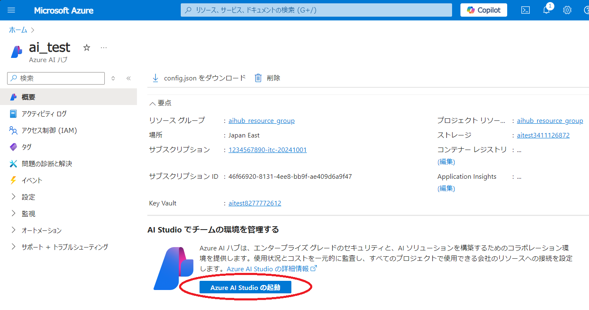
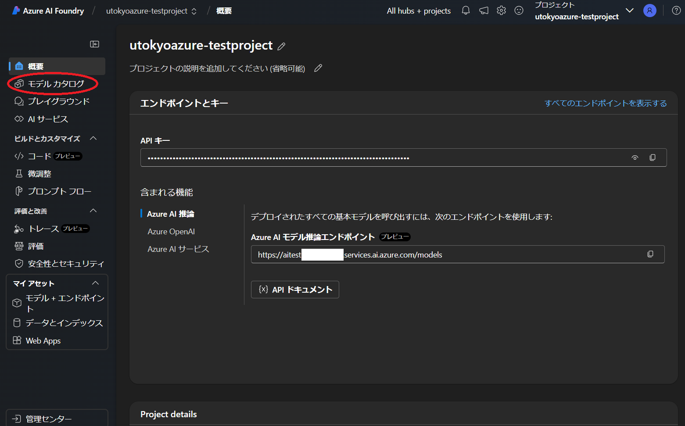
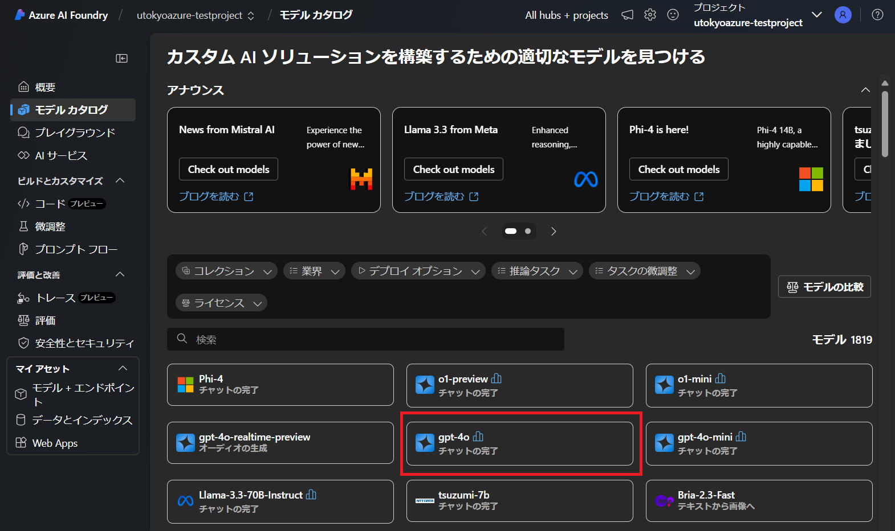
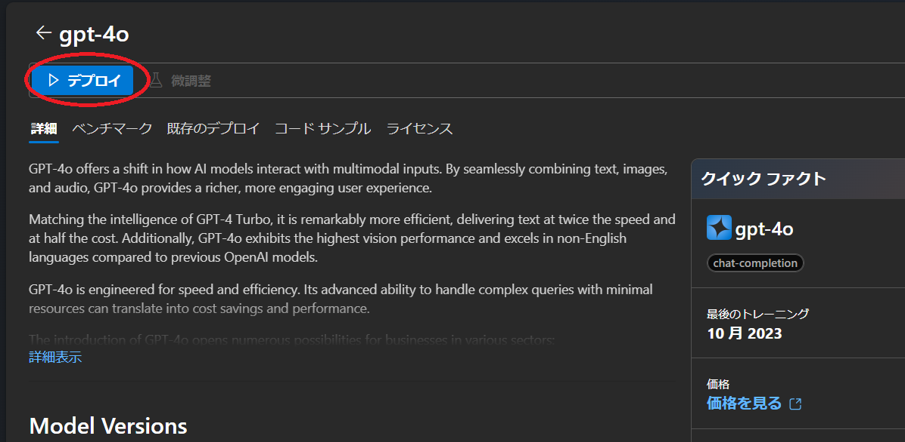
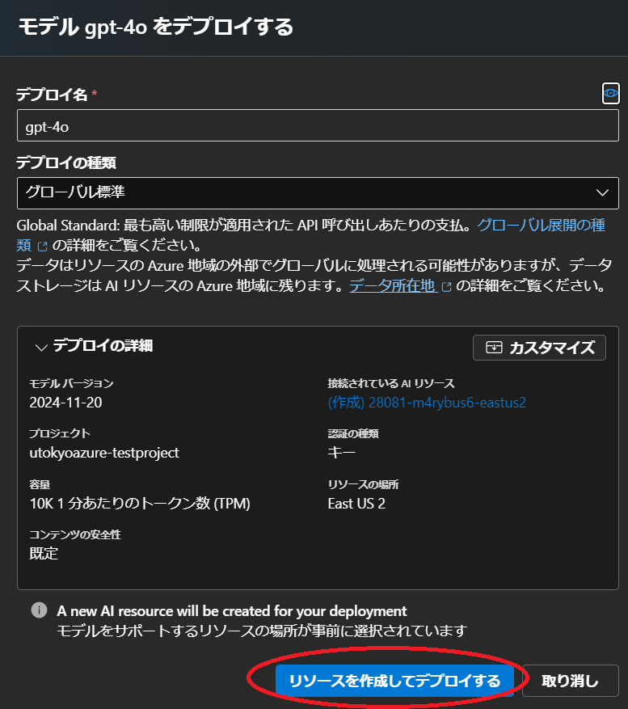
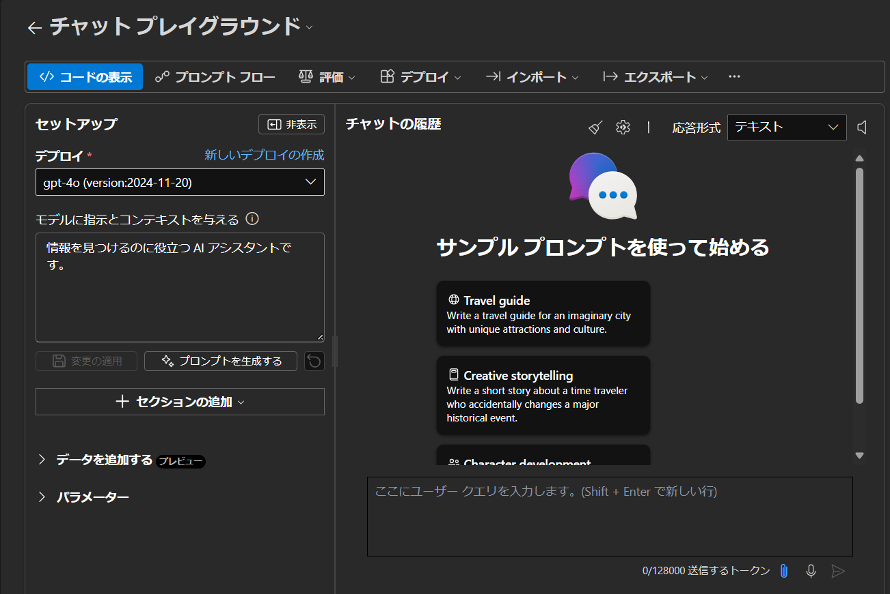

## 概要
{:#about}

Azure AI Foundry（旧称 Azure AI Studio）を本サービスで利用する場合の初期手続き例です．

2024/12 現在，Azure Portal 上は Azure AI Studio 表記です．

## １．サービスを選択する
{:#select_service}

- まだサブスクリプションをお持ちでない場合は，事前に以下サイトよりサブスクリプションを申請してください．
  - [UTokyo Azure新規利用申請ページ](http://azure.itc.u-tokyo.ac.jp/) ※学内ネットワークからのアクセスに限定．UTokyo Account 所持者のみログイン可

- [Azure portal](https://portal.azure.com/)に[UTokyo Account](/utokyo_account/)でログインし、リソースの欄に申請したサブスクリプションがあることを確認してください．（新規申請された場合は表示されるようになるまで時間がかかります）

- Azureサービスの一覧の中から`Azure AI Studio`を選択します．
    - 一覧に無い場合、一覧の右にある`その他のサービス`を選択、左側にあるリストから`AI + Machine Learning`を選択すると， 右側に表示されるメイン画面の`Azure AI + Machine Learning platforms`の中にあります．

{:.medium.center.border}

- Azure AI Studio のメインページが表示されたら，画面左上にある`＋Create`をクリックします．
- `Project`か`Hub`の選択になります．ここでは`Hub`を選択します．

## ２．Azure AI ハブを構成する
{:#aihub}

**補足**：説明のない項目は，基本的に初期設定のままで構成することを前提としています．

### 基本パート
{:#base}

#### 組織の詳細

- **サブスクリプション**：事前に申請したサブスクリプションがすでに設定されていますので、通常はそのままで問題ありません．設定が無い場合はサブスクリプションが作成完了しているかどうか確認ください．
- **[リソースグループ](https://learn.microsoft.com/ja-jp/azure/azure-resource-manager/management/manage-resource-groups-portal)**：ここでは新規に`aihub_resource_group`というリソースグループ名で作成し，以下に作成される各リソースをまとめます．まとめられたリソースは，権限の継承や削除などを一括で対応することが可能となります．
- **リージョン**：AIハブをどの地域（リージョン）にあるデータセンターにデプロイするかを指定します．使いたい機能が特定の国のリージョンにしかない場合は，その国のリージョンを選択ください．パブリッククラウド上での情報管理に不安がある場合は日本国内（`Japan East` か`Japan West`）のリージョンを選択することも可能です．

#### リソースの詳細

- **名前**：リソースのポータルでの名称を設定します．ここでは`ai_test`としています．
- それ以外の項目は初期設定のまま進めます．

{:.medium.center.border}

### ストレージ，ネットワーク，暗号化，ID，タグの各パート
{:#storage}

ここでは初期設定のまま進めます．

### 確認及び作成パート
{:#execute}

ポータルによる検証が成功したら，画面左下の`作成`ボタンをクリックし，しばらくしてデプロイが正常に完了しましたら，`リソースに移動`をクリックしてください．

{:.medium.center.border}

AI ハブ のトップページに遷移するので，`Azure AI Studioの起動`をクリックしてください．

{:.medium.center.border}

- 初回アクセスでは，プロジェクト名の入力を求められるので，適当なプロジェクト名を入力ください．初期設定のままでも構いません．

ここからは Azure AI Foundry の環境で進めます．

## ３．Azure AI Foundry のプロジェクトにモデルをデプロイする

**一例として GPT4 チャットモデルをデプロイします．**

- トップページ画面左側のリストから，`モデルカタログ`を選択します．

{:.medium.center.border}

- モデル選択画面になりますので，`gpt-4o`をクリック．

{:.medium.center.border}

- gpt-4o の詳細画面になるので，画面上部にある`デプロイ`をクリック．

{:.medium.center.border}

- 確認画面になるので，`リソースを作成してデプロイする`をクリック．

{:.medium.center.border}

デプロイが完了したら，`プレイグラウンドで開く`をクリック．

- 下図のようなチャットプレイグランドが表示されたら完了です．

{:.medium.center.border}

### 補足

- テキストボックスにメッセージを入力し，三角形をクリック（または「Enter」キーを押す）してモデルに送信します．
- 画面右下のトークン数は，このメッセージのトークンとこのモデルのトークン制限を表します．
  - 一例として下図では，このメッセージを送信するには582トークンが使用され，全体のトークン制限は128000トークンです．
  - 画面左の**モデルに指示とコンテキストを与える**テキストボックスに「システムプロンプト」（またはGPTへの指示）を入力できます．

{:.medium.center.border}

**注意**：GPTにメッセージを送信するたびに新しいメッセージと一緒にメッセージ履歴全体が送信され，トークンの消費量はその累積ベースで計算されます．
 
- たとえば，これまでのメッセージと返信がそれぞれ2，5，1，7，11，1トークンで構成されている場合，新たに9トークンで構成されるメッセージを送信すると，この送信要求は実際には2+5+1+7+11+1+9=36トークンで構成されます．
- この考え方で累積全体のトークン消費を計算すると，(2) + (2+5) + (2+5+1) + (2+5+1+7) + (2+5+1+7+11) + (2+5+1+7+11+1) + (2+5+1+7+11+1+9)=121 トークンとなります．
- OpenAI が提供する ChatGPT アプリケーションとは異なり，Azure の OpenAI サービスはトークンによって課金されるため，トークンの消費方法に注意してください．

### [デプロイしたモデルのクォータを管理する](/research_computing/utokyo_azure/ai/quota)

### [デプロイしたモデルを Python API から利用する](/research_computing/utokyo_azure/ai/python)
