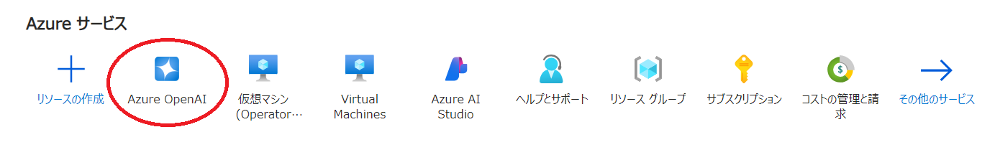
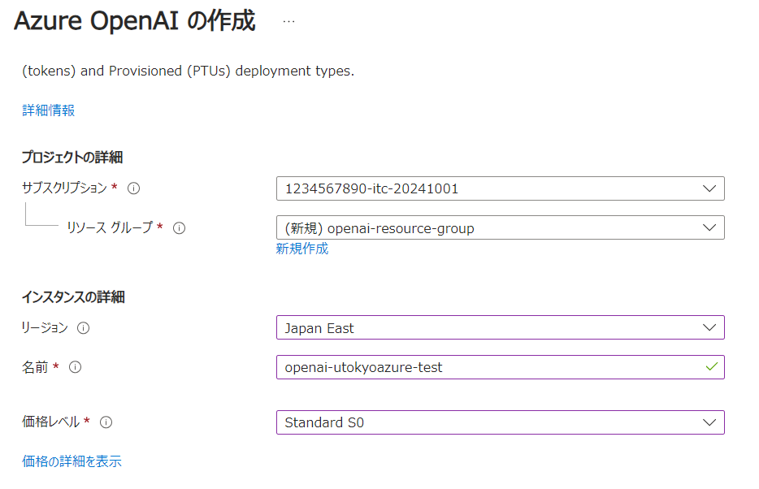
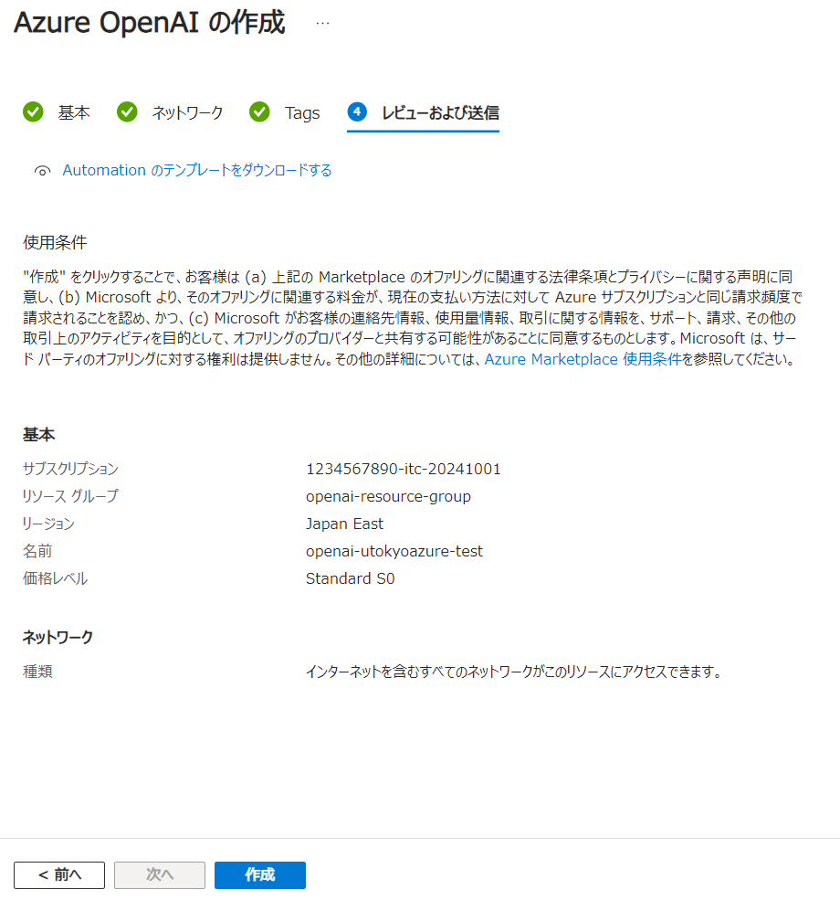
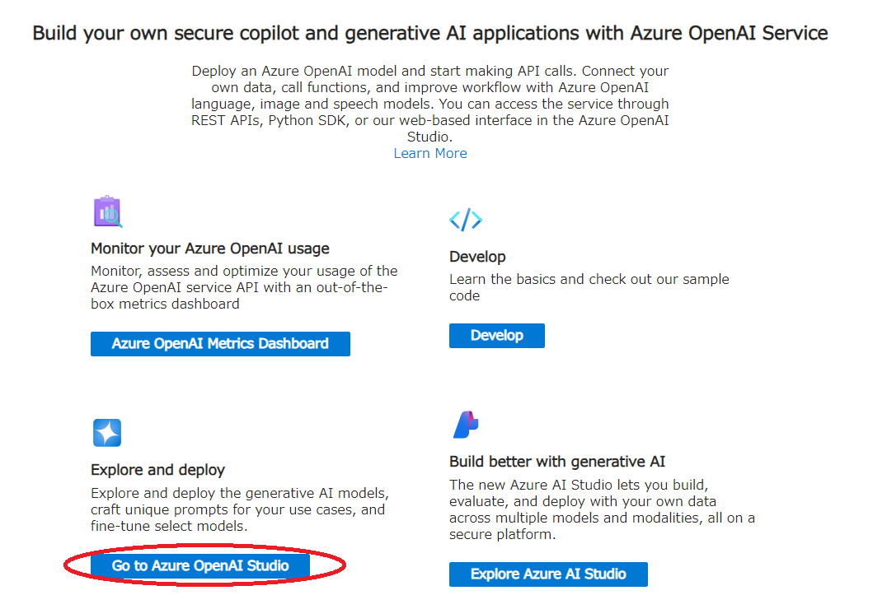
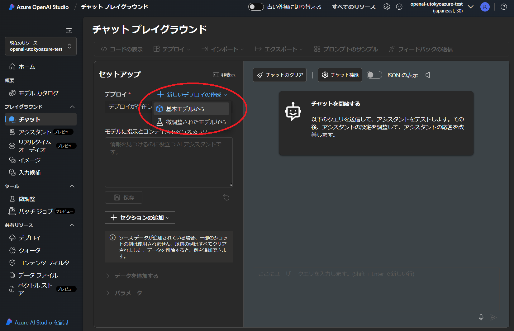
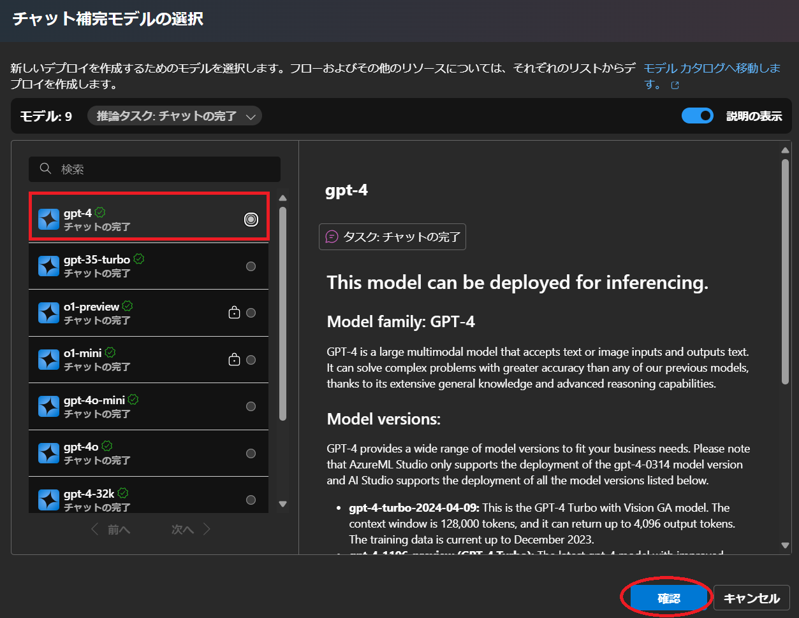
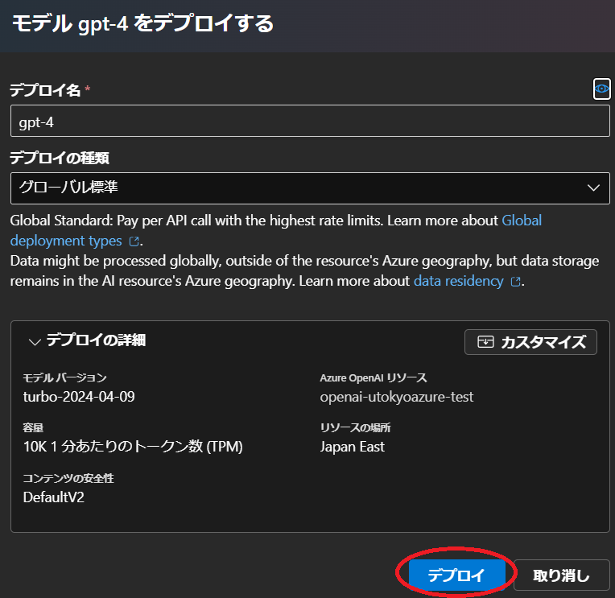
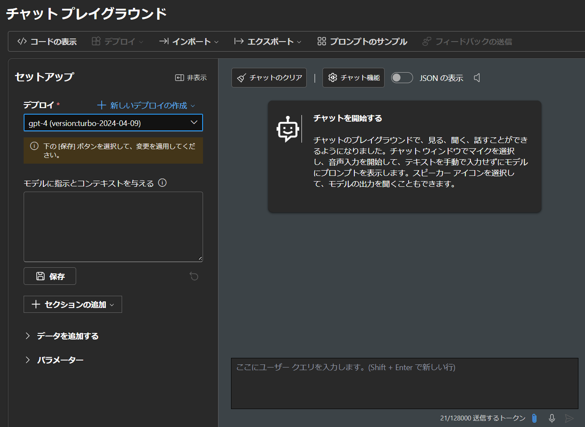

import FirstTimeUsing from "@components/ja/systems/utokyo_azure/FirstTimeUsing.mdx";

## 概要
{:#about}

Azure OpenAI を本サービスで利用する場合の初期手続き例です．

参考：[**OpenAIのサービスを利用しよう**](/events/2025-02-21/slides/5-2_OpenAI.pdf) (2025.02.21 UTokyo Azure 説明会資料)

## 注意(2026年1月現在)

Azure OpenAI を新規に利用する場合は、[Microsoft Foundry](/research_computing/utokyo_azure/ai/azureai/) ポータルからデプロイしてください．現在はこちらの手順を実施しても，最終的に Microsoft Foundry ポータルにデプロイする手順になります．

## １．サービスを選択する
{:#select_service}

<FirstTimeUsing type="details" />

- Azureサービスの一覧の中から`Azure OpenAI`を選択します．
    - 一覧に無い場合、一覧の右にある`その他のサービス`を選択、左側にあるリストから`AI + Machine Learning`を選択すると， 右側に表示されるメイン画面の`Azure AI サービス + API`の中にあります．

{:.medium.center.border}

- Azure OpenAI のメインページが表示されたら，画面左上にある`＋作成`またはメイン画面にある`Azure OpenAI の作成`をクリックします．

## ２．Azure OpenAI のプロジェクトを構成する
{:#aihub}

**補足**：説明のない項目は，基本的に初期設定のままで構成することを前提としています．

### 基本パート
{:#base}

#### プロジェクトの詳細

- **サブスクリプション**：事前に申請したサブスクリプションがすでに設定されていますので、通常はそのままで問題ありません．設定が無い場合はサブスクリプションが作成完了しているかどうか確認ください．
- **[リソースグループ](https://learn.microsoft.com/ja-jp/azure/azure-resource-manager/management/manage-resource-groups-portal)**：ここでは新規に`openai_resource_group`というリソースグループ名で作成し，以下に作成される各リソースをまとめます．まとめられたリソースは，権限の継承や削除などを一括で対応することが可能となります．

#### インスタンスの詳細

- **リージョン**：AIハブをどの地域（リージョン）にあるデータセンターにデプロイするかを指定します．使いたい機能が特定の国のリージョンにしかない場合は，その国のリージョンを選択ください．パブリッククラウド上での情報管理に不安がある場合は日本国内（`Japan East` か`Japan West`）のリージョンを選択することも可能です．
- **名前**：リソースの Azure ポータルでの名称を設定します．ここでは`openai-utokyoazure-test`としています．
- **価格レベル**：`Standard S0`を選択してください．

{:.medium.center.border}

### ネットワーク，タグの各パート
{:#network}

ここでは初期設定(すべて許可) のまま進めます．

### 確認及び作成パート
{:#execute}

Azure ポータルによる検証が成功したら，画面左下の`作成`ボタンをクリックし，しばらくしてデプロイが正常に完了しましたら，`リソースに移動`をクリックしてください．

{:.medium.center.border}

Azure OpenAI のトップページに遷移するので，画面右上の`Go to Azure AI Foundry Portal`または画面下の`Azure OpenAI Metrics Dashboard`をクリックしてください．

{:.medium.center.border}

以降は Azure AI Foundry で進めます．

## ３．Azure AI Foundry でモデルをデプロイする
{:#aistudioproject}

**一例として GPT4 モデルのデプロイ手順を進めます．**

- Azure AI Foundry に遷移すると以下のような画面になりますので`＋デプロイを作成`をクリックし，現れるプルダウンリストから`基本モデルから`を選択してください．

{:.medium.center.border}

- モデル選択画面になりますので，左側のリストから`gpt-4`を選択し，右下にある`確認`をクリックしてください．

{:.medium.center.border}

- 確認画面になるので，`デプロイ`をクリックしてください．

最新のモデルバージョンではクォータが足りないというエラーが出る場合があります．その場合はクォータの追加を依頼するか，古いモデルバージョンを選択ください．

{:.medium.center.border}

- チャットプレイグランドが下図のようになりましたら完了です．

{:.medium.center.border}

### 補足

- テキストボックスにメッセージを入力し，三角形をクリック（または「Enter」キーを押す）してモデルに送信します．
- 画面右下のトークン数は，このメッセージのトークンとこのモデルのトークン制限を表します．
  - 一例として下図では，このメッセージを送信するには582トークンが使用され，全体のトークン制限は128000トークンです．
  - 画面左の**モデルに指示とコンテキストを与える**テキストボックスに「システムプロンプト」（またはGPTへの指示）を入力できます．

{:.medium.center.border}

**注意**：GPTにメッセージを送信するたびに新しいメッセージと一緒にメッセージ履歴全体が送信され，トークンの消費量はその累積ベースで計算されます．
 
- たとえば，これまでのメッセージと返信がそれぞれ2，5，1，7，11，1トークンで構成されている場合，新たに9トークンで構成されるメッセージを送信すると，この送信要求は実際には2+5+1+7+11+1+9=36トークンで構成されます．
- この考え方で累積全体のトークン消費を計算すると，(2) + (2+5) + (2+5+1) + (2+5+1+7) + (2+5+1+7+11) + (2+5+1+7+11+1) + (2+5+1+7+11+1+9)=121 トークンとなります．
- OpenAI が提供する ChatGPT アプリケーションとは異なり，Azure の OpenAI サービスはトークンによって課金されるため，トークンの消費方法に注意してください．

### [デプロイしたモデルのクォータを管理する](/research_computing/utokyo_azure/ai/quota/)

### [デプロイしたモデルを Python API から利用する](/research_computing/utokyo_azure/ai/python/)
