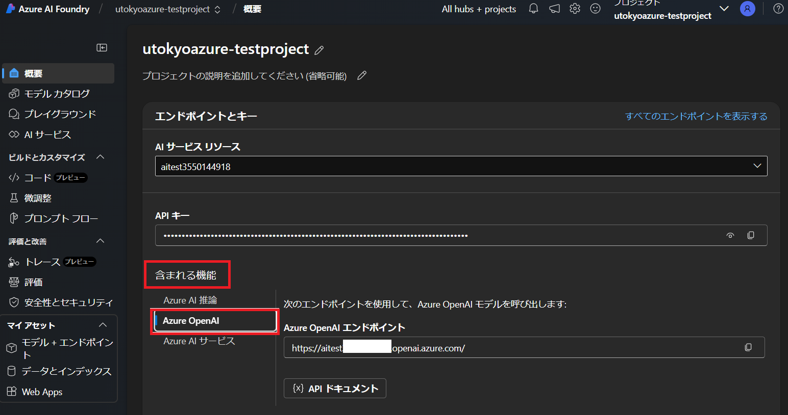
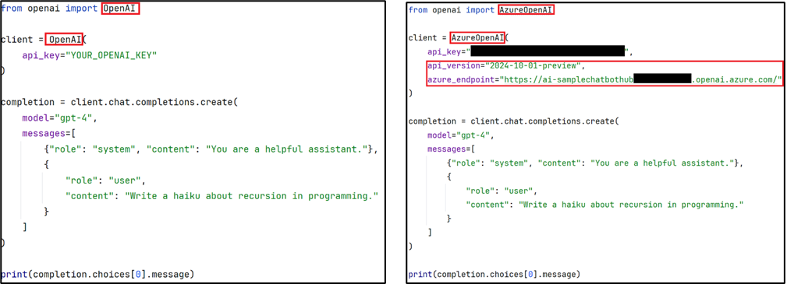

**Microsoft Foundry 以降では，Foundry ポータル上でモデルをデプロイした直後の詳細画面で，PythonでAPIを利用する手順が詳細に記載されています．本ページの以下の記載も2026年1月現在有効ですが，今後仕様が変更になったり，さらなる詳細が必要な場合は Foundry ポータルの記載をご参照ください．**

Azure OpenAI サービスは，OpenAI が提供する Python クライアントと互換性があります．ただし，いくつかの構成が必要です．

- Azure OpenAI Studio または Azure AI Foundry の概要に API キー及びエンドポイントの表示があります．これらをコピーしてください．
  - Azure AI Foundry の場合は，含まれる機能の中から Azure OpenAI を選択してください．

{:.medium.center.border}

**参考**：[Microsoft Learn:Azure OpenAI in Microsoft Foundry Models API lifecycle](https://learn.microsoft.com/en-us/azure/ai-services/openai/api-version-deprecation)で、現在の API バージョンを確認できます。

- ご自身の Python 環境で，openai パッケージをインストールしてください．
  - ``pip install openai`` 等

- Python でコーディングします．以下はコーディングの一例で，左が OpenAI クラスを利用した場合，右が Azure 互換の OpenAI を利用した場合です．
  - クラス名を，Azure OpenAI の場合 `OpenAI` を、Microsoft Foundry の場合 `AzureOpenAI` を選択する．
  - コンストラクター パラメーターとして`api_version`と`azure_endpoints`が提供されます．エンドポイントの指定が必要な場合はパラメータを設定してください．

{:.medium.center.border}
