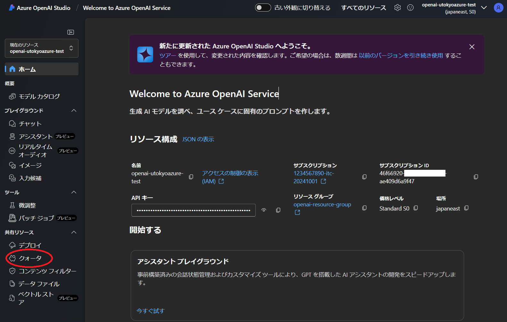
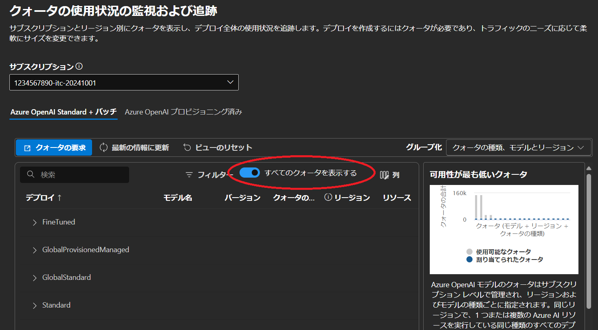
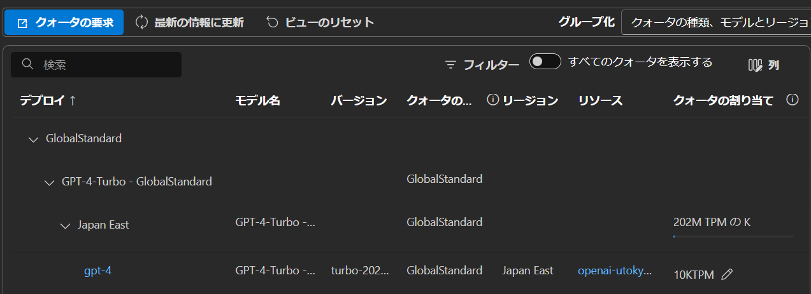

---
breadcrumb:
  title: "クォータの管理"
---

## クォータの管理

以下 Azure AI Studio からの利用でも同様です．Azure OpenAI を Azure AI に読み替えてください．

**クォータ**とは，各モデルが処理できるトークンの最大数であり，Azure OpenAI サービスのレート制限を表します．この制限を超えるとエラーが発生する可能性があり，そうなった場合は 1 分あたりのトークンがクールダウンするのを待つか，クォータ値の増加をリクエストしてください．

- **注意**：
  - この手続きは自動承認ではなく，Microsoft Azure チームにリクエストを送信して承認を得る流れになります．
  - すべてのプロセスが完了するまでに数日かかる場合があります．
  - Microsoft Azure チームからリクエスト内容に対する問い合わせのメールがくる場合がありますので，メールを常にチェックしつつ問い合わせがあった場合は必要な回答を行ってください．

- 初期画面左側のリストから`クォータ`を選択してください．

{:.medium.center.border}

- 初期状態では，デプロイしていないモデルも含めてすべてのモデルツリーが表示されます．自分がデプロイしているモデルだけを表示するようにさせたい場合は，`すべてのクォータを表示する`スイッチをOFFにしてください．

{:.medium.center.border}

- 利用例の GPT-4 デプロイを実施した状態では以下のような表示になります．

{:.medium.center.border}

- 左上にある`クォータの要求`をクリックすると，**Azure OpenAI Service: Request for Quota Increase**のページに遷移するので，必要な項目を入力し，リクエストを送信してください．

**注意**：リクエストフォームで要求されるサブスクリプションIDはサブスクリプション名**ではありません**．ご自身のサブスクリプションIDの確認方法は，
- Azure OpenAI Studio トップページに記載があります．（Azure OpenAI Studio のみ）
- サブスクリプションから確認する方法があります．[FAQ](/research_computing/utokyo_azure/faq/)の`サブスクリプションIDを知りたい`の項を参照ください．

