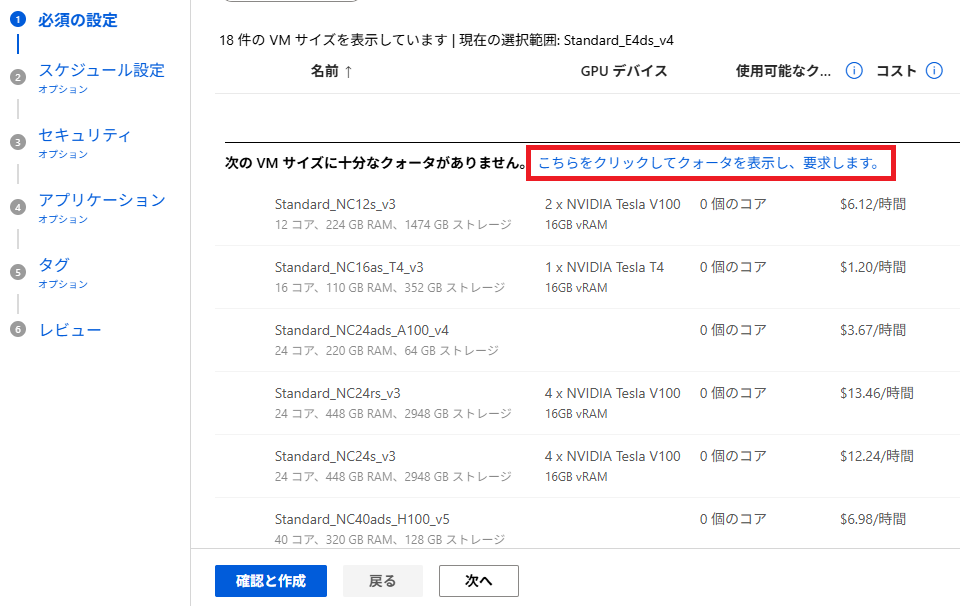
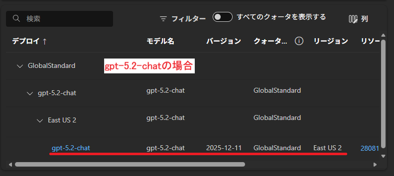

**クォータ**とは，Azure の計算資源が誤設定などで極端に消費され，他のユーザーに影響を及ぼさないように Azure が設定する利用できる資源量の上限値です．基本的に少なめに設定されているため，上限値以上に利用をしたい場合は Microsoft へクォータ変更のリクエストをする必要があります．以下はその手順を説明しています．

- **注意**：
  - この手続きは Microsoft Azure チームにリクエストを送信して承認を得る流れになりますので，すべてのプロセスが完了するまでに時間がかかる場合があります．
  - Microsoft Azure チームからリクエスト内容に対する問い合わせのメールがくる場合がありますので，メールを常にチェックしつつ問い合わせがあった場合は必要な回答を行ってください．

## VMクォータ 

以下は「[Azure Machine Learning](/research_computing/utokyo_azure/ai/aml/)」でコンピューティングインスタンスを構築している場合の手順です．

1. インスタンスの作成で，`必須の設定`を設定する際，希望するVMサイズで使用可能なクォータ数が足りない，あるいは希望するVMサイズ自体が無いなどの場合は，`こちらをクリックしてクォータを表示し，要求します`のリンクをクリックしてください．

{:.medium.center.border}

2. `仮想マシンファミリ`の一覧から，クォータ申請したいファミリをクリックして選択してください．

選択を間違えると，別の資源への申請となってしまいますのでご注意ください．

3. ページの上部にある、`クォータの要求`というボタンが活性化してクリック可能になるので，クリックしてください．
4. 新しいウィンドウがポップアップしますので，以降は書かれている内容に従い必要な資源量の要求手続きを進めてください．

## AIトークン等

- Microsoft Foundry ポータル初期画面左側のリストから，`管理センター` > `クォータ` を選択してください．

{:.medium.center.border}

- 画面下部のモデル一覧ウィンドウから，クォータ変更を要求したいモデルを展開してください．

{:.medium.center.border}

- モデル一覧ウィンドウの右端までスクロールすると，`クォータの要求`というリンクがあるのでクリックしてください．

{:.medium.center.border}

- **Azure OpenAI Service: Request for Quota Increase**のページに遷移するので，必要な項目を入力し，リクエストを送信してください．

**注意**：リクエストフォームで要求されるサブスクリプションIDはサブスクリプション名**ではありません**．ご自身のサブスクリプションIDの確認は以下のいずれかで可能です．
- foundry ポータルのプロジェクトページにあるプロジェクトの詳細．
- Azure Portal のサブスクリプションから詳細を確認．

### 補足
- クォータの要求手順はサービス毎に手順が用意されています．本手順は一例であり，必ずしもこの手順になるとは限らないので，それぞれのサービスで提供されているクォータ要求手順から手続きください．
