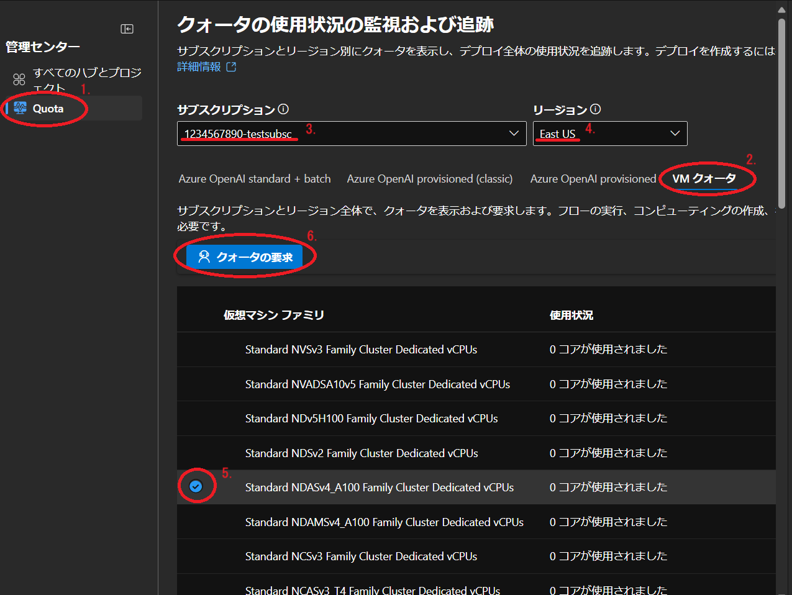

**クォータ**とは，Azure の計算資源が誤設定などで極端に消費され，他のユーザーに影響を及ぼさないように Azure が設定する利用できる資源量の上限値です．基本的に少なめに設定されているため，上限値以上に利用をしたい場合は Microsoft へクォータ変更のリクエストをする必要があります．この手順はサブスクリプションの管理権限の所有者権限を持つ方が直接行ってください．以下はその手順を説明しています．

- **注意**：
  - この手続きは Microsoft Azure チームにリクエストを送信して承認を得る流れになりますので，すべてのプロセスが完了するまでに時間がかかる場合があります．
  - Microsoft Azure チームからリクエスト内容に対する問い合わせのメールがくる場合がありますので，メールを常にチェックしつつ問い合わせがあった場合は必要な回答を行ってください．

## Azure AI Foundry 

1. 画面左側の一覧から、`管理センター` > `クォータ` を選択してください．
  - Azure AI Foundry のトップページの場合は，一番下までスクロールすると`クォータ管理`というリンクがあるので、そちらをクリックしてください．同じページに遷移します．
2. サブスクリプションの下に，`Azure OpenAI standard + batch` `Azure OpenAI provisioned (classic)` `Azure OpenAI provisioned` `VM クォータ` の4つのタブがあるので，**VMクォータ**を選択してください．
3. サブスクリプションを複数お持ちの場合は，クォータ申請をしたいサブスクリプションであるかどうかを確認し，違うサブスクリプションが表示されていた場合は選択してください．
4. サブスクリプションの右に表示されているリージョンが，現在 Azure AI Foundry リソースがデプロイされているリージョンであることを確認し，違うリージョンになっている場合は選択しなおしてください．
5. `仮想マシンファミリ`の一覧から，クォータ申請したいファミリをクリックして選択してください．

3, 4 及び 5 の選択を間違えると，別の資源への申請となってしまいますのでご注意ください．

6. ページの上部にある、`クォータの要求`というボタンが活性化してクリック可能になるので，クリックしてください．

{:.medium.center.border}

7. 新しいウィンドウがポップアップしますので，以降は書かれている内容に従い必要な資源量の要求手続きを進めてください．

## Azure OpenAI

- Azure OpenAI ではトークン制限の緩和を申請する内容になります．
- 初期画面左側のリストから`クォータ`を選択してください．

{:.medium.center.border}

- 初期状態では，デプロイしていないモデルも含めてすべてのモデルツリーが表示されます．自分がデプロイしているモデルだけを表示するようにさせたい場合は，`すべてのクォータを表示する`スイッチをOFFにしてください．

{:.medium.center.border}

- 利用例の GPT-4 デプロイを実施した状態では以下のような表示になります．

{:.medium.center.border}

- 左上にある`クォータの要求`をクリックすると，**Azure OpenAI Service: Request for Quota Increase**のページに遷移するので，必要な項目を入力し，リクエストを送信してください．

**注意**：リクエストフォームで要求されるサブスクリプションIDはサブスクリプション名**ではありません**．ご自身のサブスクリプションIDの確認は以下のいずれかで可能です．
- 各 Studio トップページに記載があります．
- Azure Portal のサブスクリプションから詳細を確認すると記載があります．

### 補足
- クォータの要求手順は様々な手順から可能です．本手順は一例であり，必ずしもこの手順でなけれなならないことはありませんので，それぞれのサービスで提供されているクォータ要求手順から手続きいただいて問題ありません．
