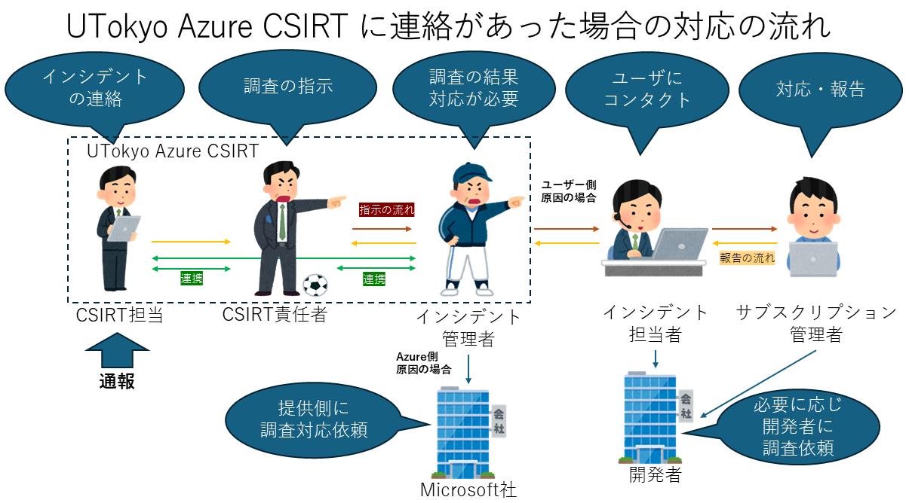

## UTokyo Azure CSIRT

UTokyo Azure は商用クラウドサービスである Microsoft Azure の資源を利用したサービスですが，学内向けに提供しているため，構築されたシステムで何らかのインシデントが外部から通報された場合に，その一次窓口や連絡・対応・報告を一本化するため，UTokyo Azure CSIRT を設置しています．

## 責任分解点

UTokyo Azure は商用クラウドサービスである Microsoft Azure の資源を利用したサービスのため，その責任分解点は主に以下の２通りに分類されます。

{:.medium.center.border}

## UTokyo Azure CSIRT に通報された場合の対応の流れ

通報者が通報先をどこへ選んだかにより，必ずしも UTokyo Azure CSTRT を経由した通報になるとは限りませんが，UTokyo Azure CSIRT が通報先または経路となった場合の対応の流れは大まかに以下の通りになります。

- UTokyo Azure CSIRT および CSIRT 責任者
  - 外部から見た場合はほぼ一体として行動します．通報のあったインシデントの内容を吟味して対応先を判断し，必要な対応先へ対応を指示します．
  - インシデントが Azure 側に起因すると判断した場合は，そのまま Azure に対応を依頼します．
- インシデント責任者
　- 主にインシデント元と思われるユーザーが所属する部局の部局CERT責任者が想定されています．UTokyo Azure CSIRT 責任者から指示があり次第調査し，インシデントに対応するべきユーザーを確定します．
- インシデント担当者
　- 部局CERTの担当者またはそのプロジェクトのインシデント担当者が想定されています．インシデント責任者からの指示に従い，対応するべきユーザーの特定や連絡などの実務を担当します．  
- サブスクリプション責任者
  - インシデントを起こしたシステムが所属しているサブスクリプションの管理者です．インシデント責任者および担当者からの指示に従いインシデントの特定および対応を行います．

{:.medium.center.border}

## UTokyo Azure CSIRT 以外からの通報

どのように Azure サービスを利用していたかによって，必ずしも UTokyo Azure CSIRT 経由でインシデントの連絡があるわけではなく，場合によっては部局CERTやサブスクリプション管理者，システムの担当者に直接連絡が行く可能性があります．

その場合は，主には部局CERTに報告を上げてどのように対応するべきかご相談ください．

その際のお願いとして，UTokyo Azure CSIRT では UTokyo Azure 上で発生したインシデントを把握，記録しておりますので，必ずしも UTokyo Azure CSIRT の対応は不要と判断した場合でも，UTokyo Azure CISRT にも何らかのご一報をお願いいたします．

## 問い合わせ・連絡・通報先

- UTokyo Azure CSIRT 担当： utokyo-azure-csirt-group@g.ecc.u-tokyo.ac.jp
