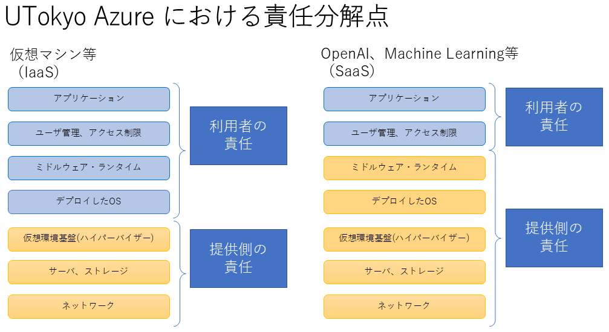

## UTokyo Azure CSIRT

UTokyo Azure は商用クラウドサービスである Microsoft Azure の資源を利用したサービスですが，学内向けに提供しているサービスなので，UTokyo Azure 上で構築されたシステムで何らかのインシデントが発生した場合には東京大学宛にも通報が来ることが予想されるため，外部からの通報の窓口として，そしてその後の連絡・対応・報告を一本化するため，UTokyo Azure CSIRT を設置しています．

UTokyo Azure CSIRT は情報基盤センターCERT(ITC-CERT)の下部組織として設置され，本 CSIRT が対応するインシデントは ITC-CERT を通じて UTokyo-CERT にインシデント情報を報告・共有いたします．

{:.center.border}

## 責任分解点

UTokyo Azure は Microsoft Azure サービスの資源を利用したクラウドサービスなので，その責任分解点は主に IaaS であるか SaaS であるかで２通りに分類されます。
- サービスの提供形式により，必ずしもこの形に収まらない場合があります．実際のインシデントが発生した場合は，発生元のリソース等からどちらの責任範囲でありそうかを UTokyo Azure CSIRT が判断します．

{:.medium.center.border}

## UTokyo Azure CSIRT に通報があった場合の対応の流れ

UTokyo Azure CSIRT が一次通報先または通報経路となった場合の対応の流れは大まかに以下の通りになります。

- UTokyo Azure CSIRT および CSIRT 責任者
  - 通報のあったインシデントの内容を吟味して対応すべきと思われる先を判断し，対応を指示します．
  - インシデントが Azure 側に起因すると判断した場合は，Microsoft 社に対応を依頼します．
  - UTokyo Azure CSIRT が取りまとめる案件となった場合は，上位 CERT への報告等を実施します．
- インシデント責任者
　- UTokyo Azure CSIRT において，UTokyo Azure 上で発生するインシデントを管理する責任者です．
  - UTokyo Azure CSIRT 責任者から指示があり次第そのインシデントに対応するべき先を調査特定してインシデント担当者に指示します．
- インシデント担当者
　- 部局CERTの担当者またはそのプロジェクトのインシデント担当者等が想定されています．インシデント責任者からの指示に従い，対応するべきユーザーの特定や連絡などの実務を担当します．  
- サブスクリプション責任者
  - インシデントを起こしたシステムリソースが割り当てられているサブスクリプションの管理者です．インシデント責任者および担当者からの指示に従いインシデントの特定および対応を行います．

{:.medium.center.border}

## UTokyo Azure CSIRT を経由しない通報

通報者は通常，インシデントを受けた場合に送信元のIPアドレスやドメインのインシデント連絡先等を見て通報するため、どのように Azure サービスを利用していたかによって，必ずしも UTokyo Azure CSIRT 経由でインシデントの通報を行うとは限らず，部局CERTやサブスクリプション管理者，システムの担当者に直接連絡が行く可能性もあります．

その場合は，主には部局CERTに報告を上げて，以後どのように対応するべきかご相談ください．

その際のお願いとして，UTokyo Azure CSIRT では UTokyo Azure 上で発生したインシデントを把握，記録しておりますので，UTokyo Azure CSIRT の対応は不要と判断した場合でも，UTokyo Azure CISRT にも何らかのご一報をお願いいたします．

## 問い合わせ・連絡・通報先

- UTokyo Azure CSIRT 担当： utokyo-azure-csirt-group@g.ecc.u-tokyo.ac.jp
