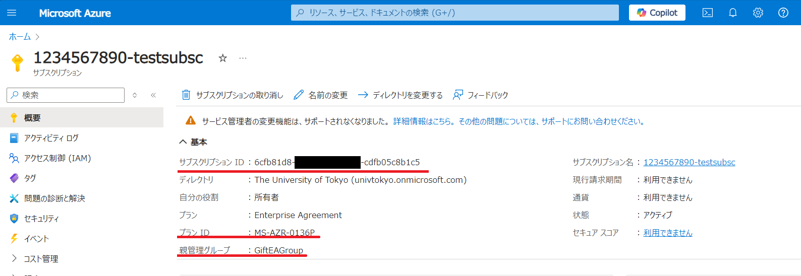

import HelpItem from "@components/utils/HelpItem.astro";

**サービス全般**

<HelpItem lang="ja" type="details">
  <Fragment slot="problem">どのような目的で利用が可能でしょうか</Fragment>
  <Fragment slot="solution">研究・教育用途であれば広くお使いいただけます</Fragment>
</HelpItem>

<HelpItem lang="ja" type="details">
  <Fragment slot="problem">どのような分野で利用が可能でしょうか</Fragment>
  <Fragment slot="solution">GX, DI, AI を推進する取り組みを歓迎しますが, これに狭く限定するものではなく，様々な分野でご利用いただけます．</Fragment>
</HelpItem>

<HelpItem lang="ja" type="details">
  <Fragment slot="problem">どのような計算機・サービスが使えますか</Fragment>
  <Fragment slot="solution">基本的に, MS Azure で提供されるあらゆるサービスが使えます. ブラウザから Jupyter Notebook で GPU 環境にアクセスする, Open AI のチャットや API を使う,クラスタ環境を自分でセットアップして使うなど, 様々な形態の利用が可能です. ただしコスト超過防止のため, デフォルトで利用不可 (opt‑in) になっているものがあります．</Fragment>
</HelpItem>

<HelpItem lang="ja" type="details">
  <Fragment slot="problem">いつまで使い続けられますか</Fragment>
  <Fragment slot="solution">2024/12/1 ～ 最大で 2029/9/30 まで(最大で約 5 年間)使えます. 大学全体として利用できるギフトクレジット (無料保証枠) に限りがあるため, これより若干早く終了することもありえます.</Fragment>
</HelpItem>

<HelpItem lang="ja" type="details">
  <Fragment slot="problem">ギフトクレジットによる運用ということは無料で使い続けられますか</Fragment>
  <Fragment slot="solution">申請時に割り当てられた無料保証枠まではご負担いただくことなくご利用いただけますが，無料保証枠の総額を超えた場合は超過分を負担いただくことになります．3月末と9月末の半期毎に集計し，超過していた場合は超過額を請求する手続きになる予定です．</Fragment>
</HelpItem>

<HelpItem lang="ja" type="details">
  <Fragment slot="problem">サービス終了後は構築した環境はどうなりますでしょうか</Fragment>
  <Fragment slot="solution">未定です. 利活用状況, クラウド移行による経費への効果(正負両方)などを見て継続することはありえますが確定していることはありません. なお, 大規模な計算需要に対しては従来から情報基盤センターが運用しているスーパーコンピュータや mdx を利用することも可能です.</Fragment>
</HelpItem>

**利用者**

<HelpItem lang="ja" type="details">
  <Fragment slot="problem">このサービスは誰が利用できますか</Fragment>
  <Fragment slot="solution">東大の教職員なら誰でも使えますが, UTokyo Account をお持ちの方が [UTokyo Azure 新規利用申請ページ](https://utokyo-azure-web.japaneast.cloudapp.azure.com/)より利用申請を行い，[「サブスクリプション」](/research_computing/utokyo_azure/faq/subscription)を開設する必要があります. 共同利用したいユーザーには，開設したサブスクリプションに後から他のユーザの権限を追加(利用権利を与える)ことも可能です</Fragment>
</HelpItem>

<HelpItem lang="ja" type="details">
  <Fragment slot="problem">学生は利用できますか</Fragment>
  <Fragment slot="solution">デプロイされたサービスの利用者になることは問題なく可能です．サブスクリプションやリソース等のスコープに後からロール付加してメンバーとして割り当てらることも可能です．ただし，無料保証枠を超えた利用があった場合に請求が発生するため，サブスクリプションの申請は教職員に限らせていただいています．</Fragment>
</HelpItem>

<HelpItem lang="ja" type="details">
  <Fragment slot="problem">このサービスの利用も学内の人に限定されますでしょうか</Fragment>
  <Fragment slot="solution">Azure Portal やサブスクリプションポータルへのログインは UTokyo Account で認証するため，これらの利用は UTokyo Account 保有者に限られます．ただし，例えば作成した仮想マシンにデプロイしたOSへのログイン認証は UTokyo Account に依存しないため，学外の共同研究者を OS にアカウント登録して利用させるといったことは可能です．</Fragment>
</HelpItem>

<HelpItem lang="ja" type="details">
  <Fragment slot="problem">申請したサブスクリプションやリソースを研究室のメンバー等で共同利用したい</Fragment>
  <Fragment slot="solution">１つのサブスクリプションやリソースを複数の人間で共同利用したい場合は，共同利用させたいユーザーの UTokyo Account を，**共同作成者**として権限付加する必要があります．この操作は，付与したいサブスクリプションやリソースに**所有者**の権限があるアカウントで行う必要があります．[詳細はこちらのリンクを参照ください．](/research_computing/utokyo_azure/group/)</Fragment>
</HelpItem>

<HelpItem lang="ja" type="details">
  <Fragment slot="problem">メンバーへの権限付与は，学外の共同研究者や研究支援を行っている民間企業の人にも与えることができますか</Fragment>
  <Fragment slot="solution">原則 UTokyo Account をお持ちの方に限ります．Azure Portal の権限付与手順でも UTokyo Account 保持者のみ表示されます．すでに別の理由で UTokyo Account をお持ちの場合は，例えば客員教員や業務支援の企業の人へも付与可能です．</Fragment>
</HelpItem>

**無料保証枠**

<HelpItem lang="ja" type="details">
  <Fragment slot="problem">無料保証枠とはなんですか</Fragment>
  <Fragment slot="solution">Microsoft からのギフトクレジットは，申請時に一定額がサブスクリプションに割り当てられます．この金額の枠内で申請者はAzure サービスを利用することができ，この枠を無料保証枠と呼称しています．</Fragment>
</HelpItem>

<HelpItem lang="ja" type="details">
  <Fragment slot="problem">最初に割り当てられる無料保証枠はいくらですか</Fragment>
  <Fragment slot="solution">一定額として決めておらず，全体で申請されたサブスクリプション数によって動的に変動します．これはギフトクレジットを後から利用申請された方にも公平に割り当てるための施策で，申請後に UTokyo Azure 新規申請ページの管理ページから枠の量や使用済量を確認することができます．</Fragment>
</HelpItem>

<HelpItem lang="ja" type="details">
  <Fragment slot="problem">最初に割り当てられた無料保証枠は確定で使えますか</Fragment>
  <Fragment slot="solution">全体で申請されたサブスクリプション数に応じて，利用開始後にも変動します．毎月1回再計算が行われ，その時点での金額はUTokyo Azure 新規申請ページの管理ページから確認することができます．</Fragment>
</HelpItem>

<HelpItem lang="ja" type="details">
  <Fragment slot="problem">管理ページでの無料保証枠が米ドル表示なのですが</Fragment>
  <Fragment slot="solution">Microsoft のギフトクレジットの取り扱い仕様により，利用中は米ドルでの管理になります．申請者への超過分の請求は，財務会計システムによってその時の変換レートで変換され日本円で請求されます．</Fragment>
</HelpItem>

**サブスクリプション**

<HelpItem lang="ja" type="details">
  <Fragment slot="problem">サブスクリプションとはなんですか</Fragment>
  <Fragment slot="solution">Microsoft Azure における契約，課金の単位で，サブスクリプションを管理単位として利用者は様々なサービスを利用することができます．詳細は[サブスクリプションとは（リンク先）](/research_computing/utokyo_azure/faq/subscription)を参照ください．</Fragment>
</HelpItem>

<HelpItem lang="ja" type="details">
  <Fragment slot="problem">サブスクリプションを複数持つことはできますか</Fragment>
  <Fragment slot="solution">UTokyo Azure のサブスクリプションの所有者になることは原則1アカウントにつき1つとしております．なお，UTokyo Azure に紐づかないサブスクリプションを同じアカウント内で作成することもできません．</Fragment>
</HelpItem>

<HelpItem lang="ja" type="details">
  <Fragment slot="problem">特権管理者ロールの所有者と共同作成者は何が違うのでしょうか</Fragment>
  <Fragment slot="solution">**所有者**は，自身が所有者であるサブスクリプションやリソースに対して他者アカウントに権限（ロール）を付与することができますが，**共同作成者**にはその権限がありません．それ以外はほぼ所有者と同じ権限が共同作成者には与えられます．サブスクリプションの申請者は所有者の権限が設定されます．</Fragment>
</HelpItem>

<HelpItem lang="ja" type="details">
  <Fragment slot="problem">サブスクリプションIDを知りたい</Fragment>
  <Fragment slot="solution">サブスクリプションIDはサブスクリプションの詳細画面で確認できます．{:.medium.center.border}</Fragment>
</HelpItem>
