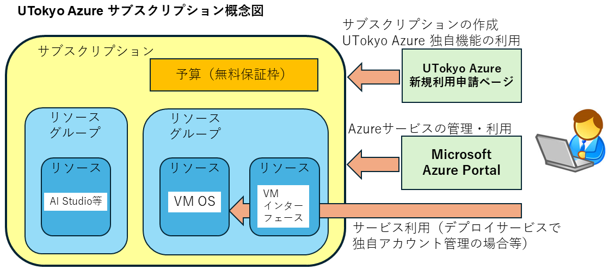
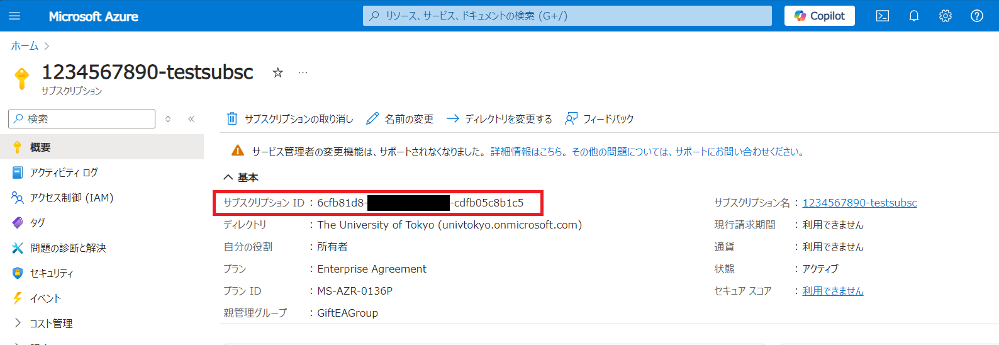
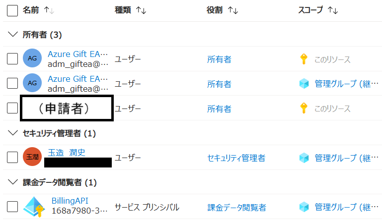

import HelpItem from "@components/utils/HelpItem.astro";

## サブスクリプションとは

Microsoft Azureでは，**サブスクリプション**と呼ばれる単位でリソースや権限，使用量の集計などが分離されています．UTokyo Azureでは，申請者のUTokyo Accountが所有者として紐づけられた個別のサブスクリプションを作成し利用します．

以下 UTokyo Azure のサブスクリプションの説明です．個人で契約した場合とは異なる部分があります．

{:.center.border}

### 申請
- UTokyo Azure においては、サブスクリプションは[UTokyo Azure新規利用申請ページ（学内ネットワークからのアクセスに限定）](http://azure.itc.u-tokyo.ac.jp/)から申請することで作成されます．
- **上記申請ページからの申請以外の方法で作成されたサブスクリプションでギフトクレジットを利用することはできません．**
- UTokyo Azure のサブスクリプションの申請ができる身分は，無料分（後述）を超過した場合に支払いが発生する可能性があるため，教職員のみとしております．
- 申請後に利用を開始できるようになるまで少し時間がかかります．UTokyo Azure新規利用申請ページ上では`準備中`>`承認待ち`>`設定中`>`作成完了`とステータスが遷移し，作成完了と表示されてから数十分後以降に Azure Portal のトップページに表示されるようになりますので，それまでお待ちください．

### ステータス
- 作成されたサブスクリプションを Azure Portal から参照したステータスは，初期状態では以下のようになります。
  - トップページ > サブスクリプション > 確認したいサブスクリプション名 で表示されます．
  - 特に，プランIDが`MS-AZR-0136P`，親管理グループが`GiftEAGroup`であることをご確認ください．これ以外の表示の場合は無料分を利用することができず請求が発生してしまいますので．即時削除してください．
  - サブスクリプション名は変更が可能なので、利用するサービスによってはサブスクリプションIDを要求される場合があります．その場合ここに表示されるIDを指定してください．

{:.center.border}

- サブスクリプションの`アクセス制御（IAM）`を参照すると，ご自身のアカウント以外に以下の権限が設定されています．**これらは本学と Microsoft との契約上必要な登録となり削除できません**ので，あらかじめご承知おきください．(下図参照)
  - 所有者：Azure Gift EA operator（全体用とサブスクリプション用と２つ設定されます）
  - セキュリティ管理者（情報システム本部 玉造准教授名で登録されています）
  - 課金データ閲覧者

{:.medium.center.border}

### 無料分・無料保証枠
- **無料分**とは，ある月の利用料のうちギフトクレジットによって最終的に無料となる分の金額です．詳細はFAQの[無料分とはなんですか](/research_computing/utokyo_azure/faq/#:~:text=%E3%83%98%E3%83%AB%E3%83%97%EF%BC%9A-,%E7%84%A1%E6%96%99%E5%88%86%E3%81%A8%E3%81%AF%E3%81%AA%E3%82%93%E3%81%A7%E3%81%99%E3%81%8B,-%E3%81%82%E3%82%8B%E6%9C%88%E3%81%AE)の項を参照ください．
- **無料保証枠**とは，無料分が確定するのが月末のため，事前に確実に無料となる金額を知りたい方向けに最低限この金額までは無料となる最低保証額を公表しており，これを無料保証枠と称しています．無料保証枠を超えてしまった場合でも，半期ごとに集計する最終的な無料分に収まっていれば無料になります．詳細はFAQの[無料保証枠とはなんですか](/research_computing/utokyo_azure/faq/#:~:text=%E3%83%98%E3%83%AB%E3%83%97%EF%BC%9A-,%E7%84%A1%E6%96%99%E4%BF%9D%E8%A8%BC%E6%9E%A0%E3%81%A8%E3%81%AF%E3%81%AA%E3%82%93%E3%81%A7%E3%81%99%E3%81%8B,-%E3%83%98%E3%83%AB%E3%83%97%EF%BC%9A%E7%84%A1%E6%96%99%E5%88%86)の項を参照ください．

#### 重要な注意事項（必ず参照ください）

割り当てられたサブスクリプションには、UTokyo Azure 独自の機能として無料保証枠の90%を使い切った時点でサブスクリプションを自動停止するという機能があり、**初期設定では有効**になっております。

無料保証枠内で利用を確実に止めたい利用者への機能となりますが、停止されると即時にサブスクリプションが取り消され、復旧ができなくなりリソースへのアクセスも不可になります。

**データ等のリソースを取り消されたくない場合は、サブスクリプションを作成後忘れずに[**UTokyo Azure新規利用申請ページの管理ページ**](https://azure.itc.u-tokyo.ac.jp/list)から当該サブスクリプションの自動停止機能を無効に設定変更してください。**

### 管理・権限
- サブスクリプションは Azure クラウドサービにおける，サービスを利用する上での管理範囲になります．
- Azure クラウドサービスの仕様や契約，UTokyo Azure サポートの管理都合上，利用できないサービスがあります．特に，Marketplace 製品（サードパーティが提供するサービス）は本サービスではすべて利用できません．
- 申請者のアカウントは、そのサブスクリプションに**すべてのロールを割り当てする権限のある所有者**として付加されます．
- サブスクリプションは共有が可能ですが，そのメンバーのアカウントを**所有者**または**共同作成者**としてサブスクリプションに権限付与する必要があります．付与手順の詳細は以下のリンク先を参照ください．
  - [複数人グループでの利用](/research_computing/utokyo_azure/group/)
